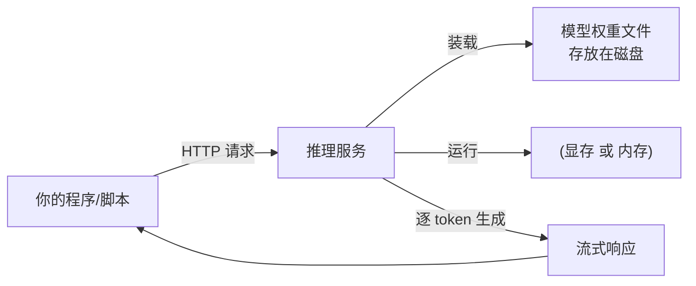

# 1.1 从零到第一次调用：最小推理服务

## 开篇问题

假设你要给团队的内部知识库加一个"问答机器人"，但数据不能发往外部 API；或者你所在的环境网络不稳定，需要一个不依赖云端的模型。很自然的想法是：在自己机器上跑一个。全书主线就从这个问题上打头：怎么让一个模型在我机器上回答问题？动手之前，四个问题依次冒出来：模型从哪里来？下载下来的文件是什么？用什么程序让它运行？怎么让自己的代码调用它？

这一章只解决这四件事。读完并做完实验，你应该能自查这四条：

1. 装好推理引擎，拉起一个 7B~8B 参数级的 Q4 档模型，用 curl 打通 OpenAI 兼容接口，完成一次真实调用；
2. 说明 token 是什么，并用两种方法数出一个句子的 token 数；
3. 说清推理引擎两个流派各吃什么文件、为谁设计，以及"今天为什么用 Ollama"；
4. 从文件名读出量化档位、估算文件体积，并按显存约束粗判"装不装得下"。

你会把本章的命令和实测数字整理成一份可复现的部署脚本和一份首次调用记录。这两样是全书项目交付物 T1 的一半，另一半在 1.5 完成。

## 正文

### 整体图景：四个部件，一条链路

先把全景摆出来。你要搭的东西在整条推理链路里的位置是这样的：



输入是一段结构化的对话（JSON 格式），输出是流式响应，由逐个生成的 token（词元，模型处理文本的最小单位）组成；这个概念下一节拆开细讲。"推理服务"这一框是本章的主角：一个常驻进程，对内管理模型权重，对外提供网络接口。它的消耗落在三类资源上：磁盘（存放权重文件）、显存或内存（运行时装载）、CPU 与整机功耗（生成时的计算与供电）。用户直接感受到的指标是"响应有多快"，本章只做体感观察，正式定义留给第三章。

下面沿着"文件 → 引擎 → 接口 → 装载 → 调用"的顺序把这条链路走通。

### 模型在硬盘上的形态：一个权重文件

所谓"下载一个模型"，下载的是一个包含**权重（weight）**的数据文件：模型训练完成后固定下来的全部参数。推理时引擎只读取这些参数，不再改动。参数的多少用"B"（billion，十亿）计数：8B 就是约 80 亿个参数。

关键问题是这个文件有多大。决定它的是一个你马上会到处见到的变量：**位宽（bit width）**，即每个参数用多少个比特存储。两种典型口径：

- 原精度 FP16（16 位浮点，多数模型出厂的精度档，2.3 逐步拆解）：每个参数 2 字节，8B 模型约 16GB；
- 量化（quantization）到 4 bit 档（档位名里的"Q4"指它，2.3 逐步拆解）：每个参数约 0.5 字节，8B 模型约 4~5GB。

量化这个词在本章只需要理解到"体积档位"这一层：4bit 档把文件砍到原精度的四分之一到三分之一，代价是精度有轻微损失；损失多大、为什么可控，第二章专门讲。眼下你只需要会读文件名：`qwen-8b-q4_k_m.gguf` 里的 `q4` 就是在告诉你"这是 4bit 档"。这种 `.gguf` 后缀的格式叫 **GGUF**（llama.cpp 系引擎通用的单文件模型格式，2.4 打开细看），文件大小通常也直接标注在下载页。

**已解示例**：下载页里有个文件叫 `qwen-8b-iq3_xxx.gguf`。不查任何资料，估计它的体积范围。IQ3 档（IQ 系列＝更激进的低位量化档，2.3 逐步拆解）意味着每参数约 3~3.5bit，即 0.375~0.44 字节，粗取 0.4 字节：8×10⁹ × 0.4 字节 ≈ 3.2GB，加上附加开销约 3.5~4GB。比 Q4 档再小一截，质量代价也更大（第二章展开）。

**小练习（3 分钟）**：打开你的模型下载页，找到 Q4 档文件的标注体积，用"参数量 × 0.5 字节 + 1GB 附加"心算一遍，对照标注差多少，试着解释差在哪里。（需先完成动手实验的下载步骤；无环境可暂跳。）

于是"我的机器跑不跑得动"有了第一道判据：可用显存（或内存）要大于文件体积，并留出运行余量。显存（VRAM）是显卡上用来放"正在计算的数据"的高速存储；运行时模型权重必须装进显存，装不下就退到内存，再放不下就无法运行。这句判据的具体算法本章末尾给出，完整版在第二章。

权重文件里也不只有权重。同一个 GGUF 文件还打包了三样东西：**词表（vocabulary）**，一张"片段 ↔ 编号"的总表，十几万条目是常态（具体数字在模型 config 文件的 vocab_size 字段里查）；**分词器（tokenizer）**，把文字切成语片的规则；**对话模板（chat template）**，一段规定"用户输入如何包装成模型输入"的格式文本。同一个模型、同一句话，模板包装不同，回答风格就可能不同。GGUF 的好处是把这一切打进同一个文件，引擎无需额外配置。

切出来的语片就是 token。从计费、速度到显存，全书每一笔账都以它为单位，这里要单独停一步。模型不认识字，只认识编号：文本先切成语片，每个语片对着词表换成一个整数（token id），模型吐出来的也是编号，最后再换回文字。切碎并换编号叫**分词（tokenize）**，换回来叫**反分词（detokenize）**。为什么不直接按"字"或"词"切？两头都不划算：按单字符切，序列太长，后面所有计算跟着吃亏；按整词切，词表会爆炸，而且新词（人名、错别字、代码里的变量名）永远造不完。折中方案叫 **BPE**（Byte Pair Encoding，字节对编码）：从最细的字符出发，反复合并"最常一起出现的相邻片段"，直到词表达到预定大小。这样常见词整体成为 token，罕见词被拆成几段，而且任何字符串都保证切得开。

▶ 动画：在框里打字，实时看文本被切成 token（示意词表，只演示"字块"概念；真实模型词表十几万条，切法更细）。

<div class="demo" data-demo="tokenizer"></div>

数一个句子的 token 数有两种方法。方法一（部署后马上能用）：把这句话发给你的服务，非流式返回的 JSON 末尾有个 usage 字段，里面的 prompt_tokens 就是这句话切出来的 token 数，动手实验第 4 步会请你记下它。方法二（编程读者，可选）：三行 Python 直接调分词器：

```python
from transformers import AutoTokenizer
tok = AutoTokenizer.from_pretrained("Qwen/Qwen2.5-7B-Instruct")
print(len(tok.encode("大模型入门")))   # 这句话的 token 数
```

换一个词表不同的模型重跑，数字会不一样，这直接证明 token 数依赖具体词表。再补一条本章贯穿案例给出的证据：数 token 这件事发生在 CPU 上，个人场景只花几十毫秒（来源：BV1qU846JEpW）；它占整次请求多大比例，1.2 会用你自己的实测数据算给你看。为什么记账不按字数按 token？因为模型只对 token 做运算：API 按每百万 token 计费（5.3 换算成钱），速度按每秒多少 token 计（3.1 正式定义），显存里的对话缓存随 token 数线性增长（1.3 起算）。

### 引擎：让权重动起来的程序

权重文件自己不会运行，就像硬盘里的 Word 安装包不会自己排版。负责装载权重、调度计算、对外提供接口的程序叫**推理引擎（inference engine）**。

个人设备生态里的引擎分两个流派，本章各用一句话定位；完整地图见附录 A 速查，并发怎么改变取舍，第三章用你自己的压测数据回答：

- **llama.cpp 系**：吃上面那种 GGUF 量化文件，为个人电脑和消费级显卡设计。Ollama、LM Studio 都属于这一派（Ollama 底层基于 llama.cpp，封装了模型下载与服务，此依赖关系以官方文档为准）；
- **vLLM/SGLang 系**：面向服务器的高并发场景，默认吃未经量化的原始权重文件（safetensors 格式，即 Hugging Face 仓库里的原始精度权重），要不要再量化由显存预算单独决定。

两派吃不同的文件，根子在服务对象不同：个人设备一次只有你一个人用，第一矛盾是"装不装得下"，所以吃压小了的量化文件；服务器先要应付几十路并发，显存预算怎么分，是后面几章的账。顺带把社区的一句劝退放在这：新手别太早进 vLLM/SGLang，要 Linux、要编译，"光是编译你可能都会遇到一大堆问题"（来源：BV1GtbL63Ekt）。

本章用 Ollama：一条命令装好、一条命令拉模型、自动提供网络接口。第一次部署时，四个部件里最陌生的两个（引擎与接口）能一步到位。

### 接口：让程序调用模型

模型跑起来之后，怎么让程序（而不只是你自己敲命令）来用它？引擎会开一个本地网络端口，提供 **OpenAI 兼容 API**：OpenAI 的对话请求格式成了事实标准，本地引擎普遍提供同形接口。好处是你的调用代码写一次，以后把地址从本地换成云端、从 Ollama 换成 vLLM，几乎不用改。

Ollama 默认监听 `11434` 端口，OpenAI 兼容路径是 `/v1/chat/completions`。参数细节以所用版本的官方文档为准，这类接口约定可能随版本调整。

### 装载：显存、内存与磁盘的关系

引擎启动时把权重从磁盘读进哪里，取决于硬件：有可用显存时装进显存，计算由 GPU 承担；显存不足或没有独显时退回内存用 CPU 算，功能可用，速度显著下降（经验上常差几倍到十倍量级，取决于内存带宽与模型规模，以你的实测为准；机制在 2.1 的带宽账与 4.3 的 offload）。存储在机器里分三层：磁盘容量大但慢，内存居中，显存最快也最小。模型运行时的装载路径是"磁盘 → 显存"（有独显时）或"磁盘 → 内存"（纯 CPU 时）；引擎启动时完成一次全量装载，之后每个请求只往显存里追加少量对话状态。这也解释了一个日常现象：模型加载要等十几秒到几十秒（整块权重在搬运），而加载完成后的每次对话响应很快（只动新增数据）。

本章的判断点只有一条：装进显存之后，显存占用 ≈ 权重体积 + 少量运行开销 + 对话历史缓存。那个"对话历史缓存"（业内叫 KV cache）会随对话变长而线性增长；1.3 拆它的机制，2.1 给它的公式，本章只需要知道它存在。

**小练习（5 分钟）**：启动模型后另开一个终端跑 `nvidia-smi`（NVIDIA 显卡查看显存占用的命令；AMD 卡用 rocm-smi，无独显就看系统内存占用），记下占用总量；再发一轮长对话（把一段长文粘贴进去让它总结），再看一次。两次读数的差，就是那轮对话新增的缓存与计算开销；这个"显存会随对话长大"的现象，第二章会给你精确公式。

### 第一次调用，以及两个现象

一切就绪后，用两种方式各调用一次：非流式（等全部生成完一次性返回）和流式（生成一个字就推一个字）。你会观察到，流式模式下第一个字到达的时间明显早于非流式模式返回全部内容的时间。这个"首字先到"的现象先原样记下，它不是错觉：下一章会给它起名，3.1 给出严格口径并教你测量。现在能说出"因为生成是逐字进行的，第一个字不需要等全部字"就足够了。顺手记一下"生成完这段回答花了多久"，这是**吞吐**最原始的体感口径。

*指标回看 · 吞吐：本章只有"多久出完一段话"的体感读数，没有统一测量口径；3.1 正式定义。*

另一个现象可以顺手验证：同一个问题问两遍，回答不完全一样。模型每步产出的是"下一个字的候选概率"，再按概率抽签决定写哪个字；抽签这个动作叫**采样（sampling）**。它解释了三件事：为什么回答有随机性，为什么同一模型在不同"温度"（temperature）设置下风格不同，以及为什么评价模型质量需要多题平均而非一题定论。采样的机制第一章到此为止，第二章讲量化误差时会回到它。

## 完整算例

**已知条件**：模型 Qwen 8B 级；档位 Q4_K_M，下载页标注文件 5.0GB（以模型页标注为准）；你的显卡显存 8GB；用途是与文档对话，对话长度中等（一两千 token 以内）。

**要回答的问题**：这张卡装得下吗？

**公式**：

```
运行时显存 ≈ 权重体积（文件口径，已含词表与格式开销）
           + 对话历史缓存（KV）
           + 引擎运行开销
```

**逐项解释与代入**：

- 权重体积（文件口径）：5.0GB。注意文件里已经含词表嵌入与格式开销，不要在权重之外再单列一遍"词表开销"，这是初学者最常见的重复计数；
- 对话历史缓存（KV）：短对话取 0.2GB（一两千 token 的量级；1.3 会算出 8B 模型每个 token 的缓存体积，届时可回来核对这个数）；
- 引擎运行开销：计算缓冲、上下文与框架预留，不同引擎差异大（约 0.5~1.5GB），取 1.0GB。

合计 ≈ 5.0 + 0.2 + 1.0 = 6.2GB。

**你自己的数字往哪代**（照第一行换上你的模型与文件）：

| 项目 | 本章例 | 你的数字 |
|---|---|---|
| 文件标注体积 | 5.0GB | |
| 对话长度（token 数，来自 usage 字段） | 一两千 | |
| 引擎开销（先取 1.0，用 nvidia-smi 读数回填） | 1.0GB | |
| **合计** | **6.2GB** | |

**数量级与单位检查**：8B 参数 × 0.5 字节 ≈ 4×10⁹ 字节 = 4GB，是 5.0GB 文件的主要部分。纯权重估算比文件标注小约 1GB；多出的一块来自词表嵌入等保了更高精度的张量（2.4 讲 GGUF 的混合策略），加上格式与配置开销。所以算显存时直接用文件口径，别拿"参数量×字节数"当真值。显存单位按十进制 GB 口径，与商品标注一致（二进制 GiB 口径的差异第二章说明，约 7%）。

这是粗略估算，不是实测值。误差主要来自三处：KV 缓存随对话长度线性增长（长对话会显著变大，曲线在 1.4）；不同引擎的显存预留策略不同（上表第三行，用你自己的读数回填）；系统与桌面本身也占一块显存（1.5 的算例把它单列）。结论：6.2GB < 8GB，可以运行，但长对话场景余量不大。这个"余量不大"的感觉，请带着进入第二章。

*指标回看 · 显存占用：本章完成"粗判"（文件体积＋余量）；TTFT 与吞吐仅作现象观测，正式定义在第三章。*

## 贯穿案例的最终分析

开头的任务是"给内部知识库加问答机器人"。用本章的四个部件把决策过程完整走一遍：

1. **模型从哪来**：公开模型托管站下载，选参数量适中的 8B 级，团队内部问答不需要旗舰模型的智力，先跑通再升级；
2. **文件是什么**：Q4 档 GGUF 文件约 5GB。这个档位是由"显存 8GB"这条硬约束反推出来的，不是越高越好；
3. **用什么运行**：Ollama（llama.cpp 系）。个人设备、单机低并发，服务端引擎的并发能力此刻用不上；
4. **怎么调用**：OpenAI 兼容接口。未来如果迁到服务器或云端，调用代码几乎不动。

最后把交付物钉牢：调用记录里请带上 usage 字段的两个 token 数（prompt_tokens 与 completion_tokens）。从下一章起，速度、显存、成本每一笔账都以 token 为计量单位；你在这台机器上数出的第一组真实 token 数，就是全书项目最早的一批实测数据。

本地部署的常见动机里有三条需要校准口径："更省钱"只在调用量足够大、且利用率不低时成立（第五章算总账）；"更快"要与所用云端档位对比而非泛泛而谈；"更私密"在权重与数据都完全不出本机时成立。三条各有适用条件，不存在无条件的"本地一定更好"。

## 理解检查

1. **计算**：一个 14B 模型的 Q4 档文件大约多少 GB？给出估算过程（提示：每参数约 0.5 字节，别忘了附加开销）；换成 IQ3 档（约 0.4 字节/参数）再估一次，两档差多少？
2. **条件变化**：还是那张 8GB 显存的卡、同一个 8B 模型，如果你把对话历史拉到非常长，预计会发生什么？哪个部件的体积在增长？
3. **排障**：调用时 curl 返回 `connection refused`。列出你的排查顺序（至少三步），并说明每步在验证什么。
4. **选型**：预算一张卡，要求跑 14B Q4 档且留出长对话余量，显存至少应选什么量级？说明你的余量估算。
5. **实测与判断**：把你本章提问的原话发给服务，先凭直觉猜它的 token 数，再用 usage 字段读出 prompt_tokens。差多少？用"常见词整体成 token、罕见词拆开"解释为什么不总等于字数；再判断一句：500 字的回答，token 数一定小于 500 吗？

## 动手实验

**环境**：Windows 或 Linux；有 8GB 显存的 NVIDIA/AMD 显卡更佳（无独显亦可跑，纯 CPU 速度显著慢）；磁盘剩余 10GB；已安装 Ollama（ollama.com，安装步骤以官网为准）。

**步骤与命令**：

```bash
# 1) 启动服务（桌面版安装后通常已自动在后台运行，可先跳到第 2 步；
#    遇到 connection refused 再回来执行这一条）
ollama serve
# 2) 下载权重文件（Q4 档约 5GB，体积以模型页标注为准；支持断点续传）
ollama pull qwen3:8b
# 3) 确认模型在位、名字拼写无误
ollama list
# 4) 首次调用（非流式）：返回 JSON 末尾的 usage 字段里有
#    prompt_tokens 与 completion_tokens——把这两个数记进调用记录
curl http://localhost:11434/v1/chat/completions \
  -H "Content-Type: application/json" \
  -d '{"model":"qwen3:8b","messages":[{"role":"user","content":"用一句话介绍你自己"}]}'
# 5) 加 "stream": true 重发一次，观察返回形式差异
```

**应记录的指标**：下载文件体积；显存占用（NVIDIA 用 `nvidia-smi`，AMD 用 `rocm-smi`，无独显记系统内存占用）；非流式总耗时；流式模式下第一个字到达时间（手机秒表即可）；usage 字段的两个 token 数。

**预期现象**：显存占用约 5~7GB；流式首字明显早于非流式整体返回；prompt_tokens 通常不等于你的字数，有的句子多、有的少，为什么见"模型在硬盘上的形态"一节与理解检查 5；无独显时功能照样可用，但速度显著变慢（经验上常差几倍到十倍量级，以你的实测为准）。

**失败排查**：`connection refused` → 三步走：①确认服务已启动（桌面版看后台，命令行跑 `ollama serve`），验证"接口这个部件在不在线"；②`ollama list` 核对模型名拼写，验证"模型在不在位、名字对不对"；③核对访问的是 `11434` 端口，验证"地址对不对"。显存不足报错 → 换更小参数量模型（如 4b）验证流程后回到第 2 章；下载中断 → 检查磁盘空间与网络，`ollama pull` 支持断点续传。

**产出**：①可复现部署脚本：把上面五步按你机器的实际执行顺序存成一个文件（deploy.sh 或 steps.txt），把你实测的数字（体积、显存、耗时、token 数）写进注释；②首次调用记录：命令、返回原文、四项指标读数；③踩坑记录：哪一步、什么报错、怎么解的，失败记录也是交付物的一部分。这三样是 T1 的一半，1.5 完成另一半。

## 本章能力清单

对照开篇的四条学习目标：

- ✅ 装好引擎、拉起 7B~8B 级 Q4 档模型、用 curl 打通 OpenAI 兼容接口（实验 1~5 步）；
- ✅ 说明 token 是什么，并用 usage 字段与动画/分词器数出一个句子的 token 数（token 一节 + 动画 + 实验 4 + 理解检查 5）；
- ✅ 说清两流派各吃什么文件、为谁设计，以及"今天为什么用 Ollama"（引擎一节）；
- ✅ 从文件名读出档位、估算文件体积，并按显存约束粗判装不装得下（文件一节 + 完整算例 + 理解检查 1、4）。

## 与下一章的衔接

你已经跑通了调用，但"按下回车之后机器里发生了什么"仍是一团黑盒：分词在哪发生、GPU 和 CPU 各干了什么、为什么首字先到。下一章（1.2 一次请求的旅程）把这团黑盒拆成七步泳道图。你本章的两次调用，连同记下的那两个 token 数，正好是拆解所需的全部分析对象。

## 资料来源与延伸观看

- 案例与方法来源：SPOTLITE（B 站 UP 主）关于本地推理请求链路中 CPU 角色的讲解（BV1qU846JEpW，本章取"分词发生在 CPU、个人场景几十毫秒"一条）、"入坑本地 AI 之前的心法"中"以终为始"的选型顺序与 vLLM/SGLang 劝退（BV1GtbL63Ekt）；视频清单与全部出处见附录 B。
- token 与分词机制：定义与 BPE 压缩段为通用共识，验证方法（usage 字段、AutoTokenizer 三行、换词表对比）见正文；具体词表的 token 数以所用模型为准。
- 接口与安装：Ollama 官方文档（ollama.com/docs）；llama.cpp 仓库（github.com/ggml-org/llama.cpp）。接口路径、参数与 usage 字段的版本差异以所用版本官方文档为准。
- 文件体积口径：以模型发布页（如 Hugging Face / ModelScope / Ollama 模型库）标注为准；位宽与体积的换算方法见本章算例。
- 原资料未说明之处（如具体帧率下的实测功耗、不同版本的显存预留差异、无独显环境下各项指标的具体数值）本文未作推断，留待第二章与第四章的实测方法补齐。
