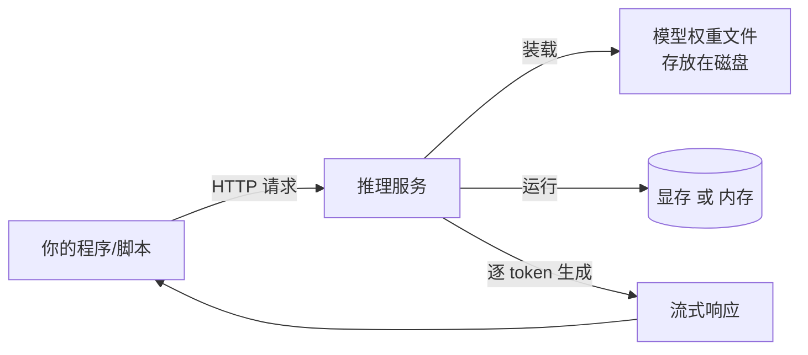

# 1.1 从零到第一次调用：最小推理服务

## 开篇问题

假设你要给团队的内部知识库加一个"问答机器人"，但数据不能发往外部 API；或者你所在的环境网络不稳定，需要一个不依赖云端的模型。很自然的想法是：在自己机器上跑一个。动手之前，四个问题依次冒出来——模型从哪里来？下载下来的文件是什么？用什么程序让它运行？怎么让自己的代码调用它？

这一章只解决这四件事。到最后，你会在自己的机器上跑起一个 7B~8B 参数级别的模型，用一条 curl 命令完成一次真实调用，并且能向别人解释清楚这次调用里每个部件的角色。

## 正文

### 整体图景：四个部件，一条链路

先把全景摆出来。你要搭的东西在整条推理链路里的位置是这样的：



输入是一段结构化的对话（JSON 格式），输出是逐个生成的 token 组成的流式响应。"推理服务"这一框是本章的主角：它是一个常驻进程，对内管理模型权重，对外提供网络接口。它消耗三类资源——磁盘（存放权重文件）、显存或内存（运行时装载）、CPU 与整机功耗（生成时的计算与供电）；它直接决定的用户指标是"响应有多快"，不过本章只做现象观察，正式定义留给第三章。

下面沿着"文件 → 引擎 → 接口 → 装载 → 调用"的顺序把这条链路走通。

### 模型在硬盘上的形态：一个权重文件

所谓"下载一个模型"，下载的是一个包含**权重（weight）**的数据文件——权重就是模型训练完成后固定下来的全部参数，推理时它们只被读取，不再改变。参数的多少用"B"（billion，十亿）计数：8B 就是约 80 亿个参数。

关键问题是这个文件有多大。它由一个你马上会到处见到的变量决定：**位宽（bit width）**——每个参数用多少个比特存储。两种典型口径：

- 原精度 FP16：每个参数 2 字节，8B 模型约 16GB；
- 量化（quantization）到 4 bit 档：每个参数约 0.5 字节，8B 模型约 4~5GB。

量化这个词在本章只需要理解到"**体积档位**"这一层：4bit 档把文件砍到约三分之一，代价是精度有轻微损失，损失多大、为什么可控，第二章专门讲。现在你只需要会读文件名——`qwen-8b-q4_k_m.gguf` 里的 `q4` 就是在告诉你"这是 4bit 档"，文件大小通常也直接标注在下载页。

于是"我的机器跑不跑得动"有了第一道判据：**可用显存（或内存）要大于文件体积，并留出运行余量**。显存（VRAM）是显卡上用来放"正在计算的数据"的高速存储；运行时模型权重必须装进它（或退而装进内存），放不下就无法运行。这句话的具体算法本章末尾给出，完整版在第二章。

### 引擎：让权重动起来的程序

权重文件自己不会运行，就像硬盘里的 Word 安装包不会自己排版。负责装载权重、调度计算、对外提供接口的程序叫**推理引擎（inference engine）**。

个人设备生态里的引擎分两个流派，本章各用一句话定位，完整的地图和取舍在第三章展开：

- **llama.cpp 系**：吃上面那种 GGUF 量化文件，为个人电脑和消费级显卡设计。Ollama、LM Studio 都属于这一派（Ollama 底层基于 llama.cpp，封装了模型下载与服务，此依赖关系以官方文档为准）；
- **vLLM/SGLang 系**：面向服务器的高并发场景，吃原精度或特定量化格式，第三章的主角。

本章用 Ollama：一条命令装好、一条命令拉模型、自动提供网络接口——对第一次部署来说，能把四个部件中最陌生的两个（引擎与接口）一步到位。

### 接口：让程序调用模型

模型跑起来之后，怎么让"程序"而不是"你自己敲命令"来用它？答案是引擎会开一个本地网络端口，提供 **OpenAI 兼容 API**——因为 OpenAI 的对话请求格式成了事实标准，本地引擎普遍提供同形接口。好处是：你的调用代码写一次，以后把地址从本地换成云端、从 Ollama 换成 vLLM，几乎不用改。

Ollama 默认监听 `11434` 端口，OpenAI 兼容路径是 `/v1/chat/completions`。参数细节以所用版本的官方文档为准，这类接口约定可能随版本调整。

### 装载：显存、内存与磁盘的关系

引擎启动时把权重从磁盘读进哪里，取决于硬件：有可用显存时装进显存，计算由 GPU 承担；显存不足或没有独显时退回内存用 CPU 算——功能可用，速度显著下降（差的不是一点半点，机制在第四章）。本章的判断点只有一条：**装进显存之后，显存占用 ≈ 权重体积 + 少量运行开销 + 对话历史缓存**。那个"对话历史缓存"（业内叫 KV cache）会随对话变长而线性增长，是第二章的主角，本章只需要知道它存在。

### 第一次调用，以及一个值得记下的现象

一切就绪后，用两种方式各调用一次：非流式（等全部生成完一次性返回）和流式（生成一个字就推一个字）。你会观察到：流式模式下第一个字到达的时间，明显早于非流式模式返回全部内容的时间。这个"首字先到"的现象先原样记下——它不是错觉，第三章会给它正式的名字（TTFT）并教你测量；现在能说出"因为生成是逐字进行的，第一个字不需要等全部字"就足够了。

## 完整算例

**已知条件**：模型 Qwen 8B 级；档位 Q4_K_M，下载页标注文件 5.0GB（以模型页标注为准）；你的显卡显存 8GB；用途是与文档对话，对话长度中等。

**要回答的问题**：这张卡装得下吗？

**公式**：

```
运行时显存 ≈ 权重体积 + 词表与配置开销 + 对话历史缓存（KV）+ 引擎运行开销
```

**逐项解释与代入**：

- 权重体积：5.0GB（文件口径）；
- 词表与配置开销：词表（约 15 万条目）和模型配置约占 0.3~0.6GB，取 0.5GB；
- 对话历史缓存：短对话（几千 token）在 8B 模型上约占 0.1~0.3GB，取 0.2GB；
- 引擎运行开销：计算缓冲与预留，约 0.5GB。

合计 ≈ 5.0 + 0.5 + 0.2 + 0.5 = **6.2GB**。

**数量级与单位检查**：8B 参数 × 0.5 字节 ≈ 4×10⁹ 字节 = 4GB，与"5.0GB 文件"同数量级，多出的 1GB 与"附加开销"一项互相印证，数量级自洽。显存单位这里按十进制 GB 口径，与商品标注一致（二进制 GiB 口径的差异第二章说明，约 7%）。

**这是粗略估算，不是实测值**。误差主要来自两处：KV 缓存随对话长度线性增长（长对话会显著变大）；不同引擎的显存预留策略不同。结论：6.2GB < 8GB，可以运行，但长对话场景余量不大——这个"余量不大"的感觉，请带着进入第二章。

## 贯穿案例的最终分析

开头的任务是"给内部知识库加问答机器人"。用本章的四个部件把决策过程完整走一遍：

1. **模型从哪来**：公开模型托管站下载，选参数量适中的 8B 级——团队内部问答不需要旗舰模型的智力，先跑通再升级；
2. **文件是什么**：Q4 档 GGUF 文件约 5GB——由"显存 8GB"这条硬约束反推出来的档位，而不是"越高越好"；
3. **用什么运行**：Ollama（llama.cpp 系）——个人设备、单机低并发，服务端引擎的并发能力此时是浪费；
4. **怎么调用**：OpenAI 兼容接口——未来如果迁到服务器或云端，调用代码可以几乎不动。

本地部署的常见动机里有三条需要校准口径："更省钱"只在调用量足够大、且利用率不低时成立（第五章算总账）；"更快"要与所用云端档位对比而非泛泛而谈；"更私密"在权重与数据都完全不出本机时成立——三条各有适用条件，不存在无条件的"本地一定更好"。

## 理解检查

1. **计算**：一个 14B 模型的 Q4 档文件大约多少 GB？给出估算过程（提示：每参数约 0.5 字节，别忘了附加开销）。
2. **条件变化**：还是那张 8GB 显存的卡、同一个 8B 模型，如果你把对话历史拉到非常长，预计会发生什么？哪个部件的体积在增长？
3. **排障**：调用时 curl 返回 `connection refused`。列出你的排查顺序（至少三步），并说明每步在验证什么。
4. **选型**：预算一张卡，要求跑 14B Q4 档且留出长对话余量，显存至少应选什么量级？说明你的余量估算。

## 动手实验

**环境**：Windows 或 Linux；有 8GB 显存的 NVIDIA/AMD 显卡更佳（无独显亦可跑，纯 CPU 速度显著慢）；磁盘剩余 10GB；已安装 Ollama（ollama.com，安装步骤以官网为准）。

**步骤与命令**：

```bash
ollama pull qwen3:8b          # 下载权重文件（体积以模型页为准）
ollama serve                  # 启动服务（部分安装方式已自动启动）
curl http://localhost:11434/v1/chat/completions \
  -H "Content-Type: application/json" \
  -d '{"model":"qwen3:8b","messages":[{"role":"user","content":"用一句话介绍你自己"}]}'
# 再加 "stream": true 重发一次，观察返回形式差异
```

**应记录的指标**：下载文件体积；显存占用（`nvidia-smi`）；非流式总耗时；流式模式下第一个字到达时间（手机秒表即可）。

**预期现象**：显存占用约 5~7GB；流式首字明显早于非流式整体返回；纯 CPU 环境下速度慢一个数量级。

**失败排查**：`connection refused` → 服务未启动或端口不对（`ollama list` 确认模型在位）；显存不足报错 → 换更小参数量模型（如 4b）验证流程后回到第 2 章；下载中断 → 检查磁盘空间与网络，`ollama pull` 支持断点续传。

## 本章能力清单

对照四个学习目标：

- ✅ 装好引擎、拉起 7B~8B 模型、用 curl 打通 OpenAI 兼容接口（实验 1~3 步）；
- ✅ 说清两流派差异与"今天为什么用 Ollama"（引擎一节）；
- ✅ 数出一个句子的 token 数并解释"为什么按 token 计费/计量"（算例与理解检查 1）；
- ✅ 按显存约束反推可选的模型档位（完整算例 + 理解检查 4）。

## 与下一章的衔接

你已经跑通了调用，但"按下回车之后机器里发生了什么"仍是一团黑盒：分词在哪发生、GPU 和 CPU 各干了什么、为什么首字先到。下一章（1.2 一次请求的旅程）把这团黑盒拆成七步泳道图——你会发现自己本章的两次调用，正好是拆解所需的全部分析对象。

## 资料来源与延伸观看

- 案例与方法来源：SPOTLITE（B 站 UP 主）关于本地推理请求链路中 CPU 角色的讲解（BV1qU846JEpW）、"入坑本地 AI 之前的心法"中"以终为始"的选型顺序（BV1GtbL63Ekt）；视频清单与全部出处见附录 B。
- 接口与安装：Ollama 官方文档（ollama.com/docs）；llama.cpp 仓库（github.com/ggml-org/llama.cpp）。接口路径与参数以所用版本官方文档为准。
- 文件体积口径：以模型发布页（如 Hugging Face / ModelScope / Ollama 模型库）标注为准；位宽与体积的换算方法见本章算例。
- 原资料未说明之处（如具体帧率下的实测功耗、不同版本的显存预留差异）本文未作推断，留待第二章与第四章的实测方法补齐。
