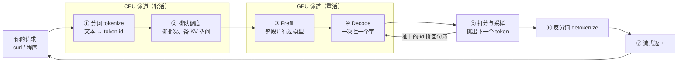

# 1.2 按下回车之后：一次请求的旅程

## 开篇问题

上一章的结尾，你在终端按下了回车：一段 JSON 发往本机 11434 端口，屏幕空白了不到一秒，然后回答像打字机一样一个字一个字蹦出来。调用成功了，但"回车与首字之间"发生了什么，对你仍是一团黑盒。

三个问题值得在动手前问清楚：这不到一秒里，机器上谁在干活？回答为什么是逐字出现的，而不是想好整段一起给你？如果你顺手打开了任务管理器，还会看到第三个更反直觉的问题——推理期间总有一两个 CPU 核心钉在 100%，其余核心很闲：换一颗主频更高的 CPU，字会蹦得更快吗？

本章把你在 1.1 发出的那次调用放上放大镜，拆成七个步骤、两条泳道。全程只做三件事：观察现象、记录数字、给现象起名字。严格的指标定义与测量口径，留给第三章。

## 正文

### 镜头对准那次 curl：一条链路，两条泳道

先看全景。你在 1.1 搭起的服务，处理的每一次请求都走同一条流水线：分词 → 排队调度 → Prefill → Decode → 打分与采样 → 反分词 → 流式返回。七步里有轻有重：前两步和后三步是查表、组队、字符串翻译一类的轻活，多半落在 CPU；中间的重计算落在 GPU。两条泳道像餐厅的前台与后厨：前台接单、把菜单翻成后厨看得懂的单据、安排出菜顺序；后厨开火炒菜。



输入是一段 JSON 对话，输出是逐 token 的文字流；调用方是你的程序；消耗的是 CPU 的少量轻活时间与 GPU 的整段生成时间；它直接决定的用户体感是"等多久开始回话"和"字蹦得多快"。把这七个框记在脑子里，接下来逐个打开。

▶ 插画：同一条旅程的泳道图——七个框在 CPU 与 GPU 之间怎么接力，谁在什么时候把活交给谁；图下方还有一句现成的结论，等你读完本节回来核对。

<div class="ill" data-ill="request-journey"></div>

### 最初的几十毫秒：分词与排队（CPU 的活）

请求到达的第一站不是模型，是分词（tokenize）。1.1 见过的那张"切字规则表"——词表——现在开始工作：分词器拿着你的输入对着词表走一遍，把"今天天气不错"这样的字符串变成一串编号（token id），形如 [108386, 104520, …]。模型从头到尾只认识编号，不认识汉字；这个翻译必须有人先做，而它本质是查表加字符串处理，典型的 CPU 活。

第二站是排队调度（scheduling）。服务不会来一个请求就直接砸给 GPU：先排队，再把长输入切成小块（chunk）、把同时到达的请求组织成批（batch），并为这次请求预留对话历史缓存——就是 1.1 埋过名字的 KV cache——的存放空间。批怎么组、空间怎么分，直接决定多用户时谁快谁慢，那是第三章 3.2 的主题；本章只需要知道：这一步在 CPU 上，决定你的请求何时轮到 GPU。

这两站加起来花多久？个人低并发场景下，几十毫秒甚至更短。这就解开了任务管理器里的反直觉现象。

**已解示例**：设你的服务单并发吐字速度约 100 tok/s，这次回答要生成 500 个 token，Decode 阶段约 5 秒；CPU 侧分词加调度按 50 毫秒计。占比 = 0.05 ÷ (0.05 + 5) ≈ 1%。现在把 CPU 主频从 1.5GHz 提到 5GHz（约 3 倍），这 50 毫秒被压到十几毫秒——整个请求只快了三十几毫秒，体感为零。所以一两个核心满载是分词与调度线程在干活，不代表 CPU 拖了后腿；为推理换高主频 CPU，钱花在了占 1% 的环节上（来源：BV1qU846JEpW）。

**小练习（5 分钟）**：同一台机器，如果回答只有 50 个 token（Decode 约 0.5 秒），CPU 那 50 毫秒的占比变成多少？由此说说"CPU 何时才值得升级"取决于什么？

这个"CPU 不重要"的结论有边界：当几十路请求同时涌进来，分词与组批的工作量随请求数上涨，CPU 侧才可能成为瓶颈——那时重要的不是单核主频，而是多核与调度能力，商业部署对此敏感，个人低并发用不着操心。

### Prefill：整段吞入，边读边记笔记

请求轮到 GPU，第一件事不是写字，是读题。预填充（Prefill）把你的全部输入 token 一次性并行送进模型：几千个 token 齐头并进，同时过完模型的全部层。读题过程中模型顺手做另一件事——给每个位置记笔记，把"前文说了什么"写进那份 KV cache。这份笔记现在只需知道两个用途：它让后面的字不必每次重读全文；它的体积随对话变长而增长——1.1 的显存小练习里你已经见过这个现象。笔记里记了什么、凭什么这么省，下一章拆开。

Prefill 干完，模型吐出第一个 token。注意这个顺序：第一个字是在读完你全部输入之后才出现的。输入越长，读题越久，第一个字到得越晚——你等第一个字的时间，大头花在 Prefill 上。

▶ 动画：拖动输入长度，看"吞入"与"吐出"两段在时间轴上怎么排布；红色标记的那段，就是你等第一个字的等待。

<div class="demo" data-demo="prefill-decode"></div>

### Decode：自回归，一次只吐一个字

第一个字出来之后，节奏变了。模型不会打腹稿，它唯一会做的事是：给定前面全部内容，算出下一个 token。于是生成变成一个循环——吐一个 token，把它拼到句尾当输入，再算下一个，直到吐出结束符。这种"自己的输出回头当输入"的模式叫自回归（autoregressive）。

自回归意味着两件事。其一，每个新 token 都要把"全部历史 + 模型的全部层"过一遍：写 500 个字的回答，就是约 500 圈完整循环，这就是回答逐字出现、长回答耗时按秒计的根源。其二，循环是串行的：第 100 个字依赖第 99 个字落定，前后强依赖，无法像 Prefill 那样并行铺开。Decode 为什么慢、慢在哪一环（权重搬运、缓存读取还是调度），属于瓶颈分析，第三章 3.4 与第四章展开；本章先把现象钉牢：**Prefill 一大口并行吞，Decode 一小口串行吐。**

### 打分、抽签、反查：一个 token 的诞生

Decode 每一圈的末尾有一小段流水线，1.1 遗留的"同一问题问两遍答案不同"在这里揭晓。先打分：模型最后一层给词表里的每个 token 出一个原始分数（logits）——词表十几万条，就是同样长的一排数，分数越高代表"下一个是它"的把握越大。再归一化与抽签：softmax 把这排数压成概率分布，特点是赢家多吃——分数差一点，概率差一截；然后按概率抽签，抽中的 token id 拼回句尾，成为下一圈输入的一部分。最后反分词（detokenize）：把编号对着词表换回文字，交给流式返回。打分跟着 Decode 在 GPU 上一起算；抽签与反查是查表轻活，多半落回 CPU——不同框架会把个别步骤挪来挪去，但"重活进 GPU、轻活留 CPU"的格局不变。

**已解示例**：一轮 Decode 结束，假设头部候选的概率是"北京 70%、上海 20%、天津 3%"。把采样温度（temperature，1.1 见过）设为 0，就是贪心采样——每步直接取最高分，稳定输出"北京"，两次运行逐字相同；设为 1，大多数时候仍是"北京"，偶尔"上海"上位；温度越大，冷门机会越多。上一章那个"问两遍答案不同"的现象，抽的就是这一签。（教学例子只列了三位候选，真实词表是十几万个 token 在竞争。）（来源：BV1qU846JEpW）

**小练习（5 分钟）**：温度设 1、按"北京 70%"的分布连问 10 次"中国的首都是哪里"，大约几次回答北京？如果连续 3 次都是"上海"，你如何判断这是抽签的正常波动、还是模型出了错？

### 流式返回：字为什么一个一个蹦

最后一步回到 HTTP 服务：每产出一个 token 就立刻装进响应推给你，而不是攒齐整段再发——这就是流式，1.1 里那个 `"stream": true`。现在可以把上一章记下的现象正式记账了：

- 等第一个字的时间，业内简称 TTFT（Time To First Token，首 token 等待）。它主要由 Prefill 决定，输入越长越久。此刻它只是个观察代号——怎么测得标准、它为什么值得单独当指标，第三章 3.1 展开；
- 开讲之后字蹦得多快，是 Decode 的速度，体感就是"每秒几个字"。

*指标回看 · TTFT：本章从 1.1 的"现象观察"升级为"首次观测"——有了名字和秒表测法，严格口径在 3.1。*

*指标回看 · 吞吐：本章仍是"每秒几个字"的体感口径，尚未与并发、批量挂钩。*

这两笔账在同一台机器上可以差出几倍到几十倍。一个极端样本：一张 400 元的老卡 P40 加一张 400 元的 P106（合计 48G 显存），跑 176B 参数的 Qwen3.8-Flash——IQ1_S 档权重仍有 72G，塞不进显存，其中 51B 参数的 n-gram 查询表被外挂到 100 元的 128G U盘上（这种"外挂"玩法第四章展开）。不开 MTP、不开投机解码，短输入实测吐字约 28~29 tok/s；换长输入才测得出读题速度，约 314 tok/s。同一台机器，吞字是吐字的 11 倍——"等它读完"和"等它写完"是两笔不同的账（来源：BV1xQtf6SEHR）。

这 11 倍的差距意味着什么，用一笔完整的账算给你看。

### 多轮对话：历史在窗口里

用到这里你会发现一个别扭的事实：第二轮提问时，客户端要把第一轮的问与答一起放进 messages 数组重新发过去。OpenAI 兼容接口默认无状态（stateless）：服务不替你记住上一轮，"记忆"的载体就是你每次发来的历史本身——历史在窗口里。

由此能推出一个可检验的预言：第二轮的输入比第一轮长（多了上一轮的问与答），Prefill 读题更久，TTFT 应一轮比一轮略高；聊得越深，每轮开场的等待越长。本章实验里你就能亲手验证。历史也不能无限变长——它受上下文窗口约束，长到一定程度被截断，那是 1.4 的主题；而"生成时怎么免于重读全部历史"，下一章用 KV cache 回答。

## 完整算例

**已知条件**：

- 输入：8192 token 的 prompt（约 8K，相当于一篇长文档或大段代码；原案例中被切成 4 个 2K 小块分批处理）；
- 引擎甲：单张 RTX 2080Ti，27B 稠密模型，Q4_K_M 档，Prefill 速度实测约 580 tok/s（单路请求；软件栈与并发细节原资料未说明，数字按跑分表 Prefill 口径）（来源：BV1YxjU6qEuw）；
- 引擎乙：同为单张 RTX 2080Ti，Qwen3.6 27B 稠密模型，INT8 档权重，推理项目 0.1.6 版"疯狗模式"，长代码输入实测 Prefill 约 2600 tok/s（MTP 已关闭；并发数原资料未说明）（来源：BV1XrE26iEMG）。

**要回答的问题**：同一份 8192 token 的输入，两台引擎上"等第一个字"各要多久？

**公式**：

```
TTFT 估算值 ≈ 输入 token 数 ÷ Prefill 速度（其余前期开销另计）
```

**逐变量解释与代入**：分子是输入 token 数——必须整段读完才能出第一个字的量；分母是 Prefill 速度，单位 token/秒，衡量每秒能读完多少输入。引擎甲：8192 ÷ 580 ≈ 14.1 秒；引擎乙：8192 ÷ 2600 ≈ 3.2 秒。同一份输入，首字等待差约 11 秒。

**数量级与单位检查**：token ÷ (token/秒) = 秒，单位闭合；8×10³ ÷ 5.8×10² ≈ 14，与 14.1 同数量级，自洽。

**这是估算，不是实测 TTFT**。公式只算 Prefill 主项，没计排队、分词、首 token 生成与传输，实测值会略高一些。误差来源还有三处：输入形态（同一引擎下纯文本约 2500、长代码约 2600 tok/s，读题时间总是按 token 数计而非字数）；切 chunk 与组批的方式；框架与档位差异——甲乙两台不是单变量对照（Q4_K_M 对 INT8、软件栈也不同），所以本例只能支撑"同一份输入，不同引擎的首字等待可差数倍"，推不出"INT8 档比 Q4_K_M 档快"，那是第二章量化的账。

## 贯穿案例的最终分析

把镜头拉回你在 1.1 发出的那次 curl，用七步泳道把决策与观察完整走一遍，再拿极端样本检验理解。

1. **你的输入只有一句话，约二十个 token**：Prefill 读题用不了 10 毫秒，所以你感觉不到等第一个字。极端平台上"输入太短时连 Prefill 速度都测不出来"也是同一回事（来源：BV1xQtf6SEHR）——短输入下，TTFT 里能观察到的反而是装载、排队这些固定开销；
2. **回答 200 个 token、吐字几十 tok/s**：耗时的大头在 Decode 的几百圈循环里。所以"慢"要先分段：等首字慢，看输入长度与 Prefill；蹦字慢，看 Decode 速度。两种慢，药方不同；
3. **对照 176B 平台的 314 对 28.9**：同机 Prefill 快、Decode 慢并不矛盾——前者一次并行读题，后者一圈一圈串行写字。决策含义：长文档问答先关心 Prefill，长输出任务（让它写完整代码、生成完整页面）先关心 Decode——Decode 只有 28~29 tok/s 的机器上，生成一份带图表的完整答案要十几分钟，"方案能不能用"取决于你等不等得起；
4. **CPU 全程占约 1%**：第一章"预算留给显卡"的判断，在这里拿到了链路层面的证据——升级清单上，CPU 排在最后。

## 理解检查

1. **计算**：输入 4096 token，Prefill 速度 500 tok/s；回答要生成 300 个 token，Decode 速度 40 tok/s。TTFT 估算值与总时长各约多少？哪个环节占大头？
2. **条件变化**：第二轮对话，你把第一轮约 1200 token 的问答一起发回。TTFT 会怎么变？用七步中的哪一步解释？
3. **排障**：用户甲抱怨"点发送后半分钟没动静"，用户乙抱怨"开始回话后每秒只蹦三四个字"。两个抱怨分别指向链路哪些环节？你各会先看哪个数字？
4. **选型**：同事提议"给推理服务器换 5GHz 高主频 CPU，用户首字会更快"。用本章证据说明这条建议在什么条件下成立、什么条件下不成立。

## 动手实验

**环境**：1.1 已部署的 Ollama 服务（模型 qwen3:8b）；另开一个终端跑 `htop`（Windows 用任务管理器"性能"页）；准备一段约 2000 字的中文文章；先发一条短请求预热，避免模型装载时间混进计时（1.1 的装载现象）。

**步骤与命令**：

```bash
# 0) 预热：先随便问一句，确认模型已装载
# 1) 流式：time_starttransfer ≈ 首字时间（含连接开销）
curl -s -o /dev/null -w "首字 %{time_starttransfer}s 总计 %{time_total}s\n" \
  http://localhost:11434/v1/chat/completions \
  -H "Content-Type: application/json" \
  -d '{"model":"qwen3:8b","stream":true,"messages":[{"role":"user","content":"写一篇 300 字的秋天短文"}]}'

# 2) 非流式：同一问题再看一次
curl -s -o /dev/null -w "首包 %{time_starttransfer}s 总计 %{time_total}s\n" \
  http://localhost:11434/v1/chat/completions \
  -H "Content-Type: application/json" \
  -d '{"model":"qwen3:8b","stream":false,"messages":[{"role":"user","content":"写一篇 300 字的秋天短文"}]}'

# 3) 长 prompt 对照：把 2000 字文章粘进 content，要求"用 200 字总结"，重复第 1 步
# 4) 生成期间观察 htop：哪几个核心满载？
```

**应记录的指标**：输入字数与 token 数（非流式返回的 usage 字段里有 prompt_tokens 与 completion_tokens；流式模式是否返回 usage 因版本而异，以官方文档为准）；两种模式的 time_starttransfer 与 time_total；吐字速度 = 输出 token 数 ÷ (time_total − time_starttransfer)；满载核心数。

**预期现象**：流式首字明显早于非流式整体返回；换长 prompt 后 time_starttransfer 明显变长，而吐字速度变化不大；htop 显示一两个核心满载、其余空闲。

**失败排查**：流式模式下 curl 打印出一串 JSON 行——那是逐 token 的响应块，属正常现象，`-o /dev/null` 可静音；读不到 usage 字段 → 用非流式请求取；connection refused → 回 1.1 的排查三步；单次数字抖动大 → 每组测三次取中位数，并关掉其他占显存的程序。

**产出**：手绘泳道图一张（七个步骤、CPU/GPU 两条泳道，标出你实测的首字时间与总时长分别落在哪两步之间），配观察记录一份（四次请求的两列时间与算出的吐字速度）。

## 本章能力清单

对照本章学习目标：

- ✅ 画出并讲清七步链路，标出每一步落在 CPU 还是 GPU（泳道一节 + 插画 + 产出）；
- ✅ 解释自回归为什么让回答逐字出现、为什么长回答按秒计（Decode 一节 + 理解检查 1）；
- ✅ 用"输入 token 数 ÷ Prefill 速度"估算 TTFT，并说明这是估算、说得出误差来源（完整算例 + 理解检查 1）；
- ✅ 用流式/非流式对照手工测出首字时间与吐字速度，并解释 CPU 满载不是瓶颈（动手实验 + 已解示例）；
- ✅ 解释多轮对话中"历史在窗口里"对每轮等待的影响（多轮一节 + 理解检查 2）。

## 与下一章的衔接

本章留下一个显眼的重复劳动：Decode 每一圈都把"全部历史 + 全部层"重过一遍——第 100 个字真的需要把前 99 个字从头算起吗？另外，Prefill 读题时写下的那份 KV cache 笔记，凭什么能让第二个字便宜下来？下一章（1.3 为什么第二个字便宜）拆开这份笔记，你会看到"读题时顺手记笔记"是整台机器上最划算的一笔交易。

## 资料来源与延伸观看

- 案例与方法来源：SPOTLITE（B 站 UP 主）"本地 AI 推理，CPU 性能重要吗"中的一次请求完整链路与 CPU 角色拆解（BV1qU846JEpW）；两张老卡加 U盘跑 176B 的实测：吐字 28~29 tok/s、读题 314 tok/s、短输入测不出 Prefill（BV1xQtf6SEHR）；视频清单与全部出处见附录 B。
- 算例数据来源：2080Ti 单卡 27B Q4_K_M 的 Prefill 580 tok/s（BV1YxjU6qEuw）；2080Ti 单卡 27B INT8"疯狗模式"长代码输入 Prefill 2600 tok/s（BV1XrE26iEMG）。两处口径以原视频与对应仓库为准，本章仅做数量级换算。
- 接口与计时：Ollama 官方文档（ollama.com/docs）；curl 的 -w 计时变量说明（curl.se/docs）。`stream` 参数与 usage 字段的版本差异以所用版本官方文档为准。
- 原资料未说明之处（两台引擎实测的并发数与部分软件栈细节）本文未作推断；TTFT 的严格定义在第三章 3.1，Prefill/Decode 的瓶颈分析在第三章 3.4 与第四章。
