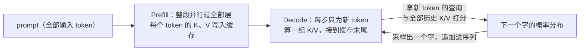

# 1.3 为什么第二个字便宜：注意力与 KV 缓存

## 开篇问题

沿用 1.1 装好、1.2 拆解过的那套服务做个小观察：发一个问题，盯着流式回答，第一个字总是等得最久，之后的字一个接一个冒出来，速度基本稳定。这有点反直觉。写到第 100 个字的时候，模型面前已经摊着一百多个字的前文，照理说活越干越多、越写越慢才对，实际却几乎不掉速。如果每个新字都要把全部前文重新"看"一遍，这笔开销为什么没有滚成雪球？

还有一个更日常的疑问：多轮对话里，它明明记得你两轮前说过的话；可你新开一个会话，它就全忘了。这份"记忆"到底放在服务器里，还是你的请求里？

本章只回答一个核心问题：**模型生成时怎么"记住"前文？**答案分两层。单次生成之内，靠一份叫 KV 缓存的笔记；多轮对话之间，模型其实什么都不记，是你的程序每次把历史原样重发。把这两层拆开，"第二个字为什么便宜"也就有了答案。

## 正文

### 整体图景：一份笔记，两条流水线在用

上一章的七步链路里，与"记忆"有关的是中间两步：prefill（把输入整段过一遍模型）和 decode（逐字生成）。它们共用一份笔记，这份笔记在链路里的位置是这样：



谁调用它：prefill 负责写入，decode 每步读一次、追加一组。它消耗的资源是显存，而且是常驻：权重装完就不动了，这份笔记却随对话变长一直长大。它影响的指标也直接：首字等待（TTFT，Time To First Token，上一章用 time_starttransfer 量过的那个数）、显存占用，以及并发（每一路请求都要一份自己的缓存，互不共享）。

下面从"看"这个动作说起，一步步推出这份笔记为什么必须存在。

### 回头看：预测下一个字的依据

自回归生成（上一章的"一次只吐一个字"）意味着每个新字都站在全部前文的基础上做预测。这个"站在前文基础上"由注意力（attention）完成：生成新 token 之前，让当前位置对之前的每个 token 打一个相关度分数，再按分数把各 token 携带的信息加权汇总，汇总结果参与这次预测。分数就是话语权：谁的分数高，谁对下一个字的影响大。

分数怎么来？每个 token 在每一层都会变换出三个向量：Query（查询，"我在找什么"）、Key（键，"我能提供什么"）、Value（值，"真正被搬走使用的内容"）。流程三步：拿当前 token 的 Q 与所有历史的 K 算匹配分；分数归一化成加和为 1 的权重；按权重把各 token 的 V 加权求和。谁的 Key 和我的 Query 最匹配，我就多"看"谁。注意 Q、K、V 都是数字向量，"检索"只是类比：匹配度是算出来的连续分数，不是关键词命中。

还有一处容易低估的开销：这场"回头看"发生在每一层。1.1 的模型配置里有个"层数"字段，8B 级模型通常在三十多层这个量级（你装的 qwen3:8b 是 36 层），等于把同一份历史从几十个角度各看一遍。层数越多、历史越长，"看"就越贵。本章后面所有账，根源都在这一步。

▶ 动画：点击矩阵中的任意一行，看这个 token 在"回头看"时把注意力分给了谁；空格是它之后的字，生成时未来的字还不存在，看不见。

<div class="demo" data-demo="attention"></div>

**已解示例**：点最后一行"包"，它分给"书"的权重明显高于"把"。有道理：要判断这个"包"是"书包"的包还是"包起来"的动作，最有用的前文证据就是"书"。边界记住一点：动画里是示意值，真实权重由每一层的 Q、K 算出；同样的"回头看"每层各做一次，各层看重的点并不相同。

**小练习（5 分钟）**：点"放"所在那一行，找出权重最高的两个词，用一句话解释为什么这个动词需要回头看主语和宾语。

### 关键观察：历史的笔记算一次就不会变

于是问题变成：每出一个字都要为全部历史打一遍分，那历史各 token 的 K 和 V，是不是也要每次重新算？

不用。一个 token 的 K 和 V，由它自己连同它之前的历史一起算出，而这在它进入序列的那一刻就定格了：模型里的注意力只"向前看"，后面无论生成出什么字，都不会回头改写它们。朴素做法（每生成一个字就把全部历史的 K/V 重算一遍）是纯粹的重复劳动。把算好的 K、V 存起来复用，这就是 KV 缓存（KV cache）：prefill 阶段整段算好写入，decode 每步只为新 token 算一组，接到缓存末尾。代价说在明处：省的是计算，付的是一块随对话变长的常驻显存，用显存换算力。

打个比方：读长文做摘录卡，K 像关键词索引，V 像内容摘录，之后每读一个新词只翻卡片、不重读全书。比方的边界也要说清：卡片不能代替原文，注意力打分仍然要拿新 token 与全部卡片逐一比对。省掉的是"重做卡片"的劳动，"翻卡片"的劳动省不掉。

所以"第二个字便宜"的准确说法是：**便宜是相对朴素做法而言**的。没有缓存时，每一步的重算量随进度线性涨，整段生成的累计开销随长度平方增长；有了缓存，每步只算一组新的 K/V，成本不再随进度滚雪球。历史变长当然仍有代价，每步要翻看的卡片更多了，但那是线性变沉，不是平方级崩塌。

约定一个说法："生成第 n 个字"指历史里已有 n−1 个字的那一刻。

**已解示例**：生成到第 4096 个字。无缓存的假想世界里，第 n 步要为历史里 n−1 个字重算 K/V，累计约 4096²/2 ≈ 839 万组 token 级 K/V 重算；有缓存时每步只算一组，累计 4096 组。两组之比约两千倍（839 万 ÷ 4096 = 2048），长文本生成速度不崩，原因就在这里。

**小练习（5 分钟）**：在没有缓存的假想世界里，生成第 100 个字的那一步，要为多少个历史 token 重算 K/V（提示：那一刻历史里已有 99 个）？第 1000 个字那步呢？由此说明"没有缓存就会越写越慢"。

### 三种记笔记法：全抄、只留最近一页、只留摘要卡

"全抄"就是全注意力（full attention）：把全部历史的 K/V 都存下来。工程上还有两种省笔记的做法，加上把它们混着用的架构，构成你在模型卡上会遇到的三种层型：

| 记笔记法 | 层型 | 笔记内容 | 笔记随上下文 |
| --- | --- | --- | --- |
| 逐字全抄 | 全注意力（Full Attention） | 全部历史的 K 和 V | 线性增长 |
| 只留最近一页 | 滑动窗口注意力（Sliding Window Attention） | 窗口内的 K/V（如最近 1024 个 token），更早的丢弃 | 封顶 |
| 只留摘要卡 | 线性注意力（如 GDN，Gated DeltaNet） | 定长的状态缓冲（内部叫递归状态与卷积状态，名字不重要），新 token 来了压缩更新一次 | 固定 |

曲线形状要盯住：只有第一行是斜线，后两行是水平线。长上下文的显存压力几乎全部来自全注意力层。三种层型按比例混着用的模型叫混合架构，这时"每层都存 K/V"的假设只对其中全注意力的那部分层成立，这个伏笔两节后收线。

GDN 的取舍：它不逐 token 存历史卡片，只维护一张固定大小的"摘要卡"，新 token 来了压缩更新一次。代价是信息有损：太早的细节只剩压缩形态，对远处细节的回忆不如全注意力可靠。这是一笔工程取舍。

### 查证：公式没错，错的是层数怎么取

现在看一笔真实的账。配置：两张 2080Ti 魔改卡，单张 22G（原版 11G），合计 44G 显存；模型是一个 27B 级稠密模型（"稠密"指全部参数每步都参与计算，与之相对的 MoE 是"只激活一小部分参数"的稀疏架构，1.5 详解）；权重为 AWQ INT4 档、约 20G（AWQ 是一种 4bit 权重量化格式，与你 1.1 见过的 Q4 档同族，细节在第二章）；上下文开满 256K，即 262144 个 token；缓存按每数 2 字节存；模型卡标注 64 层。把"64 层都按全抄记笔记"代进公式（层数 × KV 头数 × 头维度 × 2 × 长度 × 字节数，下一节逐项拆解）：仅缓存一项就要约 64G，比整台机器的显存还大，何况还有 20G 权重。可这套配置确实跑起来了，推理框架为 vLLM，配置为项目自述口径。公式一定错了一处（来源：SPOTLITE 的 KV 显存账一期，BV1UMEv68E3C，出处说明见章末）。

错在哪？错在"64 层全是全注意力"这个假设。打开模型发布页的模型卡或 config 文件，有一个 Layer type（层类型）字段，列出每一层的类型：64 层里只有 16 层是全注意力，其余 48 层是 GDN 线性注意力。只把全注意力的 16 层代进"线性增长"的那部分账，缓存从 64G 缩到 16G，正好缩成四分之一，与层数占比一致；48 层 GDN 的定长状态只有 100 多 MB，不随上下文增长。同场还有一个模型（口播转写作"解码四"，疑为 Gemma 系列，以模型卡为准）：60 层，其中 10 层全注意力、50 层是窗口 1024 的滑窗。全按全注意力算是 120G，修正后约 20G，加上滑窗的固定开销约 800MB。同一份公式，层数取法不同，账差 4 到 6 倍。

▶ 动画：拖动滑块改"全注意力层数"和上下文长度。先把层数拖到 64（假装全是全注意力）得到 64G，再拖回真实的 16 层，看这笔账怎么缩回 16G。

<div class="demo" data-demo="kv-cache"></div>

建议把查证固化成习惯。拿到任何一个模型，先查四个字段：层数、KV 头数、头维度（config 缺 head_dim 时用 hidden_size 除以注意力头数）、Layer type 分布。这四个数是所有显存账的乘数；查错一个，账差几倍。

### 带历史与不带历史：一次请求的两种命运

先回答开篇的第二个问题。推理接口按无状态（stateless）约定工作：服务器处理完一次请求就忘，不替你留存任何对话，唯一的例外是显存里那份缓存，而它只服务正在处理的请求。多轮对话的"记忆"，是你的程序把历史消息一起放进 messages 数组重发，所谓带历史。新会话忘光跟缓存没关系，是你的程序根本没把那段话发过去。

带不带历史，差别在两个维度同时出现。语义维度：不带历史，模型对"它""刚才那个""这段话"这类指代无从下手，答非所问。性能维度有两笔账。首字那笔：历史是 prompt 的一部分，第一次出现的历史要靠 prefill 现读，垫得越多、第一个字到得越晚。显存那笔：常驻的缓存按累计历史记账，留给并发与计算缓冲的空间随之变小。两笔账能打的折扣不同：1.2 的实验第 5 步你见过"第二轮首字节几乎不涨"，那是引擎复用了前缀，读过的不重读。**首字那笔可以打折，显存那笔不打折。**上一章你量 TTFT 时只动过"输入长短"一个变量；本章把它拆出第二个来源：你决定垫进去的全部历史。历史是你可以控制的变量：精简历史，首字就快、显存就松。

*指标回看 · TTFT：上一章量的是"输入长短"这个变量，本章拆出第二个——历史长短；它经 prefill 推高首字时间（前缀复用可部分抵消），还同时推高常驻显存。*

**已解示例**：客服机器人第三轮对话，请求要带三轮往来（约 1200 token）加本轮问题（60 token）。若这三轮前缀是第一次读（新会话或引擎未复用），TTFT 由 1260 个 token 的整体决定，不是那 60 个；若引擎复用了前两轮的前缀，只有新增部分要现读，首字几乎不等，但显存里那份笔记始终按累计 1260 个 token 记账。对比单句翻译接口，每条请求互不相干，就不该带历史，白付首字时间与显存。

**小练习（5 分钟）**：同一个 8B 模型的两种场景：A 私人助理，单路并发、历史 8K；B 批量翻译，128 路并发、每条 50 token。用"单 token 值 × 总 token 数"（A 为 8192 个，B 为 128 × 50 = 6400 个）估算两边缓存账，再判断哪种场景显存压力大、压力大在哪里。

## 完整算例

**已知条件**：一个典型 8B 级开源模型，字段均可在模型发布页的 config 文件查到（具体型号以官方文件为准）：32 层（**口径声明：32 层是教学假设，全书"8B 档案"按 32 层/128 KiB 每 token 记账；真实的 qwen3:8b 为 36 层/144 KiB 每 token，见 2.1**）；KV 头数 8（该模型采用 GQA，多个注意力头共享一组 KV 头，头数变少、KV 变小，2.1 的公式里会用到，注意力总头数更多）；每头 128 维；K、V 各存一份；每数 2 字节（存储精度字段给出，为什么是 2 字节留到 2.3 章）。上下文取一轮长对话：4096 token。口径：本例假设 32 层全部是全注意力；混合架构只代全注意力层数。

**要回答的问题**：这个长度下缓存本体占多少显存？顺带得到本书反复使用的"单 token 值"。

**公式**：

```
单 token KV = 层数 × KV 头数 × 头维度 × 2（K 和 V 各一份）× 每数字节数
总 KV = 单 token KV × token 数
```

**逐变量解释与代入**：

- 层数 = 32：缓存按层分布，每层一份；
- KV 头数 × 头维度 = 8 × 128：每层每个方向 1024 个数；
- ×2：K、V 两份，每层 2048 个数；
- ×32 层：每个 token 共 65536 个数；
- ×2 字节：131072 字节，即 128 KiB（按 1024 进位，约 13 万字节；教学口径），这就是单 token 值；
- ×4096 token：536870912 字节 ≈ 5.4×10⁸ 字节，按 1.1 的十进制 GB 口径约 0.54GB。

**数量级与单位检查**：另一条路径：每 token 每层 2048 个数 × 32 层 = 6.5 万个数，6.5 万 × 2 字节 = 13 万字节。两条路径同数量级，账自洽。

**这是账面值，不是 nvidia-smi 读数**：读数还包括权重（Q4 档的 8B 约 5GB，1.1 算过）、计算缓冲与引擎预留；部分引擎对缓存分页或预分配，读数偏大或不动都是正常现象。权重、缓冲与缓存合成一本总账的方法（显存三本账）是第二章的事，本章只把"缓存"这一本单独算清。

*指标回看 · 显存占用：1.1 只有"文件体积＋余量"的粗判；本章你第一次能精确算出其中一本——缓存——随长度怎么涨；总账在 2.1。*

**误差来源**：各家模型的 KV 头数与层数差异很大，同样挂"8B"标签的模型单 token 值可能差一倍以上，必须查自己的 config；精度字节数取决于引擎的缓存存储口径；混合架构只计全注意力层。对照 1.1 "短对话缓存约 0.2GB"的粗估：0.2GB ÷ 单 token 值 ≈ 1500 token 出头。1.1 粗估里说的"几千 token"，按精确口径其实只值一两千个 token 的缓存，超过之后缓存会明显越过这个数。从"感觉余量不大"到"会算余量多大"，这一步就完成了。

## 贯穿案例的最终分析

回到那笔 44G 的账，把决策过程完整走一遍：

1. **问题**：观众质疑 44G 显存不可能同时装下 20G 权重与 256K 满血上下文，直觉估算"几十 G 甚至上百 G"。
2. **第一遍算**：用通行公式、把 64 层全代入，得 64G，比整机显存还大，矛盾坐实。
3. **找证据**：不动公式，先查假设。模型卡 Layer type 字段显示 64 层里只有 16 层全注意力。
4. **修正**：只把 16 层代入线性增长的部分，得 16G；48 层 GDN 是定长状态，约 100 多 MB。矛盾解除：44G = 20G 权重 + 16G 缓存 + 剩余留给计算缓冲，装得下。
5. **横向对照**：那个 60 层模型按朴素算法（naive）算 120G、修正后 20G，缩成六分之一；与 27B 案例的四分之一并不相同，说明这步查证没法抄答案，每个模型都要查自己的 Layer type。

口径与限度说清楚：这台机器是两张 22G 魔改卡；框架与权重精度是项目自述；64G、16G、120G、20G 都是视频演算值，本教材没有复测；案例型号为口播转写，"64 层"这个数恰与一些 32B 级模型的层数相同，但层型分布以你实际打开的模型卡为准。这个案例的教训落在方法上：**公式的每个乘数都要对着字段核实**，层数取错一档，账差几倍。

## 理解检查

1. **计算**：某模型 28 层、4 个 KV 头、每头 128 维、每数 2 字节。单 token 缓存多少字节？8192 token 上下文的总账是多少 GB（十进制口径）？
2. **条件变化**：还是这个模型，上下文从 8K 提到 32K，缓存变几倍？如果后来发现 28 层里有 20 层其实是窗口 1024 的滑窗，刚才的倍数关系还成立吗？哪里会偏离？
3. **排障**：服务跑了一下午，用户反馈"越聊到后面出字越慢"，同时 nvidia-smi 显示显存缓慢爬升。给出两个最可能的原因，各配一步验证动作。
4. **选型**：参数量相近的两个模型，A 全部 32 层全注意力，B 是 16 层全注意力加 48 层 GDN 的混合架构。长文档问答（上下文 64K）选哪个？换成每条 200 token 的高并发短指令，两者的差距会怎么变？说明理由，并指出需要另行确认的条件（提示：所用引擎对线性注意力层的支持成熟度，以引擎文档为准）。

## 动手实验

**环境**：沿用 1.1 部署的 Ollama 服务与 8B 级模型（命令以官方文档为准）；能打开模型发布页（Hugging Face 或 ModelScope 镜像均可）；`nvidia-smi` 可用；准备一篇约 2000~4000 字的中文文章存成 `history.txt`。纯 CPU 环境也能做：只比 TTFT 差异，显存一项改为观察内存占用趋势。计时用 1.2 的那把尺：流式请求的"首字节时间"≈第一个字到达时间（含连接开销）。

**步骤与命令**：

```bash
# 1. 查证字段（也可以直接读模型发布页的 config 文件）
ollama show qwen3:8b     # 架构参数；层数与头数以模型卡或 GGUF 元数据为准
nvidia-smi               # 记下基线显存占用

# 2. A 组：不带历史，只发问题，测 3 次，取中位数
curl -s -o /dev/null -w "A 首字节 %{time_starttransfer}s 总计 %{time_total}s\n" \
  http://localhost:11434/v1/chat/completions \
  -H "Content-Type: application/json" \
  -d '{"model":"qwen3:8b","stream":true,"messages":[{"role":"user","content":"总结这段话的中心思想"}]}'

# 3. B 组：同一个问题，前面垫 history.txt 里的长文。先生成请求体文件
#    （用 python3 生成 JSON；没有它就用任何顺手的语言，目标是得到 payload_b.json）：
python3 - <<'PY'
import json
history = open("history.txt", encoding="utf-8").read()
msgs = [{"role": "user", "content": history},
        {"role": "assistant", "content": "已读完，请继续。"},
        {"role": "user", "content": "总结这段话的中心思想"}]
open("payload_b.json", "w", encoding="utf-8").write(
    json.dumps({"model": "qwen3:8b", "stream": True, "messages": msgs}, ensure_ascii=False))
PY

#    B1：首次发送，测 3 次；B2：原样再发一遍（同内容第二次），对比首字节
curl -s -o /dev/null -w "B1 首字节 %{time_starttransfer}s 总计 %{time_total}s\n" \
  http://localhost:11434/v1/chat/completions \
  -H "Content-Type: application/json" --data @payload_b.json
curl -s -o /dev/null -w "B2 首字节 %{time_starttransfer}s 总计 %{time_total}s\n" \
  http://localhost:11434/v1/chat/completions \
  -H "Content-Type: application/json" --data @payload_b.json

# 4. B 组之后再读一次显存
nvidia-smi
```

**应记录的指标**：A/B 两组的输入 token 数（按"一个汉字≈一个 token"粗估，正式方法见 1.4）；A、B1、B2 各三次的首字节时间与中位数；B 组前后的显存占用。

**预期现象**：B1 的 TTFT 明显高于 A，垫入的历史越长差得越多，这就是历史第一次出现要现读的直接证据。A 组模型多半会答"你没有给出要总结的文本"：这不是失败，是"不带历史则指代无从下手"的现场版。最有趣的是 B2：与 B1 内容完全相同，首字节却明显变快，引擎把相同前缀的缓存留了下来（前缀缓存，prefix cache；是否启用、保留多久，以所用引擎文档为准），你实测到了一次缓存复用。显存一项有两种剧本，都算正常：读数抬升一截，是缓存随这轮历史实际长大；读数几乎不动，是你的引擎在装载时就按上下文上限一次性预分配了缓存（Ollama 类引擎常见）。"账面值随长度涨、读数不动"两个口径的差异正是值得记录的发现，2.1 解释实测误差时用得上。

**失败排查**：`connection refused` → 按 1.1 的三步排查；TTFT 忽大忽小 → 第一次请求含模型加载时间，先空跑一次预热再计时；后台驻留别的模型 → `ollama ps` 确认当前加载了哪个，必要时停掉再测；B1 与 A 几乎没差别 → 垫入的长文可能顶到引擎默认上下文上限被静默截断（1.2 提过的 `num_ctx`），历史根本没进模型，调大窗口参数或换短些的文章再测；模型卡找不到 Layer type 字段 → 该模型未提供层型分布，就按"全部全注意力"口径记账并注明"按全口径上限计"，这也是一种诚实的账。

**产出（本章任务）**：写一段 150~250 字的话，向没学过推理的外行解释"模型怎么记住前文"。要求：覆盖两层记忆（单次生成内的缓存、多轮对话靠客户端重发历史）；不用 Q/K/V 这类术语，用了必须当场用一句话解释；写完读给一个没学过的人听，把对方第一次皱眉的句子改掉。这段话留好，第二章算显存总账时，它就是你"缓存"概念的私人定义。

## 本章能力清单

对照本章四个学习目标：

- ✅ **解释**注意力"回头看"与 KV 缓存"用显存换算力"的因果，说清省的是哪种劳动（回头看 / 关键观察两节 + 实验产出）；
- ✅ **计算**单 token 缓存体积，并缩放到任意上下文长度（完整算例 + 理解检查 1）；
- ✅ **比较**三种记笔记法的增长形状，并用 Layer type 字段完成一次查证（三种记笔记法 / 查证两节 + 理解检查 2、4）；
- ✅ **诊断**"越聊越慢、显存爬升"与"垫了历史却不见变慢"，用带历史、前缀缓存与截断的对照实验定位原因（动手实验 + 理解检查 3）。

## 与下一章的衔接

本章交付了两件下一章要直接使用的工具：Layer type 字段（知道每个模型该按哪种笔记法记账）和"缓存随长度线性增长"的曲线（知道账怎么缩放）。但还有一个问题没回答：历史一直涨下去，涨到什么时候是个头？模型卡上那个"上下文长度"参数到底限制什么？超了会截断还是报错，长文本的 token 数怎么估算，为什么有些模型敢标超长上下文（提示：混合架构的 KV 涨得慢，就是本章那两行水平线的用途）？下一章（1.4 聊着聊着就忘了：上下文窗口）把这条增长曲线画到尽头，你会用本章的单 token 值算出自己机器上"还能再聊多少轮"。

## 资料来源与延伸观看

- 案例与方法来源：SPOTLITE（B 站 UP 主）关于 256K 上下文 KV 显存账与 Layer type 翻案的演算（BV1UMEv68E3C）；视频清单与全部出处见附录 B。
- 查证入口：模型发布页的模型卡与 config 文件（Hugging Face / ModelScope）；llama.cpp 仓库（github.com/ggml-org/llama.cpp，启动日志中的 n_layer、n_embd 等字段）。字段命名随版本变化，以官方文档为准。
- 口径说明：文中 64G、16G、120G、20G、100 多 MB、800MB 均为上述视频的演算值，非本教材实测；案例中主模型型号为口播转写，另一模型口播转写作"解码四"、疑为 Gemma 系列，均以模型卡为准；双卡配置为 22G 魔改版自述口径。实验中的前缀缓存行为、上下文上限与 Ollama 命令输出以所用版本文档与实测为准。
- 原资料未说明之处（GDN 递归状态的精确字节数、不同引擎缓存存储口径的差异、滑窗窗口的跨模型取值）本文未作推断，留待第二章显存三本账的实测方法与所用引擎文档补齐。
