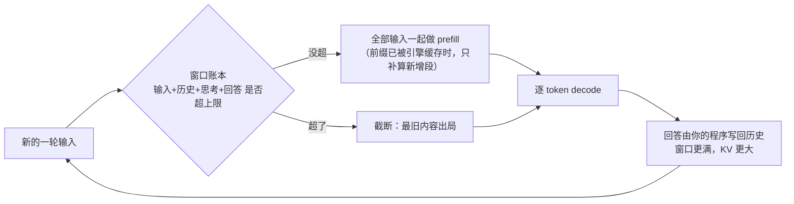

# 1.4 聊着聊着就忘了：上下文窗口

## 开篇问题

先看一段会话。第一轮，你让模型"做一个网页版的小游戏"，它从头写出一份能跑的代码。第二轮你说"加个钓鱼模式"，它在正确的位置加了几行，游戏照常运行。到第十轮画风变了：它改错了函数，把第一轮自己定过的命名规则又发明了一遍，甚至重新实现了一个早就写好的功能。

模型没有变笨。把这十轮记录翻出来看，它第十轮"看见"的东西和第一轮不一样了：最开头那段代码，多半已经不在它的视野里。本章回答**为什么长对话会"失忆"**。读完本章你能：①解释截断行为与失忆的因果；②把一次会话拆成四项占用，估出还剩多少额度；③说明思考预算如何同时吃掉额度与时间；④亲手复现一次失忆并做出复盘。工具上，你已有的两件装备正好够用：1.3 的 KV 直觉与 Layer type 查证法。本章再给你一本"窗口账本"、两笔代价账和一套五步复盘动作。

## 正文

### 整体图景：窗口是一条循环的账本

上下文窗口（context window）是模型一次请求能"看见"的全部内容的总长度上限，按 token 计数：系统提示（system prompt，开发者预设的角色设定文本）、你贴的文档、之前每一轮的问答、模型的思考与回答，全部同时摊在里面。256K 的窗口就是约 26 万个 token 同时在场，粗略相当于一本长篇小说的量。

窗口在推理链路里的位置是一个循环：



图上两处措辞要先钉准。其一，"全部一起 prefill"是无缓存复用时的口径：1.2 你亲手量过，本地引擎普遍把上一轮读过的前缀留在缓存里复用，所以第二轮的首字往往几乎不涨；大方向仍是"历史越长、首字越慢"，只是每轮重读的部分未必是全部，"时间账"一节细算。其二，"写回历史"的主语是你的程序：1.3 说过推理接口无状态，服务不替你存对话，每轮把旧问答带回 messages 的正是你的客户端。

每一轮调用消耗三样东西：窗口额度、显存（历史越多 KV 越大）、时间（首字前要读的部分变长）。影响的用户指标也是这三个：显存占用、首字等待，以及"第十轮还认不认得第一轮"这个可用性。下面先把账本里的住户点清楚。

### 窗口里都住着谁：四项占用与 token 估算

一次会话的窗口占用是一条不等式：

```text
输入 token + 历史轮次 token + 思考 token + 回答 token ≤ 窗口上限
```

| 窗口里的东西 | 谁写进去 | 最容易被漏算吗 |
|---|---|---|
| 系统提示 + 本轮输入 | 你 | 否 |
| 历史各轮的问答 | 你和模型 | 否 |
| 思考过程 | 模型 | 是 |
| 最终回答 | 模型 | 是 |

后两行最容易被漏：思考与回答也是 token，模型会自己吃掉一块窗口。"我的输入才 1K、窗口 256K，所以还剩 255K 随便用"，这笔账漏掉了历史、思考与回答三项，多轮之后错得没有边。

要知道自己花了多少，办法是先粗估、再实测。常见中文分词器大约 1 个汉字合 0.6~1.5 个 token（依分词器与版本而异），拿"一字一 token"做保守粗估，够定数量级；精确数字要靠分词器（tokenizer）来数，模型卡页面的测试框或本地 tokenizer 库都行。用 Ollama 时有两个现成的计数来源：1.1 用过的 OpenAI 兼容接口（/v1）在非流式响应的 usage 字段里给 prompt_tokens 与 completion_tokens；本章实验改用的原生接口（/api/chat）则在响应末尾给 prompt_eval_count 与 eval_count。两组字段指的是同一件事：前者是输入 token 数，后者是输出 token 数；具体字段名以所用版本官方文档为准。

**已解示例**：系统提示约 500 字，文档 2000 字。粗估：2500 字按"一字一 token"得 2500，按 1.5 倍保守上限得约 3800；实测 3100，落在估算带内。粗估的用途是"额度还够不够"这类数量级决策；临近顶格时，必须换实测数。

**小练习（5 分钟）**：把 1.1 那次调用的响应翻出来，找到 token 计数字段。没跑过实验也可用这组示例数据：输入为 2000 字文档加 500 字系统提示，响应字段 prompt_eval_count＝3100、eval_count＝487。算一下你的输入折合每字多少 token，与"一字一 token"差多少，试着解释偏差方向。

### 超限之后：截断，然后失忆

窗口放不下时只有两种后果。要么直接报错、拒绝请求；要么更隐蔽，走截断（truncation）：引擎把最旧的内容悄悄挪出窗口，不报错、不提示。模型从此"看不见"那段历史，但它不会说"我看不见了"，只会基于剩下的内容继续作答。于是出现一组典型症状：改错位置、重复造已有的轮子、忘掉自己前面定过的规则、编造没发生过的对话。

先做一个纠偏：失忆的原因是信息不在场，模型本身没有"退化"。同一个模型、同一段历史，只要还在窗口内，表现就稳定；把窗口开大、或把历史压缩摘要后再喂回去，"智力"立刻回来。排障方向由此定：先查信息到没到齐，别急着换模型。

对照一个"看得见就改得对"的正面样本。问题：多轮改代码能否保持一致。第一轮生成网页版第一人称射击（FPS）游戏，第二轮追加"加个钓鱼模式"，模型还认不认得第一版。

- 环境：千问 27B 稠密模型（型号为口播转写，以模型卡为准；全部参数每步都参与计算，与之相对的 MoE 只激活一小部分参数，1.5 详解），两张 2080Ti（22G 显存版，合计 44G；常规 2080Ti 为 11G，此为改装口径），魔改版 vLLM（vLLM-2080Ti definitive），单并发。
- 操作：第一轮从零生成整个游戏，第二轮在同一会话里追加钓鱼模式。
- 结果：两轮 decode 都在 80~100 tok/s、峰值接近 100，含 MTP 加速（提速技巧，3.5 讲）；裸 decode 约 50（3.1/3.5 口径）。
- 口径：权重量化档、上下文设置与输入长度原资料未说明。

关键在质量而非速度：第二轮改对了位置，因为它先"看见"了旧代码，才知道往哪儿加。这份"看见"是窗口给的，与模型记性无关。（来源：BV1nVVr6QEFq）

### 大窗口的显存账：KV 随长度**线性**涨

窗口里每个 token 都留有一份 KV 缓存，1.3 说过，那是模型记前文的笔记。笔记是显存里的实物，窗口开多大，直接决定显存还剩多少给你干活。沿用 1.3 那台 8B 档案（32 层、KV 头 8、每头 128 维、KV 按 FP16 档存、每元素 2 字节），单 token 的 KV 是 128 KiB。这是教学口径：真实的 qwen3:8b 是 36 层、144 KiB 每 token，见 1.3 的口径声明与 2.1 的正式公式，本章沿用 128 KiB 保持全书同一本账。于是：

```text
KV 显存 ≈ 128 KiB × 窗口内的 token 数
```

完整算例放在本章算例节，这里先记结论的形状：线性。窗口翻倍，KV 翻倍。32K 花 **4 GiB**，256K 就要 **32 GiB**，后者约是一个 8B Q4 档模型权重（约 5GB）的六七倍。聊到深处，"历史"比"模型本身"更吃显存。

*指标回看 · 显存占用：前几章它是"加载后读一读"的静态数，本章起多了一个会随对话增长的 KV 分量，而且能提前算出来。*

### 为什么有的模型涨得慢：混合架构

同样标 256K，有的模型显存代价小好几倍。原因 1.3 已经给过：三种记笔记的方式。全注意力层逐字抄录，笔记随历史线性增厚；滑动窗口层只留最近一小段，厚度封顶；线性层只维护一张定长摘要卡，不随历史变大。三种层按比例混着用，就是混合架构。其中只有全注意力层贡献"随窗口增长"的那部分 KV，其余层的开销是固定的。

▶ 插画：三种注意力方式的 KV 增长曲线，只有一条在涨，长上下文的显存焦虑几乎全部来自它。

<div class="ill" data-ill="kv-growth-curves"></div>

所以问"这个模型的 256K 要吃多少显存"，别停在窗口标签上，要去查模型卡的 `layer_types` 字段：数一数全注意力层的占比（查法 1.3 演示过），占比越小，KV 涨得越慢。精确到 GB 的账留到第二章的"显存三本账"。本章带走一个判断方向：**窗口标签相同的两个模型，显存代价可以差数倍**。

### 长上下文的时间账：首字为什么越来越慢

显存之外还有第二笔账。1.2 拆过一次请求的旅程：首字出现之前有一段 prefill，把本次请求要处理的输入整段过一遍。多轮对话里，"要处理的输入"至少包含新增的那部分历史。历史越长，每个新首字之前的准备工作越重，首字等待（正式名字 TTFT，第三章定义）随之变长。这就是长会话越聊"反应"越慢的机制：逐字生成的速度没变，是起跑线每次都往后挪了。

一个边界要先划清：有的引擎会把历史的公共前缀缓存起来复用，并非每轮都全量重算。这是工程优化，不改变"历史长则首字慢"的大方向，机制后文讲。

**已解示例**：一次实测里，长输入的填充速度约 314 token/s（两张老卡、llama.cpp 日志口径；该次输入的具体长度原资料未说明）。用它推算：把 16 万 token 的历史整段过一遍，需要 160000 ÷ 314 ≈ 510 秒，约八分半钟。注意这是按实测速度做的推算，不是该场景的实测首字时间；你机器上的数字会不同，但换算关系一致：历史长度直接换算成首字等待。

*指标回看 · TTFT：1.2 观察到"首字先到"，1.3 看到历史长短影响它，本章把因果写成可估算的式子——首字等待 ≈ 窗口内待处理 token 数 ÷ 填充速度。*

**小练习（5 分钟）**：在你能跑的服务上，分别发"一句话输入"和"贴一章书再提问"，掐表记录首字时间，验证这条因果在你机器上成立。

### 思考预算：内心戏也按 token 计价

推理模型（reasoning model）在给出答案前会先写一段思考 token，思考预算（reasoning budget）就是给这段内心戏设的 token 上限。它对应窗口账本的第三行：思考 token 是真实成本，写进 KV、占窗口、拖时间，走 API 计费时还占钱。

一个把"窗口、思考、KV 档位"三件事同时压满的实测：

- 问题：把 160K 上下文和 1 万的思考预算同时打开，代价是什么。
- 环境：Qwen3.8-Flash（176B 参数，IQ1_S 最低档量化，权重 72G；72G 怎么装进 48G 显存是另一个故事，4.3 拆账），两张二手老卡合计 48G 显存。
- 操作：日常把思考预算限到 512，保证响应快；深度测试放宽到 1 万，让它生成一个"涡轮增压发动机原理动画"。
- 结果：耗时约 15 分钟、产出约 1.8 万 token（字幕转写作"18 万"，按该机实测 28~29 tok/s 与 15 分钟推算应为 1.8 万量级），其中相当一部分是思考；160K 的上下文是在 KV 压到 Q4 档的前提下才开起来的：窗口大小与 KV 档位同时妥协，才装得下。（来源：BV1xQtf6SEHR）

**上下文窗口是总预算，思考预算是预算内的再分配**。思考给得豪爽，留给正事的空间就小，等待也更久。

## 完整算例

**已知条件**：模型为 1.3 的 8B 档案，32 层全按全注意力计、KV 头 8、每头 128 维、KV 按 FP16 档存（每元素 2 字节）。对比两个窗口设置：32K 与 256K。计数按二进制口径（1K = 1024，1 GiB = 1024 MiB），与商品十进制 GB 差约 7%，第二章统一说明。

**要回答的问题**：两个窗口的 KV 显存差多少？

**公式**：`KV 显存 = 单 token KV × token 数`，其中 `单 token KV = 层数 × KV头数 × head_dim × 2(K+V) × 每元素字节数`（1.3 已代过：32×8×128×2×2 = 131072 字节 = 128 KiB，教学口径；真实 qwen3:8b 为 36 层/144 KiB，见 1.3 口径声明）。

**逐项代入**：

- 32K 窗口：128 KiB × 32768 = 4194304 KiB = 4 GiB（约 4.3 GB）；
- 256K 窗口：256K 是 32K 的 8 倍，线性关系下 KV 也是 8 倍：128 KiB × 262144 = 32 GiB（约 34.4 GB）；
- 差值：**28 GiB**（约 30 GB）。

**数量级与单位检查**：单 token 约 1.3×10⁵ 字节，乘 2.6×10⁵ 个 token 得约 3.4×10¹⁰ 字节 ≈ 34 GB，与 32 GiB 吻合。对比权重：8B 模型 Q4 档约 5GB（1.1 的算法），256K 的 KV 是权重的六七倍，数量级自洽，反直觉成立。

这张账是理论估算，不是实测。它假设了三件事：全部 32 层都是全注意力（混合架构模型会显著缩小，见上一节）；KV 不量化（案例里 160K 就是靠压到 Q4 档才开的，取舍第二章谈）；不含引擎的缓冲与预留。误差来源主要是层占比假设、KV 档位、引擎预留策略。这张账的正确用法：下单显卡、决定窗口参数之前，先估；跑起来之后，用 `nvidia-smi` 对照。

## 贯穿案例的最终分析

回到开篇那十轮崩坏的会话，现在可以把复盘做成一套动作。第一步，排除程序问题：确认你的代码每一轮都把历史带回来了。只发最新一句，是新手最常见的"假失忆"。第二步，查窗口上限的两端：模型卡的 `max_position_embeddings` 是模型支持的上限，引擎侧的窗口参数（如 Ollama 的 `num_ctx`）默认值可能远小于它，且随版本变化，"标称 256K 却 4K 就开始忘"多半是这一端没开。第三步，按四项占用数 token，算出历史还能涨多少。第四步，按算例估 KV 显存，判断"开大窗口"在显存上是否可行。第五步，对症下药：真截断了，就压缩旧历史，或显存允许时开大窗口，或换全注意力占比更低的模型；预算被思考吃掉的，就调低 reasoning budget。

再用贯穿案例反推一次预算的算法。双 2080Ti 那次两轮改码能成立，前提是第一轮全部代码与对话都躺在窗口里；想把这种状态维持到第十轮，可用历史 = 窗口上限 − 系统提示 − 预留思考 − 预留回答。256K 听起来豪绰，减掉 1 万的思考预算、几千 token 的系统提示与预留回答，剩下的是历史的真实额度。而每多 32K 历史，按 8B 全注意力的口径就多 4 GiB 显存和多一截首字等待。额度除以每轮平均增量，就是"还能再聊多少轮"的粗答案：假设剩 20 万 token、每轮问答合计平均 2000 token，粗算约 100 轮；这两个数是示意，代你自己的数。长上下文是有代价的，这笔账记在显存和时间两处。

## 理解检查

1. **计算**：还是 1.3 那台 8B 档案、全注意力口径。窗口从 32K 改成 128K，KV 显存变成多少？比 32K 多吃多少？
2. **条件变化**：第 1 题的账假设全部层都是全注意力。若模型卡显示只有一半层是全注意力，128K 的 KV 大约变多少？另一半层的开销随窗口怎么变？再进一步：这个 128K 会话还设了 1 万 token 思考预算、预留 2000 token 回答、系统提示按 1000 计，留给历史的额度还剩多少 token？
3. **排障**：同事抱怨"聊到第 20 轮模型就忘事，是不是模型坏了"。列出至少三步排查，并说明每一步分别能排除哪种可能（程序没带历史 / 引擎窗口参数没开 / 真截断 / 思考预算挤占）。
4. **选型**：两个模型参数量相同、都标"128K 上下文"，你只有 12G 显存还要留长对话余量。先查模型卡哪个字段、比较什么，才能判断谁的窗口更便宜？

## 动手实验

**环境**：能跑起 1.1 服务的机器（Ollama + 已拉好的模型即可；显存紧张就换 4b 小模型，现象一致）；另开一个终端用 `nvidia-smi` 看显存；一段无关的长文本充当"工作噪声"。本实验用原生接口 `/api/chat` 而非 1.1 的 /v1：窗口参数 `num_ctx` 是 Ollama 原生选项，OpenAI 兼容接口不提供；只是换条路径，调用方式不变。

**两条动手纪律，先读再跑**：其一，`options` 随每次请求携带，改一次不等于一直生效，每轮都要带上 `num_ctx`（行为以所用版本文档为准）；其二，历史不会自动累积，每轮的 `messages` 都要由你亲手把之前所有轮次的问答原样带回，这正是 1.3"无状态"在操作层的样子。

**步骤与命令**：

```bash
# 第 1 轮：设暗号。options 与 messages 同轮给出
curl http://localhost:11434/api/chat -d '{
  "model": "qwen3:8b",
  "options": {"num_ctx": 8192},
  "stream": false,
  "messages": [
    {"role": "user", "content": "请记住：我的暗号是蓝色的香蕉。收到请复述"}
  ]
}'
# 记下响应里的 prompt_eval_count（输入 token 数）；把回答内容原文留好

# 第 2 轮：关键一步——messages 逐条带回第 1 轮问答，再追加长文（其余字段同第 1 轮）
curl http://localhost:11434/api/chat -d '{
  "model": "qwen3:8b",
  "options": {"num_ctx": 8192},
  "stream": false,
  "messages": [
    {"role": "user", "content": "请记住：我的暗号是蓝色的香蕉。收到请复述"},
    {"role": "assistant", "content": "<第 1 轮的回答原样粘贴>"},
    {"role": "user", "content": "<一段长文> 请总结这段话"}
  ]
}'
# 第 3 轮起同理：messages 越滚越长，每轮记录 prompt_eval_count 与 nvidia-smi 读数。
# 手工粘历史繁琐的话，用脚本循环亦可（真实客户端的 messages 数组干的就是这件事），
# 判断标准不变：盯着响应里的 prompt_eval_count 是否在涨。
# 当 prompt_eval_count 逼近 8192 时，问"我的暗号是什么"，记录回答。
```

**应记录的指标**：每轮输入 token 数（prompt_eval_count）、显存读数、末轮暗号回答（答对 / 答错 / 编造）、末轮与首轮的首字等待体感对比。

**预期现象**：输入逼近窗口上限后，最旧的信息（暗号）丢失，答错或一本正经地编造；显存随轮次上升后趋平（截断发生后最旧内容出局，KV 不再增长，趋平是现象的一部分，不是测量失败）；末轮首字等待长于首轮。若你的引擎复用前缀缓存，末轮涨幅会小于账面，1.2 的现象重演，照实记录。

**失败排查**：prompt_eval_count 每轮都差不多、暗号一直答对 → 历史没累积，你每轮只发了新句子，开篇说的"假失忆"，实验里自己也会犯，检查 messages 是否带全；count 顶到 4096（或 2048）就不再涨 → 本轮没带 `num_ctx`，引擎回落默认窗口，每轮都带上 options 再试；暗号一直答对且 count 涨得慢 → 窗口没满，加长每轮文本或把 `num_ctx` 调小（如 4096）复现；显存不足报错 → `num_ctx` 或模型过大，降一档重试；响应里没有 token 字段 → 版本差异，改用模型卡 tokenizer 测试框手工计数；请求报长度超限 → 窗口设置超过模型上限，查模型卡 `max_position_embeddings`。

**产出（失忆复盘记录）**：从第几轮开始丢、丢的是最旧还是中间的内容、暗号是答错还是编造、显存与首字时间随轮次的两条粗曲线、你的窗口账面（四项占用）与实测 token 数差多少。这份记录下一章选型时还要用。

## 本章能力清单

对照本章六个学习目标：前四条对应开篇的四条承诺，后两条是本章新增的两件工具。

- ✅ 解释长对话失忆的机制是截断而非"变笨"，并说出至少三种典型症状（正文第三、四节）；
- ✅ 把一次会话的窗口占用拆成四项，对自己的会话做 token 粗估与实测，并算出"留给历史的额度"（正文第二节 + 小练习 + 理解检查 2）；
- ✅ 说明 reasoning budget 对窗口额度与等待时间的影响（正文第七节 + 理解检查 2）；
- ✅ 亲手复现一次截断失忆，按五步动作复盘并区分四种成因（贯穿案例 + 动手实验 + 理解检查 3）；
- ✅ 用 1.3 的单 token 值算出任意窗口的 KV 显存，说出 32K 与 256K 的差（完整算例 + 理解检查 1）；
- ✅ 用 Layer type 字段比较"同样标 256K"的两个模型谁的显存代价小（正文第五节 + 理解检查 4）。

## 与下一章的衔接

你手里现在多了三个选型词汇：模型卡的上下文上限字段、引擎侧的窗口参数、思考预算。它们回答了"这个模型能聊多长、聊长的代价是什么"。但货架上那个更大的问题还没动：同样是 8GB 显存，有的模型跑不动、有的绰绰有余；参数量后面藏着的"总参数与激活参数"是什么，30B 上下的模型为什么被叫作甜点位。下一章（1.5 第一次选型）把窗口账并进选型决策，教你在货架前用一条约束反推可选档位，并写出一条站得住的选型理由；你刚做的失忆复盘记录，就是理由里"上下文需求"那栏的证据。

## 资料来源与延伸观看

- 案例与方法来源：SPOTLITE（B 站 UP 主）双 2080Ti 跑 27B 稠密模型的多轮改码实测（BV1nVVr6QEFq）、两张老卡跑 176B 的思考预算与 160K 上下文实测（BV1xQtf6SEHR）；视频清单与全部出处见附录 B。
- 查证入口：Hugging Face 模型卡 `config.json` 的 `max_position_embeddings`（上下文上限）与 `layer_types`（层类型）字段；token 计数用模型卡 tokenizer 测试框或本地 tokenizer 库。
- 引擎参数：Ollama 的窗口参数（`num_ctx`）与响应中的 token 计数字段（/api/chat 的 `prompt_eval_count`/`eval_count`，/v1 的 usage 字段）、llama.cpp 日志的 `print_timings`（prefill 与 decode 分列计时，本章未直接用到，3.1 的计时实验会逐项定义），均以所用版本官方文档为准，可能随版本变化。
- 原资料未说明之处（双 2080Ti 案例的量化档、上下文设置与输入长度；314 token/s 实测的输入长度；22G 版 2080Ti 的具体来源；176B 案例的"1.8 万 token"为转写修正值，字幕原文作"18 万"）本文未作推断，留待后续章节的实测方法补齐。
