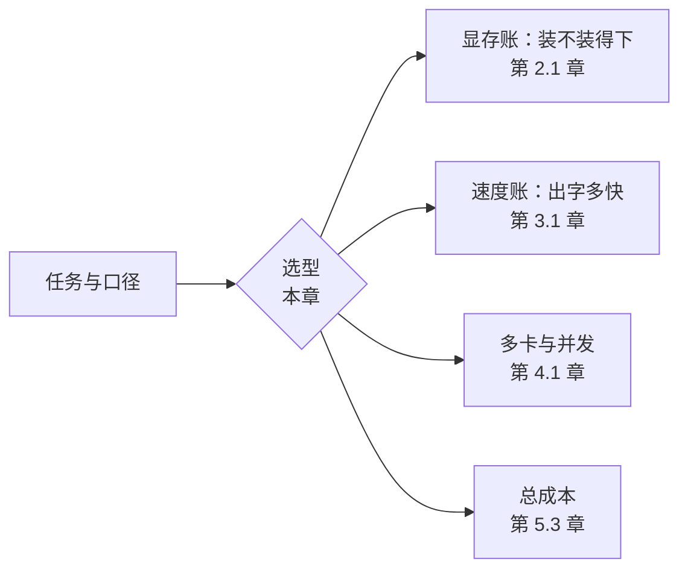

# 1.5 第一次选型：我的机器该跑哪个模型

## 开篇问题

同事老周在群里发来一条消息："帮我看看这张卡，商家说 96G 大显存，畅跑 70B 大模型，六万多，值不值？"你点开商品页，宣传语写得很满："96G 大显存，主流大模型随便跑。"与此同时，你那台在 1.1 里部署过 8B 模型的机器还在角落亮着——显存只有 8GB。同一道题摆在这两台机器面前：货架上那么多模型，我跑哪个？

这道题不是"挑个最强的"，而是一道约束题：你的任务、你的显存上限、候选模型的发布时间和社区生态，共同圈出一个很小的可选集合。这一章给你三样东西：一张模型货架的地图、两个藏在型号名里的数字（总参数与激活参数）、一套"按显存反推档位"的心算——最后落成一页可以交给别人审的选型理由。老周那张卡值不值，答案也在里面。

## 正文

### 选型在链路的上游：一个决定，四本账

第一部分你已经把链路跑通：程序发请求，引擎装载权重、逐 token 生成。选型发生在这一切之前，决定后面每一章要算的账：



同一张卡，装哪个模型、用哪个量化档，四本账的数字全变——"跑哪个模型"不是口味问题，而是整套部署方案的第一个决定。它分两层：先选**参数档位**（模型多大），再选具体型号与量化档（哪个模型、压到多小）。下面先看第一层的地图。

### 货架全景：甜点位、空档与断代

挑模型像挑瓶装水：规格高度集中。开源模型生态当前集中在两层货架上。30B 档：千问 27B、谷歌 Gemma 27B 级、GLM 稠密版、英伟达 Nemotron 30B 等。200B 档：DeepSeek V4 Flash、MiniMax、Step 3 Flash、千问大杯 MoE 等（"大杯"是口播俗称，指超大参数档），几乎全是 MoE 架构——这个词下一节解释。两层之间，70B 档空了：这一档最近的主力是 2024 年 12 月发布的 Llama 3.3 70B，断代之后没有继任者。（型号多为口播转写，以模型卡为准。）

厂商为什么把主力压在 30B？"入坑心法"一期给出的动机推断是：开源厂商不追最强榜单，而是希望模型塞得进民用消费级显卡（显存上限 24G 一档），30B 正是个人算力和模型智力之间的平衡点——跑 30B 只需 20 多 G 显存，能接受更低的量化档，16G 也行。更妙的是这个甜点位（sweet spot，各方利益平衡的最优点）两年没挪过窝：两年前是 30B，两年后还是 30B，同一张卡跑同规模的模型，智力却在涨——原因本节末尾说。

▶ 插画：模型货架——30B 甜点位、空掉的 70B、MoE 的 200B。

<div class="ill" data-ill="model-shelf"></div>

这张图直接解释了老周那条宣传语的第一处裂缝。有人认真追问过商家"畅跑的到底是哪个 70B"，答案是 Llama 3.3 70B——发布于 2024 年底、两年没有新版本的模型；而 96G 显存想跑 200B 档，也只能用很低的量化档硬塞，谈不上从容。一头是断代的旧档，一头是塞不从容的旗舰档，96G 恰好两头不靠。中间那格空档甚至有具体成因：千问 3.5（口播版本名）的 122B 规格被砍掉后，30B 到 200B 之间就断了一档（来源："Pro6000 拆解"一期）。

型号会过时，档位相对稳定，所以查货架要带上时间：模型发布页的创建与更新日期是硬证据。同参数为什么会变更聪明？模型智力来自两段训练——前训练把海量文本压进参数，后训练教它好好对话；新版本靠的是数据质量与训练方法的进步，再加持续的推理优化。这正是甜点位能停在同一点的原因：硬件没换，货架上的货在换代。由此得到一条够用论：如果半年前的模型已经满足你的任务，它不会被半年后的新旗舰"淘汰"——智力够用是持续成立的。佐证：半年后发布的千问 3.8 27B，按官方评测口径（厂商自报，以独立评测为准）智力已接近甚至超过半年前的线上最强模型（来源："入坑心法"一期）。

### 型号名里的两个数：总参数与激活参数

第二层货架几乎全是**混合专家（Mixture of Experts，MoE）**模型，它和**稠密（dense）**模型的差别用编制讲最清楚。稠密模型像全科门诊全员坐班：每个 token 来了，模型里所有参数都要为它过一遍，参数越多每步越贵。MoE 换了编制：把模型内部的一部分加工环节复制成多套，每套叫一个**专家（expert）**；每来一个 token，一个**路由器（router）**只挑两三位专家接诊，其余专家这一单不干活。注意类比的边界：专家只是参数分组，并不真懂某个"专科"；路由怎么训练、有什么额外代价，第 4.3 章讲统一内存时还会回来。

▶ 插画：全员到岗的稠密，与按需叫号的 MoE。

<div class="ill" data-ill="dense-vs-moe-comic"></div>

于是每个 MoE 型号都有两个"大小"。**总参数量（total parameters）**：所有专家都在编、都得常驻待命，它决定容量账——要装多少。**激活参数量（activated parameters）**：每个 token 实际动用的部分，它决定算力账——要算多少。命名直接写在型号里：Qwen3-30B-A3B 的 A3B 就是"激活 3B"，总参 30B、每 token 只激活 3B。200B 档的典型画像是"乍一看 200B，其实激活可能只有 10B"。这一档还反复出现 Flash 后缀：同一大版本下再切出的轻量高速档——总参与激活参一起压小，换更低部署门槛与更快速度，智力略让一档。这两个数会直接改写选型结论：一台 128G 统一内存的主机（CPU 与显卡共享同一大块内存的机器形态，第 4.3 章展开）就能畅快跑这类 200B 级 MoE，未必需要大显存显卡——算的账看激活参数，装的账看总参数（来源："Pro6000 拆解"一期）。

▶ 插画：三种代表模型的"两根条"——容量账看总参，算力账看激活参。

<div class="ill" data-ill="params-total-vs-active"></div>

**已解示例**：DeepSeek V4 Flash（总参 200B 级、激活约 10B）和千问 27B（稠密），都按 Q4 档估文件体积：前者约 200×0.5=100GB 上下，后者约 27×0.5≈14GB 上下，谁轻谁重一目了然。但"出字快慢"是另一笔账：每个 token 实际要干的活，前者约是 10B 级参数的量，后者是 27B 全员的量。两个数回答两个问题，混用就会得出"200B 一定又大又慢"这类错误结论。

反方向同样别误读：轻不等于弱。按官方评测口径（厂商自报，以独立评测为准），千问 27B 这样的稠密 30B 档，推理质量并不弱于 200B 级 MoE（来源："入坑心法"一期）。体积账、速度账之外还有第三本智力账，没有公式，只能实测（方法见下一节）。

**小练习（5 分钟）**：从 Qwen3-30B-A3B 这个名字读出两个数，估算它的 Q4 档文件体积；再回答：一张 24G 显存的卡装它装得下吗？（提示：容量账用总参——30×0.5=15GB，加词表等附加开销和 KV 缓存后贴着上限，"30B 档配 24G 卡"的成立正靠这笔账。）

### 硬约束：按显存上限反推档位

装得下是入场券。1.1 给过第一道判据（可用显存要大于文件体积并留余量），1.4 看到了缓存随对话变长的增长曲线；现在把两者合成一个反推算法——先算上限，再选模型，而不是反过来：

```
可用于权重的显存 ≈ 显存总量 − 系统与显示占用 − KV 缓存预算 − 引擎运行开销
最大参数量 ≈ 可用于权重的显存 ÷ 该档位每参数字节数
```

逐项解释：系统与显示占用是桌面常驻的那部分显存，独显机器约 0.5~1GB；KV 缓存预算要按你任务的真实对话长度给——1.4 的增长曲线在这里变成了一个必须填的参数，短对话取 0.2~0.5GB，长对话另算（KV 按 token 的精确算法：1.3 单 token 值，2.1 合成总账）；引擎运行开销是计算缓冲与预留，约 0.5GB。每参数字节数沿用 1.1 的心算规则：Q8 档约 1 字节，Q4 档约 0.5 字节，IQ3 档约 0.4 字节，IQ2 档约 0.25 字节。词表与格式的附加开销随模型变大：8B 级约 0.5~1GB（一成上下）；30B 级按一到两成预留（约 1.5~3GB）——30B Q4 的纸面权重是 15GB，加上附加、KV 与引擎开销，运行占用就到了 20GB 上下，恰好对上社区"30B 要 20 多 G 畅跑"的口径：这也是"权重只有 15G、为什么显卡要 20 多 G"的答案。

*指标回看 · 显存占用：本章从"装没装下"的现象观察，升级为"按上限反推档位"的预算方法。*

**已解示例**：16GB 显存的卡（系统占 1GB、短对话）想上 30B 档。可用于权重 ≈ 16−1−0.5−0.5=14GB。Q4 档：权重 15GB，加一到两成附加就是 16.5~18GB，远超预算，不行。IQ3 档：权重约 12GB，附加约 1.2~2.4GB，合计 13.2~14.4GB——乐观口径贴线，保守口径已超出约 0.4GB。这正是社区口径"30B 要 20 多 G 畅跑、16G 得接受低档量化"（来源："入坑心法"一期）的纸面含义：能塞进去的只有更低档，而且长对话余量很小。

**小练习（5 分钟）**：一张 24G 卡、系统占 1GB、短对话任务，Q4 档纸面上能装下的最大参数量是多少？算完对照货架：得数多半比 30B 大一截。纸面富余是真的，但货架没有对应档位可挑，富余要预付给更长上下文、更大 KV 与并发。想想看："30B 配 24G 是甜点位"说的是"装得下"还是"跑得从容"？

把同一套算法用在你那台 8GB 机器上，就是本章末尾的完整算例。那里还会看到"装不下"时引擎的补救动作——页交换——以及它的代价。

### 软约束：智力够用、社区活跃、速度有尺子

装得下只是入场券，三个软约束决定两个都装得下的候选谁胜出。

先说智力，原则是先测再选：第一法是先买线上 API，把模型放进你的真实任务里评定；第二法零成本——用现有机器装上桌面引擎，显存不够就让一部分权重回落到内存，先不管速度只测智力（来源："入坑心法"一期）。同时接受一个定位事实：本地模型比不过线上最强模型（SOTA，state of the art，当前最强），本地部署的价值在"够用、可用、随时在"，不在攀比榜单。

再看社区支持度（community support）：两个候选成绩接近时，这是最后一票。有一组仓库统计快照：千问 3.8 27B 发布仅 20 多天，模型仓库里的量化、微调、魔改变体就超过 1000 个；而被称为"本地最强"的 Kimi K3 因为用户少，推出一个多月时点的衍生版本只有 40 多个（来源："入坑心法"一期；均为发布后短时点快照）。越热门、越小的模型，现成的量化档、报错解法、踩坑笔记越多——对第一次部署的人，这些比榜单名次实用得多。

最后是速度，先建尺子再谈数字。"30 不够要 50、50 不够要 100"的追法没有参照系，更好的做法是用手头显卡装得下的最小模型（2B、4B 档）跑一个日常任务，记下你"能接受"的出字速度——这把尺子贴着你自己的需求。两个外部参照：线上 API 的出字速度一般 30~40 token/s，快的 100 多（经验口径，原资料未说明模型、量化、硬件与并发条件）；有经验的部署者会把"千问 27B、不开任何提速技巧、30 token/s"当作反推硬件配置的锚点（来源："入坑心法"一期）。

*指标回看 · 吞吐（同一时间能出多少字，正式定义在 3.1）：本章只有"体感对比"这一档——4B 比 8B 快几倍这类相对关系，尚无统一口径的测量。*

### 选型理由的一页纸：五个固定栏目

零散的判断撑不起决策，把上面所有工具收进一页纸的五个栏目，写满它，选型就完成了：

1. **任务与口径**：什么任务、输入输出多长、几个人同时用、上下文需求多大（依据 1.4 的失忆复盘）；
2. **硬约束**：显存（或内存）上限，反推出的最大参数量与可选档位；
3. **候选与档位**：具体型号加量化档，附预计文件体积与运行占用；
4. **时效与社区证据**：发布时间、变体数量级、智力参考口径；
5. **速度尺子读数与回退方案**：实测速度，以及不达标时的降档路径（14B→8B→4B，或 Q4→IQ3）。

这份一页纸就是本章的产出（T1 任务）。全书共八件交付物（T1~T8），编号沿项目里程碑的顺序而非阅读顺序，出现章节对照如下：

| 交付物 | 内容 | 出现章 |
|---|---|---|
| T1 | 一页选型理由 | 1.5（本章） |
| T2 | 显存计算器 | 2.1 |
| T3+T4 | 性能报告（并发曲线与瓶颈定位） | 3.4 |
| T5 | 量化对比报告 | 2.5 |
| T6 | 多用户压测报告 | 4.4 |
| T7 | 选型与成本决策书 | 5.3 |
| T8 | 规格表解读模板 | 5.1 |

每件交付物到对应章动手实验时产出，5.4 收官时装订成册。空格怎么填，贯穿案例里给出两台机器的完整示范。

## 完整算例

**已知条件**：你那台 1.1 用过的机器，独立显卡显存 8GB（十进制口径，与商品标注一致）；Windows 桌面环境，系统与显示占用约 0.8GB；任务是内部知识库问答，单轮输入几百到两三千 token，对话中等长度；沿用 1.1 的 8B Q4 档文件（约 5.0GB，以模型页标注为准）。

**要回答的问题**：8GB 显存，参数量与档位的可选区间是什么？

**公式**：

```
可用于权重的显存 = 显存总量 − 系统与显示占用 − KV 缓存预算 − 引擎运行开销
某模型运行占用 ≈ 权重体积 + 附加开销 + KV 缓存 + 引擎运行开销
```

**逐变量解释与代入**：

- 可用于权重 = 8 − 0.8 − 0.3（KV 预算，短到中等对话；口径见 1.3/2.1）− 0.5（引擎开销）= **6.4GB**；
- 8B 模型 Q4 档：权重 8×0.5=4.0GB，附加（词表、配置、格式）约 0.5~1.0GB，合计与 5.0GB 的标注文件互相印证；运行占用 ≈ 5.0 + 0.5 + 0.3 + 0.5 = 6.3GB ≤ 7.2GB（扣系统后）——**可运行，余量约 0.9GB**；
- 14B 模型 Q4 档：权重 14×0.5=7.0GB，附加约 0.7GB，运行占用 ≈ 7.0 + 0.7 + 0.3 + 0.5 = 8.5GB > 8GB——**纸面差半 GB**。引擎可能仍能启动（压缩上下文长度、动态腾挪），但一轮长对话就会触发 KV 增长（1.4 的曲线）把余量吃光，随即掉进页交换或显存耗尽报错。这就是"勉强"的准确含义：能启动不等于好用；
- 14B 换 IQ3 档：权重 14×0.4=5.6GB，附加约 0.6GB，运行占用 ≈ 7.0GB，勉强可用，余量 0.2GB——仍只够短对话；
- 30B 模型：Q4 档权重 15GB 起步，IQ3 档约 12GB；IQ2 档按 0.25 字节/参数算权重约 7.5GB，加约 0.7GB 附加在 8.2GB 上下——三档全都超过 6.4GB 的权重预算，且 IQ2 档的质量代价大到需要单独评估（第 2.5 章专门算这笔账）。**任何单一档位都装不下**；现实中只剩"更低档量化 + 页交换"叠加一条路：引擎把放不下的层放回内存，生成时在显存与内存之间来回倒腾，现象是出字速度骤降——参考 1.1 的观察，离开显存速度差一个数量级。低档量化的质量账在第 2.5 章，页交换这类"装不下就借内存"的玩法在第 4.3 章展开。

**三行结论**：8B Q4 ✓；14B Q4 勉强（长对话翻车，稳妥替代是 14B IQ3）；30B 需更低档量化叠加页交换，不建议。

**数量级与单位检查**：30×10⁹ 参数 × 0.5 字节 = 1.5×10¹⁰ 字节 = 15GB，与"IQ3 约 12GB、IQ2 约 8GB"的递减关系自洽；8B 结论与 1.1 的 6.2GB 估算一致（本章 KV 取 0.3GB，略高于当时的 0.2GB，因为任务明确是文档问答）。

**口径声明**：以上全部是纸面估算，相当于预算上限推演，不是实测。误差来源：系统占用随分辨率与后台程序浮动；KV 随对话长度线性增长，长文档问答会显著超过 0.3GB；不同引擎的预留策略不同；同档不同格式的体积可差 10%~20%；MoE 模型的文件构成特殊（部分参数可外挂），不能直接套用。实测方法见动手实验。

## 贯穿案例的最终分析

把五个栏目在两台机器上各填一遍，选型过程比结论重要。

**老周的 96G 卡**。第一栏任务他就没填：买卡前要先问"跑什么"。若跑文生图、文生视频类任务，96G 显存确实是对口的"王炸"；跑本地大语言模型则要打问号——同一张卡，两类负载，评价相反，条件必须写明（来源："Pro6000 拆解"一期）。第二栏"畅跑 70B"：货架中间空着，唯一被反复展示的 Llama 3.3 70B 发布于 2024 年底，为它支出十万级预算，买到的是两年前的智力——这张卡的行情半年内从 6 万涨到 10 万（视频发布时点口径）。第三栏"主流大模型随便跑"：200B 档总参 200B 级，Q4 档就是 100GB 上下，96G 只能靠很低档的量化硬塞，谈不上"畅"；而这类 MoE 激活只有 10B 级，对算力要求不高、对容量要求高——那是统一内存主机的战场，不是 96G 显卡的舒适区。第四栏时效与社区：70B 档两年无继任，本身就是反证。结论：以终为始，先定任务再定硬件——话术经不起"货架、两本账、时效"三问（来源："Pro6000 拆解"一期）。

**你的 8GB 机器**。任务与口径：知识库问答，输入两三千 token 以内，单人使用。硬约束：反推得权重预算 6.4GB，Q4 档稳妥区间 8B。候选与档位：8B 级 Q4 档（约 5GB）为主，14B IQ3 为备选。时效与社区：优先选近半年发布、仓库变体多的家族——千问家族在 27B 上有 1000+ 变体的统计快照，同家族小型号通常共享这份生态（此为推断，下单前自己在模型仓库按家族筛一遍）。速度尺子与回退：先跑 4B 建立基准，再上 8B 对比体感；长对话顶满显存或不达预期速度，就回退 4B 或降 IQ3 档。最后校准动机口径："更省钱""更快""更隐私"各在什么条件下成立，1.1 的贯穿案例已逐条给过——写进一页纸的理由都必须带条件。选型的终点不是最强模型，而是真正被用起来的那个。

## 理解检查

1. **计算**：一个 12B 模型的 Q4 档文件大约多少 GB（附加按一成上下估）？在"扣掉系统与开销后可用权重 6.4GB"的口径下装得下吗？换成 IQ3 档呢？
2. **条件变化**：同样是 30B 总参，一个稠密版、一个 A3B 版，都在 24G 卡上 Q4 档运行，谁更从容？如果把设备换成"显存小、内存大"的统一内存主机，评价会怎么变？两次判断分别用了哪个数？
3. **排障**：朋友说"商家承诺 96G 畅跑任何大模型"。用本章三件工具——货架地图、总参数与激活参数两本账、版本时效——各指出这句话的一处问题。
4. **选型**：显存 16GB，想跑 30B 档。Q4 档行不行？参考"20 多 G 畅跑、16G 需低档量化"的口径，给出你的档位方案、预计占用与要接受的代价。

## 动手实验

**环境**：1.1 部署好的 Ollama；8GB 显存的独立显卡（无独显亦可，把记录项里的显存改成内存，现象更夸张）；磁盘剩余约 20GB；关闭占显存的后台程序（游戏、浏览器硬件加速等）。

**步骤与命令**：

```bash
ollama pull qwen3:4b           # 体积以模型页为准
ollama pull qwen3:8b
ollama pull qwen3:14b          # 8GB 卡预计放不满，本实验就要观察这个
ollama run qwen3:4b --verbose  # --verbose 会在回答后打印速度统计（行为以所用版本文档为准）
# 三个模型各用同一个固定问题（如"用 200 字介绍冰箱的制冷原理"），各跑 3 次
```

**应记录的指标**：文件体积（`ollama list`）；加载并生成时的显存占用（`nvidia-smi`）；出字速度（verbose 输出的 tokens/s，或数字数除以秒）；首字等待体感（参照 1.2 的 TTFT 观察）；可用性（能否加载、能否完整答完、有无报错）；页交换征兆（速度相比小模型骤降一个量级以上）。

**口径**：单人单请求；三个模型用同一问题、同一机器、各取 3 次的中位数；记录各自量化档位（默认档以模型页为准）。这是体感对比，不是标准基准测试。

**预期现象**：4B 最快、显存占用最小；8B 速度约为 4B 的一半到三分之二，回答质量肉眼可见地更好；14B 在 8GB 卡上启动更慢、出字速度骤降（一部分层被放回内存来回搬运），或直接报显存不足——这正是完整算例"勉强"与"页交换"两行结论的实测版。

**失败排查**：下载失败 → 检查磁盘空间，`ollama pull` 支持断点续传；14b 卡住或极慢 → 属预期现象，把速度记下来当反例证据；`nvidia-smi` 看不到占用 → 引擎退回了纯 CPU 模式，记录并注明口径；速度每次不同 → 取中位数，并关闭后台任务重测。

## 本章能力清单

对照五个学习目标：

- ✅ 解释"先挑档位、再挑型号"，说出货架三层结构与 70B 空档的成因（货架全景一节 + 理解检查 3）；
- ✅ 对给定型号从名字读出总参数与激活参数，说清两个数各管哪本账（两个数一节 + 理解检查 2）；
- ✅ 按显存上限反推最大参数量与可选档位，并解释"勉强"与"不建议"的依据（硬约束一节 + 完整算例 + 理解检查 1、4）；
- ✅ 把发布时间、社区支持度、速度尺子写进选型比较（软约束一节 + 动手实验）；
- ✅ 产出一页格式完整的选型理由（五个栏目 + 贯穿案例分析）。

## 与下一章的衔接

本章的反推其实只算了一本账：权重。公式里 KV 那一项的 0.3GB 是拍的，引擎开销 0.5GB 也是拍的——显存里除了权重和 KV 到底还有哪些住客、各住多大，"显存不足"报错出现时该按什么顺序降档，都还没有公式。下一章（2.1 显存三本账）把权重、KV、缓冲三本账合成一个能判断装不装得下的公式，你本章学的"容量账看总参"会在那里第一次变成公式里的一个变量选择。

## 资料来源与延伸观看

- 案例与数据来源（与正文括注短名对照）：
  - "Pro6000 拆解"一期：BV14UEY6WEW7——RTX Pro6000 话术拆解、30B/70B/200B 货架结构与断层成因、MoE 总参数与激活参数、6 万→10 万元行情、"以终为始"结论；
  - "入坑心法"一期：BV1GtbL63Ekt——30B 甜点位与"20 多 G 畅跑、16G 低档量化可跑"口径、版本时效与智力够用论、稠密 27B 质量不弱于 200B MoE（官方口径）、社区支持度 1000+/40+ 统计、建尺子法与"27B 不开提速技巧 30 token/s"锚点、先测智力法。
  - 视频清单与全部出处见附录 B。
- 型号口径：千问 27B、千问 3.5、千问 3.8 27B（后两者为口播版本名）、Gemma 27B 级（另一转写口径作 31B，Gemma 3 无此规格，规格待核）、GLM 稠密版、Nemotron 30B、DeepSeek V4 Flash、MiniMax、Step 3 Flash、Kimi K3、Llama 3.3 70B 及"Opus 4.6 Max"等型号，均来自口播或机器转写材料，个别型号存疑，一律以模型发布页（Hugging Face / ModelScope / Ollama 模型库）的模型卡为准；货架结构随时间变动，以你查证的时点为准。
- 数据口径：6 万→10 万元为该视频发布时点的市场行情；1000+/40+ 变体数为发布 20 多天/一个多月时点的仓库统计快照；30~40 token/s（快的 100 多）为经验口径，原资料未说明模型、量化、硬件与并发条件。
- 命令与参数：`ollama run --verbose`、`nvidia-smi` 的输出随版本与驱动变化，以官方文档为准。
- 原资料未说明之处（如 14B 页交换后的具体速度、统一内存主机上的实测吞吐）本文未作推断，留待第 2.5 章（质量代价的测量）与第 4.3 章（页交换与统一内存的实测方法）补齐。
