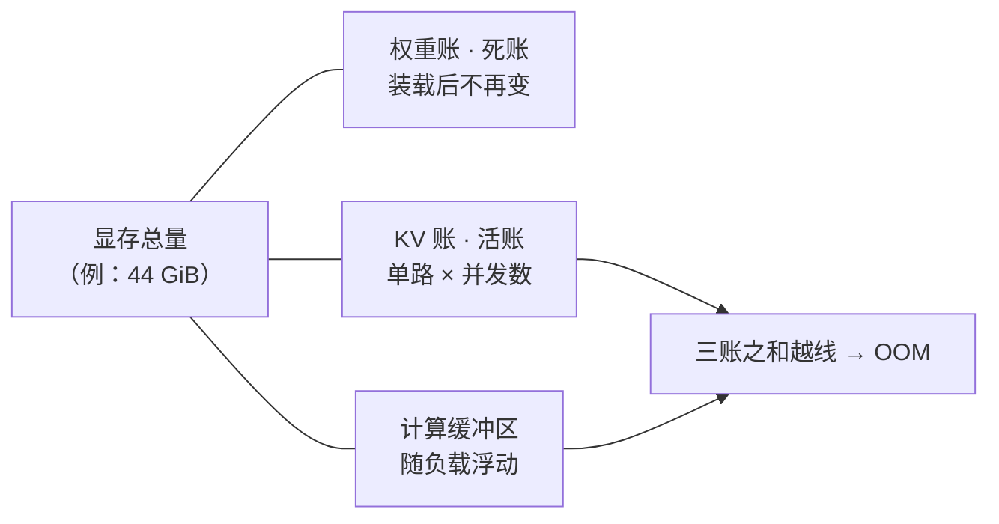

# 2.1 显存三本账：这个模型加这个上下文，装得下吗

## 开篇问题

假设团队的长文档问答确实需要 27B 级的智力。你在 1.5 那页选型理由的"候选与档位"栏写下它，然后开始挑卡：二手市场两张 22G 显存的 2080Ti 加起来 44G，价格正好卡在预算内。看上去宽裕：权重压到 4bit 才 20G 上下，44G 装它绰绰有余。这时同事泼了盆冷水：你们不是要开满 256K 上下文吗？光历史缓存"怎么也得几十 G 甚至上百 G"，一句话把方案判了死刑。

谁对？这一章不站队，只给算法。读完你能交出四件事：列出权重、KV、缓冲三本账的公式；把任何"模型 + 上下文 + 并发"的组合代进去算出总账；判断显存溢出（OOM，Out Of Memory）会发生在装载还是运行、该按什么顺序降档；用 nvidia-smi 实测复核，把手算与读数的偏差压到 15% 以内，最后这条是本章交付物 T2 的验收线。手里有一张三行的账单和一条不等式，任何组合"装不装得下"当场有答案。

## 正文

### 先看全仓库：三层存储、两种单位、一条预算线

先把仓库看全。一台机器里排着三层存储：远郊的**硬盘**、市区的**内存**（RAM）、车间隔壁的**显存**（VRAM）。1.1 装模型时你已经见过它们排队，现在补上决定排序的那列数字，也就是**带宽**（bandwidth，存储每秒能被搬进计算核心的字节数）：

| 层级 | 容量量级 | 带宽量级 | 在推理里的角色 |
|---|---|---|---|
| 硬盘 | 几 TB | 每秒几百 MB 到几 GB | 放模型文件，装载完基本闲着 |
| 内存 | 几十~几百 GB | 双通道几十 GB/s | 装载中转；放装不下的层 |
| 显存 | 几 GB 到近百 GB | 数百 GB/s 起步 | 计算核心随取随用的料架 |

权重为什么必须搬进显存？因为推理时每生成一个 token，计算核心都要把参与计算的那部分权重完整读一遍，每秒几十次、一读几小时；模具放在远郊仓库，路上时间就吃光全部节拍。装不下时可以把部分层下沉到内存甚至硬盘（offload），能救急，但每下沉一层带宽就低一档，速度跟着降；这笔搬运速度的账，下一章才开始算。顺带一个参照：普通内存离入门显卡还差好几倍，而统一内存机型已把"内存带宽"拉进显存门槛（AI Max 395 标 256GB/s、M3 Ultra 标 800GB/s），那是另一条产品路线的物理前提（来源：BV1otY26LE8w）。

还有一句必须先说清的话：显存大不等于快。同样的预算，两张小显存的卡常常稳赢一张同容量的大卡。同一核心、同价位的前提下，容量相同、算力翻倍。两笔实测作证，PP 是跑分表里 prefill 吞吐的缩写（口径 3.1 正式定义，单位原资料未说明，此处按 tok/s 记）：

- 2080Ti 跑 27B Q4_K_M：单卡 PP 580，双卡 800 多，吐字速度不劣化；
- MI50（卡型号为口播转写存疑）跑 35B 级：单张 PP 600 多，两张对半切层后 1000 多。

容量只回答"装不装得下"，跑多快由带宽与算力决定，那是第三章和第五章的事。本章只管"能不能"。

动手算之前，先把单位立好。本章的"G"有两种：硬盘、文件体积、下载页用十进制 GB（1 GB = 10⁹ 字节）；内存与显存的实际容量按二进制 GiB（1 GiB = 1024³ ≈ 1.074×10⁹ 字节），nvidia-smi 显示的 MiB 就是二进制口径，两者差约 7.4%，1.1 预告的那笔"约 7%"就是它。标注 22G 的显存实为 22 GiB ≈ 23.6 GB。规矩一条：理论下限用十进制算，和显存红线比较前统一换成 GiB。混用口径会凭空多出 7% 的假余量，正好够把"贴线"误判成"宽裕"。

而"能不能"要拆成三道加法题来答。显存这张工作台上只摆三样东西：



权重是家具，一次搬齐不再挪动；KV 缓存是摊在桌上的工作台，活越多占得越大；剩下的留白是计算缓冲区，平时看不见，没有它活就干不下去。这三样各有一本账，一本一本算。

*指标回看 · 显存占用：从 1.5 的"按显存上限反推档位"升级为逐项代入的精确账。*

### 第一本：权重账，死账

公式一行：

```
权重显存 = 参数量 × 每参数字节数
```

每参数占几个字节由精度与量化位宽决定（1.1 交代的"0.5 字节一档"在这里正式成账）。以 27B 为例：

| 精度 | 每参数 | 27B 的权重账 |
|---|---|---|
| FP16 | 2 字节 | 约 54G |
| INT8 | 1 字节 | 约 27G |
| INT4 | 0.5 字节 | 13.5G 起步 |

INT4 那格写"起步"，因为量化格式总会保留一部分高精度参数（词表、个别层），实际占用大于理论值；多出来的具体去向，2.2 的交易账与 2.4 的 GGUF 走查会给口径。于是同一个"27B 权重"有好几个常被混用的口径：

| 27B 权重体积对照 | 体积 | 说明 |
|---|---|---|
| 理论下限 FP16 | 54G | 27×10⁹ × 2 字节，纯算术下限 |
| 理论下限 INT4 | 13.5G | 27×10⁹ × 0.5 字节，同上 |
| Q4_K_M 文件口径 | 约 16.5G | GGUF 文件实际大小 |
| AWQ INT4 项目实测 | 20 多 G | 贯穿案例的实测值；AWQ 是一种 4bit 权重量化格式的名字（来历 2.2/2.4 讲），多出的是嵌入层（存放词表向量的部分）与格式开销 |

拿理论下限去对文件体积或实测占用，就会得出"账对不上"的假问题。体积口径沿用本节立的规矩：理论下限按十进制算，对红线前换算成 GiB。权重是**死账**：装载完成后一个字节都不再涨，对话再长也轮不到它加钱。

**已解示例**：14B 模型，FP16 理论下限 28 GB；Q4 档理论 7 GB。1.5 按约一成附加估到 7.7GB，而下载页常见标注是 8~9GB，附加占比随格式在一到两成之间浮动，到底多少，下面的练习让你用自己的模型量出来。这组数也是 1.5 那句"8G 显存跑 14B Q4 勉强"的账面来源：文件已贴着甚至超过整张卡，能启动靠的是引擎把一部分层腾挪回内存，长对话一压就现形。

**小练习（3 分钟）**：打开你自己模型的下载页，用标注体积除以参数量，算出"实际每参数字节数"，它比名义位宽高多少？把这个比例记下来，你后面做显存计算器时要用它修正权重账。

### 第二本：KV 账，活账

1.3 说过，KV 缓存是"用显存换算力"的那本账：历史 token 的 K、V 算一次不再重算，摊在显存里随用随取。当时你见过它随长度增长的形状，现在把它变成能签字的公式：

```
KV 显存 = 层数 × KV头数 × head_dim × 2 × 序列长度 × 每元素字节数
```

- **层数**：Transformer（1.3 起反复出现的那个"按层堆叠"的架构）按层堆叠，每层各存一份 K/V；
- **KV头数 × head_dim**：每个注意力头一组 K、V 向量，head_dim 是向量长度。多个 Q 头共享一组 K/V 头（GQA，1.3 讲过），所以缓存只跟 `num_key_value_heads` 成正比，不跟 Q 头数；
- **×2**：K 和 V 各存一份；
- **序列长度**：上下文里的 token 数；1.4 的"窗口"就是给这个变量设上限，多轮对话不清空历史，它就不回落；
- **每元素字节数**：FP16 存 KV 时是 2。

前四项查模型卡或 `config.json` 就有：`num_hidden_layers`、`num_key_value_heads`、`head_dim`。现在代入贯穿案例，先按"教科书式"的算法来。这个口径后面反复出现，给它起个名字叫 naive（不做区分的照抄：把所有层都当全注意力）。千问 27B 稠密模型（型号为案例视频口播转写，层数、KV 头数、head_dim 等字段以你查到的模型卡为准）标注 64 层、8 个 KV 头、head_dim 128，KV 用 FP16。每 token：64 × 8 × 128 × 2 × 2 = 262,144 字节 = 256 KiB。满血 256K 上下文即 262,144 token：

256 KiB × 262,144 = 2³⁶ 字节 = 64 GiB。

总盘子 44 GiB，权重已占 20 多 G，单 KV 一本 64 GiB，方案当场枪毙。同事那句"几十 G"在这个口径下应验了；"上百 G"对应的则是层数更多的模型（1.3 同场那个 60 层模型，naive 口径 120G）。

但 1.3 教过查 Layer type 字段：这 64 层里只有 16 层是全注意力（KV 随长度线性涨的那类），其余 48 层是线性注意力（GDN，Gated DeltaNet，1.3 的"摘要卡"记法：用固定小缓冲存递归状态，约 100 多 MB，不随长度涨）。公式没错，错的是"层数"这个参数：只有 16 层参与这笔线性账。16/64 × 64 GiB = 16 GiB，加 GDN 固定开销约 0.1 GiB，KV 小计约 16.1 GiB。同一句 256K，三种"记笔记"方式的账本曲线长这样：

▶ 插画：三种注意力层的 KV 增长曲线，线性涨的只有全注意力那一根。

<div class="ill" data-ill="kv-growth-curves"></div>

顺带立块牌子：这次从"公式算出 64G"到"字段改判 16G"，我们只借了结论；一手字段怎么推翻一个通行公式、每一步该信什么，这场翻案的完整走查留到 5.4 收官章重演，证物就是今天这两行算式。

还有最后一项要写进公式：每一路并发请求都有自己独立的一份 KV（并发：同时处理的请求数，1.2 单人使用时它是 1，3.2 正式定义）。预算里这一本要写成"单路 KV × 并发数"。并发怎么把这本账吃爆，3.2 用压测数据展开。

**口径交接（8B 档案）**：1.3/1.4 用的是"32 层、128 KiB 每 token"的教学假设，所以 1.4 说"256K 约 32 GiB"。真实的 qwen3:8b 查 config 是 36 层、8 个 KV 头、head_dim 128（以官方 config.json 为准），每 token 36 × 8 × 128 × 2 × 2 = 147,456 字节 = 144 KiB，256K 就是 36 GiB。两套数都对，差在"教学假设"与"你手里这个模型"的层数；从本章起，账以你查到的 config 为准。

**已解示例**：Qwen3-8B 级，按上一段的真实口径 144 KiB/token。32K 上下文单路 = 144 KiB × 32,768 = 4.5 GiB。放到你那张 8G 卡上：权重约 5G + 这 4.5G + 缓冲，已经贴线；1.4 那句"长对话显存吃紧"从这里有了精确出处。

**小练习（5 分钟）**：同一个模型把上下文开到 256K，KV 是多少 GiB？你的答案和 1.4 的"约 32 GiB"对不上？对不上才对，"口径交接"一段解释了差在哪。再对照你手头显卡的显存，解释为什么"官方支持 256K"和"你的卡跑得动 256K"是两句话。

### 第三本：缓冲区，最容易被忽略的账

推理的每一步都要临时显存：激活值（activation，本轮计算产生的中间结果）、注意力的中间矩阵、引擎与内核的工作区。它没有权重那样的查表算法，也没有 KV 那样的干净公式，随 batch、上下文长度和实现细节浮动。经验法则只有四个字：别按零算。留足几 GB，很多"明明算得下却 OOM"的案例都死在这一本被忽略。引擎还会按比例预留显存（如 vLLM 的 gpu_memory_utilization，默认值随版本变，以官方文档为准）。贯穿案例里，44G 减掉 20G 权重、16G KV 之后剩的约 8G，就全部给了它，结论"绰绰有余"（来源：BV1UMEv68E3C）。

### 合账：一条不等式，两种 OOM，一排降档旋钮

三本账合成显存预算：

```
权重 + 单路 KV × 并发数 + 计算缓冲区 ≤ 显存总量
```

三个未知数抢同一块地，天然此消彼长：权重精度开高（Q8），上下文与并发就得让路；上下文拉满，并发就得减。有人纳闷"为什么塞了高精度权重后根本没有空间给上下文"，原因很直白：权重那一项把额度吃光了。与其背公式，不如把三本账当旋钮拖一拖，看哪本先顶到红线：

▶ 动画：拖动参数量、权重位宽、上下文、KV 位宽、并发数，看三本账堆叠撞上显存红线。

<div class="demo" data-demo="vram-budget"></div>

越线的时刻有两种，对应两种 OOM。装载时 OOM：权重本身放不下，进程起不来。运行时 OOM：KV 或缓冲区在对话变长、并发变多时越线，跑着跑着报错或拒绝新请求。报错文本通常会写明是在给哪一类数据分配时失败的，读它，直接锁定该砍哪本账（报错措辞随引擎版本变，以日志为准）。

砍的顺序按代价从小到大：

1. 砍上下文、砍并发：不花钱，立刻生效，KV 按比例缩小；
2. KV 降精度：显存省一半起步，但质量风险真实存在，反面案例是 24G 单卡硬跑 256K，只能把 KV 压到 Q4 级，"这个幻觉它会爆炸到什么程度"（来源：BV1i6Y86AEv3）；代价怎么量化在 2.5；
3. 权重降档或换小模型：省得最多，赔的是智力，2.2 起开始算这笔交易；
4. 层下沉内存/硬盘：救急不快，速度掉档的机制在第四章与第五章。

最后是多卡的口径：44G = 2 × 22G 只是容量拼盘。权重和 KV 要切到两张卡上分别驻留，卡间通信、切分不均衡、通信缓冲都是另外的开销，收益不能按"一张 44G 的卡"简单外推，切分方式与真实代价在 4.1/4.2 展开。到此，显存占用这个指标你会算了，也知道每一项该去 nvidia-smi 的哪个读数里找。

*指标回看 · 显存占用：估算之外补上实测对照，手算与 nvidia-smi 读数的差值从此有名字、有归属。*

## 完整算例

**已知条件与单位**：模型：千问 27B 级稠密（型号为案例视频口播转写，以项目所用模型卡为准）；权重：AWQ INT4 格式，项目实测 20 多 G（未注明 GB/GiB，原资料未说明，按 GiB 近似）；上下文：满血 256K = 262,144 token，单路并发；KV 精度：FP16，每元素 2 字节；架构参数：64 层（全注意力 16 层）、8 个 KV 头、head_dim 128；线性层固定开销：GDN 缓冲约 100 多 MB；硬件：两张 22G 魔改 2080Ti（原版 11G，魔改加大口径，1.3 见过），合计 44 GiB（≈ 47.2 十进制 GB）；框架：vLLM 项目（以官方文档为准）。

**要回答的问题**：44 GiB 装得下吗？缓冲区还剩多少？

**公式**：

```
权重账 = 参数量 × 每参数字节数（理论），实测优先
KV 账 = 全注意力层数 × KV头数 × head_dim × 2 × 序列长度 × 字节数 + 线性层固定开销
预算：权重 + 单路 KV × 并发数 + 缓冲区 ≤ 显存总量
```

**逐项代入**：

1. 权重账：理论下限 27×10⁹ × 0.5 字节 = 13.5×10⁹ 字节 ≈ 13.5 GB ≈ 12.6 GiB；AWQ 实测 20 多 GiB，多出部分是嵌入层与格式保留的高精度参数。取 20 GiB；
2. KV 账：每 token 只算全注意力 16 层：16 × 8 × 128 × 2 × 2 = 65,536 字节 = 64 KiB；× 262,144 token = 2³⁴ 字节 = 16 GiB；加 GDN 固定约 0.1 GiB，小计约 16.1 GiB；
3. 缓冲区（扣除法）：44 − 20 − 16.1 ≈ 7.9 GiB。

**数量级与单位检查**：两条路互验 KV，按 naive 口径 64 层全算是 256 KiB/token × 2¹⁸ token = 2³⁶ 字节 = 64 GiB，恰为修正值的 4 倍，倍数应等于全注意力占比 16/64，对上了。口径也验一遍：44 GiB 的盘子若错按十进制理解成 47.2 GB，而账单按 GiB 算，会凭空多出约 7% 的假余量，"贴线"与"宽裕"的差别就在这 7%。

这是估算与实测拼合的账，不是全实测。误差来源：权重"20 多 G"未注明口径与精确值；7.9 GiB 缓冲是扣除法的余量，不是实测峰值；双卡切分的通信缓冲未单列；引擎预留策略随版本不同。即便全部向坏处取，44 GiB 仍稳稳盖住 36.1 GiB 的账单，"绰绰有余"成立（来源：BV1UMEv68E3C）。但注意成立条件：并发 = 1。想再加一路，KV 就要乘 2，直接爆线，这就是第二本账为什么叫活账。

**你的数字往哪代（T2 计算器的表样，抄这张空表填自己的）**：

| 项目 | 符号/查法 | 你的值 | 单位 |
|---|---|---|---|
| 显存总量 | nvidia-smi 或商品页 | | GiB |
| 参数量 | 模型卡 | | ×10⁹ |
| 每参数字节数 | 档位名（Q4≈0.5） | | 字节 |
| 权重账（实测优先） | 文件体积或装载跳变 | | GiB |
| 全注意力层数 | Layer type 字段 | | 层 |
| KV头数 × head_dim | config.json | | 个 |
| 每 token KV | 上两行相乘 ×2×2 | | KiB |
| 上下文 × 并发 | 你的任务定 | | token×路 |
| KV 账 | | | GiB |
| 缓冲区 | 扣除法或引擎预留 | | GiB |
| 判定 | 三账之和 ≤ 总量？ | | 是/否 |

## 贯穿案例的最终分析

把决策过程完整走一遍。第一，直觉错在哪：同事"几十 G 甚至上百 G"的直觉，按 naive 口径居然应验，64 GiB 确实装不下。但这是输对了算法、输错了参数：把 64 层全当成了线性增长的层。同一台机器，参数修正后 KV 只有 16.1 GiB，直觉反倒错了。判断本身没病，输入有病，所以解药是查一手字段而不是换结论。第二，四个数字可信度不同：44G 是硬件事实，20 多 G 是项目实测，16G 是代入修正参数的理论值，8G 是扣除法余量，可信度依次递减，所以真正的余量要用 nvidia-smi 实测复核，这正是本章实验要做的事。第三，决策链：想跑 27B 加 256K，权重就吃掉 20G，单张 22G 卡连 KV 的零头都放不下，双卡在这里是容量前提，不是速度升级；容量前提满足后，并发被锁死为 1；若要并发，先砍上下文再谈。第四，反事实检验：假如"上百 G"为真，正确动作是放弃方案；而 16.1 GiB 的账告诉你，正确动作是管住并发。算账改变的，是下一步动作。

## 理解检查

1. **计算**：用真实 config 口径（36 层、8 个 KV 头、head_dim 128、KV 为 FP16）算 Qwen3-8B 单路 32K 上下文的 KV 占用。给出每 token 字节数与 GiB 结果。
2. **条件变化**：上题的模型放到 8 GiB 显存的卡上、开 2 路并发，三本账还合吗？列出每个可动旋钮的动作与代价。
3. **排障**：vLLM 启动成功，第一条长 prompt 发到一半报 CUDA out of memory（CUDA，英伟达 GPU 的计算生态）。判断是哪本账爆了，给出判断依据，并按代价从小到大排出三个降档动作。
4. **选型**：24 GiB 单卡，要求 Qwen3-8B 的 FP16 权重、32K 上下文、2 路并发。合账；若爆线，给出代价最小的可行改法。

## 动手实验

**环境**：1.1 部署好的 Ollama 与 8B 级模型；8 GB 显存的 NVIDIA 卡（无独显可整章改用 `free -h` 以内存为口径，账同样成立，速度慢）；浏览器查模型页 config.json。

**思路一句话**：三本账混在同一列读数里，硬一次全测只会互相污染。技巧是让账目分步变：先空载，再小上下文载入（权重账跳变），再换大上下文重载（KV 账跳变），最后发长输入看剩余行为。

**步骤与命令**：

```bash
nvidia-smi --query-gpu=memory.used --format=csv   # ① 空载记 S0（MiB）
# ② num_ctx=4096 载入并发一条短请求，记 S1（首次触发加载，等几十秒）
curl -s http://localhost:11434/api/chat -d '{
  "model":"qwen3:8b","stream":false,"keep_alive":"10m",
  "options":{"num_ctx":4096},
  "messages":[{"role":"user","content":"你好"}]
}'
ollama ps                                          # SIZE 列复核驻留占用
# ③ 把 options 里的 num_ctx 改成 8192，重跑同一条 curl（引擎按新上下文重新装载），记 S2
# ④ 保持 num_ctx=8192，分别发 2K / 4K / 8K token 的长输入，每档生成中各记一次 S3
```

两个版本相关的坑先躲开：num_ctx 是 Ollama 原生参数，走原生端点（/api/chat、/api/generate）最稳，/v1 兼容端点是否透传 options 随版本而异；环境变量 OLLAMA_CONTEXT_LENGTH（新版的默认上下文开关）属服务端变量，改了要重启 ollama 服务才生效。做 A/B 对比时，用请求内 num_ctx 最省事。

**应记录的指标**：S0~S3 各阶段 MiB 读数；输入 token 数；两组差值：载入差 S1−S0（≈ 权重账 + 词表配置 + 小 KV + 缓冲）与上下文差 S2−S1；KV 斜率 = (S2−S1) ÷ (8192−4096) token，与公式预测 144 KiB/token 求比值。

**预期现象（两种都正常，先说清免得误判失败）**：S1−S0 是一次大跳变，数量级为权重（约 5G）加词表配置加小 KV 加缓冲；S2−S1 ≈ 4096 × 144 KiB ≈ 576 MiB，说明 KV 缓存随上下文在装载时扩大。llama.cpp 系引擎（含 Ollama）通常在装载时就按上下文长度一次性分配 KV 缓存，所以第 ④ 步读数基本走平属于正常现象，不是测错了；若你的引擎按需增长（如 vLLM 的分页管理），第 ④ 步会看到随输入近线性上升，斜率同样逼近 144 KiB/token。**验收线（T2）**：实测斜率与 144 KiB/token 的偏差在 ±15% 以内记通过；超线就回误差来源清单找归属，把原因写进计算器注释。

**失败排查**：读数完全不动 → 看加载日志的 offloaded 行，模型若全在 CPU 则本章改用内存口径；S2−S1 几乎为零 → 该版本对上下文的分配粒度不同或默认启用了 KV 量化，如实记录"按实测口径"，这同样是诚实的数据；跳变远大于手算 → 有第二个模型驻留（`ollama ps` 查看，卸载再测）；曲线抖动 → 关掉占显存的浏览器硬件加速与桌面特效。

**对账的第三只眼（可选，装了 vLLM 或 llama.cpp 时做）**：vLLM 启动日志会分项打印权重加载量与可用 KV cache 空间，直接和手算对数；llama.cpp 改 `--ctx-size` 或 `-np`（并行数）重启，看占用怎么跟着变。引擎自己报的账，是手算与 nvidia-smi 之外的第三份证词（行为随版本变，以日志为准）。

**产出（交付物 T2）**：把上面四步读数整理成"显存计算器"，一张表或十行 Python 脚本，输入参数量、位宽、层数、KV 头数、head_dim、上下文、并发、KV 精度，输出三本账与红线判断；表样就用完整算例末尾那张空表。以后任何"跑不跑得动"的争论，先过它。

## 本章能力清单

对照四个学习目标：

- ✅ 列出三层存储与三本账公式，说清权重为什么必须常驻显存、显存大为什么不等于快（正文第一节 + 权重账一节）；
- ✅ 把任何"模型 + 上下文 + 并发"代入三本账算出总显存，并区分 GB 与 GiB 两种口径（完整算例 + 理解检查 1）；
- ✅ 用预算不等式判断 OOM 发生在装载还是运行时，并按代价从小到大给出降档方案（合账一节 + 理解检查 3、4）；
- ✅ 用 nvidia-smi 分段实测三本账，把手算与实测的偏差解释到 ±15% 验收线以内，并产出自己的显存计算器（动手实验 + 交付物 T2）。

## 与下一章的衔接

三本账里最粗的一本是权重：27B 理论只要 13.5G，AWQ 实测却 20 多 G，中间 6 个多 G 去了哪？把"位宽"这个旋钮拧到底能省多少、赔什么，是下一章《为什么要量化：三笔账》的主题。量化改写的正是权重那一项，顺带重新分配 KV 和缓冲的余量。而 OOM 判断从下一章起成为常规操作：先算账，再下单。

## 资料来源与延伸观看

- 贯穿案例与方法：SPOTLITE（B 站 UP 主）"大模型 KV 缓存要 100G？我们一起来算算"：44G 双 2080Ti 的完整显存账、KV 公式与 Layer type 修正（BV1UMEv68E3C）；"24G 单卡硬跑 256K"的 KV 降档反例（BV1i6Y86AEv3）；"显存大不等于快"的 MI50 与 2080Ti 双卡对比（BV1YxjU6qEuw，PP 单位与其余口径原资料未说明）；统一内存带宽参照（BV1otY26LE8w）。视频清单与全部出处见附录 B。
- 字段与配置：Hugging Face 模型页 config.json（`num_hidden_layers`、`num_key_value_heads`、`head_dim`、`torch_dtype`）；Layer type 字段的查证方法见 1.3。
- 命令与参数：nvidia-smi 查询语法、Ollama 的 num_ctx 与 OLLAMA_CONTEXT_LENGTH（服务端环境变量）、vLLM 的 gpu_memory_utilization 及启动日志分项、llama.cpp 的 `--ctx-size`，均随版本变化，以各自官方文档为准；"装载时按上下文长度预分配 KV"是 llama.cpp 系引擎的常规行为描述，具体以所用版本实测为准。
- 口径说明：27B 模型型号为视频口播转写，以项目所用模型卡为准；权重"20 多 G"未注明 GB/GiB（原资料未说明）；本章理论下限一律按十进制计算，与显存比较时换算为 GiB；8B 教学口径（32 层/128 KiB）与真实 config 口径（36 层/144 KiB）的交接见 KV 账一节。
- 埋下的线：KV"64G → 16G"的方法论翻案在 5.4 完整重演；offload 与多卡切分的代价在 4.1~4.3 展开。
