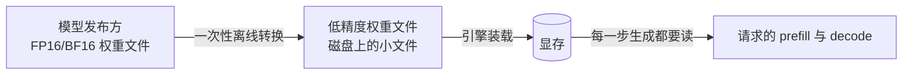

# 2.2 为什么要量化：三笔账

## 开篇问题

上一章的账本翻到最后，你算出一个让人不舒服的数字：看中的千问 27B 稠密模型，FP16 精度的权重按十进制口径约 54 GB；而主流消费级显卡的显存红线画在 24G——按 2.1 的换算规矩，标注 24G 的卡实为 24 GiB ≈ 25.8 十进制 GB。两个数字摆在一起，结论不用细算：54 对 25.8，超出一倍还多，"装进去"这一步直接失败。也别指望双卡救场：两张 24G 合计 48 GiB ≈ 51.6 GB，连权重本身都装不下，KV 和缓冲更是还没排上队。

面前通常有三条路：加钱换更大显存的卡，或者直接上双卡；换一个更小的模型；或者，把权重的存储精度砍下来——也就是量化。不少新手的直觉是"砍精度就要伤模型，能不砍就不砍"，于是直奔前两条。这一章算三笔账，看看第三条路在什么条件下是第一选择，它的收益从哪来，代价又藏在哪一本账里。

核心问题一句话：**54G 的模型，怎么塞进 24G 的卡？**

读完本章，你应该能做成四件事：把"装不下、搬不动、损失小"三笔账各复述一遍并带上成立条件；用"显存带宽 ÷ 权重体积"算出一个 decode 速度上限，并说清它是理论上限口径；给定显存约束反推出合理的位宽档方向；把这三笔账讲给一个没用过本地模型的外行听。

## 正文

### 先就位：量化在链路的哪一环

量化（quantization）这个词 1.1 出现过，当时只当它是下载页上的"体积档位"。现在把它放进推理链路里精确就位：



从左往右看：发布方交付的是训练时的原精度权重（FP16/BF16，BF16 是一种 16 位格式，2.3 拆解）；量化转换把每个参数从 16bit 的格子搬进更短的格子，做一次、离线做，产物是磁盘上小得多的文件；引擎启动时装进显存；之后每个请求的每一步计算，用的都是量化后的权重。所以量化不是运行时的开关，而是部署时的一次决定——你在下载页选 Q4 还是 FP16 的那一刻，三笔账里的两笔（显存、速度）就已经定了，剩下的一笔（质量）要等请求进来才验收。下面按"生死、快慢、质量"的顺序把三笔账算清楚。

### 第一笔账：装不下

先解决生死问题。显存三本账你上一章刚算过：显存占用 ≈ 权重 + KV 缓存 + 计算缓冲。权重是三本里最大的一本，而且它有个不近人情的性质——FP16 口径下每个参数 2 字节，账单随参数量线性增长，跟你的卡有多大没有商量的余地。27B × 2 字节 ≈ 54 GB：对 24G 单卡的 25.8 GB 是超载一倍多，对 51.6 GB 的双卡拼盘也照样装不下。

量化直接改写这一本的数额。位宽（每个参数用多少比特存储，1.1 的旧词）从 16bit 砍到 4bit，每参数约 0.5 字节，同一批参数只要 13.5 GB。按 2.1 的规矩统一口径再比较：13.5 GB 装进 25.8 GB 的盘子，还剩约 12 GB（约 11 GiB）给 KV 和缓冲。这就是"24G 卡能跑 27B"的全部秘密——不是显卡变强了，是权重换了一种存法。

**已解示例**：你手上是一张 16G 的卡，看上 27B 模型。FP16：54 GB 对 16 GiB ≈ 17.2 GB，超载三倍多，没有任何悬念；4bit：13.5 GB 装进去，17.2 − 13.5 = 3.7 GB，约合 3.4 GiB 留给 KV 与缓冲——短对话可用，长上下文就要另想办法（KV 自己的省法是 2.5 的话题）。同一张卡，能不能跑由你选的存法决定，而不是由卡决定。

**小练习（5 分钟）**：一张 12G 的卡，想跑 7B 模型并留 4G 给 KV 和缓冲。算一算权重预算是多少，再对照 FP16（每参数 2 字节）与 8bit 档（每参数 1 字节）的权重体积，判断哪个档位可行。（先按 2.1 把 12 GiB 换成十进制 GB 再减。）

*指标回看 · 显存占用：上一章它是"给定档位算出来的结果"，本章它变成"选档位的理由"——权重这一本账第一次被部署者主动改写，而不是被动接受。*

### 第二笔账：装下了，搬得动吗

装下之后是快慢问题。1.2 你已经观察过"逐字生成"：自回归的生成方式一次只算一个 token。麻烦在于，这一次前向（forward，输入完整过一遍全部层的一次计算）虽然只产出一个字，却要用到模型的全部权重——54G 的权重哪怕只为一个字服务，也要从显存完整读一遍。读多快由显存带宽（memory bandwidth，GB/s，每秒能从显存搬出多少字节；2.1 三层存储表里那列数字）决定，于是有本章最重要的公式：

```
decode 速度上限 ≈ 显存带宽 ÷ 权重体积
```

打个比方。prefill 像一卡车砖拉到工地，吊装一次（权重搬一次）砌一整面墙（几千个 token 一起算）；decode 像每砌一块砖都要单独跑一趟仓库，把全部工具搬来只用一件。前者的瓶颈在"算"，后者的瓶颈在"搬"。量化把工具箱砍到四分之一重，同样的搬运速度，每趟省下的时间全部兑现成更多的字——这是量化能提速的本质，也是选卡时 decode 先看带宽的原因。

**已解示例**：用真实数字练"反推等效带宽"。P40 跑 llama.cpp 官方的 7B 模型，decode 实测 50 多 tok/s，权重约 4.5G（来源：BV1hLtG6ZE5M）。等效带宽 = 50 × 4.5G ≈ 230 GB/s——意思是每秒真正用于读权重的只有 230G 字节。它占 P40 标称带宽的几成？去规格页查 Memory Bandwidth，一除便是。这个"等效带宽 ÷ 标称带宽"的比例，和"实测 ÷ 理论上限"是同一个折扣的两种算法（都等于 实测 × 权重 ÷ 带宽），下面反复用到。

**小练习（8 分钟）**：某人实测 decode 12 tok/s，权重 40G，卡标称带宽 512GB/s。算出理论上限与等效带宽，再算折扣。如果折扣超过九成，说明带宽是不是瓶颈？此时再降位宽，还有多少提速空间？

*指标回看 · 吞吐：本章先拿到"带宽 ÷ 权重体积"这条理论上限换算——它还不是实测吞吐；实测口径、波动与折扣的测量方法，第三章才有资格谈。*

两个提醒，防止把这条公式用歪。其一，分母只数了权重，而 decode 的搬运不只权重：KV 要跟着读，batch 大了要抢带宽，多卡有通信，内核效率各不相同——公式给的是天花板，不是实测值。其二，MoE 模型是例外：每个 token 只搬被路由选中的那部分权重，分母该用激活参数（1.5 的旧概念）而不是总参数。用 1.5 那个例子算一遍就知道照抄的代价：总参 200B、激活约 10B 的模型，Q4 档权重总量约 100 GB，照抄总参算出上限约 10 tok/s；按激活算每 token 只搬约 5G，上限约 200 tok/s——差的是 20 倍，不是一倍。

### 第三笔账：损失比想象小，但不是零

前两笔都是收益，现在看代价。把 16bit 的数压到 4bit，单个参数的舍入误差微不足道，为什么整只模型还能用？两个事实撑着。第一，训练收敛后的权重分布本身就像噪声，过参数化的网络对百分之一量级的扰动并不敏感——任务吃的是几百亿参数共同决定的统计规律，不是某个权重精确到小数点后第几位。第二，误差随位宽的变化是可预计的：在均匀量化的粗略口径下，位宽每砍一位、格距翻倍、误差大致翻倍——Q8 档误差约万分之六，Q4 档爬到百分之一量级（模型扛得住），Q2 档直接冲上百分之几十（模型开始胡言乱语）。失控点也有机制可讲：误差涨到与层间有效信号同一量级——大约在 3bit 以下——统计规律开始保不住，困惑度雪崩。至于"扛得住""胡言乱语"怎么用自己的任务量出来，是 2.5 的正题。

所以第三笔账的准确说法是：**到 Q4 为止，损失远小于收益；过了某个点，损失失控**。误差还会被两层放大器滚大——前层误差被后层接着算（层数放大），上一步的偏差被下一步接着采样（自回归放大）——这也是为什么"误差小"和"答得对"之间要留出验证余量。格子到底长什么样（浮点小格子还是整数格子），是 2.3 的正题。本章你只需要带走一个判断：Q4 附近的损失在多数日常任务上接近无感，是"可验收"的量级，不是"免费"。

三笔账算完，值得把它们并排看一眼——你会发现它们其实是同一笔交易的三张收据。

▶ 插画：三笔账的全貌。

<div class="ill" data-ill="why-quantize"></div>

### 这笔交易的适用边界：三个口号各带条件

"量化更快、更省、更隐私"——三句话都听过，三句都有前提。

**"更快"只在 decode 撞带宽墙时成立。** prefill 的主场是算力，权重减半它几乎不动（同一张卡换更小的量化，decode 上限近乎翻倍而 prefill 变化不大——第三章的对照实验会亲手验证）；输入特别短、并发特别小时，prefill 的矩阵又小又稀，也可能落回访存受限——用什么工具判断一种负载站在哪边，3.4 的 roofline 给你。硬件还得有高效的低位宽内核：同样是 4bit，有原生指令和优化内核的卡直接吃到速度；没有的卡要先反量化（把低位宽数据现场还原成高精度数再参与计算）再算，这笔额外开销可能吃掉收益。哪些卡属于后者、损失多大，原资料未说明，本章不给统一数字，一切以你自己的实测为准（2.5 的对比实验补上这一格）。

**"更省"省的只是权重那一本。** KV 跟着上下文长度和 KV 精度走，缓冲跟着引擎走，都不随权重量化自动缩小。你省下的显存若立刻被"开更长上下文"花掉，总账没变——但怎么花第一次由你决定，这正是量化给的选择权：同一个 27B，你可以选 13.5G 权重加长上下文，也可以选更高精度权重加短上下文。

**"更隐私"其实和量化无关。** 隐私来自"权重与数据都不出本机"，是本地部署的属性，任何精度都成立（1.1 校准过这三条口号的口径）。量化的贡献是间接的：它把"本机装得下"的门槛从数据中心级降到桌面级，让"本地"这个选项在预算内存在。拿"量化让模型更隐私"去和云端 API 比较，是把两件事记在了一本账上。

一句话收束：量化是一笔交易——用可预计、可验收的质量代价，换显存和 decode 上限这两项确定性收益。三笔账都在、且第三笔验收通过，这笔交易才叫划算。

## 完整算例

**已知条件**：一张标称显存带宽 1TB/s 的卡（1.0×10¹² 字节/秒；2.1 出现过的 MI50 这一级的卡在这个量级——该卡型号为口播转写存疑，以规格页为准——选它只为数字干净）；模型为 27B 稠密模型；两种存法——FP16 权重 54G（每参数 2 字节，十进制 GB 口径，上一章讲过与 GiB 差约 7%）、4bit 权重 13.5G（每参数 0.5 字节，纸面口径）。

**要回答的问题**：两种存法下，单路 decode 的吐字速度上限各是多少？

**公式**：

```
decode 速度上限 ≈ 显存带宽 ÷ 权重体积
```

**逐变量解释**：分子是带宽，单位字节/秒，表示每秒能从显存搬出多少数据；分母是权重体积，单位字节，表示每吐一个 token 必须完整读取的数据量。字节/秒除以字节，得到 1/秒——每秒能搬出几个"一整套权重"，而每个"一整套"正好产出一个 token，所以单位是 tok/s。

**代入**：

- FP16：1.0×10¹² ÷ 54×10⁹ ≈ 18.5，约 **18 tok/s**；
- 4bit：1.0×10¹² ÷ 13.5×10⁹ ≈ 74，约 **74 tok/s**。

**数量级与单位检查**：分子分母都是 10⁹ 量级的字节，相除落在几十 tok/s——与个人设备上单路 decode 的实测速度同一数量级，量纲与数量级都自洽。比例检查：54 ÷ 13.5 = 4，74 ÷ 18 ≈ 4.1，与"分母砍到四分之一、商放大四倍"一致，位宽账和速度账互相咬合。

**口径声明：这是理论上限，不是实测值。** 实测通常打六到八折；公式也只数了权重搬运，KV 读取、内核效率、调度空隙都会让实际更低。它答的是"这块带宽最多养得起多快的吐字"，不是"我跑起来一定这么快"。

**误差来源**：其一，13.5G 是"每参数恰好 0.5 字节"的纸面账，真实 4bit 文件还带着缩放数据和不做量化的层——同一个 27B，GGUF 的 Q4_K_M 文件口径约 16.5G，上限降到 60 上下；其二，不同卡的标称带宽可达成率不同；其三，框架与内核的差异。纸面账用于比较档位之间的倍数关系，绝对值要等实测。

**你自己的数字往哪代**：

| 变量 | 你的值 | 27B 示例值 |
|---|---|---|
| 卡的标称带宽（GB/s，规格页 Memory Bandwidth） | | 1000 |
| 权重体积（GB，以文件大小为准） | | 13.5 |
| 理论上限 = 带宽 ÷ 体积（tok/s） | | 74 |
| 你实测的 decode（tok/s，流式 + 单并发 + 长输出） | | — |
| 折扣 = 实测 ÷ 上限 | | — |

## 贯穿案例的最终分析

把镜头拉回上一章算过的那个项目：两张各 22G 的 2080Ti（魔改版），合计 44G 显存，线上跑着千问 27B 稠密模型（型号为案例视频口播转写，以项目所用模型卡为准）加满血 256K 上下文（FP16 精度的 KV），稳定运行一个多星期（来源：BV1UMEv68E3C）。用本章的三笔账把当时的决策重走一遍：

1. **先过生死关**：27B 的 FP16 权重约 54 GB，比 44 GiB（≈ 47.2 GB）的总盘子还大——原精度连"装"这步都过不去，换卡或量化二选一，预算把答案压给了量化。
2. **选档**：项目用 AWQ INT4（一种 4bit 权重量化格式，转换时保留了嵌入层等一部分高精度成分与缩放数据，去向 2.1 对过账、2.4 拆文件），权重落在 20 多 G——注意不是纸面的 13.5G，这正是算例误差来源其一的实例。装下之后还有 20G 出头富余。
3. **省下的显存花在哪**：三本账重排——权重 20 多 G、KV 16G（256K 上下文按 Layer type 修正后的账，上一章翻过）、再加计算缓冲，44G 绰绰有余。决策顺序值得记住：先把权重压下来，"满血上下文"才谈得上；权重若占 54G，上下文连门都进不来。
4. **速度侧复核**：每张 2080Ti 标称带宽 616GB/s，双卡合计约 1.2TB/s，除以 20~22G 的权重，单路上限约 55~60 tok/s——仍是理论上限口径：双卡并行要把权重切开各存一半，带宽聚合是近似，层间通信还要再吃掉一块（第四部分展开）。这笔账现在能和实测对上：1.4 记录过该项目的裸 decode 约 50 tok/s（不开 MTP 提速，来源：BV1nVVr6QEFq），50 ÷ 60 ≈ 0.83，折扣比"六到八折"的上沿还高一点——聚合近似把天花板抬高了些，方向与 2.1 说的"多卡的账不能简单相加"一致。

三笔账在这个项目里各就各位：装不下，逼出了量化；搬不动，给单路速度画了上限；损失小，让 INT4 成为可以签字的交易。它也回答了开篇问题——54G 塞进 24G（或 44G）靠的不是某个技巧，而是"把权重账砍到四分之一"这一步让三本账同时松了绑。

## 理解检查

1. **计算**：一个 30B 模型，FP16 权重多少 G？4bit 档多少 G？若卡带宽 1TB/s，两种存法的单路 decode 上限各是多少 tok/s？最后说明这个数字是什么口径。
2. **条件变化**：还是那张卡、那个模型，如果你把并发开到 4 路，"带宽 ÷ 权重体积"还算单路请求的速度吗？总吞吐怎么变？方向性回答即可，正式测量在第三章。
3. **排障**：朋友把模型从 FP16 换成 Q4 后抱怨"没变快"。列出至少两个可能原因，并给每个原因一个验证方法（提示：他测的是 prefill 还是 decode？他的硬件吃不吃低位宽？他的折扣算出来是多少？）。
4. **选型**：16G 显存，要跑 14B 模型且支持中长对话。FP16 行不行？你会把权重定在什么位宽档，余量留给谁？写出三本账的分配过程（记得先把 16 GiB 换成十进制 GB 再和权重比）。

## 动手实验

本章不安排上机：量化的收益必须对着可比对象才看得见，而实验器材（同一模型的多档量化文件、统一口径的测速脚本）要到 2.5 才配齐。本章的实验只需要一张桌子和上一章的记录。

**环境**：纸面推演；你在 2.1 产出的显存计算器（表格或脚本）与 nvidia-smi 记录；你那张卡的标称带宽（规格页的 Memory Bandwidth 一栏，以厂商/TechPowerUp 数据为准）。没有独显也能做：1.1 的纯 CPU 路径同样有"实测速度"，只是瓶颈里多了内存带宽一项，折扣会明显更低——把它记下来，正好留作 3.4 的反例素材。

**步骤**：

```bash
# 1. 从 2.1 的记录取出：权重体积（GGUF 文件大小）、实测显存占用
# 2. 算理论上限（把数字换成你自己的；616 与 16.5 只是 2080Ti+Q4_K_M 的示例值）：
python3 -c "print(616 / 16.5)"
# 3. 对照你实测过的吐字速度，算折扣：实测 ÷ 上限
# 4. 把权重体积换成假想 FP16（×4）重算上限，并回答：装得下吗？
```

**应记录的项**：卡与模型名；标称带宽；权重体积；理论上限；实测速度与折扣；假想 FP16 体积与是否装得下。

**预期现象**：单卡、单并发时折扣多落在 0.6~0.8（权重搬运占主导）；多卡聚合口径可能略高于 0.8——聚合近似抬高了天花板，贯穿案例第 4 条就是实例；纯 CPU 会明显低于 0.5。假想 FP16 体积大概率超出你的显存——这一步会让你直观看到量化对你的机器意味着什么。

**失败排查**：折扣高于 1 → 实测口径混入了 prefill 或多并发，先确认只数 decode（流式输出、长输出、单并发）；折扣远低于 0.5 → 瓶颈多半不在权重搬运（KV、内核或 CPU 参与），记下现象，3.4 的对照实验给你定位工具；查不到带宽 → 部分卡可用 `nvidia-smi -q` 读到，或以规格页为准。

**产出（三笔账讲给外行的三句话；2.5 完成对比后给每句补一条你自己的实测数据，并入 T5 报告）**：把三笔账各写成一句没有术语的话。第一句让外行明白为什么装不下，第二句明白为什么压小了反而快，第三句明白为什么压了也难听出损失。写完读给一个没用过本地模型的人，对方能复述才算过关。

## 本章能力清单

对照本章的学习目标：

- ✅ **解释**量化动机的三笔账，并说清"量化是交易不是免费"的含义（三节正文 + 插画）；
- ✅ **计算**给定带宽与权重体积的 decode 理论上限，并声明它是理论上限口径（完整算例 + 理解检查 1）；
- ✅ **画出**量化前后显存三本账的变化，指出哪一本被改写、哪两本不动（第一笔账 + 理解检查 4）；
- ✅ **比较**"更快、更省、更隐私"三个说法各自的成立条件（适用边界一节 + 理解检查 3）；
- ✅ **选择**在给定显存约束下反推合理的位宽档方向（已解示例与贯穿案例的决策链）。

## 与下一章的衔接

你现在相信"砍到 4bit 很划算"，但有一个词一直没拆开：位宽到底砍的是什么——数字在计算机里长什么样，砍位宽时格子怎么重新划分？下一章（2.3 位宽的世界）从浮点数的位段解剖讲起，把 FP32、FP16、FP8 到整数档位的整条阶梯摆给你看；至于 Q4_K_M 这个名字里的字母是什么意思，2.4 打开 GGUF 文件时现场拆给你看。你只需要带上一个数字进场：13.5G。

## 资料来源与延伸观看

- 贯穿案例（双 2080Ti 魔改 44G 跑 27B AWQ INT4 + 256K FP16 上下文的显存总账）：SPOTLITE（B 站 UP 主）"大模型 KV 缓存要 100G？我们一起来算算"（BV1UMEv68E3C）；该项目裸 decode 约 50 tok/s 的实测记录见 1.4（BV1nVVr6QEFq）；P40 跑 7B 的 decode 50 多 tok/s 实测与反推等效带宽练法（BV1hLtG6ZE5M）。视频清单与全部出处见附录 B。
- 卡片标称显存带宽：厂商规格页或 TechPowerUp 数据库的 Memory Bandwidth 一栏（以官方口径为准）。
- 带宽、roofline 与瓶颈定位的展开：本书 3.4；吞吐的正式定义与实测方法：本书 3.1。
- 口径说明：千问 27B 型号为案例视频口播转写，以项目所用模型卡为准；MI50 卡型号为口播转写存疑；本章权重理论下限一律按十进制 GB 计算，与显存红线比较前按 2.1 的规则换算成 GiB。
- 原资料未说明之处（不同卡与框架的具体折扣数值、无低位宽内核硬件的反量化开销、CPU 推理的量化提速实测）本章不给统一数字，留待 2.5 与第三章的实测方法补齐。
