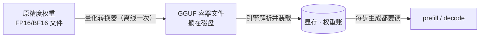

# 2.4 打开 GGUF：文件、超级块与档位

## 开篇问题

选型的最后一步，你点开模型的下载页，准备挑一个塞得进显存的文件。列表里躺着十几行：Q4_K_S、Q4_K_M、Q4_0、Q5_K_M、Q6_K、Q8_0，还有一串 IQ 开头的。以 27B 为例，体积从 10G 上下一直排到 29G。同事凑过来问了三个问题：Q4_K_M 里的 K 和 M 各是什么？Q4_0 和 Q4_K_M 都叫 Q4，为什么要选贵一点的那个？以及最扎眼的一问——名义 4bit 该是 13.5G，为什么文件标着 16.5G？

第三问你在上一章已经撞见过一次：贯穿案例里那份 AWQ INT4 权重，实测占了 20 多 G，比名义多出整整一半。多出来的字节不是黑幕，是记账方式——位宽只是"名义面额"，真正决定体积和显存占用的是文件内部怎么记账。这一章把一份 GGUF 文件拆到字节，把这笔账数清楚。核心问题一句话：**Q4_K_M 这个名字里藏着什么？**

## 正文

### 文件在链路里的位置：一次转换的产物

先把这份文件放进推理链路。原精度权重从模型发布方出发，被量化转换器（llama.cpp 生态里的 quantize 工具）做一次离线转换，产出一个低比特的容器文件；引擎启动时解析它、把权重装进显存；之后每个请求的每一步生成都从显存里读它。



GGUF 是一种**容器格式**（container format）：它不规定权重怎么压缩，只规定"什么东西按什么顺序装进一个文件"。装的东西你第一章都见过——权重、分词器、对话模板，再加一份文件的自我说明。它牵动的指标很集中：文件体积决定磁盘与下载，装载后的权重账决定显存占用，装载过程本身决定"启动到可服务"要等多久——那是 TTFT 最极端的一次。下面按字节顺序开箱。

▶ 插画：GGUF 文件的四段结构，以及它和服务端格式的分野。

<div class="ill" data-ill="gguf-file-layout"></div>

### 四段结构与一枚自我声明的印章

双击 `.gguf` 什么都看不到，但内部只有四段，按顺序是：

1. **文件头**：魔数（magic，文件开头的身份标记字节）「GGUF」、版本号、张量数、元数据条数——读这份文件的目录页；
2. **元数据键值区**：架构名、上下文长度、整个词表数组、对话模板，还有一枚 `general.file_type`；
3. **张量信息表**：每个张量的名字、维度、量化类型、在数据区的偏移量；
4. **权重数据区**：按量化类型分块码放的张量本体，段前垫上对齐字节。

元数据区里最值钱的是那枚 `general.file_type`。它的值是个整数，对照 llama.cpp 的枚举表，`15` 就是"主体 Q4_K_M"——**文件自己声明自己是什么档位**。文件名可以随手改，元数据跟着引擎的读取逻辑走：从网盘下到一份被重命名的文件，用 gguf-dump（llama.cpp 官方 gguf 包自带的导出脚本）一查便知真身。

和服务端派吃的 safetensors 对比着看更清楚。safetensors 走极简路线：JSON 头 + 原精度裸张量，不内嵌分词器，也不定义量化块格式，量化和词表都靠外部配置。这正对应两个生态的分工（第三章展开）：vLLM 内存充裕，要吃各种量化方法的插件式实现，safetensors 给它原始材料；llama.cpp 要单文件走天下、拷进 U 盘即用，GGUF 把一切都装进一个箱子。

**已解示例**：下载页同一模型并排躺着 Q8_0 和 Q4_K_M 两份文件。用上一章档位表的实测位宽换算：Q8_0 约 8.5bit，27B × 8.5 ÷ 8 ≈ 28.7G，与标注的 29G 上下对上；Q4_K_M 约 4.8bit，算出 16.2G，标注 16.5G 也在附近。两个比值——29 ÷ 16.5 ≈ 1.76 与 8.5 ÷ 4.8 ≈ 1.77——互相咬合。档位表里"实测 bit/参数"那一列，可以直接当体积换算率用。

**小练习（5 分钟）**：把你下载页上每个文件的标注体积除以参数量、乘 8，得到各自的实测位宽，和档位表对一遍。偏差最大的那一个，猜猜是它的哪部分没被量化（提示：词表那一张）。

### 超级块：4.5bit 是怎么一笔笔记出来的

上一章的整数路线给过记账公式：存 `q = round(w / scale)`，用时乘回去——缩放系数（scale）就是每块权重共用的那把尺子。当时留了个尾巴：多大范围共用一把尺？GGUF 的 K 系答案叫分块记账。

把 256 个权重打包成一个**超级块**（super-block），再切成 8 个**子块**、每子块 32 个权重。记账三层：每个权重存一个 4bit 主值；每个子块另配一对 6bit 的缩放与下限——子块自己的尺子；整个超级块再共享一对 FP16 的超级缩放与下限——整块的校准钮。

▶ 插画：超级块与子块的账本。

<div class="ill" data-ill="super-block-anatomy"></div>

为什么子块要各配尺子？如果 256 个数共用一把尺，量程得迁就块里最大的那个，其余全被挤粗；切成 8 份，一个大数只能带坏它所在的 32 个。这个"大数"有正式名字，本章后面专门给它一节。144 字节除以 256 个权重为什么恰好是 4.5bit，完整推导留在完整算例里一步步算。

先记一个对照：旧记账法 Q4_0 是每 32 个权重配一把 FP16 尺子，主数据同样是 4bit——账面位宽与 Q4_K 几乎一样，也在 4.5bit 上下。同样的字节预算，K 版花在"两级尺子、更贴分布"上，误差更小，这就是社区更认 K 系的原因。"凭什么都叫 Q4、口碑不同"，答案在记账法，不在名义位宽。

### _M：把 4.5 记成 4.8 的施工单

Q4_K 是一种记账法，Q4_K_M 则是转换器的施工单：主体按 Q4_K 记账，但把少数几类张量升格成 Q6_K（约 6.6bit）——注意力 V 投影（attn_v）、FFN 下投影（ffn_down）与输出头（把隐状态映射回词表打分的那层；词表嵌入视模型而定）。升格的张量按 6.6bit 记账，其余维持 4.5bit，文件平均位宽被拉到约 4.8bit。档位家族里 `_S` 是更省的施工单（升格更少），`_L` 更宽；IQ 系列则是为极限低比特设计的另一族记账法，代价是部分老硬件上更慢——它们的质量账留给下一章。

为什么偏偏升格这两类张量？先记现象：它们恰好站在异常值最重的位置，下一节给机制。这也顺手解了开篇的"Q4_0 与 Q4_K_M 差价"——差的不是体积（约半成），是同样字节买到的抗损能力。

**已解示例**：尺子本身的开销有多大？取一个 4096×4096 的权重矩阵，约 1678 万个数，4bit 主数据约 8.4MB。per-tensor（整个矩阵一把尺）只要 1 个 scale；per-channel（每行一把）要 4096 个；per-group、每组 128 个数的话要约 13 万个。scale 按 FP16 记账每个 2 字节，最细粒度也只多约 0.25MB——主数据的 3% 上下。粒度切得再细，元数据都不是大头，这是"粒度换精度"便宜的原因。

**小练习（8 分钟）**：你的 27B Q4_K_M 文件标注 16.5G。假设把 `_M` 升格的两类张量退回 Q4_K（全部按 4.5bit 记），新体积大约多少？（方向：变小；幅度：用 4.5/4.8 的比例估，不足一个 G——这也解释了 Q4_K_S 为什么只比 `_M` 小一点。）

*指标回看 · 显存占用：预算该按哪个数填——名义 4bit 的 13.5G 会让你自信地 OOM，超级块账 15.2G，混合档实测 16.5G。从本章起，显存三本账的权重一本按"文件实测口径"填，名义位宽只用来比倍数。*

### W8A16：量化只管存，不管算

前面一直在压权重，现在把矩阵乘里的另一个角色请回来。每层计算是 Y = A × W：**W（权重）**训练完就冻结，存硬盘、进显存、被压小，动的都是它；**A（激活值，activation）**是流入这一层的输入张量，随每个 token 实时变化，一层层往后传。菜谱和食材的比喻还适用：菜谱可以印在廉价薄纸上，下锅火候照常。

这套命名写成 **W8A16**：W 后的数字是权重存储位宽，A 后的数字是激活位宽。GGUF 的 Q4_K_M、服务端的 AWQ，都属于 **weight-only（仅权重量化）**路线——只压 W，激活保持 16bit。关键动作是**反量化**（dequantize）：用之前先把 4bit 主值乘回尺子、还原成 FP16，再和 16bit 激活相乘。所以量化改变的是权重的**存储与搬运**位宽，不是运算位宽——显存里躺着小格子，进计算单元前才展开。

由此得到一条判据："支持 Q4 权重"不等于"以 4bit 运算"。weight-only 只要求装得下、搬得动，对运算单元没有低比特要求，老卡也能跑。顺带一个命名上的诚实声明：Q4_K_M 每参数 4.8bit，却被归在"W4A16"的大类里——W 后的 4 是档位名，不是精确账，这套记法只报量级，报不出超级块的零头。

### 异常值与粒度：为什么偏偏是这几层升格

报身高，全班四舍五入到分米够用；来了个 2 米 26 的中锋，量程被撑到 2.3 米，其他同学挤进同样粗的格子，分辨率全体下降。模型权重里这种"巨人"真实存在，术语叫**异常值**（outlier）：少数离群的大数把量程撑大，让大多数数分到的格子变粗。

对策两条，本章已经见过了。其一，把粒度（granularity，多大范围共用一把 scale）切细——per-tensor 全矩阵一把尺、per-channel 每行一把（通道是矩阵的一行，对应一个输出）、per-group 行内再分组；k-quants 的"超级块 + 子块"就是粒度细化的实现，巨人被圈进 32 个数里。其二，把少数受影响最大的部分排除在压缩外、单独留高精度——`_M` 施工单升格 attn_v 与 ffn_down，正是这个思路：经验上这两类张量乘到的输入激活分布最宽，异常值先砸在它们头上。AWQ 的"激活感知"（先观察激活值、找出显著通道、保留高精度）与 `_M` 升格，是同一个思想的两副面孔——这也解释了贯穿案例那份 AWQ 权重为什么比 GGUF 贵得多：它把更多字节花在了保护名单上。

▶ 插画：一个巨人与全班的格子——共用一把尺和各配一把尺的差别。

<div class="ill" data-ill="outlier-comic"></div>

### Marlin 为什么快：省的是搬运，不是乘法

回到那个悬了两章的问题：既然 weight-only 算之前总要还原回 FP16，量化到底图什么？图搬运。第二章给过 decode 速度上限 ≈ 显存带宽 ÷ 权重体积：每生成一个 token，权重都要从显存过一遍，4bit 比 16bit 少搬约 4 倍，省下的搬运时间远大于反量化多花的乘加。vLLM 里执行这条路线的代表是 Marlin 内核——把 AWQ/GPTQ 这类权重（GPTQ 是与 AWQ 同路的服务端训练后量化格式）反量化后与 FP16 激活相乘，它的功夫不在省乘法，而在把细粒度尺子的额外搬运压到几乎免费（scale 开销约 3%，前面刚算过），让"少搬 4 倍"真正兑现成吐字速度。

条件照旧要写全：这笔提速属于"decode 撞带宽墙、内核高效、有 FP16 算力"的场景。prefill 的主场是算力，低位宽权重帮不上多少；短输入、小负载时两头都可能站在访存侧；没有优化内核的硬件还要先付解包成本。量化是否提速，取决于硬件指令、内核、粒度与负载，是否真的更快以同口径实测为准——方法在下一章。

三口径收进一句话：名义 4bit 是档位名，4.5bit 是记账法，4.8bit 是文件实测——显存预算认第三个。

## 完整算例

**已知条件**：Q4_K 超级块结构——256 个权重 = 8 子块 × 32；每个权重 4bit 主值；每子块一对 6bit 缩放与下限；每超级块共享一对 FP16 超级缩放与下限（FP16 每个占 2 字节）。模型 27B（27×10⁹ 参数）；体积按十进制 GB 口径（与 2.1 的约定一致）。

**要回答的问题**：Q4_K 每个权重实际摊多少 bit？整个模型的权重文件账是多少？

**公式**：

```
子块账（bit） = 主数据 + 子块尺子 = 32×4 + 6 + 6
超级块账（字节） = 8 × 子块账 ÷ 8 + 超级尺子（2 + 2 字节）
位宽（bit/权重） = 超级块账 × 8 ÷ 256
```

**逐变量解释**：主数据 32×4 是 32 个权重的 4bit 格子本体；6bit 缩放与 6bit 下限是子块尺子（为什么取 6bit：8 个子块的两对 6bit 恰好拼进 12 字节，是精度与开销的折中设计）；超级缩放与下限是整块共享的校准钮，FP16 各占 2 字节。

**代入**：

- 子块：32×4 + 6 + 6 = **140 bit**；
- 8 个子块：140×8 = 1120 bit = 140 字节；
- 加超级尺：140 + 4 = **144 字节 / 超级块**；
- 位宽：144 × 8 ÷ 256 = **4.5 bit/权重**。

**数量级与单位检查**：换个方向验算——主数据 256×4bit = 128 字节，尺子 12 + 4 = 16 字节，合计 144 字节，与逐子块累加一致。结构检查：主数据占整块 89%，尺子占 11%——元数据不是零头，"Q4 记成 4.5"的那 0.5，主体就是尺子。

**从 4.5 到文件**：纯 Q4_K 记满 27B：27×10⁹ × 4.5 ÷ 8 = 15.2G。`_M` 施工单把 attn_v、ffn_down 与输出头换成 Q6_K（约 6.6bit；词表嵌入视模型而定），平均拉到约 4.8bit：27×10⁹ × 4.8 ÷ 8 = 16.2G；下载页标注约 16.5G（以模型页为准）。三个口径排成一列：名义 13.5G → 超级块账 15.2G → 混合档实测 16.5G。

**口径声明**：4.5 是由格式定义决定的结构推导值，不算误差；4.8 是社区按文件体积反推的实测口径（上一章档位表的取值）；16.2G 是按它的纸面账，与 16.5G 标注之间约 2% 的差来自词表、配置与对齐填充。

**误差来源**：转换器版本对施工单有微调，同一档位不同仓库的产物可差几百 MB；词表大小直接进账，大词表模型的嵌入层可观；GiB 与 GB 差约 7%，与显存容量比较时记得换算（2.1 讲过）。

## 贯穿案例的最终分析

把镜头拉回那个已稳定上线一个多星期的项目：两张各 22G 的 2080Ti（魔改版）合计 44G，vLLM 服务着千问 27B 稠密模型与满血 256K 的 FP16 上下文，其中 AWQ INT4 权重占 20 多 G（来源：BV1UMEv68E3C）。用本章的眼睛重看这笔权重账：

1. **折扣对账**：20 多 G 对名义 13.5G，多出约一半，比 Q4_K_M 的折扣（约 22%）大得多。原因同族不同形：AWQ 是激活感知方案，给显著通道留了高精度成分，外加 per-group 尺子与未量化的嵌入/输出层。"INT4"是方法名，不是每参数恰好 4bit 的承诺——该文件内部逐张量的位宽分布原资料未说明，无法逐字节对账，但折扣的类别可以点名。
2. **为什么是 AWQ 而不是 GGUF**：服务面向团队多用户，引擎选了 vLLM（第三章的主角），它吃 AWQ/GPTQ 这类格式；GGUF 是端侧单机生态的箱子。同一句"4bit 权重"，两个生态各有记账法、折扣率不同——跨生态比体积，必须用文件实测口径，不能拿名义位宽套。
3. **查证方式迁移**：GGUF 的自我声明在元数据 `file_type` 里；AWQ 的自我声明在模型页 config.json 的 `quantization_config` 字段里（`quant_method`、`bits` 这类键值）。体积和名义对不上时，先查自我声明，再按折扣类别点名，而不是先怀疑文件下载坏了。
4. **合账复核**：权重 20 多 G + KV 16G（2.1 按 Layer type 修正后的账）+ 计算缓冲与固定缓存（100 多兆量级），合计 40G 上下，44G 装下且留有余量。上一章的结论，换成文件实测口径后依然站得住。

## 理解检查

1. **计算**：某假想档位每个超级块 256 权重、8 子块 × 32，主数据 3bit/权重，每子块一对 5bit 缩放与下限，整块共享一对 FP16 超级尺。每权重摊多少 bit？一个 14B 模型按它记账，权重文件约多少 GB？
2. **条件变化**：把一份 Q4_K_M 重新转换成"取消 `_M` 混合"的版本（全部按 Q4_K 记账），文件向哪个方向变、大约变多少？变完之后，平均位宽落在本章三个口径的哪一个上？
3. **排障**：朋友坚称下到的 Q4_K_M 是假文件，理由是"按 4bit 算 14B 该是 7G，下载页写 8.4G"。给出至少两步排查和你的结论。
4. **选型**：8G 显存要跑 14B 模型，还想留 1.5G 给 KV 与缓冲。权重预算按本章哪个口径算？哪个档位方向可行？写出账，若都不行给出两个替代方案。

## 动手实验

**环境**：任何能跑 Python 的机器（本实验只读文件、不装载模型，无显卡也行）；一份 Q4_K_M 的 GGUF（1.1 下载的那份即可），有条件再备同模型的 Q8_0 做对照；llama.cpp 的 llama-cli（获取与编译以官方仓库为准）；`pip install gguf`（官方元数据工具包，命令名与用法随版本变化，以 `--help` 与官方文档为准）。

**步骤与命令**：

```bash
# 1. 读自我声明与四段清单
gguf-dump 你的模型.gguf | head -80      # 元数据键值区 + 张量信息表开头
#    记下 general.file_type 的数值，对照 llama.cpp 枚举表查档位
# 2. 加载打印对照（llama.cpp；逐张量类型的打印随版本变化，以官方仓库为准）
llama-cli -m 你的模型.gguf -p "你好" -n 8 2>&1 | tee load.log
grep -iE "attn_v|ffn_down|ffn_up" load.log | head
# 3. 体积账对照
ls -l 你的模型*.gguf
```

**应记录的项**：`general.file_type` 数值与查表结果；张量信息表条数（对照文件头的张量数声明）；抽查 attn_v、ffn_down、ffn_up 三类张量的量化类型是否不同；文件实测体积与三口径（按你的参数量换算后的名义值、超级块账、档位实测值）的偏差；Q8_0 对照文件的体积比。

**预期现象**：file_type = 15（Q4_K_M 档）；ffn_down 与 attn_v 的量化类型高于 ffn_up/attn_q（如 Q6_K 对 Q4_K；依转换配置而定，不同模型可能不同）；Q8_0 体积约为 Q4_K_M 的 1.7~1.8 倍；加载日志与导出脚本里逐张量的类型清单，就是四段插画的文字版。

**失败排查**：`gguf-dump` 报版本不兼容 → 升级 gguf 包，或改用 `python3 -m gguf.scripts.gguf_dump`（以包文档为准）；加载日志里找不到逐张量类型 → 新版把这类打印放在调试级别，改用第 1 步的导出工具，结论等价；体积与三口径都对不上 → 先核对参数量（以模型卡为准），再检查是否 GiB/GB 口径混用。

**产出（交付物）**：自己模型的 GGUF 走查单，一页四栏——四段各装什么（对着 gguf-dump 输出逐段标注）；自我声明的档位；抽查张量的类型分布；三口径体积账与实测偏差。以后拿到任何陌生的 GGUF，先按这页走查，再谈装载与预算。

## 本章能力清单

对照五个学习目标：

- ✅ **画出** GGUF 四段结构并说出每段装什么、解释 file_type 为什么比文件名可靠（四段一节 + 实验）；
- ✅ **计算**超级块位宽账（144×8÷256 = 4.5）并解释 4.5 到 4.8 的混合来源（完整算例 + `_M` 一节 + 理解检查 1、2）；
- ✅ **解释** W8A16 与 weight-only：量化改变存储与搬运位宽，不改变运算位宽（W8A16 一节）；
- ✅ **比较** per-tensor / per-channel / per-group 三种粒度对异常值的处理与元数据开销（异常值一节 + 已解示例）；
- ✅ **诊断**"名义 4bit 与实测体积对不上"的差距来源，并按折扣类别点名（贯穿案例 + 理解检查 3）。

## 与下一章的衔接

三个数字请带进下一章：4.5（记账法）、4.8（文件实测）、16.5G（你的显存预算口径）。账现在会记了，但另一头的疑问原地未动：同样记到 4.5bit，为什么 K 系比旧记账法抗损？把位宽压到 3bit、2bit 时，异常值会把质量啃到什么程度？下一章（2.5 量化的代价与甜点位）给你位宽-质量曲线、误差被自回归逐层放大的机制，以及用你自己的任务做盲测验收的方法。届时，本章的 GGUF 走查单会变成多档对比实验的登记表。

## 资料来源与延伸观看

- 贯穿案例（双 2080Ti 魔改 44G、千问 27B 稠密模型 AWQ INT4 权重 20 多 G + 256K FP16 上下文的显存总账，vLLM 服务）：BV1UMEv68E3C。权重"20 多 G"未注明 GB/GiB，模型型号为口播转写，以项目模型卡为准；该 AWQ 文件内部逐张量位宽分布原资料未说明。
- GGUF 格式定义与档位枚举（`general.file_type` 数值表）：llama.cpp 仓库（github.com/ggml-org/llama.cpp）与 gguf python 包文档；格式字段随版本演进，以官方文档为准。
- safetensors 与 Hugging Face 生态：huggingface.co/docs/safetensors；AWQ 的量化声明见模型页 config.json 的 `quantization_config` 字段。
- Marlin 内核与 weight-only 路线：vLLM 官方文档 quantization 章节（硬件支持表与启动日志，以所用版本文档为准）。
- 理论位宽与实测的换算方法见本章算例；具体卡型上量化前后的速度对比，留待 2.5 与第三章的实测方法补齐。
