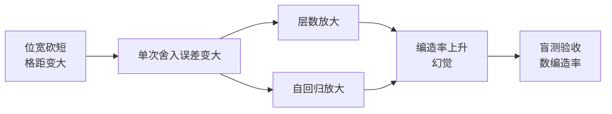

# 2.5 量化的代价与甜点位：Q4 之后为什么不能再省

## 开篇问题

上一章你打开了 GGUF 文件，看懂了 Q4_K_M 这个名字：超级块把 256 个权重打进 144 字节，账面 4.5bit，_M 混合策略抬到约 4.8。看完你很可能冒出一个大胆的念头——既然压到 4bit 这么划算，为什么不继续？Q4 再压一半就是 Q2，显存再省一半、搬运再少一半，照 2.2 的三笔账，这买卖应该一路做到 1bit 才对。

可社区的口径恰好停在这里：Q4_K_M 被当作"标配甜点档"，再往下的档位名字前都挂着警示意味的 IQ 前缀。更蹊跷的是，同样号称 4bit，有人跑得欢，有人却抱怨"模型开始一本正经地胡说八道"。这条质量边界画在哪、为什么画在这，就是本章要拆的问题。

核心问题一句话：**Q4 之后为什么不能再省？**

## 正文

### 先就位：质量这条边要用自己的尺子

到上一章为止，这本账已经翻过三页：显存三本账（2.1）回答装不装得下，带宽除以权重（2.2）回答理论上限多快，档位名字（2.3、2.4）回答文件里存的是什么。三页合起来，量化的收益端已经算清了。剩下的一端——质量——前几章只用了一句"损失轻微"带过，现在轮到它上桌。

质量的麻烦在于它没有单价。显存按 GiB 标价，速度按 tok/s 标价，"模型变笨一点"却找不到商店货架。它能被观测到的形态是一条因果链：



链上每一环都能检查：格子怎么变大是 2.3 的位段解剖，误差怎么被放大是本节正题，"编造率"怎么数是本章实验的尺子。先立个规矩：**谈质量损失，要么给出测量口径，要么明说是定性判断**——本书两者都会标清。

### 误差的两级放大器：从格距到幻觉

把一个 16bit 的数压进 4bit 的格子，单次舍入误差小到可以忽略。真正的问题是有两台放大器接着它。

第一台是**层数放大**。权重分布在几十层里，每层的输入是上一层的输出：前层带进来的偏差被后层原样接着运算，一路乘加下去。2.4 讲过的异常值（outlier）在这里添乱——个别数值特别大的通道让"一把尺子量所有权重"量不准，这也是 k-quants 分块配尺度存在的原因。

第二台是**自回归放大**，它更隐蔽。1.2 说过生成是一次一个字：上一步的输出就是下一步的输入。权重误差轻微扰动了输出概率分布，采样就可能挑出一个不一样的词；然后在"错了一点"的基础上继续生成，错上加错。两台放大器串起来，出口就是**幻觉（hallucination）**——模型语气温和、格式工整地编造不存在的文献、条款和数据。量化越狠，误差越大，编造率越高。

▶ 插画：幻觉与质量劣化随量化档位的恶化曲线——Q4_K_M 之前几乎是白拿的省显存，IQ 段开始用质量换体积。

<div class="ill" data-ill="hallucination-vs-quant"></div>

先说明这张图的口径：它是定性趋势示意，不是某一个模型的实测曲线——真实位置因模型和任务浮动，这正是本章实验要你亲手测的原因。曲线上还有一处容易读漏的标注：低档位上"文档问答还行，数学和代码先崩"。同一只模型，聊天时你察觉不到 IQ3 和 Q4 的差别，让它做两位数乘法或复述条款原文，差别立刻显形。**量化损失不是均匀抹在所有能力上，而是先砸向容错度低的任务。**

还有一个近年容易踩的坑，值得单独讲。五零系显卡原生支持 4bit 浮点运算，宣传语听起来像"4bit 不再掉点了"。但社区实测的结论更有意思（来源：BV1GtbL63Ekt）：同样 NVFP4 的 4bit 权重，若激活也用 4bit 去运算（W4A4，命名法见 2.4），幻觉水平约等于 Q3 级量化，质量骤跌；同样的权重换成半精度激活（W4A16）则好得多，两者之间隔着一个明显的台阶。UP 主的原话是"你量化的越狠，他的幻觉越重""不要太迷恋于低精度推理"。这条案例的价值在于把两个旋钮拆开了：**存储位宽决定文件多小，运算精度决定误差多大**——原生 4bit 硬件不是免死金牌，分水岭在计算时用几位。

**已解示例**：为什么同一个 Q4_K_M 模型，"陪聊"几乎无感，"引用原文写综述"却容易翻车？顺着因果链走一遍：单次误差很小 → 自回归把小扰动滚进历史 → 引用任务要求历史里的原文一字不差，容错度极低，扰动在"复述"环节集中暴露；聊天任务吃的是统计规律，个别词的替换无伤大雅。结论不是"Q4 不能用于引用任务"，而是"引用任务要用更严的验收"——多问几题、盯编造率，这正是本章实验的盲测设计。

**小练习（5 分钟）**：给四个任务排一排对量化档位的容忍度，并各写一句理由：闲聊陪聊、营销文案、合同条款核对、两位数乘法。写完对照插画曲线，看你的排序和"数学代码先崩"的口径是否一致。

### KV 也能砍，而且更危险

显存三本账里还有一本活账也能量化：KV 缓存（1.3 的旧词——历史 token 的 K、V 存起来不重算）。三档的账面是：

| KV 精度 | 每元素字节 | 相对 FP16 | 定性表现 |
|---|---|---|---|
| FP16 | 2 B | 1× | 基准 |
| INT8 | 1 B | 1/2 | 通常几乎无感 |
| Q4 | 0.5 B | 1/4 | 长上下文下明显掉智力 |

权重量化好歹是"把存着的参数压一压"，KV 量化动的却是**每生成一个 token 都要被注意力完整读一遍的记忆**。它的误差直接混进每一步的注意力打分——等于给上一节的两级放大器再加一级。所以社区对 KV 降档一贯更谨慎：INT8 通常无感，Q4 在长上下文下是"读过就忘"的量级。

KV 降档的动机几乎总是同一个：显存不够。这里有一个残酷的排片规律——**权重和 KV 抢的是同一块显存**。显存宽裕时你根本不会想起 KV 量化；显存紧张时，塞进高精度的 Q8 权重，就没有空间留给上下文和并发；被迫让路的那一本，最先被牺牲的总是精度。UP 主对 30B 级模型给过直接的换算：24G 卡只能跑 Q4 级权重，16G 卡只能 Q3 甚至更低；硬塞 Q6/Q8 权重的下场是"根本没有空间给上下文，也没有空间做并发"（来源：BV1i6Y86AEv3）。

一个真实翻车案例把这条规律演到了极端：24G 单卡想跑满 256K 上下文，KV 只能压到 Q4 级，UP 主的原话是"你想这个幻觉它会爆炸到什么程度"（来源：BV1i6Y86AEv3）。同样是 Q4 的 KV，在短对话里往往无感，塞满上下文之后就是照妖镜——**KV 精度的代价不由档位决定，由你把上下文塞多满、任务多较真决定**。

*指标回看 · 显存占用：上一章它是"三本账的精确代数"，本章它第一次反过来行使否决权——同一台机器、三档权重各算一遍，账本否决了更高精度。*

**已解示例**：贯穿案例那台 44G 双卡机（2.1 的账：AWQ 权重 20 多 GiB、FP16 KV 约 16.1 GiB、缓冲约 7.9 GiB），假设权重换成 16.5G 的 Q4_K_M 文件，省出约 4.5 GiB。这笔钱怎么花？方案一是把 KV 降到 INT8：16.1 → 8.1 GiB，再省 8 GiB，凑出开第二路并发的本钱；方案二是维持 FP16 KV。选哪个取决于任务：纯聊天，INT8 的 KV 无感，省下的钱换并发划算；长文档问答要引用原文，记忆精度就是验收标准，FP16 保住，富余宁可留作缓冲。**同样的省法，花在权重、KV 还是并发，是三笔不同的账。**

**小练习（5 分钟）**：Qwen3-8B 级（36 层、8 个 KV 头、head_dim 128，2.1 算过 144 KiB/token）开 32K 上下文，FP16 的 KV 是多少 GiB？降到 Q4 省多少？你的 8G 卡上，这笔省额够不够再开一路并发？

### 甜点位：一条线性与一条非线性的交点

现在能回答开篇的疑问了：为什么收益明明还能翻倍，社区却停在 Q4。

把甜点位两侧各画一条曲线。**收益侧是线性的**：每往下降一档，显存实打实再省一截——Q8 到 Q4 省一半，Q4 到 Q2 再省一半，这条边的诱惑每一档都一样大。**代价侧是非线性的**：均匀量化的误差大致与格距成正比，位宽每砍一位、格距翻倍、误差翻倍。两级叠加的结果是：Q8 档误差约万分之六，Q4 档爬到百分之一量级（模型扛得住），Q2 档直接冲上百分之几十（模型开始胡言乱语；口径：社区困惑度增幅量级，非权重相对误差）。

模型为什么在 Q4 附近扛得住？2.2 给过半个答案：训练收敛后的权重分布本身像噪声，过参数化的网络对百分之一量级的扰动不敏感——任务吃的是几百亿参数共同决定的统计规律，不是某个权重的精确值。剩下半个答案是：这份宽容有刻度。当误差涨到与层间有效信号同一个量级（3bit 以下），"统计规律"也开始保不住，困惑度（perplexity，衡量模型预测下一个词时有多犹豫的指标，越低越好）雪崩式上升。宽容不是无限的，刻度恰好落在 Q4 与 IQ3 之间。

▶ 插画：位宽-质量曲线与甜点圈——Q4_K_M 右边几乎白拿，左边用质量换显存。

<div class="ill" data-ill="quant-sweet-spot"></div>

于是甜点位有了精确定义：**甜点位 = "再省一半显存"开始要求"用质量偿还"之前的最后一档**，也就是边际收益的分界线。往右看：Q4 到 Q8 显存翻倍，质量只挽回最后一小截——收益递减，钱花对了地方却买不到多少东西。往左看：Q4 到 Q2 显存再省一半，质量断崖——代价递增，省下的每一 G 都用编造率偿还。两条曲线的交点随模型与任务浮动，但对"27B 级稠密模型 + 24G 级显存"这对最常见约束，答案稳定在 Q4_K_M。

### 速度与首字：三档量化各拿多少

显存之外，速度端也有账可算。decode 的理论上限是带宽除以权重体积（2.2 的公式），位宽砍短分母变小，所以档位越低、吐字上限越高——这张卡的账本章末完整算。但要带着 2.2 的两个提醒读数：公式给的是理论上限，实测要打折；而且**量化是否真提速取决于内核**——IQ 系列在部分老硬件上反量化开销大，纸面更小、实测更慢的情况存在（2.3 埋过的伏笔），以实测为准。

TTFT（首字等待）一侧，量化帮不上太多忙：prefill 的主场是算力，权重位宽对它影响有限（2.2 的口径）。真正让首字崩掉的不是低档位，而是**显存装不下**——一旦权重被迫下沉内存甚至硬盘，首字等待就从秒级跳到十秒级。所以速度端的正确顺序是：先保证三本账合上、模型全量驻留显存，再谈档位带来的加速。

*指标回看 · 吞吐：本章拿到三档"理论上限前后对照"的粗测口径——正式的 TTFT/TPOT（Time Per Output Token）/吞吐定义与测量，留给第三章。*

*指标回看 · TTFT：本章把它纳入前后对照的记录项（量化对它影响有限，显存溢出对它致命），测量方法仍是秒表级的粗测。*

### "IQ3 起步、Q4 标配"：口径、例外与不能省的时刻

把上面所有结论压成一句可操作的口径。给显卡配档的社区经验原话是："最小的模型起步至少也是 IQ3 吧，标配的话加 Q4"（来源：BV1hLtG6ZE5M）——IQ3 是极限压榨的下限，Q4 是质量与显存的甜点。这句话背后有一张显存到档位的映射表：16G 只能 Q3 甚至更低，24G 能到 Q4 甚至 Q5，凑到 40G/48G 就能跑 Q8 高精度权重（来源：BV1i6Y86AEv3）。UP 主把它总结成全书会反复用到的一句话："显存容量决定能不能，性能决定好不好"——量化就是"能不能"与"好不好"之间的换挡杆：先让模型装进去，再在同档显存里挑质量够用的最高精度。

这句口径有一条重要的例外：**MoE 模型的下限比稠密模型能打得多**。社区在 176B 级 MoE 上压到最低档 IQ1_S（1~2bit 档），拿去生成前端代码，"万万没想到，效果也还可以"——那份方案靠总参数堆出的冗余与稀疏激活换来了余量，再加上"能跑就行"的任务容错度，才在极限档位上站住了（来源注见章末资料来源；该方案的显存拆账在第四部分展开）。请把适用条件读全：下限能打的是**百亿级总参数的 MoE 加容错型任务**；稠密 27B 照抄这个下限，等于拿着别人的余量签自己的字。事实型、精确型任务在任何模型上都别赌极低档位。

最后把"什么时候不能省"归拢成三条检查项，签字前过一遍：

1. 权重和 KV 是否在抢同一块显存——权重升档省下的质量，可能被 KV 被迫降档赔回去；
2. KV 精度是否等于你任务的记忆精度——引用原文的活，KV 糊了等于读过就忘；
3. 任务容错度是否经得起极低档位——闲聊可以省，条款核对别省。

## 完整算例

**已知条件与单位**：模型：27B 稠密；机器：贯穿案例的双 22G 2080Ti，合计 44 GiB；上下文：满血 256K，单路并发，KV 为 FP16 时约 16.1 GiB（2.1 的账）；缓冲区按经验取 4 GiB（保守取值；2.1 扣除法约 8 GiB）；三档文件用"每权重平均位宽（bpw，含缩放数据的社区口径近似值）"换算体积：Q8_0 约 8.5 bpw，Q4_K_M 约 4.8 bpw，IQ3_XS 约 3.3 bpw；速度口径：单卡标称带宽 616 GB/s。

**要回答的问题**：Q8/Q4/IQ3 三档在这台机器上的显存、速度、质量对照表，并判断哪一档能签字。

**公式**：

```
文件体积 = 参数量 × bpw ÷ 8（十进制 GB），换 GiB 时除以 1.074
decode 速度上限 ≈ 带宽 ÷ 权重体积（保守口径：全部权重由单卡带宽喂）
显存合账：权重 + KV 16.1 + 缓冲 4 ≤ 44（GiB）
```

**逐变量解释与代入**：

| 档位 | 体积换算 | 体积 | 显存合账 | decode 上限 | 质量（定性口径） |
|---|---|---|---|---|---|
| Q8_0 | 27×10⁹×8.5÷8 | 28.7 GB ≈ 26.7 GiB | 26.7+16.1+4 = 46.8 > 44，**爆线** | 616÷28.7 ≈ 21 tok/s | 与 FP16 差异在测量噪声内 |
| Q4_K_M | 27×10⁹×4.8÷8 | 16.2 GB ≈ 15.1 GiB | 15.1+16.1+4 = 35.2 ≤ 44，余 8.8 GiB | 616÷16.2 ≈ 38 tok/s | 劣化普遍在 1% 上下 |
| IQ3_XS | 27×10⁹×3.3÷8 | 11.1 GB ≈ 10.3 GiB | 10.3+16.1+4 = 30.4 ≤ 44，余 13.6 GiB | 616÷11.1 ≈ 55 tok/s | 盲测可感知；文档问答尚可，数学与代码先崩 |

**数量级与单位检查**：比例互验——Q8 与 Q4 的体积比 28.7÷16.2 = 1.77，速度比 38÷21 = 1.8，应与分母反比一致，对上了；Q4 与 IQ3 体积比 16.2÷11.1 = 1.46，速度比 55÷38 = 1.45，同样咬合。显存侧用十进制 GB 算体积、与 GiB 红线比较前统一换算（2.1 的口径），三行账单口径一致。

**口径声明**：速度列是理论上限中的保守口径，实测通常打六到八折；双卡带宽聚合近似翻倍，再被层间通信吃掉一块（2.2 与第四部分的口径），上限数值只用于档位间比较。质量列是社区困惑度与盲测的定性口径，不是本书实测。bpw 是近似值，同一档位不同模型、不同版本的文件体积有浮动，**以你下载页标注的文件大小为准**。

**误差来源**：其一，bpw 随混合策略浮动，Q4_K_M 文件口径在 2.1 引作 16.5G，与本表 16.2G 同量级；其二，IQ 档在部分硬件上反量化更慢，速度列会失真；其三，显存余量不等于白拿——并发翻倍时 KV 翻倍，13.5 GiB 的富余只够再开一路（16.1×2 = 32.2 GiB 会爆线，降到 INT8 的 KV 才放得下）。**三行表的读法：Q8 不是输在质量，是输在显存合账；IQ3 不是赢在速度，是赢在显存，赔的在质量。**这就是"Q4 之后为什么不能再省"的完整算术。

## 贯穿案例的最终分析

回到那台 44G 双卡机：线上跑着千问 27B、AWQ INT4 权重 20 多 GiB、满血 256K 上下文、FP16 的 KV。用本章的尺子，把"为什么签字在这一档"重放一遍：

1. **Q8 先出局，凶手是合账不是质量**。26.7 GiB 权重加 16.1 GiB KV 已到 42.8 GiB，缓冲只剩 1.2 GiB——按 2.1 的规矩"别按零算"，等于没有。要保住"满血 256K"这条硬需求，Q8 必须放弃，或者拿上下文换。质量最好的档位被账本否决，这是"权重和 KV 抢显存"的实例。
2. **IQ3 可行但被拒，理由写在任务里**。再省约 5 GiB、上限再快约 45%，但这个项目的验收标准是长文档问答里引用原文的准确率——容错度最低的那类。省下的显存换成编造率，不划算。
3. **Q4 级内部怎么选，是工程问题不是曲线问题**。项目用的 AWQ INT4 实测 20 多 GiB，比 Q4_K_M 文件口径的 16.5G 更胖——感知量化保留的高精度成分换来的稳定，且 vLLM 生态对它的支持成熟。两者在曲线上同一个甜点圈里，具体格式按引擎生态选，档位本身不动摇。
4. **质量预算花在了刀刃上**。富余显存没有拿去把权重升到 Q5/Q6，而是保住了 FP16 的 KV 和缓冲余量。对"引用原文"的任务，记忆精度比权重再高半档更值钱——甜点位的用法从来不是"停在 Q4"四个字，而是**权重停在甜点档，省下的预算按任务容错度重新分配**。

最后校准一下证据的成色：文件体积是实测，速度是理论上限，质量是定性口径，显存合账是理论加实测拼合。签字之前还差一块板子：同题盲测的编造率。它就是本章实验要补上的最后一块。

## 理解检查

1. **计算**：14B 模型，用 8.5/4.8/3.3 bpw 的纸面账算 Q8_0、Q4_K_M、IQ3_XS 三档文件体积；你的卡标称带宽 616 GB/s，三档的 decode 上限各是多少 tok/s？最后声明这些数字的口径。
2. **条件变化**：还是那台 44G 双卡机，任务换成合同条款核对（要求逐字引用原文条款）。权重档位和 KV 精度分别怎么选？说出哪本账优先、为什么。
3. **排障**：朋友把模型从 Q4_K_M 换成 IQ2 档，抱怨"开始编造参考文献"，还很委屈："网上都说量化损失很小。"给出你的判断链条（误差在哪一级被放大成幻觉），以及一个十分钟内能做完的验证方法。
4. **选型**：24G 单卡想跑 30B 级模型，为什么社区说"只能 Q4"？同一句话里，16G 卡为什么只能 Q3 甚至更低？用显存三本账反推这两个数字。

## 动手实验

**环境**：1.1 部署好的机器（8G 显存级即可）；同一模型的三档 GGUF 文件（建议 8B 级，例如 Q8_0、Q4_K_M、IQ3_XS，文件体积以下载页为准）；llama.cpp 的 llama-cli，或 Ollama 用 Modelfile 导入本地 GGUF（导入步骤以官方文档为准）；秒表。

**步骤与命令**：

```bash
# 每档各跑一次，依次记录
./llama-cli -m model-q8_0.gguf -ngl 99 -p "<十题事实问题>" -n 128
nvidia-smi --query-gpu=memory.used --format=csv    # 加载后记显存
# 可选：KV 量化开关对照（llama.cpp）
./llama-cli -m model-q4_k_m.gguf -ngl 99 -ctk q8_0 -ctv q8_0 -p "<同题>" -n 128
# 日志里 "KV self size" 一行会按比例缩小（参数名随版本变，以官方文档为准）
```

**盲测纪律**：准备 10 道你知道标准答案的事实题，外加 2 道"长文档细节题"——贴一篇三五千字的文章进上下文，问开头第 N 段的细节。三档问同样的题，答案打乱顺序后（自己测就把档位标签遮住）判卷，数编造数。

**应记录的项**：每档文件体积；显存占用（MiB）；decode 速度（llama-cli 输出行末的 tok/s）；首字到达时间（流式 + 秒表）；12 题的编造数。

**预期现象**：显存近似按位宽比例走，Q8 明显最胖；速度排序 Q8 最慢、IQ3 最快，但差距小于带宽比（KV 与内核分掉了收益）；Q8 与 Q4 的盲测几乎无差，IQ3 在长文档细节题和计算类题目上编造数上升——短对话三档都是慈善家，长上下文才是照妖镜。

**失败排查**：IQ3 档明显比纸面慢 → i-quants 反量化在部分硬件上更慢，属已知取舍，记录现象即可；Q4 也大量编造 → 先查上下文设置，num_ctx 太小导致文章被截断同样会造成"答非所问"，这是与量化无关的假阳性；三档速度几乎无差 → 瓶颈多半不在权重搬运（CPU 推理或 KV 占主导），记下现象，3.4 的对照实验给你定位工具。

**产出（交付物 T5）**：量化对比报告——一张三行表（体积/显存/速度/首字/编造数），加一句签字结论："我的任务的可接受档位是 X，依据是编造数与显存余量。"从此任何"量化掉不掉点"的争论，先看你自己的表。

## 本章能力清单

对照本章的学习目标：

- ✅ **解释**误差的两级放大器如何把可忽略的单次舍入误差滚成幻觉，并说清存储位宽与运算精度是两个旋钮（正文第二节 + 插画）；
- ✅ **画出**位宽-质量曲线，标出拐点与甜点圈，说明甜点位为什么是边际收益的分界（甜点位一节 + 插画）；
- ✅ **计算**Q8/Q4/IQ3 三档的显存合账与 decode 上限对照表，并声明每一列的口径（完整算例 + 理解检查 1）；
- ✅ **比较**KV 量化与权重量化的风险差异，按任务容错度给 KV 精度做取舍（KV 一节 + 理解检查 2）；
- ✅ **诊断**"低档位后开始编造"的故障链并用同题盲测验收，产出自己的量化对比报告（理解检查 3 + 实验 T5）。

## 与下一章的衔接

这份 T5 报告里，你已经把三个指标都摸了一遍：秒表掐的首字、行末读出的吐字速度、nvidia-smi 里的显存。但口径全是粗的——单次测量、没有波动、没有均值。下一章（3.1 会看表）把这三件事正式化：TTFT、TPOT、吞吐的定义，十次测量与极差的整理，以及"这个数字该不该信"的判断。你会拿着 3.1 的脚本回来，把这张三档对照表重新量一遍——那才是能写进选型文档的数字。

## 资料来源与延伸观看

- 案例与口径来源：SPOTLITE（B 站 UP 主）"入坑本地 AI 之前的心法"中 NVFP4 的 W4A4 与 W4A16 幻觉对比、"量化越狠幻觉越重"（BV1GtbL63Ekt）；"智商税"论中显存到档位的映射、24G 跑 30B 只能 Q4、24G 硬跑 256K 压 Q4 级 KV 的翻车、"显存容量决定能不能，性能决定好不好"（BV1i6Y86AEv3）；"温饱线"单卡指南中 27B 的 IQ3 配档、"起步 IQ3、标配 Q4"口径（BV1hLtG6ZE5M）；176B 级 MoE 压到 IQ1_S 跑前端代码的例外案例与其"起步 IQ3、标配 Q4"原话（BV1xQtf6SEHR，该方案的显存拆账见本书第四部分）。视频清单与全部出处见附录 B。
- 档位与位宽口径：bpw 数值为 llama.cpp 社区口径的近似值，文件体积以模型发布页（Hugging Face / ModelScope）标注为准；KV 量化参数（`-ctk`/`-ctv`、vLLM 的 `--kv-cache-dtype`）随版本变化，以官方文档为准。
- 本书内回链：显存三本账与 KV 全公式见 2.1，带宽与 decode 上限见 2.2，位段与档位阶梯见 2.3，超级块与异常值见 2.4；三指标的正式测量见 3.1，瓶颈定位见 3.4。
- 原资料未说明之处（质量曲线的具体实测数值、不同硬件上 IQ 档的速度折损、盲测的样本量效应）本章不给统一数字，留待 3.1 的测量方法与读者自己的 T5 报告补齐。
