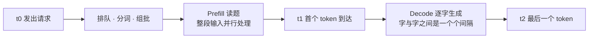

# 3.1 会看表：TTFT、TPOT 与吞吐

## 开篇问题

朋友半夜甩来一条消息："有人用 4500 块钱的两张二手卡，跑出 5 万块专业卡的速度——单并发 100 tok/s！你这台机器怎么才 30？"你盯着自己的监控数字，三个问题依次冒出来：这个 100 是给谁的 100——一个人独享，还是二十个人分？从第一个字到最后一个字，每一秒都有 100 吗？明天开机再测一遍，还是这个数吗？

答不上来，不代表你不懂大模型，只代表你还不会"看表"。性能数字跟体检报告一样，每一项都有采样口径；拿错口径对比两台机器，比拿体温对比身高还不讲理。这一章把三个最常用的表项——TTFT、TPOT、吞吐——从"看过"升级为"会测"：每个都给出正式定义、客户端就能用的测法，以及一套"这个数字该不该信"的检查流程。章末你会产出自己的第一张个人指标表。开篇这三个问号就是路线图：第一问交给"吞吐与单路速度"一节，第二问交给 TTFT 与 TPOT 两节，第三问交给"最高速度≠稳定复现"一节——最后在贯穿案例里统一销账。

## 正文

### 先把三个指标放到同一条时间轴上

一次流式请求，从按下回车到正文收尾，在客户端眼里是一条时间轴：



t0 到 t1 的等待，是 1.2 给过名字的首 token 等待（Time To First Token，TTFT）；t1 之后字与字之间的平均耗时，是本章要正式化的第二个指标——单 token 生成时间（Time Per Output Token，TPOT）；把视角从"你的这一路"抬高到"整台服务器"，单位时间内所有请求产出的 token 总数，是第三个指标吞吐量（throughput）。三个数字的单位里都带"每秒"，回答的却是三个不同的问题：等多久开口、说得跟不跟手、这台机器能接待多少人。

这三个数不用钻进服务端日志：任何发请求的人都能在客户端测到，量的全程是 prefill 与 decode 两段的算力与带宽时间。1.2 你用秒表观测过这些现象，本章把秒表换成正式口径。

### TTFT：给"等第一个字"立正式口径

正式定义分三句。第一句，计时起点是客户端发出请求的时刻，不是服务端收到请求的时刻——中间隔着网络与排队，用户等的就是这一整段。第二句，计时终点是收到第一个"带字"的流式块：有的服务会先推一个只带角色、不带内容的空块，要以第一个出现文本的块为准。第三句，它是端到端口径——排队、分词、prefill 读题、首 token 生成与传输全在里面，不能拿它直接当 prefill 内核的耗时。

这段等待的大头是谁？输入越长，越是谁。prefill 要把你整段输入并行读一遍，速度通常比逐字生成的 decode 快几倍到几十倍（具体倍数取决于模型结构与精度；输入很短时反而是装载、排队这类固定开销可见，瓶颈定位的工具在 3.4）。于是有了从 1.2 沿用下来的估算式：

```
TTFT 估算 ≈ 输入 token 数 ÷ prefill 吞吐速度（另加少量固定开销）
```

它仍是估算口径：没计排队与传输，而 prefill 速度要等你测出来才知道。

**已解示例**：某台双 2080Ti（NVLink 卡间直连桥）机器，千问 3.6 27B（口播转写型号，以模型卡为准）的 prefill 实测 1700 tok/s（来源：BV1Y2LX61EjQ）。贴一篇 4096 token 的文档，首字等待约 4096 ÷ 1700 ≈ 2.4 秒——这是估算值，实测会略高。

**小练习（3 分钟）**：你的机器 prefill 600 tok/s，输入 2048 token，首字等待估算多少？输入砍到 256 token 呢？由此说说"文档问答"和"闲聊"两种场景，等首字的烦恼谁更大。

*指标回看 · TTFT：1.2 里它是秒表上的一个数，本章起它有了正式定义与客户端测法——从"观测"升级为"定义与手测"。*

### TPOT：字与字之间的心跳

首字落地之后，体验交给第二段。TPOT 用一次请求就能算出：

```
TPOT =（最后一个 token 时刻 − 首个 token 时刻）÷（输出 token 数 − 1）
```

分母减 1，是因为第一个 token 的等待已经记在 TTFT 头上，不该在 TPOT 里再收一次费。单位取毫秒每 token（ms/token），它的倒数乘 1000 就是你自己的单路速度：TPOT 22 毫秒，等价于约 45 tok/s。TTFT 决定"什么时候开口"，TPOT 决定"说起来跟不跟手"——网页打字机效果流不流畅、代码补全等不等得起人，看的都是它。

"平均"两个字有分量。字与字之间的间隔（逐 token 间隔，inter-token latency，ITL）并不均匀：大多数时候很稳，偶尔插进一个明显长的间隔。平均会把这些尖峰摊平——一次 200 毫秒的卡顿摊到 500 个 token 上，TPOT 只涨 0.4 毫秒，数字几乎不动，体感却是"嗯"了一声。所以 TPOT 适合描述节奏，不适合回答"有没有卡顿"；要回答后者，得留原始间隔序列，或至少记下最长的那次。平均会撒的小谎，本章后面还有一处，先按下不表。

**已解示例**：服务端计时字段显示本次输出 256 个 token、生成段耗时 5800 毫秒。TPOT = 5800 ÷ 255 ≈ 22.7 ms/token，单路速度约 1000 ÷ 22.7 ≈ 44 tok/s。注意分子只算"生成"这一段，不含读题——若字段给的是整次请求耗时，要先减去 prefill 那部分。

**小练习（5 分钟）**：另一次请求输出 512 token、生成段耗时 18 秒。TPOT 与单路速度各是多少？若这次 TTFT 是 1.6 秒，请求从发出到收尾总共约多少秒？

*指标回看 · TPOT：从 1.2 的"逐字节奏"体感，升级为一条可复现的毫秒口径——它的倒数就是你自己的单路 decode 速度。*

### 吞吐与单路速度：同一单位，两种答案

把推理服务想成食堂窗口：吞吐量是窗口一小时总共打出去多少份饭，二十个人排队时总数相当可观；单路速度是你一个人坐在桌上每秒吃进几口。两个数字的单位都叫"份/秒"，含义天差地别。类比到此为止，回到机制：吞吐是服务端把所有在处理请求每秒产出的 token 加总；单路速度（单并发，batch=1）是整台机器只服务你一个请求时，你每秒收到的 token 数。并发越多，单个请求分到的越少、总量越高，于是有一个粗略换算：吞吐 ≈ 单路速度 × 并发数——它是粗略的，何时失真是下一章的正题。

这个换算解释了跑分表的一个习惯：报吞吐的数字总是漂亮，因为吞吐随并发上涨。反过来读也成立——看到"跑到 3000 tok/s"却不报并发数，多半是吞吐口径；二十个用户摊下来，每人手里只剩 150。个人用户要认的恰是最小的那个数：你是唯一用户，没有排队、没有摊薄，batch=1 的单路速度才是"我用起来有多快"的真实答案，也是本地部署里最容易被跑分表藏起来的一项。

**已解示例**：开篇那条消息里，"单并发 100 tok/s"六个字其实把口径说全了一半——它是单路 decode 速度，没有并发摊薄，所以才有资格跟另一张卡的单路速度对表（来源：BV1nVVr6QEFq）。反过来，如果它报"3000 tok/s"而不提并发，反而没资格比。

**小练习（8 分钟）**：你的机器单路 45 tok/s，用粗略换算估算 8 路并发时的总吞吐。再写一句话回答：这个估算在什么情况下会明显失真？（提示：8 路请求抢的是同一份带宽和同一块显存，谁先顶到天花板？）

*指标回看 · 吞吐：本章区分"吞吐与单路"两种口径，并立下读数三前提——数字没变，变的是你敢不敢直接信它。*

### PP/TG：跑分表两列，各说各的话

打开 llama.cpp 系的跑分输出，速度通常排成两列：PP（prompt processing）是 prefill 的吞吐速度，TG（text generation）是 decode 的输出速度（通常取 batch=1 口径）。PP 与你贴进去的文档长短作对，TG 与你读答案的耐心作对，两列差几倍到十几倍是常态。它们恰好各管一个你已认识的指标：TTFT 的主项由 PP 决定，TPOT 的倒数就是 TG。

两列还可以各走各路。同一张表里，MI50 16G 单卡跑 35B 级模型（具体型号字幕转写存疑，以原表为准）PP 600 多，换成两张 16G 各分一半层后涨到 1000 多，TG 却两边几乎不动（来源：BV1YxjU6qEuw）——为什么双卡能加速读题却加速不了吐字，4.1 用流水线时序拆解；现在只需记住：只看一个笼统的"快了多少"，这组实验读不出任何结论。顺带排一个雷：这里的 PP 与 4.1 要讲的流水线并行（pipeline parallel）缩写撞车，语境不同含义不同。

▶ 动画：拖动输入长度滑块，看读题与吐字两段时间轴怎么此消彼长——TTFT 与 TPOT 各占哪一段，一目了然。

<div class="demo" data-demo="prefill-decode"></div>

### 最高速度 ≠ 稳定复现速度

最后一个提醒不在表格里，在汇报数字的人嘴上。同一项目（双 2080Ti 22G、NVLink 直连，千问 3.6 27B）公布的基准是：prefill 1700 tok/s，decode 不开 MTP 为 50、开 MTP 为 100——报完数字，作者立刻补了一句："这是最高速度，不一定是可以稳定复现的速度。"（来源：BV1Y2LX61EjQ；该项目未说明量化档位与测试的输入输出长度、并发数，原资料未说明。MTP 即多 token 预测，一种投机解码，3.5 展开。）

基准工具报出来的常常是多次采样里最好的一次。让同一条命令读数上下浮动的因素至少有五个：后台进程抢 CPU 与磁盘；GPU 温度升高后的降频；缓存是冷是热——首次请求常背着权重装载与内核编译；引擎组批与调度的时机；输入内容本身（生成长代码与生成短句，每步开销不同）。所以看任何速度数字先过三问：哪个口径（prefill 还是 decode、PP 还是 TG）、几路并发、峰值还是均值。自己汇报成绩时把这三条写全，数字才有公信力。

那"该不该信"怎么操作？把单次读数换成一组读数。多次平均能把随机波动压到约 1/√n——10 次平均大约把抖动缩到单次的三分之一；中位数对离群值更不敏感。把结果报成"中位数是多少、极差是多少"——一个中心值，外带一条它可能波动的带——这就是置信区间的直觉版。但有两类问题平均治不了：混进口径的系统性错误（测进了 prefill、并发没控住），以及持续的温度墙——它们不会随机抵消，只会被平均悄悄藏起来，得靠对照实验揪出来，那是 3.4 的方法论。下面先用一个完整的整理算例，把"一组读数"变成一个可辩护的结论。

## 完整算例

**任务**：把 10 次单路速度测量整理成一个可信的数字。下面的示例数据是构造值，用于演示方法；口径与步骤请原样套到你自己实验的实测数据上（末尾有现成的空表）。

**已知条件（口径全列）**：模型 27B 级、4bit 档（Q4_K_M 文件口径约 16.5G；"每参数 0.5 字节"的纸面账是 13.5G——2.2 交代过的两条口径，下面数量级检查两条都算）；单卡，标称带宽 1TB/s；llama.cpp 系引擎；固定输入约 512 token、要求输出约 256 token；单并发 batch=1；客户端流式计时；已空跑 2 次热身。10 次测得单路速度（tok/s）：

```
45.2  44.6  45.8  44.9  45.4  33.5  45.1  45.6  44.8  45.3
```

**公式**：均值 = 各次之和 ÷ 次数；极差 = 最大值 − 最小值；标准差衡量散布（散布越大，均值越不稳）；TPOT = 1000 ÷ 速度。

**逐项代入**：

- 全体均值：(45.2 + 44.6 + … + 45.3) ÷ 10 = 440.2 ÷ 10 ≈ 44.0 tok/s；
- 极差：45.8 − 33.5 = 12.3 tok/s，约为均值的 28%——10 次里 9 次挤在 44.6~45.8，唯独一次掉到 33.5；
- 中位数：排序后取中间两数平均 ≈ 45.15，几乎没被那个 33.5 拖动；
- 剔除 33.5 后重算：均值 45.2，极差收窄到 1.2（约 2.6%），标准差从 ±3.7 降到 ±0.4；
- 换算成节奏：45.2 tok/s 对应 TPOT ≈ 22.1 ms/token，掉队那次对应 29.9 ms/token。

**数量级检查（两条口径都过一遍）**：用文件口径，decode 上限 = 1000 ÷ 16.5 ≈ 61 tok/s，实测 45 ÷ 61 ≈ 0.74；用纸面口径，上限 = 1000 ÷ 13.5 ≈ 74 tok/s，45 ÷ 74 ≈ 0.61。两条都落在 2.2 实验讲过的 0.6~0.8 常见区间——不管你的文件体积落在哪条口径上，数量级都自洽，说明主体数据没有口径错误。自己检查时，分母用你文件的实际大小（下载页标注），别背这两个数。

**判断：该不该信**。可信的部分：9 次测量挤在 3% 窄带里，"这台机器单路约 45 tok/s"这句话可以签字。存疑的部分：33.5 那次先查原因——那半分钟里是否开着浏览器直播、编译任务，或 GPU 已爬到温度墙；能解释就按剔除规则剔除，并在表格里注明"剔除 1 次，原因××"；解释不了就保留，同时报告均值与极差，让读者自己判断。只报一个孤零零的"45"，不如报"中位数 45.15、剔除一次异常后极差 1.2"经得起追问。

**误差来源**：客户端计时含传输与渲染，天然略高于服务端口径；每次输出的 token 数有出入，整理时要连输出长度一起记录；n=10 仍偏少，均值自身还有波动，结论宜写"约 45"而非"45.2"。

**你自己的数字往哪代（抄这张空表，填自己的 10 次；第一行是示例）**：

| 次 | 单路速度 tok/s | 输出块数 | 测前 GPU 温度 | 备注（后台任务/异常） |
|---|---|---|---|---|
| 1 | 45.2 | 256 | 71℃ | 无 |
| 2~10 | | | | |
| 均值 / 中位数 | | — | — | |
| 极差 = 最大 − 最小 | | — | — | |
| 剔除离群后均值 / 极差 | | — | — | 剔除必须注明原因 |

这张表填完，加上口径表头（模型、档位、硬件、输入/输出长度、并发），就是本章实验要交付的个人指标表 v1 的毛坯。

## 贯穿案例的最终分析

把开篇那条消息放回桌面，用三问拆完——开篇的三个问号，在这里逐一销账。事实部分先摆全：两张二手 2080Ti 加 NVLink 桥加一台约 500 元主机，整套约 4500 元，跑千问 27B 稠密模型；现场边生成网页 FPS 游戏边按新需求加"钓鱼模式"，读速口播 90 多、接近 100 tok/s；量化档位与输入输出长度原资料未说明（来源：BV1nVVr6QEFq）。

1. **哪个口径**：单并发 decode 速度。同项目的基准视频给出不开 MTP 50、开 MTP 100 的 baseline（来源：BV1Y2LX61EjQ）——按这条 baseline 推断，现场的"接近 100"多半是开着 MTP 的成绩，不开它单路吐字在 50 上下。注意这是两条视频拼出来的推断，不是现场声明；但"100 与 50 都是那台机器的真话，只说其一就是误导"这个教训不受影响：报数字必须连前提一起报。
2. **几路并发**：batch=1，整台机器服务一个人。这正是它敢跟单卡对表的原因：对比对象 RTX PRO 6000（约 5 万元）"可能也就是这个速度"，两边比的都是单路速度，口径对齐，比较才成立。但仍要留意——这是经验横向对比，不是同时同题实测；单路数字也回答不了"这台 4500 元的机器能同时接待几个人"。
3. **峰值还是均值**：现场读速属于演示场景下的读数，输出还是长代码——这类负载每步开销与闲聊不同。同项目作者在自己的基准里主动声明"最高速度不一定可以稳定复现"，把这份克制移植过来：那个 100 应当读作"峰值量级 100"，而不是"每次都有 100"。

拆完的结论不是"数字有假"，而是：这是一个口径不完整的好数字。三问补齐之前它只是谈资，补齐之后才是数据。你现在有了补齐的本事——给自己测一份同口径数字，这张表比任何跑分截图都值钱。

## 理解检查

1. **计算**：一次请求输入 2048 token，TTFT 实测 1.8 秒；输出 512 token，总时长 26.8 秒。求 TPOT 与单路速度，并说明每个结果的口径。
2. **条件变化**：同一请求把输出长度从 512 加到 2048。TTFT、TPOT、总时长各自怎么变？若把输入也加倍，哪个指标跟着动？
3. **排障**：你的 10 次测量里有 3 次明显偏低。给出排查清单（至少三项）与每项的验证方法，并写出"剔除还是保留"的决策规则。
4. **选型**：机器 A 跑分 PP 3000 / TG 30，机器 B 是 PP 800 / TG 60。你要贴 8192 token 的文档并生成 2048 token 的报告：用"输入 ÷ PP"与"输出 × TPOT"各算一笔账，判断谁先开口、谁先交卷；再把场景换成"反复塞 32K 输入、每次只要 128 token"，重判一次。

## 动手实验

**环境**：沿用 2.5 实验的"够用档"模型与引擎（llama.cpp 系最顺手，服务自带计时字段；vLLM 或 Ollama 亦可，字段名以所用版本官方文档为准）；独显可选；准备一段 500~800 token 的固定文本存为 prompt.txt；python3（仅标准库）。

**步骤与命令**：

第一步，把下面脚本存为 bench3.py，一次请求同时取 TTFT、TPOT 与单路速度：

```python
# bench3.py —— 客户端计时：TTFT / TPOT / 单路速度（OpenAI 兼容流式接口）
import json, time, pathlib, urllib.request

prompt = pathlib.Path("prompt.txt").read_text(encoding="utf-8")
body = json.dumps({
    "model": "local", "stream": True,
    "messages": [{"role": "user",
                  "content": prompt + "\n\n请用约 200 字总结上文"}],
}).encode()

t0 = time.perf_counter()
first, n = None, 0
req = urllib.request.Request("http://127.0.0.1:8080/v1/chat/completions",
                             body, {"Content-Type": "application/json"})
with urllib.request.urlopen(req) as resp:
    for raw in resp:
        line = raw.decode().strip()
        if not line.startswith("data:"):
            continue
        if line[5:].strip() == "[DONE]":
            break
        if json.loads(line[5:])["choices"][0]["delta"].get("content"):
            first = first or time.perf_counter()
            n += 1
t2 = time.perf_counter()
if first is None:
    raise SystemExit("未收到任何内容块——先查 stream 参数与返回结构（对应失败排查第 3 条）")
tpot = (t2 - first) / max(n - 1, 1)
print(f"TTFT={(first-t0)*1000:.0f}ms TPOT={tpot*1000:.1f}ms "
      f"输出块数={n} 单路≈{n/(t2-first):.1f}tok/s")
```

注一：Ollama 用户端口改 11434、模型名填 `ollama list` 显示的名字。注二：脚本计的是"内容块数"，TPOT 与单路速度因此按块计——多数引擎流式时一个块就是一个 token，但这只是经验假设，第四步取服务端 timings 时顺手核对 predicted_n（生成 token 数）与块数，对不上以服务端计数为准，并把差值记进表里。

第二步，先空跑两次热身（首次请求背着权重装载与内核编译），再连测 10 次：

```bash
for i in $(seq 1 12); do python3 bench3.py; done | tee run.log   # 前两次是热身
```

第三步，从服务端响应取同口径的 PP 与 TG（llama.cpp 的 timings 字段：PP = prompt_n ÷ prompt_ms × 1000，TG = predicted_n ÷ predicted_ms × 1000）。第四步用官方基准工具互验，输入输出长度对齐到与手测同量级：

```bash
llama-bench -m 你的模型.gguf -p 512 -n 256 -r 10
```

**应记录的项**：10 次 TTFT、TPOT、输出块数；服务端 PP/TG，以及 predicted_n 与输出块数是否一致；llama-bench 的 pp/tg 列及其 ± 误差；每次测前的 GPU 温度（`nvidia-smi --query-gpu=temperature.gpu --format=csv,noheader`）与有无后台任务；热身两次与正式测量的差异。

**预期现象**：TTFT 随输入长度增长，且远小于输出段总时长（本例输入约 512 token）；TPOT 聚在窄带、偶发离群；服务端 TG 的倒数与客户端 TPOT 接近但不相等（客户端计时多出传输与渲染）；llama-bench 的 tg 与你的单路速度同数量级，口径对齐时相差通常在一两成内（经验值：差得远先查口径——长度、档位、KV 设置——再怀疑机器）。

**失败排查**：`connection refused` → 端口或服务未起（先 `curl http://127.0.0.1:8080/health` 验活，路径以版本为准）；首块迟迟不来 → 多半在装载权重，先热身再计时；脚本报"未收到任何内容块"退出 → 检查流式返回结构，或服务端忽略了 stream 参数（有的模型把内容放在别的字段，逐块打印一次排查）；手测与 llama-bench 差数倍 → 口径没对齐（-p/-n 长度不同、量化档或键值缓存设置不同、温度降频），对齐后再比。

**产出（个人指标表 v1）**：一张表，每行一组完整口径（模型、档位、硬件、输入/输出长度、并发），列包括 TTFT 中位数与极差、TPOT 中位数、单路速度、服务端 PP/TG、llama-bench pp/tg、备注（波动与剔除记录）。表头写上三前提。它是你在 2.5 粗测数字的"转正"版本，也是下一章并发压测的基线。

## 本章能力清单

对照本章学习目标：

- ✅ **计算**一次请求的 TTFT 与 TPOT，说出每个数字的口径与误差来源（TTFT/TPOT 两节 + 完整算例）；
- ✅ **比较**吞吐与单路速度两种口径，对任何速度数字过三问：口径、并发、峰值还是均值（吞吐一节 + 贯穿案例）；
- ✅ **解释**为什么单并发 batch=1 是个人用户的真实指标，以及"3000 tok/s"式宣传该怎么读（吞吐一节 + 理解检查 4）；
- ✅ **诊断**一组 10 次测量该不该信：均值、中位数、极差、离群值与系统性偏差的处理（完整算例 + 理解检查 3）。

## 与下一章的衔接

你这张表是"一个人吃满整台机器"的口径。真实服务不会只来一个人：第二个人发请求时，你的 TPOT 会不会翻倍？总吞吐能不能翻倍？显存里多出来的东西是谁？"吞吐 ≈ 单路 × 并发"的粗略换算在哪里失效？下一章（3.2 并发与批处理）把"人多了"这件事拆开——你会看到 GPU 用批处理复用权重读取，也可能第一次见到显存被并发吃穿的报错。带上个人指标表 v1，下一章所有"掉了多少"的百分比，都除以这张表里的数。

## 资料来源与延伸观看

- 贯穿案例（双 2080Ti + NVLink + 约 4500 元主机跑千问 27B 稠密，单并发现场读数 90 多~接近 100 tok/s）：BV1nVVr6QEFq。
- 波动与基准纪律（双 2080Ti 22G 基准：prefill 1700、decode 不开/开 MTP 为 50/100，"最高速度不一定可以稳定复现"）：BV1Y2LX61EjQ；MI50 与 PP/TG 两列各走各路的对照（所用 35B 级模型的型号字幕转写存疑）：BV1YxjU6qEuw。
- 工具与字段：llama.cpp 的 llama-bench 与 llama-server timings 字段（github.com/ggml-org/llama.cpp）；vLLM 的 usage 字段；Ollama 的 OpenAI 兼容接口（ollama.com/docs）。参数与字段名以所用版本官方文档为准。
- 口径声明：权重体积 13.5G（纸面）与 16.5G（GGUF Q4_K_M 文件）双口径、"实测 ÷ 理论上限"的 0.6~0.8 折扣区间均出自 2.2；多次平均压 1/√n 与中位数抗离群为统计学通识方法，非视频内容。
- 原资料未说明之处（贯穿案例的量化档位、输入输出长度与并发数；基准的测试负载细节）本章未作推断，相关数字均已标注并按三问降权处理。
