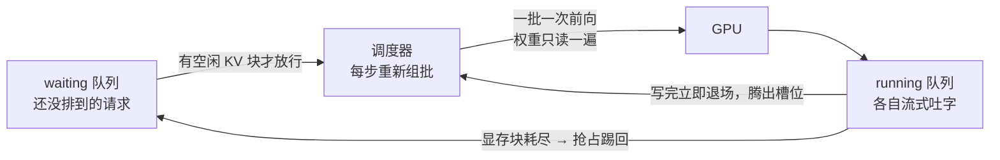

# 3.2 并发与批处理：GPU 为什么不怕人多

## 开篇问题

3.1 你用脚本给自己部署的服务建了第一张指标表。周一早上你把地址发进群里，九个同事同时点了发送。十个人抢一张卡，每人慢到十分之一，这不是常识吗。可一下午过去反馈是"还行"；再跑 3.1 的脚本，单路出字只掉了一点，全组拿到答案的总速度反而比独占时高了好几倍。

卡没换，权重没换，变的只是同时来的人——这张卡在偷用什么空隙？本章回答这个核心问题：**10 个人同时用，为什么不是慢 10 倍？** 答案由三个机制叠加：权重复读的浪费给了"拼车"可乘之机，连续批处理消灭陪跑，分页管理让 KV 显存不空转。读完你能交出三件事：一道除法算出并发上限；对并发翻倍后的速度先写预测、再亲手测出总吞吐与单路速度各怎么动；高峰期变慢时说出先查哪一环。

## 正文

### 整体图景：十个请求挤进同一张卡的路径

先把十个请求的完整路径摆出来。1.2 拆过七步旅程；人一多，变化全部发生在"排队调度"那一格——它从一个过场变成主角：



输入是成批到达的请求，输出是各自独立的流式响应。槽位（slot，服务预留的同时服务名额）就是图里 running 队列的座位数。调用这张卡的是调度器（scheduler）——决定"谁先上、几路一起上"的引擎部件；其开销本章先按"可忽略"处理，3.3 给它算细账。它消耗两份资源：算力一份（一批共用一次权重读取），显存 N 份（每路一本 KV，账在第四节）。它直接影响并发、总吞吐、每路 TPOT，还通过 KV 推高显存。下面按"拼车 → 陪跑 → 省显存 → 三方牵制"的因果链走。

### 拼车的原理：权重每一步都要复读一遍

先回忆 decode 的账。模型逐字生成，每吐一个 token，参与计算的权重都要从显存完整读一遍——2.2 算过，1TB/s 带宽喂 13.5G 权重的理论吐字上限是 74 tok/s，上限由"搬权重"决定，不是由"算"决定。这套机制里藏着大空隙：一趟车烧的油几乎固定（读一遍权重的时间），坐一个乘客和坐满一车人油钱差不多。既然每步反正要把权重读一遍，为什么不让多路请求共用这一次读取？

这就是**批处理（batching）**：把多个请求的 token 排成矩阵，一次前向（forward）一起算。班车类比只建直觉，真实机制在矩阵形状上：batch=1 时每层做的是"向量乘矩阵"，batch=8 时是"矩阵乘矩阵"——权重仍然只从显存读一次，输出算八份。多花的算力远小于省下的搬运时间，所以 decode 阶段加并发，总吞吐近似上涨，单路速度只轻微下降。

"近似"两个字要保住。decode 的耗时不止搬权重：上下文越长，每步要翻读的 KV 越多；内核发射与调度开销在 batch 变大后逐渐压不住（3.3 的主题）；batch 再往上加，算力也会接棒成为新瓶颈（3.4 用 roofline 定位）。所以并发翻八倍，吞吐到不了八倍——本章实验让你先预测、再亲手测出自己那张卡，别背任何人的倍数。

*指标回看 · 并发：从"群里几个人在用"的体感计数，升级为有定义的服务指标——同一时刻正在被服务的请求数；单并发（batch=1）就是 3.1 那张表的个人口径。*

### 三个词对齐口径：并发、批、微批

搜文档和日志之前，先把三个常被混用的词分开：

- **并发（concurrency）**：同一时刻正在被服务的请求数；
- **批（batch）**：一次前向里并排计算的 token 集合——可由不同请求拼成，也可是一条长 prompt 切出来的段；
- **微批（micro-batch，llama.cpp 叫 ubatch，参数 `-ub`/`n_ubatch`）**：逻辑批再切小的物理计算单元。长 prompt 不是一口气灌进模型，而是按这个粒度分块过层。

第三条解释了一个后面要用的现象：批也是 prefill 的切块单位——8K 的 prompt 在引擎眼里是四个 2K 的块排队过层，多路请求的块在同一列队里轮转（本节末尾的三方关系）。至于排队组批：分词与组批是 CPU 的活，低并发下合计几十 ms 甚至更低，对整段请求几乎无感（来源：BV1qU846JEpW，机制留到 3.3）。

### 每路并发，一本自己的 KV 账

批处理省的是算力和搬权重的时间，**不省 KV 显存**：注意力各看各的历史（1.3），每路请求必须各有一份独立的 KV 空间。回到 2.1 的三本账——权重是全机一份的死账，KV 却要乘上并发数，8 路并发就是 8 倍 KV（共享前缀能省一笔，第五节讲）。一句话：算力侧白赚，显存侧真金白银。

这笔账有真实翻车现场。

1. **单并发被锁死**：双 2080Ti 合计 44 GiB，跑千问 27B 级稠密模型（型号为案例视频口播转写，以项目所用模型卡为准），AWQ INT4 权重实测 20 多 G、满血 256K 上下文、FP16 KV——2.1 算出单路 KV 约 16 GiB，并发被锁死在 1：开 2 路就是 32 GiB，总账 52 GiB 超出 44 GiB，直接显存溢出（OOM）。那套方案的标签只能写"单并发吃满上下文"；想多并发，先砍上下文、压 KV 精度或加卡（来源：BV1UMEv68E3C）。
2. **权重挤占并发**：有人把 Q6 甚至 Q8 高精度权重塞进 24G 单卡，随后发现"根本没有空间给到上下文，也没有空间给到并发"——权重多吃的每一 G，都从 KV 与并发的额度里扣（来源：BV1i6Y86AEv3）。

2.1 说的"三个旋钮此消彼长"，这里是它的代价。

**已解示例**：你的 8G 卡跑 8B Q4 模型，权重约 5 GB（1.1 的口径；按 2.1 规矩换算 5 GB ≈ 4.7 GiB），单 token 值 128 KiB（1.3 的教学口径），预计每路平均上下文 4K。单路 KV = 128 KiB × 4096 = 0.5 GiB。8 − 4.7 ≈ 3.3 GiB 可分；给计算缓冲留 1 GiB，KV 预算约 2.3 GiB，理论上限 4 路——留出长对话余量，实际取 2~3 路。并发上限不是拍出来的，是这道除法算出来的。

**小练习（5 分钟）**：某服务显存里还剩 6 GiB 给 KV，单 token 值 128 KiB，每路平均上下文 8K。最多开几路？如果你想把并发提到 10 路，上下文上限得压到多少？

### 静态批次与连续批处理：谁在陪跑

并发开起来之后，第二个问题浮出来：批次什么时候散、什么时候补人？两种做法的差距能决定引擎的档次：

| | 静态批次（static batching） | 连续批处理（continuous batching） |
|---|---|---|
| 组批时机 | 开跑前凑满一批 | 每步 decode 后重新组批 |
| 已写完的请求 | 陪最慢的跑完才散批 | 立即退场，释放槽位 |
| 新来的请求 | 排队等下一批 | 下一步就插入 |

静态批次的浪费叫"陪跑"：短请求十个字就写完了，槽位却要占着陪最长的跑完全程，权重照样每步为它空读。连续批处理让调度器每步 decode 后重新挑人组队，写完即走、随到随插。这是服务级引擎（vLLM、SGLang 一派）总吞吐碾压朴素 server 的主要原因之一，也是 1.1 "两流派分野"在并发维度的落点——单并发时看不出差别，一上多人它就是分水岭。

▶ 动画：看多条请求拼进批次、做完即补位。

<div class="demo" data-demo="batching"></div>

### PagedAttention：跟操作系统学管显存

批次调度到位后，还有第三类浪费藏在 KV 的分配方式里。KV 随序列长度线性增长（1.3 的公式），而引擎必须在请求一进来就决定留多大空间——朴素做法是按上限预留一整块连续显存，上下文开多大预留多大。可多数回复只生成几百到几千 token，实际用上的不到一成，剩下的显存空着，别的请求还插不进来。这叫**内部碎片（internal fragmentation）**。vLLM 论文实测过：这类做法的 KV 有效利用率只剩两到四成，同卡并发容量跟着只剩两到四成。

操作系统几十年前就解过同一道题：进程眼里地址连续，物理内存按页散落，靠页表翻译——图书馆座位是物理页，借书条是页表。PagedAttention（分页注意力）把这套思路搬到 KV 上——

- **逻辑块（logical block）**：每个序列的 KV 在逻辑上仍是一串连续的块；
- **物理块（physical block）**：真实显存切成固定大小的块（vLLM 默认 16 个 token 一块，可配 8/16/32，以官方文档为准），哪里有空放哪里；
- **块表（block table）**：记录逻辑块号到物理块号的映射，注意力计算按表寻址。

▶ 动画：看 KV 块按页分配、多请求共享显存页。

<div class="demo" data-demo="paged-attention"></div>

收益三条：

1. 碎片上限从"整段预留"缩到"最多一个块"（论文口径：浪费 4% 以内）；
2. KV 按需生长，要多少给多少；
3. 省下的显存装进更多路并发——单请求速度没变，总吞吐成倍上去。

还有一条附赠：多请求共享同一段前缀时，逻辑块可以直接指向同一批物理块——这是前缀缓存（prefix caching）的地基，也是 1.3 实验"同前缀第二次请求首字变快"的正身。

配套纪律：引擎里排队（waiting）与运行（running）两个队列，有空闲物理块才放行进 running；块耗尽时宁可**抢占（preemption）**——把请求踢回 waiting、重算或换出它的 KV，也不让显存爆掉。高峰期"忽然全员变慢再慢慢恢复"，多半就是抢占在起作用。

**已解示例**：同一个请求，上下文上限 32K，单 token 值 128 KiB（教学口径）。整块预留要 4 GiB，而它平均实际只写到 2K——利用率 6%，3.7 GiB 纯空转。分页之后，浪费的上限是最后一个没用满的块：16 × 128 KiB = 2 MiB。前一种分配下十路"占着 4 GiB"就把 40 GiB 摊满，后一种能容纳的真实负载要多得多——并发容量的差距不在硬件，在分配策略。

**小练习（3 分钟）**：上下文上限 8K、块大小 16。最后一个块最多浪费多少 KiB？占整段预留的百分之几？把这两个数和"整块预留 100% 占用"放在一起，你就明白论文里那个 4% 是怎么来的。

### 三方关系：并发、单路速度、总吞吐

三个机制都在手上，把 3.1 的三指标放到并发维度上：

| 指标 | 并发上升时 | 为什么 |
|---|---|---|
| TPOT（单路） | 变长，但远小于线性 | 每步 decode 的工作量变大，权重搬运却被分摊 |
| 总吞吐 | 近似上涨，斜率递减 | 权重复用是白赚，调度与 KV 读取的代价随并发累积 |
| TTFT（新请求） | 变长 | 要等槽位与 KV 块，prefill 块还在队列里轮转 |

两个格子容易记错。一是 prefill：批也是 prefill 的切块单位，多路请求的 prefill 块在同一列队里轮转，谁也白赚不了——prefill 在大 batch 下更接近算力受限（卡在算不过来，与 2.2"搬不动"的账相对；两区定位是 3.4 的事），与 decode 的访存受限不同，所以并发主要买吞吐，不买首字速度。二是单路：decode 阶段并发翻倍，总吞吐近似翻倍、每路分到的速度相应下降——这笔账分两栏记，混起来就会得出"并发亏了"或"并发免费"两种错结论。

*指标回看 · 吞吐：从 3.1 的"单并发产出"升级为服务口径——所有在跑请求的加总；它随并发上涨的斜率，就是你这张卡"不怕人"的程度。*

*指标回看 · TPOT：从"我自己等字的速度"升级为"负载的函数"——它随并发上行，上行得多缓，决定多少人能同时舒服地用。*

这套关系还能接回选型。"多并发 + 长上下文可以弥补单卡性能差距"是有成立条件的观点：前提是显存装得下 KV×N、且单路质量可接受——否则就是"速度再快，它后面还是一辆小车"：快卡被显存逼着跑低精度小模型，并发无从谈起（来源：BV1i6Y86AEv3）。

批还能给多卡提速：双卡流水线让两个 prefill 块重叠跑，2080Ti 上 27B 模型的 prefill 从 580 涨到 800 多（UP 口径提升五成，单位与测法原资料未说明），decode 不劣化——那笔账在 4.1 展开（来源：BV1YxjU6qEuw）。

最后落到旋钮上。llama.cpp 系：`llama-server -m 模型.gguf -np 4 -b 2048 -ub 512`——`-np` 是并发槽位数，`-b`/`-ub` 是逻辑批与微批；vLLM 系盯三个参数：`--max-num-seqs`（最多同时跑几路）、`--max-num-batched-tokens`（一步最多拼多少 token）、`--gpu-memory-utilization`（划给权重+KV+缓冲的显存比例）。参数名随版本变，以各自官方文档为准；对应关系是死的——并发上限、批粒度、显存预算，正是本章三本账。

## 完整算例

**口径交接**：2.1 立的规矩是"账以你查到的 config 为准"。本算例沿用 1.3 的教学口径（32 层全注意力、128 KiB/token），保持全书 8B 档案连续；代自己的模型时把层数与每 token 值换成 config 真实值，步骤不变——真实的 qwen3:8b 是 36 层、144 KiB/token（以官方 config.json 为准），同样的 8 路 32K 是 36 GiB。

**已知条件与单位**：模型：8B 级，按上述教学口径（KV 头数 8、head_dim 128、K/V 各一份、FP16 每数 2 字节），单 token KV = 128 KiB；上下文上限 32K = 32,768 token；并发 8 路；对比两种 KV 分配：按上限整块预留、分页按需；目标硬件：24 GiB 单卡。

**要回答的问题**：8 路并发的 KV 总账多大？24 GiB 卡放得下吗？分页能救多少？

**公式**：

```
单 token KV = 层数 × KV头数 × head_dim × 2 × 每数字节数
KV 总账 = 单 token KV × 上下文长度 × 并发数
```

**逐项代入**：

- 单 token：32 × 8 × 128 × 2 × 2 = 131,072 字节 = 128 KiB；
- 单路 32K：128 KiB × 32,768 = 2¹⁷ × 2¹⁵ = 2³² 字节 = 4 GiB；
- 8 路：4 GiB × 8 = 2³⁵ 字节 = **32 GiB**（≈ 34 十进制 GB）。

**数量级与单位检查**：另一条路：8 路 × 32,768 = 262,144 token ≈ 2.6×10⁵；128 KiB ≈ 1.3×10⁵ 字节；相乘 ≈ 3.4×10¹⁰ 字节，与 2³⁵ 字节同数量级，账自洽。单位口径沿用 2.1：账按二进制 GiB 算，括号给十进制 GB 对照。

**这笔账的两种读法**。按上限整块预留时，32 GiB 是"8 路全部写满 32K"的最坏情况——多数请求用不到一成，但引擎不知道谁会用满，只能按上限扣额度。论文对这类做法的平均口径：只有两到四成预留空间真被写入——乘到 32 GiB 池子上，约六到十二 GiB 装着有用数据，其余空转（本例 2K 是极端值，利用率 6%）。分页按需之后，池子还是那一整块（分页不制造显存），但按实际长度生长，同样显存容纳的真实并发数倍于整块预留。**分页救的是浪费，不是总量**：如果 8 路真的都写满 32K，32 GiB 一分不少。24 GiB 卡扣掉权重约 5 GB 与缓冲，放不下这本账——出路只有三个：砍上下文（压到 8K 后总账 8 GiB，放得下）、KV 量化（FP16→INT8 减半、INT4 再减半，质量代价 2.5 讲过，反面教材是 24G 硬跑 256K 只能把 KV 压到 Q4 级、"幻觉爆炸"）、或加卡堆显存。

**这是账面值，不是实测**。误差来源：各家 8B 模型的层数与 KV 头数差异很大（换成 144 KiB/token 口径，8 路账是 36 GiB）；块对齐向上取整会多算一点；共享前缀复用会再省一笔，比例取决于前缀重合度；引擎的预留与回收策略随版本不同。所以这类结论必须以你自己的压测收尾——下面实验就做这件事。

**你的数字往哪代（抄这张空表填自己的）**：

| 项目 | 查法/公式 | 你的值 | 单位 |
|---|---|---|---|
| 单 token KV | 层数 × KV头数 × head_dim × 2 × 字节数（config.json） | | KiB |
| 每路上下文上限 | 任务定 / 引擎参数 | | token |
| 并发数 | 业务定 / 槽参数 | | 路 |
| KV 总账 | 上三行相乘 | | GiB |
| 权重 + 缓冲 | 2.1 三本账 | | GiB |
| 判定 | 权重 + KV 总账 + 缓冲 ≤ 显存？ | | 是/否 |

## 贯穿案例的最终分析

回到开篇那十个人。把"开放给全组"这个决策完整走一遍：

1. **先量再改**：把 3.1 的单发脚本改成 N 路同时发，扫 1/2/4/8（本章实验）——别凭"十个人肯定卡"宣布结论，开头那个直觉已经在纸面上被拆穿。
2. **判断掉速掉在哪**：单路 TPOT 微涨、总吞吐大涨 → decode 主导，权重复用在起作用；若 TTFT 同步暴涨 → prefill 与排队吃紧，先查批粒度（`-ub`/`--max-num-batched-tokens`）而不是急着加卡。
3. **算显存上限**：并发上限不是引擎参数写多少就是多少，是"权重 + 单路 KV × 并发 + 缓冲 ≤ 显存"解出来的那个数。8 路并发、每路 32K 的 8B 模型要 32 GiB KV——24 GiB 卡在这一步被否决，跟引擎无关。
4. **选引擎**：朴素 server 输在陪跑与整块预留两处；连续批处理 + PagedAttention 是服务级引擎的两块基石——KV 有效利用率两到四成与接近全量，就是并发容量的数倍差距（论文口径）。
5. **校准结论**："GPU 不怕人多"的成立条件：负载以 decode 为主、显存装得下 KV×N、调度开销没上桌。缺一个，人多照样慢——而你已经能查出缺的是哪一个。

## 理解检查

1. **计算**：单 token 值 128 KiB 的模型，3 路并发、每路上限 16K，KV 总账多少 GiB？KV 压到 INT8 之后又是多少？
2. **条件变化**：并发从 4 提到 8，`nvidia-smi` 读数几乎没动。给出两种可能的解释（提示：请求实际写到的长度、前缀复用、池子按满配预留），并说明什么情况下显存才真的翻倍。
3. **排障**：低峰期单路 60 tok/s，高峰期新请求长时间排队、在跑的掉到 20 tok/s，偶尔全员卡一下再恢复。给出两条排查方向，各配一个可观察的验证点（提示：并发槽位、KV 池与抢占）。
4. **选型**：24 GiB 卡，8B Q4 权重约 5 GB（先把 5 GB 换算成 GiB，2.1 的规矩），留 4 GiB 缓冲，要求开 8 路。KV 按 FP16 算，每路平均上下文多大以内才放得下？若业务要求每路 16K，给出代价最小的两个改法。

## 动手实验

**环境**：沿用 3.1 的手测脚本与已部署模型（Ollama 或 llama-server 均可，参数以官方文档为准）；llama.cpp 用户可用自带 `llama-bench` 互验；`nvidia-smi` 可用。纯 CPU 环境规律相同，只是慢，显存改看内存占用。

**先躲开两个参数坑（否则数字会骗你）**：

- llama.cpp 系：多数版本把 `-c` 作为**全部槽位共享的总上下文**按 `-np` 均分——`-np 8 -c 32768` 每槽实际只有约 4K；想每槽 32K，总账给到 262144。以启动日志打印的 KV 缓冲与每槽上下文为准。
- Ollama：并发槽数由**服务端**环境变量控制（如 OLLAMA_NUM_PARALLEL，默认值随版本变，改后需重启）。没开够时第二路排队串行——它的 TTFT ≈ 前一路完整时长。

**步骤与命令**：

```bash
# 第 0 步：起服务（每槽上下文给足），记启动日志的 KV 池大小与 nvidia-smi 稳定读数 S0
# ——池子此刻已按满配预留，即 2.1 预分配现象的并发版。

# 第 1 步：发车前先写预测：估 8 路总吞吐（按"吞吐 ≈ 单路速度 × 并发"）、
#          8 路时的单路速度、压测期间的显存读数；测完逐项对答案。

# 第 2 步：1/2/4/8 路压测
llama-bench -m 模型.gguf -np 1,2,4,8        # 独立压测（不起服务、自带并发），与你的服务互验
for n in 1 2 4 8; do
  for i in $(seq $n); do bash bench_once.sh > "out_${n}_${i}.log" & done
  wait    # 等这一档全部结束再进下一档；档间歇几秒，确认上一档进程已退净
done

# 第 3 步：显存随并发的账用重启法测：同一配置内 nvidia-smi 走平是正常现象；
# 改 -np 依次取 1/2/4/8 各重启一次，记启动日志的 KV 缓冲大小与 S。
# vLLM 用户：读日志 # GPU blocks（乘块大小 16 = 池子 token 总数）与 Maximum concurrency，
# 改 --max-num-seqs 对照。
```

**应记录的指标**：每档并发下每路的 TTFT 与单路速度（tok/s）、总吞吐（总输出 token ÷ 墙钟时间）、各档 S 读数与启动日志 KV 缓冲、有无排队或报错；输入固定且够长（建议 2K 上下，太短看不出差异）。

**预期现象**：总吞吐随并发上升但斜率递减，8 路到不了 8 倍；单路速度下降但远不到 1/N；同一配置内 nvidia-smi 基本走平（池子已预留），重启改 `-np` 时 KV 缓冲随路数近似线性上涨（"KV×N"的实测形态）；超过 KV 池容量后新请求排队，或引擎抢占导致全员变慢。

**失败排查**：各档数字与单并发完全一样 → 请求没真正同时发（脚本串行或 CPU 核心不足），查 `wait` 与进程数；第二路 TTFT ≈ 第一路全程 → 串行实锤，查并发槽参数（Ollama 看服务端环境变量，llama.cpp 看 `-np` 与启动日志）；nvidia-smi 纹丝不动 → 先分清：池子预分配（正常，走第 3 步）还是请求被串行化（查槽参数）；某档后报 OOM 或全员骤慢 → KV 池耗尽、抢占开始，回算例核对 KV 预算；数字忽大忽小 → 回看 3.1 纪律：每档至少三次、报中位数。

**产出（并发行为笔记）**：一张 1/2/4/8 的三指标表，加四句话结论——总吞吐斜率、单路摊薄程度、显存代价（池子随 `-np` 的涨幅）、预测与实测的最大偏差在哪一格；最后一句写死："我这个服务的并发上限是 N，由＿＿本账决定。"以后谁问"再拉几个人行不行"，先翻这张表。

## 本章能力清单

对照五个学习目标：

- ✅ **解释**批处理复用权重的原理，说清 decode 加并发为什么总吞吐近似涨、单路只微降，以及"近似"什么时候失效（拼车原理一节 + 理解检查 1）；
- ✅ **计算**任意"上下文 × 并发"组合的 KV 总账，并判断目标显存是否可行（完整算例 + 理解检查 4）；
- ✅ **预测**并发翻倍后自己服务的三个指标，用压测数据核对并解释偏差（动手实验 + 三方关系一节）；
- ✅ **比较**静态批次与连续批处理，解释 PagedAttention 消灭的是哪一类浪费、省下的显存去了哪（两节 + 理解检查 2）；
- ✅ **诊断**高峰期"新请求排队、单路骤降"，区分是并发槽位、KV 池耗尽还是抢占（动手实验 + 理解检查 3）。

## 与下一章的衔接

本章把"多人"全部交给了调度器：每步重新组批、写完即补位、块耗尽就抢占——而调度器自己的开销，我们全程按"几十 ms、可忽略"带过。这个豁免该到期了：组批与内核发射的毫秒花在哪，为什么同样的卡换个引擎差一倍，CUDA Graph 拿什么换什么，CPU 何时从"可忽略"变成瓶颈——下一章（3.3 引擎在忙什么：调度、CUDA Graph 与内核）把引擎的盖子拧开；你测出的"总吞吐斜率为什么递减"，也会在那里找到去向。

## 资料来源与延伸观看

- 案例与方法来源：SPOTLITE（B 站 UP 主）：
  - 24G 单卡塞 Q6/Q8 后"没有空间给上下文与并发"、"多并发长上下文弥补单卡性能"的成立条件、"小车"比方：BV1i6Y86AEv3；
  - 双 2080Ti 44G 显存账与"2 路并发 KV 翻倍即 OOM"的推演：BV1UMEv68E3C；
  - 批作为 prefill 切块单位、双卡 prefill 重叠实测：BV1YxjU6qEuw——2080Ti 27B 组 580→800 多（UP 口径提升五成）；另一组 MI50 的"600 多→1000 多、提升六成"卡型号为口播转写存疑；两组单位与测法原资料未说明，见 4.1 口径钉子；
  - 分词与排队组批由 CPU 承担、低并发几十 ms 量级：BV1qU846JEpW。
  - 视频清单与全部出处见附录 B。
- PagedAttention 与利用率数据：vLLM 论文（Kwon et al., Efficient Memory Management for Large Language Model Serving with PagedAttention）——利用率两到四成、碎片 4% 以内均为论文口径，非本教材实测；块大小默认与可配项以所用 vLLM 版本文档为准。
- 命令与参数：llama-server 的 `-np`/`-c`/`-b`/`-ub`、llama-bench 的 `-np`、vLLM 的 `--max-num-seqs`/`--max-num-batched-tokens`/`--gpu-memory-utilization` 均随版本变化，以各自官方文档为准。
- 引擎行为说明：llama.cpp server 把 `-c` 按槽均分、Ollama 的并发槽由服务端环境变量（如 OLLAMA_NUM_PARALLEL）控制、KV 池在启动时按满配预留——均为常规行为描述，随版本变化，以官方文档与启动日志为准。
- 口径说明：单 token 值 128 KiB 为 1.3 的"32 层全注意力"教学口径，Qwen3-8B 实际 config 为 36 层、144 KiB/token（2.1 修正，交接见算例）；吞吐倍数、"几十 ms"均为原资料的量级表述或示意值；27B 模型型号为视频口播转写，以项目所用模型卡为准；三指标随并发的具体变化以你的压测为准。
- 埋下的线：批作为 prefill 切块单位在双卡流水线上如何重叠（4.1）；调度开销与内核发射的毫秒分解（3.3）；KV 量化的质量代价（2.5）与上线供电散热（4.4）。
