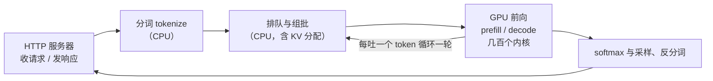

# 3.3 引擎在忙什么：调度、CUDA Graph 与内核

## 开篇问题

第二部分你帮一套双 2080Ti 方案算过显存账：44G 总盘子装下千问 3.6 27B（口播转写型号，以模型卡为准）。现在看同一套机器的完整成绩单：prefill 约 1700 token/s；单并发 decode 不开 MTP 约 50 tok/s，开了之后 80~100 tok/s。交出成绩单的是社区调优的运行时项目 vLLM-2080Ti definitive（1.4 见过名字）：开源约一个月迭代到 v0.1.12，GitHub 收获 300 star，还有开发者提交代码参与完善（数据为该期视频时点；来源：BV14yT46kE5T）。

先把最容易认错的一笔挑明：从 50 到 100 的那一大头不是引擎，而是 MTP（多 token 预测，一种投机解码，3.5 拆它的账）——一次前向吐不止一个 token。引擎的功劳藏在三个隐蔽层面：请求之间的决定（排队、组批、KV 管理）、GPU 开始计算前的空白（内核发射）、真正干活的小程序本身（内核）。还有一个把人带偏的现象：跑推理时任务管理器总有一两个核心钉在 100%，不少人由此得出"换强 CPU 能更快"。本章把一次请求的毫秒逐段拆开，你会看到这一两个核心在忙什么、那几十毫秒在整条链路占几成。

核心问题一句话：**同样的卡，换引擎为什么差一倍？**

先立好口径：原资料没有"同卡、两引擎、同一天"的对照数据，"差一倍"是社区体感加论文口径（下一节的 KV 利用率两到四成）拼出的量级判断。本章教的不是背倍数，而是拆法——任何两份成绩差，拆到这三层，看每层占几成、哪层值得动手。

## 正文

### 先拆清楚：一次请求的时间去了哪

上一章站在用户视角看并发：batch 怎么复用权重、PagedAttention 怎么把 KV 按页分配。本章走进引擎内部。全景还是 1.2 那张链路图，只是现在每个框里都填得上内容了：



图中真正花时间的框是 GPU 前向，它由一段段叫**内核（kernel）**的小程序构成——被上万线程同时执行的一段 GPU 函数。模型一层展开是若干矩阵乘与逐元素运算，每种运算对应一个内核；跑一次前向，就是把几百个内核按固定顺序执行一遍（数量级口径，原资料未给实测计数）。引擎的活分两摊：CPU 侧管排队、组批、KV 管理，GPU 侧执行内核。"换引擎差一倍"的差异只可能出在两摊交界——要么决定做得不好让 GPU 闲了，要么内核之间和内核本身有可省的空白。

### 排队与组批：引擎每一步都在做决定

请求先到队列。vLLM 内部有 waiting 与 running 两个队列：有空闲物理块（上一章的 KV 页）才放行进 running；块耗尽时宁可**抢占（preemption）**——把请求踢回 waiting、重算或换出它的 KV——也不让显存爆掉。KV 管理值多少钱，上一章刚算过：8B 级 GQA 模型（1.3 教学口径）每 token KV 128 KiB，按 32K 上限整块预留就是 4 GiB，而它平均实际只写到 2K，利用率 6%；vLLM 论文实测这类朴素预留的有效利用率只剩两到四成（论文口径）。页管理省下的显存直接换算成并发容量。

组批是另一项每轮都在做的决定：这一步带哪些请求、各分多少 KV、切多长的输入块。单并发时近乎免费；几十路并发、请求长短不一时，组批与调度本身是 CPU 上的活，随请求数上涨——这里按下不表，本节末尾的 CPU 一段给它记时间账。

可观察的结果有两类：并发继续加时，新请求首字时间多出一段排队等待；发生抢占时，被踢回去的请求总时长暴涨（KV 要重算）。压测曲线里出现孤立尖峰，先查显存是否逼近上限，而不是先怀疑网络。

### CUDA Graph：把几百次"递单"压成一次回放

现在看 GPU 侧最大的隐形开销。GPU 是手速极快的大厨，CPU 是服务员：每上一道菜，服务员都要单独递一张单子——报菜名（内核入口地址）、报配料（参数）、报取餐口（显存地址）。递单本身有固定耗时，这就是**发射开销（launch overhead）**，公开量级在每次几微秒（原资料未给实测值）。

prefill 对此基本无感：长输入、大 batch 时每个内核都是大菜，一算几毫秒，递单的几微秒九牛一毛——但这只是常态而非铁律，短输入小 batch 的 prefill 也可能落在访存受限一侧，判定方法 3.4 给你。decode 正相反：每吐一个 token 都要完整跑一遍前向，每个内核只做"矩阵乘向量"级别的小活，微秒级就算完，然后停下来等下一张单子。发射本可与执行重叠，可 decode 的内核太短，GPU 总是先跑完、再干等——算力全花在"等单"的空隙里。

**已解示例**：还是那套双 2080Ti（千问 3.6 27B 稠密、batch=1）。裸 decode 50 tok/s：每 token 预算 1000 ÷ 50 = 20ms；假设一次前向发射 500 个内核、每次发射 5µs，递单 500 × 5µs = 2.5ms——占 12.5%。开 MTP 后 100 tok/s：预算 10ms，表面占比 25%；但 MTP 一次前向吐不止一个 token，"每 token 一次前向"不成立，25% 只能读作上限口径，真实占比比它低。两个输入都是量级估算，结论的形状不变：**内核越碎、batch 越小，发射占比越大**（完整推导与误差边界见本章完整算例）。

**小练习（5 分钟）**：同样的引擎改跑 32 路并发，每步内核从微秒级涨到接近毫秒级，每步前向约 30ms（示意值；用你 3.2 压测的真实数字更好）。发射还是那 500 次 × 5µs，发射占比掉到了多少？再解释为什么服务端高并发场景很少有人抱怨发射开销。

**CUDA 图（CUDA Graph）**的思路是把菜谱写死：第一次按老办法逐个发射，同时把整串内核连同参数、显存地址**捕获（capture）**成一张图；之后每个 token 只发一条**回放（replay）**指令，GPU 照录像把流程跑完。几百次 CPU→GPU 往返压成一次，省的就是递单时间。

▶ 动画：对比逐个发射与整图回放的时间线。

<div class="demo" data-demo="cuda-graph"></div>

代价记在显存账上。回放要成立，每次执行的地址必须一模一样，所以建图时就得把内核用的**工作区（workspace）**钉死，还要给单并发、2 并发、4 并发……每种批次档位各录一张图。这块显存从此划走，不能再让给 KV 缓存或更长上下文。灵活性也受限：并发或长度超出建图档位，就得补齐凑档或退回逐个发射。显存极限时这笔账真能压死人：有人盘点百元矿卡算过，CMP 90HX（英伟达挖矿计算卡）单卡 10G 显存，跑 27B 的 FP4 级权重至少三张卡；就算凑四张共 40G，还要扣掉每张卡的缓冲、CUDA Graph 与运行时，能用的更小（来源：BV1E5426eE5X）。卡越小、卡越多，被图扣走的那块越疼。

| 场景 | 建议 | 原因 |
| --- | --- | --- |
| 服务级框架跑 decode 为主 | 默认开 | 小内核是大头，整图回放收益最大 |
| 显存极限紧张（小卡、多卡） | 考虑关 | 每张卡都被扣一块，可能直接决定跑不跑得下 |
| 长输入短输出、prefill 为主 | 开关差别不大 | 内核大而少，发射占比本就低 |
| 调试、并发与长度频繁变化 | 关 | 回放要求形状固定，动态形状处处碰壁 |

一句话：**用显存换时延**。顺带点破一个工程事实——引擎优化绑定硬件生态：CUDA Graph 属英伟达 CUDA 生态，换 AMD 卡就是另一套名字与另一套内核生态，选卡时把"我的量化与引擎在这张卡上有没有对应实现"当作一道题（第五部分展开）。

*指标回看 · TPOT：上一章它是"并发摊薄后的每 token 时间"，本章拆出第一笔隐形成本——decode 每轮被发射开销吃掉的毫秒；这笔钱能用显存赎回——多少取决于内核多碎、batch 多大。*

### 内核：真正干活的程序，两种快法

消空白只是快的一半，另一半在内核内部：一条路把几道工序捏成一道，另一条把不必要的工作直接去掉。各有一个代表。

第一个代表是 **Marlin**（2.4 见过它省搬运的账）。量化模型走 weight-only 路线——只把权重存成低比特、激活保持 FP16（2.4 的 W8A16 记法）：权重按 4/8 位存储，计算前先**反量化（dequantize）**还原成 FP16 再乘。"支持 FP8 权重"与"以 FP8 运算"是两回事，前者只描述存储档位。vLLM 里点名负责这条路线的就是 Marlin：它把数据排布、反量化、矩阵乘捏成一道工序喂饱张量核心（Tensor Core，2.3 讲过，专做矩阵乘加的硬件单元）——快不来自省了计算，而来自少了两道工序间的显存往返与发射等待。直接的应用：vLLM 的硬件支持表里就有图灵一行，社区项目靠它让不支持 FP8 运算的 2080Ti 也加载上了 FP8 甚至 FP4 权重——档位归存储，运算仍走 FP16（来源：BV14yT46kE5T）。

第二个代表是 **FlashAttention** 一族（把注意力各步融成一道工序的内核）。朴素写法要把 Q×K 的大矩阵、softmax 的中间结果逐一写回显存再读回来；FlashAttention 把这几步融成一道工序，中间大矩阵不落显存——上下文越长、prefill 越重，省下的显存往返越可观。这一族里 vLLM/SGLang 等引擎常用的后端库有一个叫 FlashInfer；启动日志里 attention backend 一栏（如 FLASHINFER / FLASH_ATTN，随版本与配置变化）显示的就是这次在用哪个库。

**已解示例**：判断题——"2080Ti 换成 FP8 权重，prefill 会不会吃到 FP8 硬件加速？"分两步答。第一步问存储还是运算：weight-only（Marlin）路线下，FP8 权重先反量化成 FP16 再算，计算仍在 FP16 上，"FP8 运算加速"根本没被用上。第二步问硬件有没有这份能力：2080Ti 不支持 FP8 运算，但支持 INT8 加速，INT8 算力是 FP16 的两倍——架构设定，不是营销数字；要兑现它，激活值也得是 8 位（W8A8）。当时全生态只有一个量化方案在这张卡上走通 W8A8，实测 prefill 大大增快、decode 却因实现问题非常慢（来源：BV14yT46kE5T）。结论：**快 = 合适的内核 × 喂得饱的数据 × 用得上的格式**——量化是否提速，取决于硬件指令、内核实现、量化粒度与负载阶段，缺一项，纸面翻倍就只是纸面。

**小练习（8 分钟）**：朋友说"我把模型从 GGUF Q4 换成 FP8 权重文件，decode 应该更快，因为数短了"。用本节两步法判断他的推理哪里成立、哪里不成立（提示：decode 的瓶颈在搬运还是计算？他的引擎走的是哪条路线？）。

### CPU 在忙什么：满载的两个核心不是瓶颈信号

回到开篇那个误导性的观察：跑推理时一两个核心钉在 100%。现在能读懂了——那是 CPU 侧的分词与调度线程在干活：收请求、对词表切 token、决定组批与 KV 分配、最后把生成的 token 反分词成文本。GPU 侧的重负载（prefill、decode、多卡通信）全不经过 CPU。多卡框架每张卡还挂一个 **张量并行（TP）worker**（多卡协作进程，4.1 展开）做协调，卡越多、活跃核心越多；"worker 只调度不运算"是从 CPU 视角说的，别误成 worker 不碰计算——每个 worker 在自己那张卡上执行 1/N 份权重分片的前向（来源：BV1qU846JEpW）。

这段 CPU 工作值多少时间？低并发下的量级是"几十毫秒甚至更低"。放进整条链路算占比：单并发 100 tok/s 吐 500 token 要 5 秒，CPU 前期按 50ms 算只占 1%，用户毫无感知。有人算过另一笔账：CPU 频率从 1.5GHz 提到 5GHz（约三倍），也只是把几十毫秒压到十几毫秒，对秒级的整段请求可以忽略（来源：BV1qU846JEpW）。最能说明问题的还是那套机器本身：主机 CPU 是 i3-9100T，4 核 4 线程、35W 散热设计功耗，配双通道内存，照样跑出 100+ tok/s（含 MTP）——瓶颈在卡，CPU 够用就行（来源：BV12ZEN6CEho）。

那 CPU 什么时候重新上台？请求数与 batch 变多后，分词、组批、调度的工作量随请求数线性上涨，CPU 侧才可能成瓶颈。结论分两半：**单核性能在个人低并发场景几乎不重要；多核性能与多核调度在商业部署才敏感**。攒机预算的大头留给显卡——这句建议在本章有了毫秒级的依据。

*指标回看 · TTFT：上一章它被排队拉长，本章拆开构成——首字时间 ≈ CPU 前期（连接、分词、组批）+ prefill；低并发下 CPU 那几十毫秒不是大头，并发上来后排队与抢占才是 TTFT 尖峰的主因。*

### 毫秒分解：给一次请求记一本时间的账

三层看过了，现在并成一张表。对本地服务发一条流式请求，用 curl 计时参数就能把时延切成几段。测量次序先讲清，避免循环相减：prefill 用"输入 token 数 ÷ PP"独立估算（PP 从服务端 timings 字段或 llama-bench 拿，3.1 的口径）；前期段做残差，等于 TTFT 实测减 prefill 估算。

| 时延段 | 包含什么 | 怎么测 | 本章案例参考量级 |
| --- | --- | --- | --- |
| 连接与前期处理 | HTTP 收包、分词、排队组批 | 残差法：TTFT 实测 − prefill 估算 | 几十 ms 甚至更低（低并发） |
| prefill | 吞下全部输入 token | 输入 token 数 ÷ PP（服务端 timings 或 llama-bench 实测） | 4096 ÷ 1700 token/s ≈ 2.4s |
| TTFT | 上两段之和 | `curl -w` 的 `%{time_starttransfer}` | 约 2.4~2.5s |
| decode 全程 | 逐 token 生成 | `%{time_total}` − `%{time_starttransfer}` | 500 token ÷ 100 tok/s ≈ 5s |
| TPOT | decode 每 token 摊到的毫秒 | decode 毫秒 ÷（输出 token 数 − 1，3.1 的口径） | 10ms（含 MTP） |

```bash
curl -s -o /dev/null -w "连接 %{time_connect}s 首token %{time_starttransfer}s 总计 %{time_total}s\n" \
  http://127.0.0.1:8000/v1/chat/completions \
  -H "Content-Type: application/json" \
  -d '{"model":"m","messages":[{"role":"user","content":"写一首七绝"}],"max_tokens":500}'
```

这张表是本章的产出物。价值不在某一格的数字，而在归因方式：首字慢，先看前期段（CPU、排队）还是 prefill 段（算力、上下文长度）；吐字慢，先看 TPOT 里发射、KV、带宽各占多少嫌疑。3.4 的瓶颈定位就建立在这张表上。

## 完整算例

**已知条件**：单并发 decode，双 2080Ti + NVLink、千问 3.6 27B 稠密、batch=1；两个口径：不开 MTP 约 50 tok/s、开 MTP 约 100 tok/s（基准口径为"最高速度"，作者声明不一定稳定复现，3.1 三问；输入输出长度原资料未说明）；一次前向发射内核约 500 个（量级假设，原资料未给实测计数）；单次发射耗时 5µs（公开量级，原资料未给实测值）。

**要回答的问题**：每 token 的预算里发射开销占几成？CUDA Graph 最多赎回多少？MTP 开关对这本账做什么？

**公式**：

```
每 token 预算 = 1000ms ÷ 吐字速度（tok/s）
发射总耗时 = 内核数 × 单次发射耗时
发射占比 = 发射总耗时 ÷ 每 token 预算
MTP 修正：开 MTP 时每 token 摊到的前向次数 < 1，
          按"每 token 一次前向"算出的占比是上限口径
```

**逐变量解释**：吐字速度决定每个 token 分到多少毫秒（tok/s 的倒数，换算成 ms）；内核数乘单次发射耗时是 CPU"递单"的总时间，µs 除以 1000 换算成 ms；两者相除得到无单位占比。

**代入**：

- 裸 decode：每 token 预算 = 1000 ÷ 50 = **20ms**；发射总耗时 = 500 × 5µs = 2500µs = **2.5ms**；发射占比 = 2.5 ÷ 20 = **12.5%**；
- 含 MTP：每 token 预算 = 1000 ÷ 100 = **10ms**；发射照算 2.5ms；表面占比 = 2.5 ÷ 10 = **25%**——按 MTP 修正读作上限，因为这时一次前向吐多个 token，"每 token 一次前向"不成立。

**数量级与单位检查**：µs 乘个数得 µs，再换 ms，量纲闭合。比例检查：decode 单内核执行微秒量级，与单次发射同数量级，"算一阵、等一阵"成立；同样的 2.5ms 放进 prefill（单内核毫秒级）占比掉到千分之几——两阶段对同一笔开销的敏感度差三个数量级，互相印证。

**口径声明：这是量级估算，不是实测**。500 个内核与 5µs 都是假设输入；结论的形状（占比随内核数线性涨、随批次变大而降、MTP 会稀释它）比绝对值可靠。

**误差来源**：其一，内核计数口径——采样、通信、反分词的内核算不算进去，结果差几成；其二，MTP 的前向次数未实测，含 MTP 的占比被高估；其三，CUDA Graph 赎不回全部 2.5ms，回放指令仍占一点 CPU 时间，建图那一次也照常逐个发射；其四，部分发射本可与内核执行重叠，重叠得起多少取决于内核长短；其五，框架、驱动、CPU 单核性能不同，单次发射耗时本身在变。

## 贯穿案例的最终分析

把镜头拉回那套双 2080Ti，全口径先摆齐：双 2080Ti 22G（魔改版，常规版 11G）加 NVLink 桥、约 500 元的迷你主机（i3-9100T、双通道内存，来源：BV12ZEN6CEho），跑千问 3.6 27B 稠密模型（型号口径见开篇）、AWQ INT4 权重（2.1 算过显存账）；引擎 vLLM-2080Ti definitive；负载为单并发 decode，输入输出长度原资料未说明。成绩：裸 decode 约 50 tok/s，开 MTP 后 80~100 tok/s，prefill 约 1700 token/s；同一口径下，作者拿约 5 万元的 RTX PRO 6000 当参照系："可能也就是这个速度"（原始出处见章末）。

用本章的三层拆这份成绩。第一层调度与 KV 管理：PagedAttention 让 44G 省出的显存真装进了并发与长上下文，是上一章的账，"跑得起来"的地基。第二层发射：CUDA Graph 把 decode 每轮递单压成一次回放，按算例口径，在 20ms 预算里最多值两毫秒半——不是大头，但是"每一毫秒都花在计算上"的前提。第三层内核：Marlin 让这张不支持 FP8 运算的卡吃上 FP8/FP4 权重的存储收益，W8A8 尝试则是"格式对、内核缺、快不起来"的反面。

再对一遍天花板，把"差的一倍"归位。2.2 算过：双卡聚合带宽约 1.2TB/s 除以 20 多 G 权重，单路 decode 上限约 55~60 tok/s（理论上限口径）。裸 decode 50 贴着这条线跑，八五折——引擎层的"不浪费"确实把带宽喂饱了，这是引擎的真实功劳；而开 MTP 后的 100 远超上限，恰因一次前向吐多个 token、权重读一次产出多份，天花板本身被挪走了。所以"同样的卡差出一倍"拆完的读法是：**引擎层的三板斧负责贴着天花板跑，投机解码负责把天花板掀了**——两类提速，不要记混。

这个案例还回答了"要不要自己写运行时"。作者一个月迭代到 v0.1.12，改的都是本章这类细账；对你的判断顺序则是：先用默认引擎测出毫秒分解表，看空白在哪层，再决定换引擎、改配置还是写代码——跳过测量直接调优，等于不看账本就改账。

## 理解检查

1. **计算**：你的方案单并发实测 60 tok/s，一次前向发射约 400 个内核、每次发射 6µs。每 token 预算与发射占比各是多少？若 CUDA Graph 把发射压成一条约 20µs 的回放指令，TPOT 最多降到多少、吐字速度上限变为多少？声明你算的是上限口径还是实测口径。
2. **条件变化**：还是这套配置，把并发开到 32 路。每步内核执行时间明显变长，发射次数近似不变，发射占比往哪个方向变？由此解释为什么 CUDA Graph 在个人单并发场景的口碑远好于服务端。
3. **排障**：同事看到任务管理器一两个核心 100%，坚持"换个强 CPU 推理能快一倍"。用本章的毫秒分解给他算一笔账劝住他；再补一个条件——什么情况下他说得对？
4. **选型**：一张显存只比模型需求多 1G 的卡，服务以 decode 为主。你开不开 CUDA Graph？写出决策依据（提示：图的显存代价、这笔显存能装几路 KV、跑不跑得下哪个优先）。

## 动手实验

**迁移说明**：从 Ollama/llama.cpp 主线来的读者：本章 A/B 需要 vLLM（`pip install vllm`；或改用 SGLang，开关名 `--disable-cuda-graph`）。llama.cpp 新版在满足条件时自动使用 CUDA Graph、没有对等开关，只能对照书中数据纸面复算；无 N 卡同样标记选做、纸面完成。

**环境**：Linux，NVIDIA 显卡（6G 显存以上），vLLM 装好并能起一个 7B~8B 级模型。

**步骤与命令**：

```bash
# 1. 基准：默认（CUDA Graph 开）
vllm serve <模型路径> &            # 启动日志找建图字样（如 "Capturing CUDA graphs"，措辞随版本变）
nvidia-smi --query-gpu=memory.used --format=csv   # 记下稳定显存
# 用 3.1 的 bench3.py 测：单并发、固定输入、256 输出，测 10 次，报中位数与极差

# 2. 对照：关闭 CUDA Graph（唯一变量）
vllm serve <模型路径> --enforce-eager &
nvidia-smi --query-gpu=memory.used --format=csv   # 再记显存
# 同一脚本、同参数再测 10 次

# 3. 复算：两组 TPOT 各换算成 ms/token，差值对照 "500×5µs=2.5ms" 的数量级
```

**应记录的项**：模型名与量化档位；两次启动日志关键行；两次稳定显存读数与差值；两组 TPOT（中位数与极差）；换算后的 ms/token 差值。

**预期现象**：默认启动时日志逐档位建图；关图（eager 模式，即不建图、退回逐个发射）后 TPOT 变长、显存回落，差值就是各档位图的工作区总和——量级随版本与档位数变化很大，以你两次读数的差为准，别背任何人的预设数字。

**失败排查**：两组数字没差别 → 先确认测的是 decode（单并发、长输出），再确认 `--enforce-eager` 真的生效（看启动日志）；差别远超 2.5ms 量级 → 检查对照组是否混入了并发或输入长度变化；显存不足启动失败 → 降 `--max-model-len` 或减少批次档位后重试；纯 CPU 环境 → 本实验不可做，CUDA Graph 是 GPU 机制，改做纸面复算。

**产出**：毫秒级时延分解表——用正文那张表的框架填入你自己机器的五个时延段，表下写一行结论：你的方案里 CPU 前期、prefill、发射、decode 各站几成。这张表是 3.4 瓶颈定位的直接输入。

## 本章能力清单

对照本章的学习目标：

- ✅ **拆解**"同卡不同引擎"的成绩差：归到调度、发射、内核三层，说明每层的证据（开篇口径 + 贯穿案例）；
- ✅ **解释**引擎三件事（排队、组批、KV 管理）各自决定什么、抢占发生时用户看到什么（排队一节）；
- ✅ **计算**给定内核数与发射耗时的发射占比，声明量级估算口径并说明 MTP 的影响（已解示例 + 完整算例 + 理解检查 1、2）；
- ✅ **画出**一次请求的毫秒级时延分解表，说出每段的独立测量方法（毫秒分解一节 + 实验）；
- ✅ **比较**Marlin 与 FlashAttention 各自解决的问题，判断一个量化方案能否吃到硬件加速（内核节已解示例 + 小练习）；
- ✅ **诊断**"一两个核心满载""TTFT 孤立尖峰"两个现象的成因，并给出验证动作（CPU 一节 + 理解检查 3）；
- ✅ **选择**给定显存与负载下 CUDA Graph 的开与关（开关表 + 理解检查 4）。

## 与下一章的衔接

你现在有一张表，能说出时间花在哪；但"花在哪"和"卡在哪"还差一步——prefill 慢是算力不够还是数据喂不上？decode 慢是带宽、KV 还是内核？下一章（3.4 找瓶颈：roofline 与对照实验）给你 roofline 双曲线和单变量对照两件工具，把调度作为正式的瓶颈维度纳入定位流程，也是把"换引擎差一倍"从体感变成证据的路径——两个引擎各测一张本章的表，差值自己会说话。这张时延分解表就是那套方法的输入，别弄丢了。

## 资料来源与延伸观看

- 内核与量化路线（"支持 FP8 权重 ≠ 以 FP8 运算"、Marlin、INT8 翻倍与 W8A8 尝试、版本与 star 数据）：BV14yT46kE5T。
- CPU 链路与毫秒量级（请求链路、几十 ms 前期处理、频率三倍的账、TP worker 与满载核心）：BV1qU846JEpW。
- 贯穿案例成绩单（双 2080Ti、千问 3.6 27B、decode 约 50 / 含 MTP 80~100、prefill 约 1700 token/s）：BV1Y2LX61EjQ 与 BV1nVVr6QEFq，完整清单见附录 B；输入输出长度原资料未说明。
- 案例机器的 CPU 与内存配置（i3-9100T、双通道）：BV12ZEN6CEho。
- CUDA Graph 显存代价的选型案例（CMP 90HX 四张 10G 卡扣缓冲与图）：BV1E5426eE5X。
- 开关与参数：vLLM 的 `--enforce-eager`、SGLang 的 `--disable-cuda-graph`，以官方文档当前版本为准；"每次几微秒"与"约 500 个内核"均为量级估算，原资料未给实测。
- 原资料未说明之处：同卡两引擎的对照数据无实测来源，"差一倍"按量级判断使用；调度、发射、内核三层各自的贡献百分比无拆分数据，本章只给了发射层的量级账，双层拆分留待 3.4 的对照实验补齐；vLLM 论文口径两处（两到四成、4%）。
