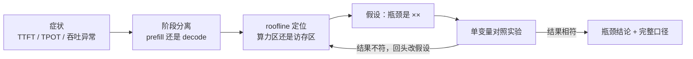

# 3.4 找瓶颈：roofline 与对照实验

## 开篇问题

你翻开自己的实验记录，看到两行放在一起很不对劲的数字：同一个模型、同一张卡、同样的单并发测法，上周五 decode 实测 38 tok/s，今天重测只有 25。这中间你没有动过任何硬件。同一个上午，群里有人转发一条消息："某模型上周调用量世界第一，赶紧用起来。"

两个数字都摆着要你处理。前一个是你自己测的，却解释不了——卡没变，三成多的速度去哪了？后一个是别人的，来路不明——"世界第一"的账本是谁的？3.1 到 3.3 你攒下了三张表：个人指标表、并发行为笔记、毫秒级时延分解表，它们回答了"时间花在哪"，还没回答"卡在哪一环"。prefill 慢、decode 慢、并发加不动，是三种不同的病，药方互不相通；照别人的药方吃自己的药，是性能调优里最常见的破财方式。

本章核心问题一句话：**我的服务卡在哪一环？** 两件工具加一套审问：roofline 双曲线把症状定位到"算不动"还是"搬不动"，单变量对照实验把判断钉成证据；末尾用五个问题把那条"世界第一"拆开——拆完别人的，回头用同一套动作审你自己的性能报告。

## 正文

### 瓶颈不是卡的属性，是工作点的属性

先把诊断流程摆出来。它就位于你前三章产出的下游：三张表是它的输入，瓶颈结论是它的输出。



roofline（屋顶线）模型是这套流程里的定位仪。横轴是算术强度（arithmetic intensity）——每从显存搬 1 字节数据，能捎带做多少次运算；纵轴是这块卡实际能达到的性能。曲线由两段拼成：左段是斜线，性能等于带宽乘算术强度，搬多少算多少，这叫访存受限（memory-bound）；右段是平线，数据早就在手边、算力成了天花板，叫算力受限（compute-bound）。两段的交界俗称"屋脊"。

它和你已经会算的账是同一本：2.2 那条"吐字上限 ≈ 显存带宽 ÷ 权重体积"，就是斜线段的解析式。decode 每吐一个 token 都要把权重完整搬一遍，每字节的搬运只摊得上个位数的运算，算术强度低到趴在图的最左侧——所以单并发 decode 几乎总坐在斜线段上。反过来，长输入的 prefill 把几千个 token 一起前向，权重搬一次被所有 token 反复使用，算术强度很高，压在平线段上。由此得到本章最重要的判断：**瓶颈不是这张卡的固有属性，而是当前工作点（并发、上下文长度、输入输出比）的属性。** 同一张卡，换个负载，瓶颈可以从"搬"跳到"算"。

▶ 动画：拖动并发与权重位宽，看算术强度变化、工作点沿屋顶线滑动。

<div class="demo" data-demo="roofline"></div>

这个模型也要认清边界：roofline 是上限图，不是计时器。KV 的反复翻读、内核实现效率、卡间通信、内核发射开销都不在图里——图上说你该跑到 60，实测只有 40，这段缺口本身就是下一层线索，但它不会自己出现在图上，要靠后面的对照实验去解释。

*指标回看 · 吞吐：从 3.2 的"随并发上涨的斜率"升级为瓶颈坐标——总吞吐曲线斜率归零的位置，就是工作点撞上屋脊（或显存墙）的位置。*

### decode 定位：斜线段上的一笔除法

decode 慢，第一嫌疑人是带宽。定位动作是三步：算上限、求折扣、反推等效带宽。

```
decode 理论上限 ≈ 显存带宽 ÷ 权重体积
折扣 = 实测速度 ÷ 理论上限
等效带宽 ≈ 实测速度 × 权重体积
```

上限告诉你天花板在哪，折扣告诉你离天花板多远，等效带宽则往回倒推"这块卡实际用上了多少带宽"。2.2 给过折扣的常见区间：单并发、权重搬运占主导时，六到八折。落在区间里，说明 decode 正常趴在斜线段，瓶颈就是带宽本身——想快只有两个方向：更宽的带宽，或更小的权重。

**已解示例**：P40 跑 llama.cpp 官方的 7B 模型，decode 实测 50 多 tok/s（量化档位原资料未说明，按 4bit 级文件约 4.5G 估算）；P40 标称带宽约 346GB/s（规格页口径）。反推等效带宽 ≈ 50 × 4.5 ≈ 230GB/s，折扣 230 ÷ 346 ≈ 0.65——落在正常区间，结论：这张卡的 decode 没病，瓶颈就是带宽（来源：BV1hLtG6ZE5M）。同一套逻辑还解释了另一组观察：没有张量核心的海光 Z100L，prefill 速度非常慢，decode 却靠约两倍的显存带宽拿到笔记本魔改卡约九成的解码性能——"力大砖飞"四个字，就是访存受限的民间说法。

**小练习（5 分钟）**：你的卡标称 448GB/s，权重 16.5G，单并发实测 TG 12 tok/s。算上限、折扣、等效带宽，判断是否正常；若不正常，按下面那段红线的清单列出两个嫌疑（提示：上下文多长？并发真是 1 吗？）。

那句提示是一条红线：**decode 的耗时不止搬权重。** 上下文越长，每步翻读的 KV 越多；并发上去之后算力逐渐接棒；多卡方案还有通信。所以等效带宽异常偏低时，先查上下文长度与并发设置这些"账没对齐"的口径问题，再怀疑内核——顺序反了，就会把一次配置差异当成硬件缺陷，白花一次换卡的钱。

### prefill 定位：平线段与纸面算力陷阱

prefill 慢，第一嫌疑人是算力——但"算力"不是规格表上那个数。roofline 纵轴画的是实现度折扣之后的算力：架构、内核、生态各抽一道税。

先划清例外边界：prefill 不必然算力受限。长输入、大批量时权重搬一次被几千个 token 反复用，才压得住平线段；输入只有几百 token、并发又低时，prefill 也可能落在访存一侧，甚至让装载与排队这些固定开销主导。所以定位 prefill 的第一步不是查算力，是分离——拿 3.1 的估算式对账：输入 token 数 ÷ 实测 PP 速度，应该和 TTFT 里 prefill 那一段对得上。

**已解示例**：你的机器 PP 实测 1500 tok/s，一条输入 1024 token 的请求 TTFT 却有 3 秒。1024 ÷ 1500 ≈ 0.68 秒是 prefill 的账，缺口约 2.3 秒不在 GPU 计算里——去查排队（当时的并发多少、KV 池是否贴顶）和 3.3 时延表里的 CPU 前期段，而不是去换卡。

确认 prefill 段真的主导之后，再验算力。规格表的数字在这里最容易骗人：Intel Arc A770 理论 FP16 128T、INT8 256T（Intel ARK 口径），纸面"性能甚至强过 3080"，实测推理却"巨慢无比"，prefill 与 decode 都比架构更老的 P40 还慢（来源：BV1hLtG6ZE5M）。TOPS 是原料，内核是把原料做熟的手艺；roofline 的平线段永远比规格表矮一截，矮的那截就是这道税。decode 与 prefill 的定位动作合在一起，就是下面这张合诊表。

### 三张表合诊：TTFT 与 TPOT 各指一个方向

工具齐了，把前三章的表接上。症状不同，第一嫌疑人与验证动作就不同：

| 症状 | 区位假设 | 先查什么 | 一步验证动作 |
|---|---|---|---|
| TTFT 长，输入长 | prefill，算力区 | 输入 ÷ PP 与首字实测对账 | 输入减半，TTFT 应近半；不半 → 查排队 |
| TTFT 长，输入短 | 不在 GPU 前向 | 排队、装载、CPU 前期 | 空载单发重测，对照 3.3 前期段 |
| TPOT 长，单并发 | decode，访存区 | 上限、折扣、等效带宽 | 换小档位权重，TG 应近比例变快 |
| 并发加不动 | 已到屋脊或显存墙 | 吞吐拐点、显存读数 | 扫并发档；显存贴顶 → 显存墙 |
| 偶发卡顿尖峰 | 调度与抢占 | 3.3 分解表、KV 池余量 | 看尖峰是否与抢占同时出现 |

用 TTFT 与 TPOT 分离阶段是这张表的钥匙：首字异常先分"输入长（算力区）"与"输入短（排队与固定开销）"，两口的药完全不同；吐字异常则先算那笔除法，别急着下"卡不行"的结论。

*指标回看 · TTFT：从"首字等多久"升级为阶段指认——它异常时先分"输入长（算力区）"还是"输入短（排队与固定开销）"，再决定查算力还是查调度。*

*指标回看 · TPOT：从"逐字节奏"升级为访存区坐标——单并发下它对权重位宽敏感、对算力迟钝，这份敏感度本身就是"坐在斜线段"的证据。*

*指标回看 · 显存占用：从"装不装得下"升级为瓶颈旁证——读数贴顶时先把"带宽瓶颈"改判为"显存墙"，加带宽是错药，减并发或砍上下文才对症。*

### 单变量对照：一次只动一个旋钮

roofline 给你假设，对照实验给你证据。设计规矩只有四条：先定基准组，什么都不动，连测 10 次取中位数（3.1 的纪律）；一次只动一个变量，动了两个，结果就归因不了；把预判先写下来——"我猜动 X，Y 会怎么变，因为瓶颈在 Z"，实验是审你的假设，不是碰运气；记录完整口径，模型、档位、输入输出、并发、温度一样不缺。

三组最常用的对照，各对应工作点的一次移动：

| 对照组 | 动的旋钮 | 访存区（decode）下的读数 | 算力区（prefill/大批量）下的读数 |
|---|---|---|---|
| 位宽 | Q8_0 ↔ Q4_K_M | TG 近比例变化，PP 几乎不动 | PP 也几乎不动（配并发组一起判读） |
| 并发 | `-np` 1/2/4/8 | 单路微降，总吞吐近比例涨 | 总吞吐走平（撞屋脊） |
| 上下文 | 输入 512 → 4096 | TG 缓降（KV 翻读），TTFT 大涨，显存涨 | TTFT 近比例涨，TG 几乎不动 |

位宽那一行要带条件读：换更小的档位后 decode 上限近比例变快，前提是 weight-only 路线加上跟得上的内核——3.3 的 Marlin 一课说过，内核缺位时纸面翻倍只是纸面。PP 几乎不动这一点倒是很稳：prefill 的账与权重体积基本无关，只与算力和 token 数相关，这反过来成了"prefill 在算力区"的证据。

工作点可以这样被推动，有现成的实测背书。MI50 16G 单卡跑 35B 级模型 PP 600 多，两张 16G 按层一比一切分流水线后涨到 1000 多；为排除 AMD 因素，再用 2080Ti 跑 27B Q4_K_M 复测：单卡 PP 580，双卡 800 多——两侧 decode 都不劣化。原理落在工作点上：8K 的 prompt 被拆成四个 2K 的 batch，单卡核心一次只能吃一个；双卡流水线让两个 batch 的 prefill 重叠，等效同时在算约 4K 的输入，这是把算术强度往上推、在平线段挤出更多性能的实例。decode 是自回归的，第一个字出完才轮到第二个字，重叠不起来，所以钉在斜线段上不动（来源：BV1YxjU6qEuw）。至于"两张 16G 胜一张 32G"的完整账、带宽到底哪几项能加，4.1 展开。

**小练习（8 分钟）**：你怀疑"高峰期慢"是 KV 显存墙而不是带宽不足。写一个单变量方案：动哪个旋钮、固定什么、盯哪两个读数、出现什么结果支持你的假设。

*指标回看 · 并发：从"服务容量"升级为实验旋钮与定位坐标——它是把工作点推向屋脊的手柄；对照组里它必须钉死，实验组里它是唯一变量。*

开篇那两行记录，现在可以破案了。复盘发现两次的负载不同：上周五测的是短对话，上下文两千上下；今天重测的是 32K 的长文档问答。KV 翻读与每步的注意力扫描都随上下文变长，decode 单步变贵，工作点整个挪了位置——卡没变，瓶颈变了，三成多的速度不是丢了，是换了负担。这条教训比答案值钱：记录本上每个数字都要带口径，否则两周后的你，就是那个转发"来源不明"数字的人。

### 口径批判五问：先问账本，再做除法

对照实验管你自己的数字，五问管别人的数字。看到任何性能宣称——"快 3 倍""世界第一""性价比之王"——依次问：

- **谁测的**：账本是谁的？厂商自报、第三方平台，还是全网统计；
- **什么负载**：输入多长、输出多长、几路并发、什么任务；
- **什么口径**：TTFT 还是 TPOT，PP 还是 TG，峰值还是均值；
- **能否复现**：给出命令，我能跑出同量级吗；
- **谁受益**：发布者从你的相信里得到什么。

用这套问题拆开篇那条转发。账本：数据源是 OpenRouter，一个国外的 API 中转/聚合平台，榜单只统计经过它转发的流量——极小样本，媒体把它当成了全网总账。负载：调用量计的是 token 消耗，不是人，而 token 消耗极端长尾——一位自称"中度偏重度"的 API 用户单日最高烧约 20 亿 token（编程类智能体把整个代码库塞进上下文反复读写所致；平均速率约 2×10⁹ ÷ 86400 ≈ 每秒 2.3 万 token，单机单并发达不到，API 多并发够得着）。口径：这是"调用量"，不是"用户量"。除法：周榜第一约 6.13 万亿 token，重度用户一周约 140~150 亿，6.13 万亿 ÷ 150 亿 ≈ 409——约 400 个重度用户就能刷出"第一"；而主流产品的用户量是几百万级，400 对几百万差 4 个数量级（来源：BV1kgN26SECZ）。数字为真，结论为假。

这五问不只防别人。你的性能报告里"瓶颈在带宽"这句话，五问问下来都答得出，才算结论；答不出任何一问，它就只是猜想。写报告的动作顺序由此定下来：先问账本，再做除法，最后才信结论——这套动作也是全章方法的收口。

*指标回看 · 成本：从"买卡的花费"升级为错误结论的价签——按错药方买的每张卡、轻信榜单多花的每笔预算，都记在瓶颈误判与口径轻信的账上；五问不花一分钱。*

## 完整算例

**已知条件**：卡：2080Ti，标称显存带宽 616GB/s（规格页口径）；权重 A：27B 模型的 GGUF Q4_K_M 文件口径 16.5G（2.2/2.4 的账）；权重 B：同为 27B 的 AWQ INT4，项目实测 20 多 G（未注明 GB/GiB）；实测成绩：双 2080Ti（NVLink 互联）跑权重 B，单并发 decode 约 50 tok/s、未开 MTP（输入输出长度与并发细节原资料未说明，来源：BV1Y2LX61EjQ）。

**要回答的问题**：单卡口径上限约 37 tok/s，双卡实测却有 50——数字打架吗？

**公式**：

```
decode 理论上限 ≈ 显存带宽 ÷ 权重体积
等效带宽 ≈ 实测速度 × 权重体积
```

**逐项代入**：

- 单卡上限：616 ÷ 16.5 ≈ **37 tok/s**（理论上限口径；按六到八折，实测合理区间约 22~30 tok/s）；
- 双卡上限：聚合带宽 2 × 616 ≈ 1.2TB/s，权重取 20G：1200 ÷ 20 ≈ **60 tok/s**（仍是理论上限口径）；
- 折扣：实测 50 ÷ 60 ≈ **0.83**；
- 反推等效带宽：50 × 20 ≈ **1000GB/s**——远超单张卡的 616GB/s，单卡口径解释不通，只有跨卡聚合说得通。

**数量级与口径检查**：37 与 50 不矛盾，它们是两套口径——"单卡 + Q4_K_M 文件"对"双卡聚合 + AWQ 权重"。但 0.83 的折扣略高于常见的六到八折，而且还有两个方向相反的未计入项（聚合是近似、层间通信要吃掉一块），所以这个 0.83 只能当量级互验，不能当效率标定。单位检查：GB/s 除以 G 得 tok/s，tok/s 乘 G 得回 GB/s，量纲闭合。

**口径声明：这是理论上限与量级估算的混合，不是实测标定**。误差来源：各卡带宽标称可达率不同；AWQ"20 多 G"精度不足；KV 翻读随上下文变化而两次成绩的上下文未记录；MTP 确实未开，但现场演示口径与基准口径可能不同。两张卡的带宽为什么能近似相加、哪几项收益不能简单相加，是 4.1 的正题，这里只立一块预告牌。

## 贯穿案例的最终分析

把开篇那条转发审完。事实摆全：媒体称某模型"周调用量世界第一"，数据源 OpenRouter 的周榜第一约 6.13 万亿 token；对照样本是一位自称"中度偏重度"的 API 用户，单日最高约 20 亿 token、一周约 140~150 亿；主流产品的用户量级是几百万（API/付费口径）（来源：BV1kgN26SECZ）。

决策过程三步。第一步问账本：OpenRouter 只是中转站，样本是"经过它家的流量"，拿它宣布"全网第一"是抽样偏差。第二步做除法：6.13×10¹² ÷ 1.5×10¹⁰ ≈ 409，约 400 个重度用户、一周的 API 账单，就能把任意模型刷上周榜第一。第三步对口径：榜单给的是 token 数，产品规模常用用户数，两个口径差 4 个数量级，根本不在同一赛道。结论就是那五个字："数字为真，结论为假。"

你自己的 38 对 25，也用同一套动作收尾：先问账本——两个读数各自的完整口径还在吗？再做除法——差三成多，落在口径漂移的常见范围里吗？最后才信结论——"卡老化了"和"负载变了"哪个有证据？复盘给出第三个答案：负载变了。两个案例同一条纪律：**无口径的数字是谈资，有口径的数字才是证据；补齐口径靠对照实验，不靠追问的语气。** 你写下的性能报告，就是给未来的自己递一份"来源可查"的账本。

## 理解检查

1. **计算**：某卡标称带宽 1000GB/s，权重文件 16.5G，单并发实测 TG 25 tok/s。求理论上限、折扣与等效带宽，判断这台机器是"正常折扣"还是"另有隐情"；若把上下文从 2K 拉到 32K 后 TG 掉到 18，你的第一怀疑对象是什么、怎么验证？
2. **条件变化**：并发从 1 扫到 32，总吞吐曲线先陡后平。描述工作点在 roofline 上的移动路径，指出拐点之后的瓶颈，并回答：此时继续加并发，最先爆的是哪本账？
3. **排障**：同事在群里说"新引擎让我们快了 3 倍"，配图只有一张速度截图。用五问列出你要他补齐的信息清单（至少四项），并写明缺哪一项时你不能下任何结论。
4. **选型**：预算 2500 元，选项 A 是一张 32G 大显存卡，选项 B 是两张 16G 同核心卡。你的负载 prefill 占大头（TTFT 敏感）、decode 压力小。用 MI50/2080Ti 的实测结论与成立条件给出选择，再写明什么负载条件下结论会反转。

## 动手实验

**环境**：沿用 3.1/3.2 的机器与已部署模型（7B~8B 起步，显存富余可上 14B/27B）；llama.cpp 系最顺手（`llama-bench` 一条命令扫参数），vLLM/SGLang 亦可，参数名随版本变化、以官方文档为准；准备同一模型至少两个量化档位的文件；另开终端记录显存与温度。

**步骤与命令**：

```bash
# 基准组：固定输入 512、输出 128、并发 1，先热身再测
llama-bench -m 模型_Q4_K_M.gguf -p 512 -n 128 -r 5

# 对照 1（位宽）：只换文件
llama-bench -m 模型_Q8_0.gguf -p 512 -n 128 -r 5

# 对照 2（并发）：只扫 -np
llama-bench -m 模型_Q4_K_M.gguf -p 512 -n 128 -np 1,2,4,8 -r 5

# 对照 3（上下文）：只拉长输入
llama-bench -m 模型_Q4_K_M.gguf -p 4096 -n 128 -r 5

# 全程记录显存与温度
nvidia-smi --query-gpu=memory.used,temperature.gpu --format=csv -l 5
```

**应记录的项**：每组的 pp/tg 均值与 ± 误差；显存与温度；档位与文件体积；每组一行的完整口径（模型/量化/输入/输出/并发）。

**预期现象**：档位越低 TG 越快、pp 几乎不动；`-np` 扫档总吞吐上升、单路下降、斜率递减；输入 4096 时 pp 大体不变而 TTFT（≈ p ÷ pp）涨约八倍、TG 略降、显存上涨。

**失败排查**：组间读数没差别 → 确认变量真的生效（文件确实换了、`-np` 没被引擎忽略）；TG 反常地高 → 检查输出长度是否被截短、是否吃了缓存；读数随时间漂移 → 看 GPU 温度是否爬进降频区，回 3.1 的纪律重测；纯 CPU 环境 → 规律方向相同、绝对值不可比，在报告里注明口径。

**产出（性能报告，T3+T4）**：三部分缺一不可。一，双曲线：用 3.2 并发表的数据画"并发-总吞吐"与"并发-单路速度"两条曲线，标出拐点。二，roofline 定位：prefill 与 decode 各自的区位、折扣、等效带宽各一行，注明口径。三，瓶颈结论：一句话——"我的服务在当前工作点（并发 × 上下文 × 输入输出比）下，瓶颈是＿＿，证据是＿＿对照实验（前后数据附后）"——最后过一遍五问自查。这份报告是 T3、T4 的交付物，也是 3.5 优化决策的基线。

## 本章能力清单

对照本章学习目标：

- ✅ **画出** roofline 两区与屋脊，把单并发 decode、长输入 prefill、大 batch 三个工作点放到图上并说明理由（正文第一节 + 理解检查 2）；
- ✅ **计算**理论上限、折扣与等效带宽三笔账，并声明每一步的口径（decode 定位节 + 完整算例 + 理解检查 1）；
- ✅ **诊断**用 TTFT/TPOT 分离 prefill 与 decode 的瓶颈，并给出一步验证动作（合诊表 + 理解检查 1 后半）；
- ✅ **设计**单变量对照实验：基准组、唯一变量、重复次数、预判与判读（对照实验节 + 动手实验）；
- ✅ **驳斥**一个无口径的性能宣称：五问加一道除法（口径批判节 + 贯穿案例 + 理解检查 3）。

## 与下一章的衔接

你的定位流程现在能指认瓶颈，但它开出的三味药——更宽的带宽、更小的权重、更多的卡——都要花钱；而 decode 坐在斜线段还意味着一件更别扭的事：单并发吐字被带宽钉死，堆算力没用，可算力明明闲着。不换卡还能不能快？下一章（3.5 投机解码与 MTP）给一个反直觉的答案：让闲着的算力去"猜"后面的字，猜对了就不必一遍遍搬权重。这一招改的是工作点本身——你现在已经会算工作点，所以能自己判断它在你的负载上值不值。

## 资料来源与延伸观看

- 贯穿案例与口径批判（OpenRouter 周榜约 6.13 万亿 token、重度用户单日约 20 亿/周约 140~150 亿、约 400 人的除法、几百万级用户量对比）：BV1kgN26SECZ。
- 两区定位的实测素材（P40 跑 llama.cpp 官方 7B：PP 1000 多、TG 50 多；Z100L 无张量核心、decode"力大砖飞"；A770 纸面强实测慢）：BV1hLtG6ZE5M；MI50/2080Ti 双卡流水线 PP 提速五到六成、decode 不劣化与"买显卡不是买显存"：BV1YxjU6qEuw。
- 贯穿项目实测成绩（双 2080Ti、千问 27B、AWQ INT4：decode 未开 MTP 约 50、开 MTP 约 100 tok/s，prefill 约 1700 tok/s）：BV1Y2LX61EjQ，视频清单与全部出处见附录 B。
- 公式与口径沿用：decode 上限公式与六到八折（本书 2.2）；权重文件口径 16.5G 与 AWQ 20 多 G（本书 2.2/2.4）；显卡带宽与算力规格以 TechPowerUp、Intel ARK 等规格页为准。
- 原资料未说明之处：P40 案例的量化档位与测试负载；双卡项目的输入输出长度、并发与温度条件；MI50 案例中 PP 值的精确单位口径——相关数字均按量级口径使用，未作推断。
