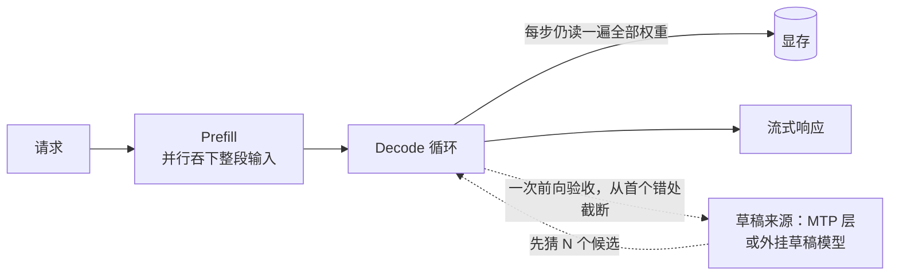

# 3.5 投机解码与 MTP：不换卡的提速

## 开篇问题

3.4 收尾时，你手里应该有一份性能报告：roofline 双曲线、工作点位置、瓶颈结论。最常见的一种结论写作"decode 访存受限"——单路出字慢，慢在每吐一个 token 都要把全部权重从显存搬一遍。你想再快一点，手上却只有三条老路：加并发？3.2 已经证明并发买的是总吞吐，不买单路 TPOT。压位宽？2.5 的甜点位说过，再往下压，质量先垮。换卡？预算不批。

还有第四条路，而且它有点反直觉：让一个便宜的角色先把答案猜出来，贵的大模型只负责批改——而批改四个候选，几乎不比批改一个贵。本章回答核心问题：**不换卡，还能怎么快？** 你会看到，这条路的收益上限不取决于你的显卡，而取决于你的任务"有没有标准答案"；也会看到它的三张账单——Prefill 变慢、显存上涨、与某些多卡部署不兼容。贯穿全章的证据，是一位 UP 主自购显卡做出的三种方案 × 三类任务 × 两个框架的实测（来源：BV1qGh56JEj2）：我们不背他的排名，先学他的实验设计，再用自己的开关对照收尾，最后交出一份属于你的"MTP 开关决策记录"。

## 正文

### 整体图景：这项优化插在链路的哪一格

先把它在链路里的位置摆出来。1.2 拆过一次请求的旅程：请求进来，Prefill 一次吞下整段输入，然后进入 Decode 循环，每步吐一个 token。投机解码不动链条两端，它改造的是 Decode 循环这一格：



谁调用它：引擎的解码循环。输入不变，输出不变，变的是每步产出——从"至多 1 个 token"变成"平均 1 个多一点到 N+1 个"。它多消耗两笔资源：显存里要住下草稿来源（一层 MTP 或一个草稿模型），Prefill 阶段要多算一遍（草稿也要吞 prompt）。它牵动的指标：TPOT 正向、TTFT 负向、显存占用上涨，卡没换所以采购成本为零。

物理地基只有一句话，来自 3.4：decode 工作点落在 roofline 的带宽区，一次前向的时间几乎被"搬权重"包圆，算力大量闲置。3.4 算过那笔账：2080Ti 用 616 GB/s 搬 16.5 GB 权重，吐字理论上限约 37 tok/s——上限由搬运时间决定，算力在旁边空转。既然每一步"反正要读一遍权重、顺路还能算很多"，就让它一步多验收几个候选。记住这个前提，它是本章全部收益的来源，也是收益消失的条件：哪天工作点挪进算力区（并发高、batch 大），"顺路"就没有了——第四部分的多用户场景会回到这句话。

### draft-verify：为什么"批改"比"写作"便宜

一个编辑部类比先建直觉：主编写稿极慢，每写一个字都要翻遍整柜资料；实习生写字飞快但常出错。聪明的安排是实习生一口气拟四个字，主编只扫一眼——对的留下，从第一个错处截断。类比的边界要立刻画清：真实机制里"扫一眼不贵"，不是因为主编眼力好，而是因为一次前向本来就能并行算一整段序列——和 Prefill 能一次吞下整段 prompt 是同一个道理（1.2 的旅程里你已见过它）。

这套机制叫**投机解码（Speculative Decoding，又译推测解码）**，框架只有两步：

- **draft（起草）**：**草稿模型（draft model）**——远小于主模型、猜测质量尚可的模型——一口气猜出 N 个候选 token；
- **verify（校验）**：主模型一次前向同时核对这 N 个候选，从第一个被拒的位置截断。

校验为什么近乎免费？核对 4 个候选和正常吐 1 个 token，走的层数一样、读的权重一样，多出来的只是算术强度略升——在带宽区，这一步的墙钟时间几乎不变。于是每步的时间成本 ≈ 一次普通 decode 步 + 一次便宜的草稿，产出则取决于**接受率（acceptance rate）**：草稿候选被主模型采纳的比例。截断后主模型还会在自己认定的位置上免费给出下一个 token，所以接受 0 个也保底 1 个，这一步不会空手。

▶ 动画：普通解码与投机解码两条时间线。

<div class="demo" data-demo="speculative"></div>

**已解示例（一步的三笔账）**：草稿一口气猜了 4 个候选，主模型一次前向核对：前两个与自己的判断一致，第三个被拒。这一步产出 = 2 个被接受的候选 + 1 个主模型在截断处自己给出的新 token，共 3 个；墙钟成本 = 一次草稿（小模型，很便宜）+ 一次主模型前向（约等于普通一步）。错在第 3 个，白猜的只有从错处起的 2 个，不是整批作废。

**小练习（3 分钟）**：同样的步骤，若 4 个候选全部被拒，这一步产出几个 token？比不开投机解码的一步，多花了什么、赚到了什么？

### 加速比：线性上界与严格式

接受率知道了，收益怎么折算成速度？两个口径，先写出来再解释：

```
线性上界：加速比 ≤ 1 + N × p
严格式：  加速比 = 1 + p + p² + … + p^N
```

p 是接受率（假设各位置相同），N 是一次猜的候选数，加速比（speedup）指开启后与基线的速度之比。线性上界把每个候选当成"独立地、以概率 p 被接受"，再叠加保底的 1 个——它好算好反解，快速估算用它。严格式记住了一件线性式假装没看见的事：候选按顺序验收，第 2 个候选只有第 1 个被接受才有出场机会，所以"k 个候选全部存活"的概率不是 p，而是 p 的 k 次方；再加无论如何保底的 1 个，就是那条几何级数。由于 p^k ≤ p，严格式总不高于线性上界，两个口径的差值本身就有信息：接受率越低，"白猜"损耗越重，差得越远。

注意两者都是理论模型（每步产出的期望倍数），不是实测——实测还要扣掉草稿耗时、验收步略增的算力与调度开销。从实测反推接受率时用线性口径：把"开启后实测速度 ÷ 基线速度"记作加速比，(加速比 − 1) ÷ N 就是近似接受率，拿来与任务类型对号。

### 接受率从哪来：任务确定性

公式里唯一的活变量是 p，它由任务"答案的唯一性"决定——这里把输出确定性定义为：同一输入下"几乎没有第二种写法"的程度。

- 科学计算：数学题的正确答案只有一个，主模型与草稿的分歧空间最小，接受率最高；
- 代码工程：实现路径相对固定（先建函数、再处理输入、再返回），接受率居中——Agent 场景里最多的正是这类负载（写脚本、发起工具调用）；
- 创意写作：小说散文怎么写都成立，输出发散，接受率最低。

贯穿案例的第一组证据就落在这里（来源：BV1qGh56JEj2）：同一套 prompt 分这三类场景实测，加速排名与接受率排序一致——科学最快、代码居中、创意最小。这不是巧合，而是整条因果链的第一环：任务越"唯一" → 草稿越容易猜中 → 每步留下的 token 越多 → 加速比越大。由此得出一句话自检：业务若是闲聊与文案为主，先把预期调低，再谈部署。

### 草稿从哪来：MTP、dFlash、DSpark

接受率是天花板，下一个问题是：草稿从哪来？当前主流框架里常见的方案有三个，出身各不相同（另一类常见方案 EAGLE 思路同为 draft-verify，不在这组对比内）：

- **MTP（Multi-Token Prediction，多 token 预测）**：不外挂模型。模型厂商在主模型（实测那颗是 64 层）之上原生训练一层专管投机解码的 MTP 层，权重内嵌在官方发布的模型里。只多一层，显存负担最小；
- **dFlash**：第三方 Z Lab 推出，用扩散模型的方式一次并行产出大量候选（不需要懂扩散，记住"先出一版粗稿、再一步步修"即可，与文生图同源）。出字快，但草稿与主模型的匹配率低——快在草稿侧，赚不赚要看验收侧；
- **DSpark**：厂商归属存疑（原资料推测是 DeepSeek，字幕转写校正后仍属推测，以官方信息为准）。在 dFlash 之上加一层**自回归校正**：dFlash 猜出的 8~10 个候选，先交给一个更小的校验层修正一遍，再送主模型验收。草稿质量上去了，代价是要额外加载草稿模型，显存占用最高。

三者的取舍收拢成一张表：

| | MTP | dFlash | DSpark |
|---|---|---|---|
| 草稿从哪来 | 主模型内置的一层 | 扩散式并行生成 | dFlash 粗稿 + 小校验层修正 |
| 额外显存 | 只多一层，最轻 | 要挂草稿模型，较高 | 同挂草稿模型，最高 |
| 接受率表现 | 好 | 低 | 高 |
| 部署兼容 | 流水线并行下当前框架用不了 | 可用 | 流水线下仍可用 |

表里最易被忽略的是最后一行。**流水线并行（Pipeline Parallelism，PP）**——把模型按层切开、几张卡接力各算一段，4.1 专门展开——会直接砍掉你的选项：PP 拆分下 DSpark 仍可用，MTP 当前框架却用不了（以所用框架版本文档为准）。部署形态反过头来约束优化选项，这根伏笔在本章末尾收线。

"傻快"那句评语值得单独留下（来源：BV1qGh56JEj2）：UP 主研究 dFlash 一代大半年、本以为早该淘汰，第二代实测依旧垫底——出字快不等于赚，接受率才是分母。判一个草稿方案，先看它被主模型采纳多少，再看它出字多快。

### N 值甜点：一次猜几个，曲线自己会说话

方案选定，最后一个旋钮是一次猜几个（记作 N，DSpark 文档里叫 gamma）。直觉说猜得越多赚得越多——严格式也确实随 N 单调上升。但两股真实开销反向拉扯：候选按顺序验收，猜得越多混进错的概率越大，从首个错处截断后，错处之后的候选全部白猜，草稿与验收的算力照样花；同时草稿越长，越靠后的位置越难猜对——p 不是常数，会随位置衰减。两股力量合起来，速度曲线通常先升后缓、甚至掉头向下，于是存在**甜点区间（sweet spot）**。

贯穿案例把这条曲线真扫了出来（来源：BV1qGh56JEj2）：llama.cpp 的甜点在一次猜 2/3/4 个；MTP 随 N 增大持续走高，3、4、5 直到 7 都还在涨；DSpark 的峰值落在 5/6/7；而代码场景下 dFlash 与 DSpark 随 N 增大反而下降。同一份报告里三种弯法全齐——曲线怎么弯比峰值在哪信息量更大：

- 先升后降：草稿质量扛不住大 N，错处来得早，白猜压过收益；
- 单调上升：草稿质量足够好，p 衰减得慢，收益还没到头；
- 随 N 下降：接受率太低，多猜纯属浪费。

▶ 插画：N 值曲线的三种弯法。

<div class="ill" data-ill="n-value-curves"></div>

**已解示例（曲线为什么变平）**：设 p = 0.5 且不随位置衰减（乐观假设），按严格式算每步产出：N=2 时 1 + 0.5 + 0.25 = 1.75 个；N=4 时 1.9375 个；N=8 时 1.9961 个。N 翻了两番，产出只从 1.75 磨到 2.0——低接受率下把 N 往大拉，曲线先升后平，多猜的算力几乎全打水漂。再叠加"p 随位置衰减"，曲线就不仅是平，还会掉头。

**小练习（3 分钟）**：p = 0.9、N = 4，分别用线性上界与严格式算每步产出，两个口径差多少？再与 p = 0.7 时的差值比一比，说说"接受率越高，上界越可信"怎么从数字里读出来。

*指标回看 · TPOT：从 3.4 报告里"定位出来的那个数"升级为"可以用架构手段改造的量"——本章你第一次把优化前后的 TPOT 并排写进同一张表，并且知道了它压不下去时的原因可能不在卡，在任务的确定性。*

### 代价：三张账单

收益侧讲完，UP 主那句"投机解码不是免费的"（来源：BV1qGh56JEj2）拆开是三张账单。

**Prefill 账**：草稿也要把整段 prompt 过一遍，MTP 层或草稿模型无一例外。Decode 提速的伴生代价就是 Prefill 降速——而长输入场景里 TTFT 由 Prefill 主导（3.1 的定义），Prefill 优先的部署（长文档吞吐一类）甚至会干脆关掉它。这笔代价有诚实的实测背书（来源：BV1XrE26iEMG）：Qwen3.6 27B 稠密 INT8（全重 30 多 GB）在 2080Ti 上跑 vLLM 2080Ti definitive 项目的"疯狗模式"，明确关闭 MTP——解码速度因此不快，但纯文本长输入的 Prefill 冲到 2500 tok/s、长代码输入 2600 tok/s（上一期 FP8 权重的基线为 1600~1700；输入输出长度、batch、并发原资料未说明）。同一条链路，关掉投机解码，Prefill 与 Decode 各归各账。

*指标回看 · TTFT：从"优化收益的旁观者"升级为"代价的收据"——投机解码赚的是 Decode 的钱，花掉的那部分在 TTFT 上显形；开关对照表里 TTFT 那一列，就是这笔花费的金额。*

**显存账**：dFlash 与 DSpark 要额外住下一个草稿模型，MTP 只多一层。峰值显存的实测对比里，前两者明显更吃显存（来源：BV1qGh56JEj2）。数量级锚点：跑 27B/32B 级模型，24G 显存不够、32G 可以（单卡多卡均可）。你的卡若本来就贴着容量上限跑（2.1 的三本账），开之前先算这笔新增开销从哪一本里扣。

**兼容账**：多卡部署方式直接砍选项——PP 拆分下 DSpark 可用、MTP 当前框架用不了。单卡用户跳过这条；双卡用户在读完 4.1 之后要回头看它。

合起来一句话：**投机解码赚的是 Decode 的钱，花的是 Prefill 和显存的钱。** 哪头划算，取决于任务确定性（决定赚多少）与部署形态（决定能不能赚）。

## 完整算例

**已知条件与单位**：N = 4（一次猜 4 个候选）；接受率 p = 0.7，假设各位置相同（简化，真实 p 随位置衰减）；基线速度 s 为不开投机解码时的实测输出速度，单位 tok/s，此处取 s = 20 tok/s 作换算示例。

**要回答的问题**：开启后每步期望产出几个 token？速度约为基线几倍？两个口径差多少？

**公式**：

```
线性上界：加速比 ≤ 1 + N × p
严格式：  加速比 = 1 + p + p² + p³ + p⁴
```

**逐项代入**：

- 线性上界：1 + 4 × 0.7 = **3.8**。含义：若 4 个候选彼此独立、各有七成被采纳，再叠加保底的 1 个，每步期望产出 3.8 个；
- 严格式：1 + 0.7 + 0.49 + 0.343 + 0.2401 = **2.7731 ≈ 2.77**。含义：第 k 个候选要活到被验收，前 k−1 个必须全部存活，概率按 p 的幂衰减——0.7 的四个幂次 0.7、0.49、0.343、0.2401 逐项相加，再加保底 1 个。

**数量级与单位检查**：加速比无量纲，合理区间为 [1, N+1] = [1, 5]，3.8 与 2.77 都在其中，且上界 ≥ 严格式，自洽。换算速度：s = 20 tok/s 时，两个口径的理论上限分别对应 76 与 55 tok/s 量级——注意这是理论上限的换算，不是你能测到的数。

**这是理论模型，不是实测**。误差来源四条：p 并非常数、随候选位置衰减，严格式实际会比 2.77 再低；验收步比普通 decode 步略贵（一次要算 4 个位置的输出）；草稿模型自己耗时；调度与采样开销照旧存在。所以实测加速比通常落在严格式之下，任务越发散低得越多。两个口径分工：报预算、做快速估算用线性上界（3.8）；预判真实收益、解读自己的实测用严格式（2.77）。

## 贯穿案例的最终分析

把贯穿全章的那份实测（来源：BV1qGh56JEj2）放回 3.4 练成的"口径批判五问"里过一遍，就知道它哪里可信、哪里仍要存疑：

- **谁测的**：个人 UP 主，自购显卡，非厂商——利益相关性低，但样本只有一台机器；
- **什么负载**：三档确定性（科学/代码/创意）铺满因果链两端与中间，自变量设计合格；
- **什么口径**：同框架内对比（SGLang 一组、llama.cpp 一组），横轴扫 N，控制变量意识在线；但各方案的具体 tok/s、输入输出长度、batch、并发原资料未说明——排名可信，倍数无法引用；
- **能否复现**：方案全部公开（框架开关 + 模型权重），你能用本章实验在自己的机器上重跑；
- **谁受益**：结论指向"别抄别人的 N"，对读者是提醒而非带货。

被五问筛过之后，这份报告值得带走三件事：加速排名由接受率决定（该实测中 DSpark > MTP > dFlash 二代）；甜点区间因框架与任务而异（2/3/4 对 5/6/7，不是普适答案）；三张账单真实存在（Prefill 会降、草稿模型吃显存、PP 下 MTP 不可用）。另有一处存疑要标注：实测主模型的字幕转写作 27B，但"64 层"与 Qwen3-32B 吻合，模型规格以官方页面为准——引用任何二手数据前，先做这一步核对。

## 理解检查

1. **计算**：N = 6、p = 0.5，分别算线性上界与严格式的加速比，并回答：这份任务值得开投机解码吗？你的判断依据是两个数里的哪一个？
2. **条件变化**：服务从单人使用变成 8 路并发（3.2 的 batch=8），"验收四个候选几乎不比验收一个贵"还成立吗？说明哪个前提被动摇，你预测曲线会怎么移。
3. **排障**：打开 MTP 后，TTFT 从 400 ms 涨到 900 ms，TPOT 降了三成，显存多占 1.5 GB。逐条解释三个数字，然后回答：什么业务该保留这个开关，什么业务该关掉？
4. **选型**：两张 24G 卡打算用 PP 跑 27B 级模型并开启投机解码，你推荐 MTP 还是 DSpark？给显存与兼容两条理由；换成单张 32G 卡，答案变吗？

## 动手实验

**环境**：沿用 3.1 部署的模型，引擎用 llama.cpp（草稿模型加载参数以所用版本官方文档为准）；若你的模型在发布页提供 MTP 权重且框架支持（如 SGLang 的 MTP 开关，以官方文档为准），优先走 MTP 路线；`nvidia-smi` 可用。纯 CPU 环境规律相同，绝对数字慢一个量级。

**步骤与命令**：

```bash
# 基线：不开投机解码
llama-server -m 主模型.gguf -c 8192

# 开启：挂草稿模型，--draft-max 即本章的 N（参数名随版本变，以官方文档为准）
llama-server -m 主模型.gguf -md 草稿.gguf --draft-max 4 -c 8192

# 每种配置各发一组请求；另开终端记录显存峰值
nvidia-smi --query-gpu=memory.used --format=csv -l 1
```

请求组分两类各备 3~5 条：**代码组**（写一个带错误处理的脚本、修复一段给定代码）、**问答组**（知识问答、长文总结）。从返回 JSON 的 `timings.predicted_per_second` 读输出速度、`timings.prompt_ms` 读 Prefill 耗时。有余力把 `--draft-max` 取 2/4/6/8 各扫一遍，画你自己的 N 值曲线。

**应记录的指标**：每组任务的基线与开启后速度（相除得加速比）、`prompt_ms`、显存峰值；开关两行并排写。

**预期现象**：代码组加速明显（确定性高）、问答组居中；`prompt_ms` 上升；显存读数上涨，幅度与草稿模型体积同量级；N 扫出的曲线先升后缓，峰值位置与视频的 2~4 或 5~7 不一定重合——不重合才是正常的，别人的最优 N 不能直接抄。

**失败排查**：加速比 ≤ 1 → 接受率太低（任务发散，或草稿与主模型不匹配），换代码组再试；草稿模型加载报错 → 词表或架构不匹配，确认草稿与主模型同一系列（以官方文档为准）；显存 OOM → 换更小的草稿模型或回退基线；两组数字几乎不变 → 确认 `-md` 真的生效（启动日志里找草稿模型加载行）。

**产出（MTP 开关决策记录）**：一张两列表（开/关 × 代码/问答），每格填输出速度、`prompt_ms`、显存峰值；表下写一句结论："我的业务负载以＿＿为主，接受率档位为＿＿（科学/代码/创意），因此开/关，N 取＿＿。"以后换模型、换卡、换业务，重跑这张表再改结论。

## 本章能力清单

对照五个学习目标：

- ✅ **解释** draft-verify 为什么近乎免费、成立前提是带宽区工作点，以及并发变大时这个前提怎么失效（draft-verify 一节 + 理解检查 2）；
- ✅ **计算**线性上界与严格式两口径的加速比，并从实测加速比近似反推接受率（完整算例 + 理解检查 1）；
- ✅ **比较**MTP、dFlash、DSpark 在草稿来源、显存开销、接受率、部署兼容四项上的取舍，并指出 DSpark 厂商归属存疑（三流派一节 + 理解检查 4）；
- ✅ **画出**并解读 N 值曲线的三种弯法，说清甜点区间为什么存在、为什么因任务与框架而异（N 值一节 + 已解示例）；
- ✅ **部署**一组开/关对照实验，按任务类型分记指标，写出 MTP 开关决策记录（动手实验）。

## 与下一章的衔接

本章留下两根线头，都通向第四部分。第一根：PP 拆分下 MTP 用不了、DSpark 可以——部署形态反过头来约束优化选项，而"怎么拆"正是下一章（4.1 双卡怎么放：TP vs PP）的主题：一张卡装不下时，按层内切还是按层接力，决定你的通信账与流水线形状。第二根：投机解码的白赚建立在"工作点在带宽区"上，人一多、batch 一大，工作点挪向算力区，白赚缩水——多用户场景的取舍（4.4）会把这本账算完。顺带，3.2 埋的那句"双卡流水线让 prefill 提速五到六成"，也在 4.1 兑现。

## 资料来源与延伸观看

- 案例与实测来源：SPOTLITE（B 站 UP 主）MTP/dFlash/DSpark 三方案实测——三场景 × 双框架 × N 值扫描、加速排名与甜点区间、峰值显存对比、PP 兼容性、"投机解码不是免费的"与"傻快"评语（BV1qGh56JEj2）；Qwen3.6 27B 稠密 INT8 在 2080Ti 上关 MTP 的 Prefill 实测——纯文本 2500、长代码 2600 tok/s，上一期 FP8 基线 1600~1700（BV1XrE26iEMG）。视频清单与全部出处见附录 B。
- 口径与存疑说明：上述实测的具体 tok/s、输入/输出长度、batch、并发原资料多未说明，本文一律未补造；实测主模型字幕转写作 27B、64 层与 Qwen3-32B 吻合，规格以模型官方页为准；DSpark 的厂商归属（视频推测 DeepSeek）与 dTree（dFlash 变体）均为二手转述，以官方发布为准；量化口径（INT8/FP8、权重 30 多 GB）以原视频及其附属仓库为准。
- 命令与参数：llama.cpp 的 `-md`/`--draft-max`、返回 JSON 的 `timings` 字段，SGLang 的 MTP 开关，均随版本变化，以各自官方文档为准。
- 延伸：EAGLE 一类投机解码方案本文未展开，思路同为 draft-verify；加速比严格式的完整推导见投机解码论文（Leviathan et al., Fast Inference from Transformers via Speculative Decoding, 2023），文中"保底 1 个"对应论文里的 bonus token。
