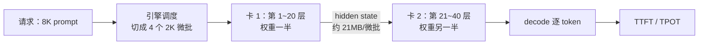

# 4.1 双卡怎么放：TP vs PP

## 开篇问题

二手卡市场上有个奇怪的定价：同一款核心的 AMD **计算**卡 MI50，16G 显存版稳定在五六百元，32G 版却被炒到两千多，而半年前它还只要八九百。你的预算约两千五，目标是跑第二部分算过显存账的那个千问 27B（口播转写型号，以模型卡为准；Q4_K_M 档权重约 16.5G，一张 16G 卡怎么都塞不下）。摆在面前两条路：加钱上被炒价的 32G 单卡，或者买两张 16G 拼起来。买大卡的理由很直白：显存大就是快，一张卡省心。第二种听起来违反直觉：多一层协作，不该更慢吗？

本章结束时你应该能独立完成三件事：说清两张 16G 拼 16.5G 模型时权重怎么放、卡间传什么；把一条 8K 输入在双卡上的流水线时间表亲手推一遍；对着自己的机器写出"选 PP 还是 TP"的依据，并交出一张双卡基准表。

核心问题一句话：**两张小卡为什么常常赢一张大卡？**

## 正文

### 全景：显存拼接解决"能不能"，切法决定"快不快"

第二部分的 44G 显存账其实已经偷偷用了一次"切"：两张 2080Ti 各装一半权重，账本按 44G 总盘子算。当时只关心加法，没问过减法：权重切开之后，一次前向怎么跨过两张卡完成？本章就回答这个问题。

先把对象放回链路。引擎收到一个 8K 的 prompt 后：



图里多了一个新部件：卡间链路。它消耗链路带宽与两张卡的显存算力，牵动的是你已有的几个指标：单卡显存占用减半、prefill 段的墙钟时间（TTFT）、逐字节奏（TPOT）、整套机器的价格（成本）。切法不同，这些指标的变动方向和幅度都不同。

两种切法先用抄书类比建直觉：一本书两个人抄，可以按章节分，你抄前半本、我抄后半本，中途交一次货；也可以把每一页撕成两半，每页两人各抄半页，每页互相核对再装订。前者是**流水线并行（pipeline parallelism，PP）**，后者是**张量并行（tensor parallelism，TP）**。类比到此为止：真实机制里"交货"和"核对"是两种代价悬殊的卡间通信，它们就是后面每节的主角。

▶ 动画：切换 TP/PP，看两种切法各把权重切在哪、卡间各传什么。

<div class="demo" data-demo="tp-vs-pp"></div>

先扫清两个容易踩混的记号。本章的 PP 指流水线并行；不少跑分表（包括本章引用的实测）把 prefill 吞吐也叫"PP 速度"，那是 prompt processing 的缩写，一个指切法、一个指阶段，读到数字时留意语境。另外，下一节用"40 层对半切"演示，40 层是举例口径；本章 TP 案例里的千问 27B 级实际约 64 层，切法同理。

### PP：按层接力，一次只交一份货

模型权重按层堆放。流水线并行把层分成两段：40 层模型左边放 20 层、右边放 20 层，1:1 对半切。数据像流水线上的工件：第一张卡算完自己的 20 层，把分界层输出的**隐藏层状态（hidden state，每层算完递给下一层的中间向量）**递给第二张卡，后者接着算。llama.cpp 里这套切法叫 layer split，参数名随版本变化，以官方文档为准。

接力要递的东西有多重？一条公式：

```
payload（单次传输量）= hidden_size × token 数 × 每元素字节数
```

hidden_size 是每层向量的宽度（27B 级为 5120，模型目录的 config.json 里可查）；token 数是这次交接携带多少个 token 的向量；字节按精度取，FP16 每元素 2 字节。prefill 阶段每个 2K 微批（3.2 定义过的 micro-batch，llama.cpp 叫 ubatch）交接一次：2048 × 5120 × 2 ≈ 21MB；decode 阶段每次只带 1 个 token：1 × 5120 × 2 = 10KB。

**已解示例**：这条 21MB 的交接，在一条很糟的链路上要花多久？矿卡飞线改装（补焊线路，详见 5.2）后常见的 PCIe 1.0 x4，带宽约 1GB/s：21MB ÷ 1GB/s ≈ 21ms。而一个 2K 微批过 20 层要多久？量级估算借用 3.1 贯穿案例的 prefill 实测 1700 tok/s（那是 TP 方案、双卡、完整模型的口径，这里只借它定数量级）：2048 个 token 过全部层约 1.2 秒，过一半层数折半约 0.6 秒。21ms 只占 3% 上下，而且传输可以与另一张卡的**计算**重叠。所以 PP 的接力几乎不挑互联，PCIe 1.0 x4 都无所谓；decode 的 10KB 更是零头中的零头。

**小练习（5 分钟）**：你的 64 层模型 hidden_size 5120、TPOT 20ms。decode 每吐一个 token 卡间传多少字节？每秒累计多少流量？据此用一句话回答：为什么 PP 的接力开销对 decode"近乎免费"。

### 为什么 PP 只赚 prefill：流水重叠与自回归的死结

PP 之所以能加速 prefill，靠的是**流水重叠**，不是算力翻倍。8K prompt 被引擎拆成 4 个 2K 微批。卡 1 把第 1 块的前 20 层算完、递出 hidden state 之后，不必干等，立刻回头算第 2 块。于是卡 2 在算第 1 块的后半段时，卡 1 同时在算第 2 块的前半段：两卡同时有活干，同一时刻系统在处理的约是 4K 个 token。单卡做不到：它必须把第 1 块的 40 层全部跑完，才开始第 2 块。

一处容易记过头的细节：这 4 块并非互不相干，后一块在同一层会通过注意力看到前一块的 KV 缓存（1.3 的机制）。流水重叠之所以成立，是因为处理顺序恰好没有破坏依赖：等第 2 块走到某一层时，第 1 块在该层之前的计算早已完成，它需要的 KV 已经就位。微批能"错峰过模型"，但不是"彼此无关"。

▶ 插画：流水重叠的时序，分填充、稳态、排空三段，以及 decode 为什么铺不开。

<div class="ill" data-ill="pp-pipeline-anim"></div>

decode 铺不开的原因写死在自回归里：下一个 token 的输入是上一个 token 的输出，任何时刻流水线上只有一个 token。它必须等前 20 层、后 20 层全部算完才能轮到下一个，手里永远没有第二块微批可以填空。

丑话说在前面：重叠不会因为买了双卡就自动生效，它要同时满足三个条件，少一个收益就打折。

1. **微批至少两块**。8K 切 2K 是 4 块；若 prompt 只有 1K、凑不满一个微批，流水线上只有一件工件，双卡 2 拍等于单卡 2 拍，零收益。
2. **两段负载大体均衡**。拍数账默认前后两段各花 1 拍；若切成 10+30，慢的那段说了算，快卡大量空转，加速比从"接近 2"塌向"1 倍多一点"。
3. **引擎真的在流水**。前一块交接完，下一块要立刻上卡；若调度被 KV 写回之类的杂务卡住，两卡轮流空转，重叠名存实亡。

所以 PP 对 decode **不提速、也不减速**。实测里三组对照的 decode 全部没有劣化；按机制推理，接力本该带一点固定开销，但 10KB 的交接被毫秒级的计算时间整个盖住。

*指标回看 · TTFT：从 3.4 的"prefill 瓶颈"视角看，本章第一次给了首字时间一个不动硬件的杠杆——只把权重按层切到两张卡，长输入的 prefill 段就因流水重叠缩短（幅度见下节实测），而 decode 段与逐字节奏原地不动。*

### 580 到 800：三组对照给出的实证

机制说完了，看实测。三组同卡对照，每组只动一个变量：权重放一张卡，还是按层切到两张卡；模型、量化档、prompt 长度、微批大小全部钉死：

- 2080Ti ×2，千问 27B 级 Q4_K_M：单卡 prefill 580 → 双卡 800 多，约 +38%~50%（UP 口播"提升了 50% 多"）；decode 不劣化；
- MI50 ×2，35B 级模型：单卡 600 多 → 双卡 1000 多，+60% 以上；decode 不劣化；
- 矿卡 CMP 170HX ×2，这种卡要补电路（飞线），改装后只剩 PCIe 1.0 x4：prefill 约 +72%，decode 不劣化。

三颗口径钉子先钉牢。其一，这几组口播只报了"PP 速度"的数值，单位与测法原资料未说明，本书按 tok/s 记。其二，35B 这个型号是口播转写、存疑；"+60%"这一条在两份资料的转写里分别写作 MI50 与 MI250，本书按 MI50 口径统一（MI250 是双芯大显存卡，与"两张 16G"的语境不符），精确卡型以视频画面与实测表为准。其三，"三组结论一致"之外还有一句常被当成实测的推论：**双 16G 的速度不输一张 32G**。实测对照其实是"单张 16G 对两张 16G"，35B 的权重恰好塞得进一张 16G，才有单卡基线；"不输 32G"是从"同核心算力相同"推出来的一步，成立前提是同代同核心、且走 PP 路径。

第三组故意选在最差条件下：没有 NVLink、没有卡间点对点直连（P2P，peer-to-peer），带宽只有 1GB/s 量级，PP 的 prefill 照样大幅加速。用 A 卡与 N 卡各测一遍，还顺带排除了厂商生态的干扰：AMD 那边对应 GPU 编程接口 HIP（AMD 版 CUDA，生态话题见附录 D）。规律是架构性的，不是某一家的实现福利。

这套实验是方法论样品，值得拆出**单变量对照纪律**：模型、量化、prompt、微批全部固定，唯一变量是放置方式；prefill 与 decode 分开记录。分开记录还有个体检作用：PP 的机制决定了它不该碰 decode，如果你的对照里 decode 掉了一截，说明混进了别的变量（层切不均、KV 或缓冲溢出、温度降频），这比"prefill 涨没涨"更值得先查。

*指标回看 · 吞吐：从 3.2 的"单引擎并发吞吐"扩展出多卡对照口径——+50%（580 → 800 多）指同一 prompt 集上双卡 PP 相对单卡的 prefill 吞吐增益；decode 列不动，正是"增益只来自流水重叠"的证据。*

**小练习（5 分钟）**：判断题："两张卡算力翻倍，decode 也应该快一倍。"错在哪？（提示：decode 的流水线上同时有几个 token？第二张卡在等待什么？）

### TP：每层切开，每层对一次答案

PP 把层与层之间切开，TP 把**单层内部**切开：每层的权重矩阵按行列分块，两卡各拿一半、同时算这一层，再用**全局规约（all-reduce）**合并。合并的含义是所有卡交换各自的部分和、各自得到同一个完整结果的一次集合通信。代价是每一层都要合并：约 64 层、每层 2 次，再加输出层 1 次，一次前向约 129 次（口径说明：实测视频口播只报了"约 129 次"的总数，"每层 2 次"是按 129 ÷ 64 反推的均分拆法，精确值以模型结构与 profiler 为准）。

prefill 变长不会增加合并次数：8K 还是 64K，一轮前向都是约 129 次，变的只是单次 payload（2K 微批约 21MB，64K 输入则大得多）。decode 反过来：每吐一个 token 都要完整跑一轮前向，也就是 129 次 10KB 的小通信。TP 之下，两个阶段的合并次数相同，差别全在单次 payload：prefill 一次 21MB 级，decode 一次 10KB 级。这决定了两阶段对链路的要求不同：prefill 的单次搬运毫秒级，看路有多宽（带宽敏感）；decode 的 10KB 搬运本身不到微秒，但每次通信的固定开销（发起、同步）乘上 129 次，要挤进每 token 十几毫秒的预算，看的是来回多快（延迟敏感）。这笔账 4.2 算完整：payload 乘次数，一轮长输入前向的卡间通信量能到 GB 量级。

到这里，两种切法的画像齐了：

| | 流水线并行 PP | 张量并行 TP |
| --- | --- | --- |
| 切的位置 | 第 20/21 层之间，切一次 | 每一层内部，层层切 |
| 卡间通信 | 每微批交接一次 hidden state | 每层 all-reduce，约 129 次/前向 |
| prefill | 流水重叠，实测 +38%~72% | 提速，但吃卡间带宽 |
| decode | 不提速、不减速 | 等效带宽翻倍，上限更高 |
| 对互联的要求 | 几乎不挑，PCIe 1.0 x4 都行 | 挑带宽，更挑延迟 |

**小练习（8 分钟）**：算 TP 两个阶段的每秒卡间流量。decode 一侧：129 次 × 10KB ≈ 1.29MB/token，按实测 50 tok/s 折算约 66MB/s。prefill 一侧：先算一个 2K 微批的通信总量 129 × 21MB ≈ 2.7GB；再注意一件事：摊到每个 token，prefill 恰好也是 129 × 10KB ≈ 1.29MB，和 decode 一模一样，变的只有速率。按 1700 tok/s 折算约 2.2GB/s。两个每秒流量相差约 34 倍，正好是 1700 ÷ 50：同样的字节量，prefill 以 34 倍的速率在搬，所以它对带宽敏感；decode 把同样的量摊进每 token 二十毫秒，所以它对延迟敏感。

### TP 为什么能救 decode：等效带宽翻倍

decode 想快，PP 无能为力，TP 却正打在痛点上。第二部分与 3.4 的结论：decode 是访存受限的，每吐一个 token 要把权重完整读一遍。TP 让两卡各存一半权重，每张卡每次只读一半，**等效显存带宽翻倍**，decode 的理论上限随之翻倍。

**已解示例**：一张 2080Ti 显存带宽 616GB/s，20G 的 INT4 权重，单卡 decode 理论上限 ≈ 616 ÷ 20 ≈ 31 tok/s。双卡 TP：合计带宽约 1.2TB/s，权重还是 20G（各存 10G、并行读）→ 1232 ÷ 20 ≈ 62 tok/s。实测那套双 2080Ti 22G + NVLink 桥、27B 稠密模型配 AWQ INT4 权重（AWQ 是激活感知权重量化，第二部分讲过的 INT4 档位之一）：裸 decode 约 50 tok/s，打了个八折，折扣正是上一节的 129 次通信与同步、KV 读取和内核效率（decode 的瓶颈从来不止权重搬运）。开 MTP（3.5 的投机解码）后翻到 80~100 tok/s，prefill 约 1700 tok/s。整套机器约 4500 元，对照物是约 5 万元的专业卡（"可能也就是这个速度"，口径与出处见章末）。

注意两处限定。其一，31 与 62 是理论上限口径，不是实测推算。其二，TP 的收益依赖互联质量：拓扑（卡与卡、卡与 CPU 之间怎么连，4.2 专讲）尚可时 decode 通常仍明显快过单卡，但窄路上 129 次通信的固定开销会先吃掉一部分收益；而 PP 全程只递几 MB 的货，对链路几乎无所谓。

## 完整算例

**已知条件**：8K prompt（8192 token）；微批 2K → 4 块；模型 40 层（举例口径，视频演示设定；27B 级约 64 层，方法不变）；两卡 1:1 对半切（20+20）；把"一块微批过 20 层"的时间记作 1 拍；卡间传输与调度开销先按零计（这是假设，不是事实）；本算例只算 prefill。

**要回答的问题**：prefill 的墙钟时间，双卡 PP 相对单卡省多少？

**推演规则**：单卡没有流水，4 块微批串行过 40 层，每块 2 拍。双卡两级流水：卡 A 算完一块的前半段、递出后立刻接下一块；总拍数 = 填充 1 拍 + 稳态（块数 − 1）拍 + 排空 1 拍 = 块数 + 1 拍。一般式：两级流水、N 块时，单卡 2N 拍、双卡 N+1 拍。

**甘特图**：

```
时间（拍）     1     2     3     4     5
卡A 前20层    块1   块2   块3   块4    —
卡B 后20层     —    块1   块2   块3   块4
```

**代入与检查**：N=4 → 单卡 8 拍、双卡 5 拍；墙钟比 5/8 = 62.5%，吞吐理论上限 8/5 = 1.6 倍（+60%）。拍是无量纲时间单位，比值无量纲，量纲闭合。这份账默认上一节三个条件全部成立：块数 N ≥ 2、两段各 1 拍、交接即上卡。任一条不成立，就按那里说的折：N=1 时单卡双卡都是 2 拍，收益归零；两段失衡时节奏向慢段塌缩。块数越多越接近两级流水的极限：N→∞ 时 2N ÷ (N+1) → 2，即"至多翻倍"，只有两级，翻倍就是天花板。

**口径声明：这是理论上限，不是实测**。实测 580 → 800 多即 1.38~1.5 倍（UP 口播"+50% 多"；按 800 整算是 +38%，按 870 算恰为 +50%，口播倍数有取整，建议按倍数区间理解）。第三组 170HX 录得 +72%，高于 1.6 倍的模型预测，多半是单卡基线另有拖累（原资料未说明具体原因）。这也提醒你：实测可以从两个方向偏离简单模型。

**误差来源**：其一，传输不为零，4 块共约 84MB（4 × 21MB），在 PCIe 1.0 x4（约 1GB/s）上合计约 84ms，对 10 秒量级的 8K prefill（8192 ÷ 800 ≈ 10s）不到 1%，且与计算重叠；其二，填充与排空的占比随块数变化，块越少损失越大；其三，对半切但各层计算量不严格相等；其四，实测含引擎调度与测速开销。

## 贯穿案例的最终分析

回到开篇那笔两千五的购买决策，用本章的结论完整走一遍。

第一步，解决能不能。千问 27B 级的 Q4_K_M 权重，本书账本口径约 16.5G（视频口播口径约 25G，两处口径不同，标准口径 16.5G 见 2.4，以模型页实测为准；无论哪个数，16G 单卡都装不下）。两张 16G 按 1:1 对半放，每卡 8G 多，剩下留给 KV 缓存与计算缓冲。显存拼接把"能不能"从否决变成可行。

第二步，定切法。你的主板没有 NVLink 桥、卡走 PCIe 常规链路。按本章机制与实测，PP 是风险最低的起点：三组对照在窄到 PCIe 1.0 x4 的链路上仍录得 +38%~72%（prefill），decode 全部不劣化。操作上守单变量纪律：先测单卡基线，再切双卡，prefill 与 decode 分开记录；decode 若掉了，先查混入变量，不急着下结论。

第三步，decode 想快再谈 TP。等效带宽翻倍把理论上限从约 31 提到约 62 tok/s，但兑现它需要像样的卡间互联，这一步要分卡路线说。NVLink 桥是英伟达的卡间专线：那套双 2080Ti 22G + NVLink 的方案（约 4500 元整机）就是走通全程的样子，裸 decode 约 50、MTP 后 80~100、prefill 约 1700 tok/s。你若照开篇买了两张 MI50，卡间对应的高速互联叫 xGMI，能不能用要看卡与主板的支持，判断工具在 4.2。在那之前，先按第二步把 PP 跑稳，TP 的账等拓扑读明白再算。

第四步，回到钱。一张 32G 现价 2000~2500 元，两张 16G 约 1100 元。省下的一千多留作升级本钱：N 卡路线够买二手 NVLink 桥（约 200 元）还有富余；A 卡路线先留着，等 4.2 读完拓扑再决定花不花。同核心的 32G 版相对 16G 版，硬件上的唯一差异是显存容量，而显存拼接恰好把这个优势整个拿走。溢价买到的是"只管一张卡"的省事，速度上换不来什么。

最后把"两张小卡赢一张大卡"这句口号按成立条件拆开，它是经验观点，不是定律：同核心、同算力、只差显存时成立；模型大到单卡吃紧时成立（小模型单卡反而少一层协作开销）；prefill 口径是"稳赢"，decode 口径是"不输，互联好时 TP 上限更高"；对象是语言模型（文生图、文生视频模型不在此列）；价格维度跟着行情走，32G 溢价退潮时这笔账要重算。提出它的 UP 主的总结是"买显卡做推理，不是买显存去推理"：显存决定能不能跑，切法与互联决定多快，两本账别混着记。

## 理解检查

1. 计算：12K prompt、2K 微批（6 块）、40 层对半切。单卡几拍、双卡几拍、加速比多少？与 N=4 时的 1.6 倍相比，方向是更接近 2 还是更远？声明你的答案属于哪种口径。
2. **条件变化**：同一套双卡 PP 机器，任务从"8K 输入 + 200 token 摘要"换成"500 token 输入 + 4K 代码输出"。对照本章流水重叠的三个条件说：PP 的收益会发生什么变化？此时想让逐字变快，该动哪个旋钮？
3. **排障**：朋友把模型按层切到两张卡后，prefill 快了四成，decode 却比单卡时慢了 15%。按本章结论 decode 不该被 PP 改变。列出至少三个可能混入的变量和对应的检查动作。
4. **选型**：卡间只有 PCIe 1.0 x4（矿卡飞线机器），你的任务 decode 占大头。选 PP 还是 TP？写出依据（提示：PP 在 decode 上连"收益"都没有，只有 TP 有机会；TP 的 129 次通信在窄路上的代价，先跑小基准验证再下结论）。

## 动手实验

**环境**：Linux 双卡机（两张同型号卡，有无 NVLink 均可，PP 的卖点恰恰是不挑互联）；llama.cpp 编译出的 llama-bench；一个单卡装不下的 Q4 模型（如 27B 级 Q4_K_M，约 16.5G）；磁盘余量 20G。无双卡环境：改做完整算例的纸面复算，并用本章案例数据代回核对，注明口径。

**步骤与命令**（参数名随版本变化，以 llama.cpp 官方文档为准；vLLM 对应 `--pipeline-parallel-size 2` / `--tensor-parallel-size 2`）：

```bash
nvidia-smi topo -m   # 先存拓扑截图（读法在 4.2，这里只存档）
# A. 单卡基线
CUDA_VISIBLE_DEVICES=0 llama-bench -m qwen-27b-q4_k_m.gguf -p 8192 -n 128 -r 3
# B. 双卡 PP（layer split）
llama-bench -m qwen-27b-q4_k_m.gguf -p 8192 -n 128 -sm layer -ts 1,1 -r 3
# C. 双卡 TP（层内切）
llama-bench -m qwen-27b-q4_k_m.gguf -p 8192 -n 128 -sm row -ts 1,1 -r 3
```

**应记录的项**：模型与量化档；卡型、显存、互联方式；每组 prefill（pp 列）与 decode（tg 列）三轮均值与极差；单卡 → PP → TP 的两个增益百分比。

**预期现象**：B 组 pp 列上涨（案例区间 +38%~72%）、tg 列基本不动；C 组 tg 列上涨（幅度看互联）、pp 也涨；任何一组 tg 掉幅超过 5%，先回头查混入变量。

**失败排查**：模型单卡装得下 → 对照退化成"纯切分开销"测试，换更大模型或明说前提；B 组 tg 明显下滑 → 查切分是否均分（-ts）、单卡 KV 与缓冲是否溢出（nvidia-smi 分卡看），顺带确认引擎确实看到了两张卡；OOM → 减小 -p 或换更小档位；单卡或纯 CPU 环境 → 做纸面复算版，别硬跑。

**产出**：双卡基准报告，一张三行两列的表（单卡 / PP / TP × prefill / decode）加全口径注记（模型、量化、卡、互联、prompt 长度、微批、并发）。这张表是 4.2 互联章的直接输入；带 NVLink 桥的机器加测一组拔桥对照更好。

## 本章能力清单

对照本章的学习目标：

- ✅ **区分** TP 与 PP 的切法、通信形态与适用场景（全景与两节机制 + 对比表 + 理解检查 4）；
- ✅ **解释** PP 让 prefill 重叠、decode 不重叠的因果（微批错峰 vs 自回归串行），并列出重叠成立的三个条件（流水重叠一节 + 理解检查 2）；
- ✅ 计算 PP 的卡间 payload 与两级流水的拍数推演，并声明理论上限口径（payload 公式 + 完整算例 + 理解检查 1）；
- ✅ **比较**实测增益区间（+38%~72%）与 1.6 倍理论值的关系，识别口径差异（实证一节 + 完整算例）；
- ✅ **选择**给定预算、卡路线与互联条件的双卡放置方案，并用单变量对照纪律验证（贯穿案例 + 理解检查 3、4 + 实验）。

## 与下一章的衔接

本章两次碰到同一堵墙：PP 递 21MB 可以忽略，TP 递 129 次就要讨价还价。但"多重"还不是"多久"，决定"多久"的链路本身还没拆开：PCIe 的代际与通道数、NVLink 桥有多宽、卡和 CPU 之间怎么连（拓扑）、为什么 decode 对普通直连不敏感而 prefill 明显变慢、矿卡飞线怎么毁掉 TP。下一章（4.2 卡间互联）把 payload 公式补完整：4K 输入的单次 payload 是 2K 微批的两倍（约 42MB），乘 129 次约 5.4GB 一轮前向。你实验报告里顺手存的那张 `nvidia-smi topo -m` 截图，下一章就是教材。

## 资料来源与延伸观看

- 三组同卡对照与低带宽结论（170HX +72%、2080 +50%、decode 不劣化、PCIe 1.0 x4 下的 PP、hidden state 交接量级、4K prompt + 2K ubatch 配置）：BV1dx3Q6iEbZ。该资料的转写把"+60%"一条的卡型写作 MI250，与"两张 16G"语境不符，本书按 MI50 口径统一并标注存疑。
- MI50 行情与双卡对照（32G 版 800~900 元炒到 2000~2500 元、16G 版稳定 500~600 元、35B 级 600 多 → 1000 多、27B Q4_K_M 580 → 800 多、"买显卡做推理，不是买显存去推理"、四张 16G 建议）：BV1YxjU6qEuw。口播"PP 速度"未报单位与测法，本书按 tok/s 记（原资料未说明）。
- 双 2080Ti + NVLink 的完全体数据（裸 decode 约 50、MTP 后 80~100、prefill 约 1700 tok/s、约 4500 元 vs 约 5 万元专业卡）：BV1nVVr6QEFq（现场口径）；基准与 MTP 前后对照同见 BV1Y2LX61EjQ，其拓扑降级实验留待 4.2 展开。视频清单与全部出处见附录 B。
- 工具与参数：llama-bench 的 `-sm`（layer/row）与 `-ts`、vLLM 的并行参数，均以各自官方文档当前版本为准。
- 原资料未说明之处：三组对照"PP 速度"的单位与测法；+72% 高出两级流水理论上限的原因；三组对照 decode"不劣化"的具体读数（原始 tok/s 未披露）；TP 案例模型的层数与 hidden_size 以 config.json 与 profiler 为准。本文未作推断，留待 4.2 与你自己的基准报告补齐。
