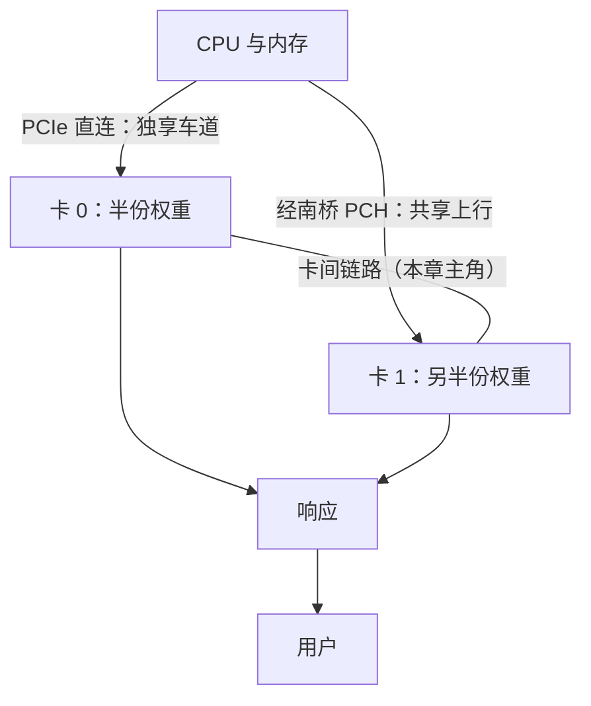

# 4.2 卡间互联：NVLink、PCIe 与通信账

## 开篇问题

上一章你把放不进单卡的模型切进两张卡，交出了双卡基准报告。报告之外还有两笔真实的账。其一，二手市场那套双 2080Ti 22G 方案（约 3500 元，装机单见章末）常被商家搭一句"双卡必买 NVLink 桥接器，加几百块"。桥该不该加钱，取决于卡间到底要搬多少货。其二，同样是两张同款卡、同一个模型做张量并行，有的机器 prefill 明显偏慢。差别不在卡，在卡和卡之间那条路上。

本章只回答一个核心问题：卡和卡之间的路有多宽？学完你能做五件事：数清一条卡间链路的宽度与来路；按切法算出一次前向的卡间搬运量；判一条路对 prefill 和 decode 各够不够用；读懂自己机器的拓扑；回到开篇，回答那几百块该不该花。

## 正文

### 全景：这条路只在多卡时收费

单卡跑推理时，"卡间链路"根本不存在；上一章把模型切到两张卡后，它才出现在链路图里。它的位置横在两张卡中间，不在请求进出的主干道上，前向算到一半可能要在这里走一遭：



图里"南桥"一词下一节才展开，这里只需知道从 CPU 引出来的车道有直连与绕行两种来路。输入输出都没变，变的是账单：卡间通信的时间夹在两段计算之间，直接给吞吐打折，prefill 的通信惩罚最先体现在首字等待上。这条路只在双卡及以上场景收费，收多少取决于两个变量：路有多宽（本章前半），上面跑多少趟车（4.1 的通信频率，本章后半变成能算的数）。

### 路有多宽：lane、代际与南桥

先修地基。PCIe 是显卡与 CPU 之间的常规公路，基本单位是 **lane（通道）**，一组收发对线；x1、x4、x8、x16 就是并排几股车道。宽度账只有一个公式：链路带宽 = 单 lane 速率 × lane 数。两个变量都要问清，缺一个都会买错卡。

| 代际 | 单 lane 单向 | x16 合计 |
| --- | --- | --- |
| PCIe 1.0 | 250 MB/s | 4 GB/s |
| PCIe 2.0 | 500 MB/s | 8 GB/s |
| PCIe 3.0 | 约 1 GB/s | 约 16 GB/s |
| PCIe 4.0 | 约 2 GB/s | 约 32 GB/s |
| PCIe 5.0 | 约 4 GB/s | 约 64 GB/s |

先记两个锚点：PCIe 1.0 x4 约 1 GB/s（本章末尾的极端案例主角），PCIe 3.0 x16 约 16 GB/s（老平台双卡常见配置）。注意这是单向理论值，实际有效吞吐要扣掉协议开销打些折扣，够做量级判断，别拿来当精确预算。

**已解示例**：商家说"这块卡是 PCIe 4.0，比他那张 3.0 的新一代"。代际新不等于路宽：4.0 x4 是 2 GB/s × 4 = 8 GB/s，3.0 x16 是 1 GB/s × 16 = 16 GB/s，旧的反而宽一倍。判断路宽总要乘出"速率 × 车道数"，别只看一个。

**小练习（3 分钟）**：一台迷你主机用 M.2 口转出 PCIe 3.0 x1 挂卡。算一算这条链路每秒能搬多少 MB；再对照"TP 一次 4K prompt 的前向要在卡间搬约 5.4GB"（下一节算这笔账），说说这条路靠不靠得住。

车道也不是凭空长的，起点是 CPU 里的 **root complex（根复合体）**。直连 CPU 的车道独享带宽、延迟最低；挂在**南桥（PCH，Platform Controller Hub，芯片组）**下的插槽，要先在南桥汇合、再挤一条上行链路回 CPU。消费级主板通常只有一条 x16 直连，其余插槽和 M.2 口都在南桥后面。M.2 口走的就是 PCIe 通道，所以能转出 x1/x4 来挂卡。服务器平台正相反：EPYC 7002/7003 可以给到 128 条 PCIe 4.0，至强 W 也有多条 x16 直连。同样叫"双卡"，插槽挂在哪，宽窄与通畅就已定。

▶ 动画：拖动 token 数，看同一笔通信账在三种宽度的路上各要搬多久。

<div class="demo" data-demo="pcie-bandwidth"></div>

### 同一个 root 才好抄近道：拓扑与 P2P

路宽之外还有第二个问题：两卡之间的数据走哪条线？最直接的想法是 **P2P（peer-to-peer，点对点直连）**，两张卡经 PCIe 直接互访对方显存，不绕 CPU。能不能走通看拓扑（topology，卡与 CPU 之间的连接结构）：两卡在同一个 root complex 下，P2P 可用；一张直连、一张挂南桥，就得多绕路，甚至绕不通。

家用主板上凑出"同一 root"常见三种手段。**通道拆分（bifurcation）**：BIOS 里把一条 x16 拆成 x8+x8，两卡仍在同一 root 下。**转接卡（riser）**：只挪位置不生带宽，插上去是 x4 就只有 x4。**PLX switch（PCIe 交换芯片拆分卡）**：交换芯片一分多，能用，但多一跳、多一笔钱。还有一个容易漏掉的前提：P2P 不是所有卡都支持。有实测反例，3080 20G 单卡不弱，却不支持 P2P 拷贝，双卡并联未必占优（来源：BV1hLtG6ZE5M）。

拓扑怎么影响真实装机，有个把"每条车道来路数清楚"的完整例子（来源：BV12ZEN6CEho）：1L 迷你主机 M720q（i3-9100T），靠转接卡把通道分成一路 x8（PCIe 3.0，直连 CPU）和一路 x4（走南桥），M.2 再转出 PCIe 3.0 x1；两张 2080Ti 只接 x4 与 x1，卡间用 NVLink 互联实现 P2P，省下的 x8 引出接第三张卡。窄成这样还能双卡跑 27B，取舍逻辑是：卡到卡的通信走 NVLink 专线，不占那几条可怜的 PCIe 车道；"卡到 CPU"的路只承担装载权重这类一次性流量，慢点也就是开机多等十几秒。慢路留给不常走的流量，是插槽紧张时的通用解法（后半句是本书补的工程解释，视频原话没这么概括）。

### 通信账：一次前向要搬多少数据

路宽定了，接着数车次。卡间通信总量 = 单次 payload × 通信次数。单次 payload（单次传输量）有一条公式：

```
payload = hidden_size × token 数 × 每元素字节数
```

为什么按这条公式算？TP 对答案时交换的是这一层的**激活**，不是权重：每个 token 在这层有一条宽度 hidden_size 的向量，合并一次就是全部 token 的向量各发一份。hidden_size（隐藏维度，模型每一层内部向量的宽度）从模型目录的 `config.json` 里读，27B 级约 5120；每元素字节数由激活精度决定，FP16 就是 2 字节。次数由切法决定：上一章说过，TP 把单层内部切开，两卡各算一半后要靠全局规约（all-reduce，把两份半成品合并成完整结果的通信操作）对答案，每一层都要对，一次前向约 129 次。

129 要多说一句：实测来源只报了总数；"每层 2 次 × 约 64 层 + 输出层 1 次"是按总数反推的均分口径，复算可用，不当精确事实。

这组公式能对上一份真实 profiler（性能剖析器）统计（来源：BV1Y2LX61EjQ，双 2080Ti 22G + NVLink 桥，千问 3.6 27B（口播转写型号，以模型卡为准），TP-2），两阶段的账分开摆：

- **prefill**：4K prompt 的逻辑发送总量 5G 多、合并 129 次；prompt 加到 64K，总量暴涨到约 80G，合并次数仍是 129 次。prompt 变长，变大的是单次 payload，次数不变。
- **decode**：吐 128 个 token，总量只有 161MB，却合并了 1.6 万多次；吐 1000 个 token，总量约 1.26G，合并约 13 万次。吐得越久，变多的是次数，单次 payload 一直小得可怜。

两笔账都能复算，复算顺便教会你读二手数字的单位：

- 64K 复算：5120 × 65536 × 2 ≈ 671MB，乘 129 ≈ 86.6GB（十进制）= 80.6GiB（二进制），对上"约 80G"，这份统计的 G 按 GiB 读吻合；GB 与 GiB 差约 7%（2.1 的口径），是个活例子。
- decode 复算：单次 payload = 5120 × 1 × 2 = 10,240 B = 10KiB；乘 129 ≈ 1.26MiB/前向；乘 128 ≈ 161MiB，对上"161 兆"；乘 1000 ≈ 1260MiB，源资料写作"1.26G"，按"MiB 的千进位"读法正好吻合（严格换算是 1.32GB 或 1.23GiB，量级一致）。同一份统计里 80G 像 GiB、161M 像 MiB、1.26G 像 MiB 的千进位。二手数字口径不整齐是常态，复算就是把每种读法都试一遍，对得上的那个才是它的单位（此读法为本书推断，原资料未说明）。

**已解示例**：decode 的合并次数为什么恰是"输出 token 数 × 129"？每吐一个 token 要完整跑一遍前向，每个前向约 129 次 all-reduce，所以 128 × 129 ≈ 1.65 万次、1000 × 129 ≈ 12.9 万次，与 profiler 的"1.6 万多次""约 13 万次"逐一对上。

**小练习（5 分钟）**：不查任何资料，用 payload 公式算 decode 吐一个 token 时的单次 payload（提示：token 数为 1，hidden_size 5120，FP16）。再解释 4.1 里"decode 每 round 卡间只交几 KB"的说法和你的结果是否一致。

*指标回看 · 吞吐：上一章它是两卡叠加后的产出速率，本章给它记上通信惩罚——一次前向数 GB 的搬运夹在计算之间，链路越窄、输入越长，扣得越狠；而"1700 tok/s"这类数字，是宽路加专线条件下的成绩。*

### 两种敏感：prefill 挑带宽，decode 挑延迟

把两阶段的通信画像并排放，它们挑的东西不一样。

prefill 挑带宽。payload 动辄几十 MB，搬运时间 = 体积 ÷ 带宽，带宽翻倍、搬运时间减半，这就是**带宽敏感**。

decode 挑延迟。payload 只有 10KiB，搬运本身不费时间，但每次通信都带一份固定开销（发起、同步、握手），129 份固定开销要挤进吐一个 token 的预算里。预算有多紧？4.1 借过的口径：decode 约 50 tok/s，每 token 约 20ms，129 次通信每次只摊到约 155µs。次数一多，按次计费的固定开销就成了主要支出。这就是**延迟敏感（latency）**。

还有一个更容易被"平均数"骗过的坑。完整算例会算出：prefill 期间链路平均只需供出约 2.2GB/s，PCIe 3.0 x16 的 16GB/s 供给绰绰有余；可实测里 x8 拆分就让 prefill 明显变慢，账面够用，疼从哪来？因为 2.2GB/s 是把 129 次突发摊平的错觉。真实过程是每层算完，两卡停下来对一次答案，42MB 要在这一层约 18ms 的时间预算（2.4s ÷ 129）内搬完；按 x8 的 8GB/s 算，光搬运就要约 5ms，再叠同步等待与协议开销，层层累加就成了"平均够用、突发疼痛"。all-reduce 的物理实现（环状、树状）还会让数据在链路上不止走一遍，再添一笔。平均数口径看的是容量够不够，突发口径看的是等不等，两个都真，回答的问题不同。

有一组分级对照把这件事钉死（同一项目同一模型，只动拓扑），引用前先把置信级别分开记账。第一级，profiler 的通信账：实测。第二级，作者的经验判断（原话带"可能"，源笔记标注不一，按经验理解更稳）：服务器级平台（EPYC、至强 W 一类，多条 x16 直连 CPU）跑 TP，decode 与 NVLink 直连基准几乎一致，prefill 仍受带宽一定影响；家用主板把直连 CPU 的 x16 拆成两个 x8（同一 root、仍可 P2P），decode 只掉 3%~5%、基本可忽略，prefill 却明显变慢。decode 不挑带宽，prefill 挑。第三级，作者自标推测（明说未实测）：一张 x16 直连、另一张走南桥 x4，decode 和 prefill 都会明显下降。

基准数字值得存档，口径给全：双 2080Ti 22G + NVLink 桥、千问 3.6 27B、TP-2，prefill 约 1700 tok/s，decode 不开 MTP 约 50 tok/s、开 MTP 约 100 tok/s（MTP 是多 token 预测，一种投机解码，3.5 已讲）；作者声明这是最高速度、不保证稳定复现。对照本节的账：decode 每前向只搬 1.26MiB（10KiB × 129），x8 窄路几乎不疼；prefill 每前向 5GB 级、还按每层一次突发搬，路一窄立刻显形。两阶段对同一条路的容忍度差三个数量级。

*指标回看 · TTFT：4.1 里它靠 prefill 流水重叠被压短，本章补上它的另一个变量——卡间带宽；拓扑从 x16 直连降到 x8 拆分，decode 只掉 3%~5%、prefill 却明显变慢，用户最先感觉到的就是首字变慢。*

### NVLink：不占车道的专线

既然 TP 每层都要通信，自然会想到给"卡到卡"单独修一条路，不跟卡到 CPU 的流量抢车道。NVLink（英伟达的卡间直连总线）就是这条路：不占 PCIe lane，从卡侧直接拉线到另一张卡。2080Ti 的 NVLink 2.0 有两条链路、双向共约 100 GB/s，约为 PCIe 3.0 x16 双向带宽（31.5GB/s）的 3 倍余（口径：同为双向；源资料"6 倍"拿双向对单向，本书改按同口径记账）。AMD 的对应物叫 xGMI（MI50 出现在本章末尾的案例里，用的就是它）。跨机的 ConnectX-7 网卡、USB4（给 PCIe 做隧道的协议）属于同一条故事线，记住名字即可。

NVLink 不是魔法，边界有两条。其一，它只解决"卡到卡"：装载权重仍走 PCIe，磁盘到显存那十几秒照旧。其二，收益只在通信频繁的切法上兑现：TP 每层都对答案，专线价值最大；PP 全程只交几次货，专线闲置。两条合起来正好回答开篇的问题：桥接器要不要买看切法，不看商家话术。

▶ 插画：卡间互联的全景路线图，直连、南桥、拆分、专线，一条条数清来路。

<div class="ill" data-ill="interconnect-map"></div>

### 极端对照：PCIe 1.0 x4 照样能赚

如果把"路宽"压到极限，多卡还值得吗？有个反直觉的实测案例（来源：BV1dx3Q6iEbZ）：矿卡 CMP 170HX 补电路飞线（手工焊线补回被裁掉的电路）改装后只剩 PCIe 1.0 x4，约 1 GB/s，比 3.0 x16 窄 16 倍。三组同卡对照、双卡流水线并行（llama.cpp 的 layer split），负载为千问 3 系列 Q4 模型（约 25GB，视频口播口径，标准口径 16.5G 见 2.4；单张 16G 放不下）、4K prompt 加 2K ubatch（微批，把长 prompt 切块喂入）：prefill 比单卡快约 72%，decode 不劣化；另两组录得 MI50 快约 60%、2080 快约 50%，decode 同样不劣化。三颗口径钉子："+60%"的卡型在两份资料转写里分别作 MI50 与 MI250，本书按 MI50 统一并存疑（与 4.1 同一把钉子；MI250 是双芯大显存卡，与"两张 16G"语境不符）；"+60%/+50%"两组的模型与配置原资料未逐组说明（4.1 记 MI50 组为 35B 级）；结论限定在语言模型，不覆盖文生图、文生视频。

解释就在 payload 公式里：PP 每个 micro-batch 只在层间接力一次，2K 的 ubatch 对应 5120 × 2048 × 2B ≈ 21MB（=20MiB，4.1 的 21MB 是十进制读法），decode 每轮更是只有 10KiB。车次少、单次货也不重，1 GB/s 的窄路照样供得上流水重叠。这把 4.1 埋的伏笔收了尾：PP 几乎不挑路，TP 挑带宽更挑延迟；"没有 NVLink、没有 P2P、没有大带宽，多卡照样能加速"成立，条件是走 PP。

### 读出自己的拓扑：两条命令

讨论最后落到一步：查自己机器的账。第一条命令 `nvidia-smi topo -m` 打出交叉表，每对卡之间的格子写着连接类型：`NV#`（NVLink 几条链路，专线在位）、`PIX`（同一 PCIe switch 即交换芯片内，P2P 最快）、`PHB`（同经一个 root complex，普通 PCIe 相邻）、`SYS`（跨 CPU，最差）。第二条看协商结果：`sudo lspci -vvv -s <设备地址> | grep LnkSta`，`Width x16` 是车道数，`8GT/s` 对应 3.0、`16GT/s` 对应 4.0；`nvidia-smi -q` 的 GPU Link Info 一节也有同样信息（命令细节随驱动版本可能变化，以官方文档为准）。想实测 P2P，可以编译 cuda-samples 里的 `p2pBandwidthLatencyTest`，直接看 P2P 是否启用、带宽多少。

查到数字后做一步换算，路的地位立刻清楚：显存带宽 600 GB/s 的卡，若卡间（或卡外）链路协商成 PCIe 3.0 x4 约 4 GB/s，只有显存带宽的约 1/150。offload 为什么慢、双卡为什么都怕通信，一算就有体感。这笔 1/150 的账先记下，下一章它当主角。

## 完整算例

**已知条件**（口径全列）：千问 3.6 27B 稠密模型（口播转写型号，以模型卡为准），TP-2；hidden_size = 5120（模型 config.json 口径）；层数约 64（config 口径）；激活精度 FP16，每元素 2 字节；prompt 长度 4096 token（4K）；all-reduce 次数 = 每层 2 次 × 约 64 层 + 输出层 1 次 ≈ 129 次/前向（拆分口径为按总数反推，实测来源只报"约 129"）。

**要回答的问题**：prefill 吞下一个 4K prompt，卡间总共要搬多少数据？换算成持续带宽需求，什么样的路供得上？

**公式**：

```
单次 payload = hidden_size × token 数 × 每元素字节数
一次前向通信总量 = 单次 payload × all-reduce 次数
持续带宽需求 = 一次前向通信总量 ÷ prefill 耗时
```

**逐变量解释**：hidden_size 乘 token 数得到一次合并要搬运的元素个数（每元素是宽度 5120 的激活向量在 4096 个位置上各一份），乘 2 字节换算成体积；乘次数得到整个前向的逻辑发送总量；prefill 耗时用实测 prefill 速度（1700 tok/s）反推，总量除以耗时即链路需持续供出的带宽。

**代入**：

- 单次 payload = 5120 × 4096 × 2 B = 41,943,040 B ≈ 42MB（十进制口径 41.9MB，二进制口径 40MiB）；
- 一次前向总量 = 41.9MB × 129 ≈ 5.4GB；
- prefill 耗时 ≈ 4096 ÷ 1700 ≈ 2.4s，持续带宽需求 ≈ 5.4GB ÷ 2.4s ≈ 2.2GB/s。

**数量级与单位检查**：元 × token × 字节/元 = 字节，量纲闭合；MB × 次 = MB，除以 1000 进 GB。交叉验证两处：64K prompt 时单次 payload = 5120 × 65536 × 2 ≈ 671MB，乘 129 ≈ 86.6GB（十进制）= 80.6GiB（二进制），对上 profiler 的"暴涨到约 80G"；decode 端 10KiB × 129 = 1.26MiB/前向，乘 128 ≈ 161MiB、乘 1000 ≈ 1260MiB，分别对上"161 兆"与"1.26G"（三种 G/M 的读法见正文复算）。

**口径声明**：这是逻辑发送量的理论账（与 profiler 统计口径对应），不是链路物理流量实测；2.2GB/s 用"最高速度口径"的 1700 tok/s 反推。

**误差来源**：其一，均值口径掩盖突发结构：2.2GB/s 是摊平的均值，真实流量是每层一次约 42MB 的同步突发，要在每层约 18ms 预算内完成，加上 all-reduce 物理实现（环状、树状）让数据在链路上不止走一遍，线上真实流量大于逻辑账；实测里 x8 拆分令 prefill 明显变慢，而按均值账 2.2GB/s 对 8GB/s 供给"不该这么疼"，这处偏差正是本条的活例子。其二，层数与"每层 2 次"的拆分是估算口径。其三，GB/GiB 差约 7%。其四，payload 之外还有协议头与对齐开销，原资料未说明，未计入。

## 贯穿案例的最终分析

回到开篇那笔钱：双 2080Ti 22G（约 3500 元）之外，NVLink 桥接器要不要加几百块？把决策过程走完。

第一步问切法。计划用 PP（比如显存刚不够、跑 llama.cpp layer split）：不用买。极端案例里 PCIe 1.0 x4 都能让 prefill 快 72%、decode 不劣化，PP 全程只交几次 21MB 级的货，专线与拆分卡都是闲置资产。计划用 TP（比如跑 vLLM 系、追求 decode 翻倍）：进入第二步。

第二步问负载画像。长文档问答、长输入（prefill 占大头）：桥的带宽收益直接进 TTFT，拓扑降到 x8 拆分时 prefill 明显变慢，这笔钱优先级高。短进长出的聊天（decode 占大头）：桥买的是延迟。x8+x8 同 root 可 P2P 时 decode 只差 3%~5%（作者的分级经验，非 profiler 级实测），且"可忽略"的前提是 P2P 在位；若一张卡只能挂南桥 x4，推测两头都明显下降（作者自标未实测），这时候该换插槽或上桥，硬跑不划算。

第三步查自己的板子。`topo -m` 看两卡之间是 `NV#`、`PIX` 还是 `SYS`，`LnkSta` 看协商宽度与代际，`p2pBandwidthLatencyTest` 验证 P2P 实际通不通（别忘了 3080 那个反例：卡不支持，拓扑再好也没用）。这三步做完，"买不买"就从听商家的话术变成看你自己的账。

视频项目的最终答案是"本项目里 NVLink 有必要性"，理由是"既解决 prefill 的速度问题，也解决 decode 的延迟问题"（来源：BV1Y2LX61EjQ）。这个结论的成立条件要说全：跑的是 TP、负载 prefill 与 decode 都吃、主板已经把同 root 的 x8+x8 榨出来了。任何一条不成立，几百块就该省下。M720q 那台机器给出了省钱的另一种形态：插槽只有 x4 和 x1，靠 NVLink 专线扛下全部卡间流量，照样跑起 27B。

## 理解检查

1. **计算**：还是这台 TP-2 的千问 27B，把 prompt 从 4K 加到 32K。单次 payload 与一次前向通信总量各是多少？若 prefill 速度维持 1700 tok/s 不变，持续带宽需求变成多少？分别对照 PCIe 3.0 x16 与 x4 的理论供给，说出量级判断；再解释均值账"够用"与实测"变慢"为何能同时成立。
2. **条件变化**：同一负载（4K prompt、2K ubatch，即 2 个微批）改走 PP，每个微批在层间接力一次。①算一次 prefill 前向的卡间通信总量，与 TP 的 5.4GB 比差多少倍？②decode 阶段：TP 每 token 约 129 次 × 10KiB，PP 每 token 1 次 × 10KiB，总量差几倍？③两个 decode 总量都不构成带宽压力，TP 在窄路上疼的却是另一样东西，是什么？（提示：129 次里的每次同步等待。）
3. **排障**：同事的双卡 TP 方案成绩不对劲：prefill 比别人的机器慢一大截，decode 倒还正常。`nvidia-smi topo -m` 显示两卡之间是 `SYS`，且没有 `NV#`。给出诊断结论、至少两步验证动作，以及一个不动预算的缓解办法。
4. **选型**：朋友预算有限，双 16G 卡走 PP 跑一个 25G 左右的 Q4 模型（口播口径；标准口径 16.5G 见 2.4），商家推荐加钱买 NVLink 桥和 x8+x8 拆分卡。用本章的账劝住他，并说明省下的钱花在哪一步才在刀刃上。

## 动手实验

**环境**：Linux，NVIDIA 显卡，已装好驱动（单卡可做拓扑认读，双卡更有意思）；无 N 卡则改做案例数据复算，目标不变。命令细节随驱动与发行版可能变化，以官方文档为准。

**步骤与命令**：

```bash
# 1. 看拓扑交叉表：每对卡之间的连接类型
nvidia-smi topo -m

# 2. 看协商结果：车道数与代际
lspci | grep -i nvidia          # 找到两块卡的 PCI 地址
sudo lspci -vvv -s <地址> | grep -E 'LnkCap|LnkSta'
# LnkSta 里 Width x16 是协商车道数；8GT/s≈3.0、16GT/s≈4.0

# 3. 复算本章通信账（拿自己的模型改数字）
cat <模型目录>/config.json | grep -E 'hidden_size|num_hidden_layers'
# 单次 payload = hidden_size × token 数 × 2B；总量 = payload × (2×层数+1)
```

**应记录的项**：每对卡之间的连接类型（NV#/PIX/PHB/SYS）；每张卡的协商宽度与代际；按代际表换算出的链路理论带宽；你所用模型的 hidden_size、层数与算出的单次 payload。

**预期现象**：家用主板双卡常见 `PHB` 或 `SYS`，服务级平台较少出现 `SYS`；M.2 或转接卡挂的卡会显示 x4/x1 的窄协商；单卡机器交叉表只有 `X`，说明它根本没有卡间账。

**失败排查**：`topo -m` 列错乱或缺列 → 驱动过旧，先升级驱动；`lspci` 无 `LnkSta` 输出 → 地址不对，用第 2 步的 grep 重新找；显示的代际低于显卡规格 → 检查是否插在了南桥后的插槽或转接卡上，这正是本章要抓的"路窄"实锤；无 N 卡 → 用正文 42MB×129 与 64K 两笔账动手复算，写一份"如果我的板子是 x8+x8 会怎样"的推演。

**产出**：互联带宽笔记：一张自己机器的拓扑图（照 `topo -m` 抄成两卡关系草图），配一行结论：卡间路宽约多少 GB/s，是显存带宽的几分之一；做复算的写 4K 与 32K 两档的通信总量与带宽需求。这份笔记是下一章选型决策树的输入。

## 本章能力清单

对照本章的学习目标：

- ✅ **解释** lane、代际、直连与南桥四个变量如何共同决定一条 PCIe 链路的宽度与通畅度（"路有多宽"一节 + 已解示例）；
- ✅ **计算** payload 与一次前向的卡间通信总量，并区分逻辑账与线上流量、均值口径与突发口径（完整算例 + 理解检查 1）；
- ✅ **比较** prefill 的带宽敏感与 decode 的延迟敏感，据此判断一条链路够不够用，并给引用的数字标置信级别（"两种敏感"一节 + 理解检查 2）；
- ✅ **画出**自己机器的互联拓扑草图，并诊断 P2P 是否在位、哪张卡在哪条路上（"读出自己的拓扑"一节 + 实验）；
- ✅ **选择**给定切法、负载与预算下，NVLink 桥与拆分卡该不该买（贯穿案例三步决策 + 理解检查 4）。

## 与下一章的衔接

本章的路账只算了"卡和卡"。链路里还有一条更易被忽略的路：卡和内存、卡和硬盘之间。模型大到几张卡都装不下时，权重得住进显存之外、按需搬进来，每读一次都要挤 PCIe 这条独木桥。1/150 那笔账（600 GB/s 显存对 4 GB/s 的 PCIe 3.0 x4）就是下一章的引子：176B 的模型凭什么能在几张老卡上跑起来（统一内存与 offload），代价又落在哪个指标上。把互联带宽笔记放在手边，下一章的决策树第一层就建在它上面。

## 资料来源与延伸观看

- 贯穿案例与 profiler 账（双 2080Ti 22G + NVLink、千问 3.6 27B（口播转写型号，以模型卡为准）、TP-2：4K prompt 5G 多/合并 129 次，64K 约 80G/仍 129 次；decode 128 token 161M/1.6 万多次、1000 token 1.26G/约 13 万次）、拓扑降级分级对照（服务器平台 decode≈NVLink 基准、家用 x8+x8 拆分 decode 掉 3%~5% 而 prefill 明显变慢、南桥 x4 两头下降）、baseline（prefill 1700 tok/s、decode 50/开 MTP 100，最高速度不保证稳定复现）与桥接器取舍之问：BV1Y2LX61EjQ。置信分级：profiler 账为实测；两级拓扑对照为作者经验判断（原话带"可能"）；南桥一条自标推测未实测。
- 迷你主机三卡拓扑（M720q、i3-9100T；riser 分 x8 直连与 x4 南桥、M.2 转 x1、双 2080Ti 走 x4/x1 靠 NVLink 实现 P2P、双卡约 3500 元）：BV12ZEN6CEho。
- 极端带宽对照（CMP 170HX 飞线后 PCIe 1.0 x4，双卡 PP：prefill +72%/+60%/+50% 三组、decode 不劣化；千问 3 Q4 约 25GB 口播口径、4K prompt、2K ubatch；结论限语言模型）：BV1dx3Q6iEbZ。卡型转写 MI50/MI250 存疑，按 4.1 的口径统一。
- P2P 反例（3080 20G 不支持 P2P 点对点拷贝）：BV1hLtG6ZE5M。
- 命令与平台规格：`nvidia-smi topo -m`、`lspci` 的 LnkSta/LnkCap、cuda-samples 的 `p2pBandwidthLatencyTest`，以 NVIDIA 官方文档当前版本为准；EPYC 7002/7003 的 128 条 PCIe 4.0 以 AMD 官方规格页为准。
- 原资料未说明之处：all-reduce 物理实现带来的线上流量放大倍数、payload 之外的协议开销、NVLink 单向（而非双向）口径下的实测带宽、profiler 统计的单位约定、"+60%/+50%"两组的模型与 prompt 配置，均无实测数据或明确口径，本章只做量级推断并已标注。
