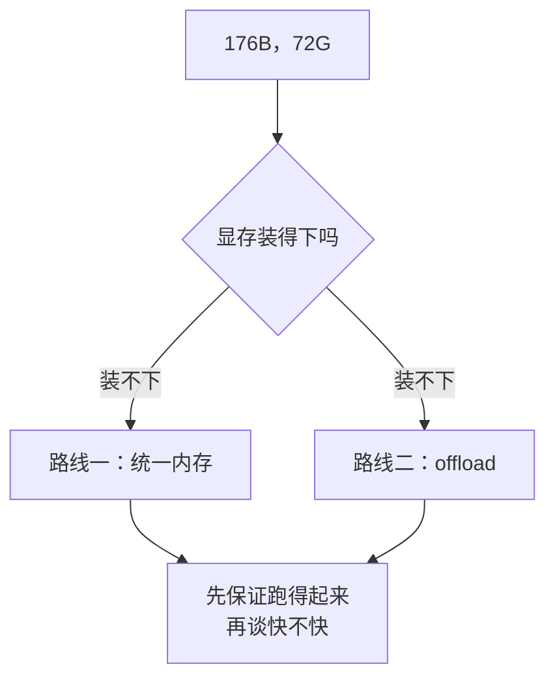
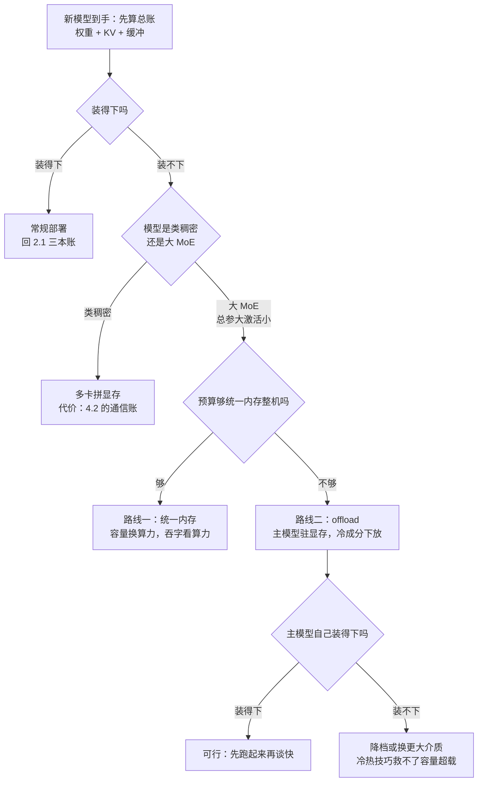

# 4.3 大模型的另两条路：统一内存与 offload

## 开篇问题

先摆一张报价单：两张十年前的 Pascal（帕斯卡）10 系改装卡——P40（24G）与一张口播称作 P106 的 24G 魔改卡（P106 官方规格 6G，24G 为魔改转写口径，型号存疑），每张 400 元；再加一个 128G U 盘，100 元。合计约 900 元的硬件，声称跑得动 176B 参数、被称作"当前本地最强模型之一"的模型，实测吐字 28~29 tok/s、上下文 160K（来源：BV1xQtf6SEHR，两张老卡加 U 盘跑 176B 一期）。

按前两部分立的规矩，这张单子哪一行都不成立。第一行你现在就能证伪：拿 2.1 的三本账把 72G 往 48G 里塞——176B 压到最低精度档 IQ1_S 也还有 72G，光权重一本就填不平；就算装得下，百元 U 盘凭什么出现在推理服务器的物料清单里？

本章回答这个问题：**176B 怎么可能在几张老卡上跑？** 答案是两条"装不下也要跑"的路——把 CPU 与显卡之间的存储边界拆掉的**统一内存**（unified memory），和把一部分权重主动挪去慢介质的 **offload（卸载）**。读完你带走三样东西：判断权重该住哪级介质的判据、一笔 176B 的完整拆账、一张能套上自己机器的大模型路线决策树。

## 正文

### 整体图景：当"跑多快"退回"跑不跑"

前三章你站在"装得下"的地板上谈速度：2.1 拆三本账，3.1~3.5 谈 TTFT、吞吐与瓶颈；4.1、4.2 又给多卡这条路——显存可拼接，代价是卡间通信，上一章刚算过一次前向几 GB 的 all-reduce（卡间合并通信）流量。

176B 把地板抽掉了：72G 的模型对 48G 的显存，连"装得下"都不满足。讨论退回最上游的**权重安放**——每个权重该住在哪一级介质上。安放方案不改变模型做什么，但决定显存占用能否压进预算，也决定吞吐的形态。两种安放哲学：



两条路，一条动"边界"，一条动"位置"；可行与否，都写在 176B 的成分里。

### 176B 的成分表：路由、专家与那张大表

1.5 留过一个尾巴：选型算式特别注明"MoE 模型的文件构成特殊，部分参数可外挂，不能直接套用"。现在兑现它。

先回收 1.5 的两个词：**稠密模型**每步要动用全部参数（前文的千问 27B 属于这类；口播转写型号，以模型卡为准）；**MoE（混合专家，Mixture of Experts）**把每层的 FFN（前馈层）换成一排结构相同的"专家"，外加一个**路由（router）**：token 进来，路由打分，只挑最匹配的几位专家干活。参数从此分两本账：**总参数**（所有专家之和）决定容量，**激活参数**（本步真正干活的那一小撮）决定带宽与算力。200 多 B 的模型激活量可能只有 10B——1.5 那句"乍一看 200B，其实可能只是 A10B"说的就是它（来源：BV14UEY6WEW7，96G 旗舰卡悖论一期）。

到了 176B 量级，麻烦对稠密模型是双重的：每吐一个 token 都要读完 176B 份权重，带宽喂不饱；显存还得整包装下。新一代 MoE 又挂了一张 **n-gram 查询表**（统计语言模型的老概念：用前 n−1 个 token 查表，估计下一个 token）。这张表体量惊人——某个更新一代的更大模型约 500G 权重里，约 200G 是这张表（注意：那是另一代模型，非本章案例的 176B）——但它不参与每步的矩阵乘，只被"查"（来源：BV1otY26LE8w，统一内存三平台横评一期）。

这个结构改写了硬件的账：所有专家都要随叫随到，"住得下全部"一点没降；但每个 token 只读一小部分专家，带宽与算力的要求反而低了。**容量巨大、带宽中等、算力够用**——记住这个画像，两条路都围着它转。

它还改写了多卡的账。MoE 的编排调度让 CPU 参与明显变多，对节点间时延和存储统一度要求很高；多卡方案里路由信息在卡间来回传导，4.2 的通信账被进一步放大——有一种判断认为，光路由的来回传导就可能吃掉大半显存容量优势与并行带宽优势（来源：BV1otY26LE8w，同上期）。对照组是**类稠密模型**——每步几乎动用全部参数的模型，纯稠密（如千问 27B）与激活占比极高的 MoE 都算，它们加卡收益线性，2 卡强过 1 卡、4 卡强过 2 卡。**"显存不够就加卡"对大 MoE 不成立**——这是本章存在的第一个理由。

第二个理由是市场给的：96G 旗舰卡半年内从 6 万炒到 10 万，可面对 200B 档只能塞最低精度量化，谈不上从容（1.5 拆过这套悖论）。旗舰对不上号，结构又吃多卡反面，第三条路被逼了出来。

### 第一条路：统一内存——把边界拆掉

普通电脑里 CPU 用内存、显卡用显存，两个仓库靠 PCIe 总线用卡车倒货——4.2 的通信账就是运费。统一内存让 CPU 和 GPU 共用同一块物理内存，谁要用谁直接取，跨计算单元是硬件级**零拷贝**（zero-copy）——没有搬运这回事。

▶ 动画：对比独显经 PCIe 搬运与统一内存零拷贝的取数路径
<div class="demo" data-demo="unified-memory"></div>

说清"是什么"，最快是说清"不是什么"。它不是"集显加共享内存"：后者要在开机前进 BIOS 把内存**固定划分**——64G 切 32G 给显卡，切完两边互借不了。统一内存则是系统运行中动态调度、用多少占多少。物理共用加零拷贝，各家平台都成立；"运行中动态热分配"目前只有苹果系做到——AMD Strix Halo（AMD 大容量统一内存平台，代表整机 AI Max 395/495）仍要在 BIOS 里划一个可分配上限（AI Max 395 默认 96G），只是上限之内不再切死。查自己机器时认这个上限，别拿内存总量当显存算。

第二张牌是带宽。这类机器用的 LPDDR5X（焊在主板上的低功耗内存）有 200GB/s 出头的等效显存带宽，已摸到入门显卡的水平；395 标称 256GB/s，苹果 Mac Studio 的旗舰芯片 M3 Ultra 更到 800GB/s。第三张牌是短板：算力普遍偏弱，395 的算力档约在笔记本版 3060M 到 3070M 之间，且不支持 FP8 浮点。合起来是那句画像：**吐字不亏、吞字看算力**——吐字（decode）被带宽按住，带宽够用；吞字（prefill）是并行大矩阵乘，看算力，正是弱项。实测：同一模型用原版 llama.cpp，英伟达的统一内存主机 DGX Spark 预填充 3000+，395 一侧只有 900+；解码两者只快一点、同一量级——都是 LPDDR5X，带宽相近（量化档位与输入长度原资料未说明）（来源：BV1otY26LE8w，同上期）。

**已解示例**：395 标价约 2 万，新款 495 约 4 万，多花的钱买了什么？495 核心只是把 8060S 小幅超频成 8065S，算力几乎不变；实质升级只有内存 128G 变 192G、可分配显存 96G 变 160G。算**边际价格**——增量价格除以增量资源：2 万元 ÷ 64G ≈ 312 元/GB。同样的 4 万买两台 395：算力翻倍，机器间还有 PCIe 直出和 USB4 80G 双向互联，带宽绰绰有余。结论：395 必须买 128G 版——64G 版能做的事完全不同；495 多出的两万，只在"160G 恰好跨过你要跑的模型的门槛"时才值得。

**小练习（5 分钟）**：查你手头内存条的单价，和 312 元/GB 摆在一起。差价就是"GPU 能零拷贝使用的大容量"的溢价——它什么前提下值得付，什么前提下不如两台小的？

### 第二条路：offload——往下一级借地方

第二条路不动边界，动位置。存储分级：显存、内存、硬盘、U 盘，越往下越慢也越便宜。offload 的要点是**按访问频率分级放置**：每步计算都要读的权重是热数据，必须常驻显存；访问稀疏的冷数据才往下一级放。判断标准一句话：**访问越稀疏，越不怕慢介质。**

为什么热数据绝不能下放？回到 2.2 那条理论上限：decode 每吐一个 token 都要把"每步必读"的权重读一遍，吐字上限 ≈ 介质带宽 ÷ 每步读取字节数。把 21G 权重放到高速 U 盘（顺序读数百 MB/s 量级，以实测为准）上，上限立刻从每秒几十个 token 掉到一分钟一个字的量级。2.1 埋的那句"每降一层带宽掉一档"，在这里是最陡的一档。

*指标回看 · 吞吐：此前它是"装得下之后有多快"的连续变量，本章它第一次出现断崖形态——安放位置错一格，吞吐不是下降，而是跌出两三个数量级。*

冷数据为什么不怕慢？查询表这类结构低频被查、不挡生成主循环，慢介质的代价只是"某次查询慢一点"，拖不住每一步；词表、字典表同理。专家群和注意力是热的，n-gram 大表是冷的——划线是模型结构替你划好的。

验证手段很便宜：llama.cpp 加载日志逐个张量打印落点（`CUDA0`/`CPU`）；`--n-gpu-layers` 调常驻层数、对比吐字速度，就能亲手量出"层往下挪一级、速度掉一档"（参数名以官方文档为准）。

**已解示例**：某个更新一代模型总权重约 500G，其中约 200G 是 n-gram 大表。一台 395（可分配 96G）配上"表回落硬盘"，装得下吗？主模型部分约 300G：就算把 200G 的表整个推给硬盘，96G 也装不下 300G 的主模型。"表回落"救不了"主模型超载"——容量账要在买机器之前算，冷热技巧只在主模型本身装得下时才有用（来源：BV1otY26LE8w，同上期）。

### 贯穿案例：72G 怎么拆进 48G 加一个 U 盘

现在回到开篇那 900 元。机器条件：P40（24G）与 P106（型号存疑，见章首注）合计 48G；内存 16G；硬盘共 100G；外补高速主控的 128G U 盘。模型：Qwen3.8-Flash，176B，IQ1_S 档，整体 72G。推理栈选了对老卡友好的 llama.cpp。

▶ 插画：176B 的完整架构与 n-gram 外挂——1.5 埋下的伏笔在这里完整展开
<div class="ill" data-ill="qwen-arch-ngram"></div>

拆账分两步。先拆参数：176B = 125B 主模型 + 51B n-gram 查询表——主模型每步参与计算，必须常驻显存；查询表是冷数据，按需读。再拆字节：72G 反算平均位宽只有 3.3 bit/参数，对不上 IQ1_S 的名义位宽（约 1.5~2 bit）——差距全在没深压的表身上（约 51G），真正 IQ1_S 级的是主模型，约 21G。21G 塞进 48G，剩 27G 给 KV 与计算缓冲——账平了（逐项代入见完整算例）。

安放位置逐个排除：

| 安放位置 | 这台机器的条件 | 结局 |
| --- | --- | --- |
| 另一张显卡 | 没有第三张 | 出局 |
| 主机内存 | 16G | 装不下 51G 的表 |
| 硬盘 | 总共 100G | 连 72G 模型本体都放不下 |
| 128G U 盘 | 约 100 元，需高速主控 | 中标 |

官方三种安放方式被这台机器的条件逐条堵死，最后 100 元的 U 盘接住了 51G 的表——"卡刚够住人，表拎包走"。

实测成绩单，口径摆全：Qwen3.8-Flash 176B、IQ1_S 档、P40+P106 合计 48G、KV 用 Q4 量化、不开 MTP（多 token 预测，3.5 讲过的投机解码一类）、不开任何投机解码；演示为单路请求（并发数原资料未说明）。解码 28~29 tok/s，刚起步只有 20 多——数据还没搬进快的地方；换长 prompt 后预填充 314 tok/s（llama.cpp 日志读出）；上下文开到 160K，靠 KV 压到 Q4 挤出来的余量；两卡满载 150W，长解码全程合计不到 200W。思考模式要把思考预算（reasoning budget，1.4 讲过）限住（演示 512、深度测试 1 万），不设限就白烧时间（来源：BV1xQtf6SEHR，同上期）。

*指标回看 · 吞吐：28~29 tok/s 在第三章的速度参照系里排不上号，但在本章语境里它有专门的名字——"可用"。安放方案的胜负判据不是快，是主循环没有被慢介质拖住。*

*指标回看 · 显存占用：从 2.1 的"一张卡占用多少"升级为"全系统往哪几级介质安放"——加载后两卡占用应接近"主模型 21G + KV + 缓冲"，远小于 72G，第一次可以小于模型体积。*

*指标回看 · 成本：900 元里 800 元买 48G 显存容量，100 元买冷数据的容身之处，没有一分钱花在算力上。"更省钱"在这里有条件：买到的是"跑得起来"，不是"跑得快"。*

**小练习（10 分钟）**：看你自己的机器——内存多少、独显多少。同一个"主模型 21G + 查询表 51G"的模型，表在你的机器上有哪几种合法安放？各牺牲什么？（先数位置，再想带宽。）

### 两条路的失效边界

offload 的风险前面已给了公式：慢介质一旦伺候每步必读的权重，吞吐跌出数量级——划冷热必须诚实：这个案例选的 IQ1_S 是极端档，主模型约 1.3 bit/参数，远低于社区常规（起步至少 IQ3、标配 Q4），对安放错误的容忍度也随档位一起变小。质量端这次跑出的前端代码"效果还可以"是单例观察，当不成 IQ1_S 档的普遍结论（来源：BV1xQtf6SEHR，同上期）。

统一内存的失效方式不同：不崩，只是慢。容量管够、吐字及格，吞字被算力按住——M3 Ultra 带宽 800GB/s 碾压全场，算力却只比 395 略强，同模型预填充实测 1400；而 395 的吞字还有大把可挖：社区优化项目把千问 flash 在 395 上的预填充从原版 llama.cpp 的 200~300 拉到轻松破 1000（这组与前面 900+ 那组模型版本不同，口径不可互比）（来源：BV1otY26LE8w，同上期）。选型口诀是"内存按下一代买"：这一代总参数 200 多 B，下一代 flash 起步可能 600B 以上，128G 很可能跑不动下一代。

两条路的适用条件与失效边界收拢，就是开篇承诺的决策树——本章章末产出，每个分叉对应正文的一笔账：



无论落在哪个叶子，第一问永远是"装不装得下"，再谈快不快。

## 完整算例

**已知条件**：Qwen3.8-Flash，总参数 176B（125B 主模型 + 51B n-gram 查询表）；最低精度档 IQ1_S，文件实测口径 72G；硬件 P40 24G + P106 24G 合计 48G 显存、16G 内存、128G U 盘；实测解码 28~29 tok/s。

**要回答的问题**：这 72G 的每一部分住在哪里？实测吐字速度和介质带宽的账对得上吗？

**公式**：

```
平均位宽（bit/参数）= 总字节 × 8 ÷ 总参数
各部分位宽 = 各部分字节 × 8 ÷ 各部分参数
吐字理论上限（tok/s）≈ 介质带宽 ÷ 每步必读字节
```

**逐项解释与代入**：

- 平均位宽：72G × 8 ÷ 176B ≈ 3.3 bit/参数——混合平均，不对应任何单一档位，拿它对档位名是最常见的误读；
- 主模型：约 21G × 8 ÷ 125B ≈ 1.3 bit/参数，IQ1_S 级，常驻显存；
- 查询表：约 51G × 8 ÷ 51B ≈ 8 bit/参数，未深压，按需读，放 U 盘；
- 显存账：48G − 21G（主模型）= 27G 余量，给 Q4 量化的 KV（撑起 160K 上下文）与计算缓冲；
- 带宽核对之一（假设表每步全读）：需要表带宽 ≈ 51G × 28.5 tok/s ≈ 1.45TB/s；高速主控 U 盘顺序读在数百 MB/s 量级（原资料未给出实测值，以你自己的 dd 读数为准）——差三到四个数量级。假设被证伪：表不可能每步全读，也不需要，它本就是低频查询的冷数据；
- 带宽核对之二（假设主模型每步全读）：需要带宽 ≈ 21G × 28.5 ≈ 600GB/s。原资料未给出两卡带宽规格，这个数只能做量级判断；且注意一个反直觉点——两卡按层切分、单路 decode 时各层读取严格串行，等效带宽受最慢一段拖累，**不因有两张卡而相加**（相加只在微批跨卡流水重叠时近似成立）。矛盾只剩一个与模型结构自洽的出口：主模型本身是 MoE，每步只读路由选中的专家子集，实际流量远小于 21G——"每步全读"假设被证伪，量级成立。

**数量级与单位检查**：GB × 8 ÷ B 得 bit/参数，无量纲；GB/s ÷ GB 得 1/s，即 tok/s。

**这是估算与量级核对，不是精确账**。误差来源：原资料未说明两卡的带宽规格、模型的激活参数量与每步实际读取字节；层切分下串行读取使等效带宽低于任一单卡，此项无法定量；U 盘速度未实测。结论分两层：定性上，"主模型驻显存、表驻 U 盘、吐字不掉档"成立；定量上，精确的每步流量账需要激活参数量才能算。

## 贯穿案例的最终分析

开篇问"176B 怎么可能在几张老卡上跑"，现在复盘决策过程——重点是每步的"为什么"。

1. **为什么不走"常规"**：48G 显存最常规的玩法是跑 30B 档 MoE（1.5 的甜点位）。放弃的理由是"没有榨干"——显存还有余量，200B 档智力上限更高。选型在此分叉：要"硬件舒服"还是"模型上限"，方案选后者，付出档位（IQ1_S 而非 Q4）与速度。
2. **为什么敢选 176B 的 MoE**：看清了成分表——激活参数小，十年前的老卡算力够用；总参数大，唯一要买的是容量。800 元买 48G 容量，算力算白送。
3. **为什么拆在"主模型/查询表"这条线上**：这是模型结构给出的天然冷热边界，不是拍脑袋。换个拆法——把一半注意力层放到 U 盘——主循环每步穿过慢介质，方案当场作废。
4. **为什么接受 U 盘**：显卡、内存、硬盘三个官方安放位被逐条排除后的最后选项；它伺候冷数据，代价被隔离在"某次查询变慢"，进不了主循环。
5. **这笔交易的完整对价**：得到"本地跑起当前最强档模型之一"，付出 IQ1_S 的质量风险、28~29 tok/s 的单路速度，以及方案自身的脆弱——安放决定错一格，吞吐跌出数量级。

它也回答了一个更一般的问题：十万元 96G 旗舰为何不是这类需求的最优解——需求缺的是容量，旗舰卡单价买的是算力与带宽。**按瓶颈买硬件**，第五章还会反复出现。

## 理解检查

1. **计算**：把 51B 的查询表压到 4 bit/参数，它约多少 G？压完后，这台机器（48G 显存 + 16G 内存）装得下它吗？再算一遍全模型的平均位宽——"IQ1_S"这个名字这回名实相符了吗？
2. **条件变化**：把 128G 高速主控 U 盘换成顺序读只有几十 MB/s 的老 U 盘，主模型安放不变。预计解码速度怎么变？哪一类使用场景会最先暴露差距？（从"查询频率"和"主循环是否经过它"两个维度想。）
3. **排障**：启动后 llama.cpp 日志里大量张量落在 `CPU` 而非 `CUDA0`，吐字速度只有预期的几分之一。给出至少三步排查，说明每步在验证什么。
4. **选型**：预算 4 万，需求是"200B 级大 MoE 本地常驻，未来可能两机协作"。买一台 495 还是两台 395？用边际价格和互联带宽各给一条理由，并写明你的前提。

## 动手实验

**环境**：一台带 NVIDIA 显卡（8G 显存即可）与 llama.cpp 编译环境的 Linux 机器；内存大于所选模型文件体积；一个 SSD 和一个 U 盘。模型用 GGUF 的 7B~14B 档（比如第一章那个）——案例把"表"放去 U 盘，实验把"层"放去内存，测的都是"权重离计算单元远一级的代价"。

**步骤与命令**（参数名以所用版本官方文档为准）：

```bash
# 0) 基线：全部层驻显存
llama-cli -m model.gguf -ngl 99 -p "写一段 200 字的说明" -n 256
# 1) 逐级下放：层数减半、再减半，层落内存
llama-cli -m model.gguf -ngl 8 -p "写一段 200 字的说明" -n 256
llama-cli -m model.gguf -ngl 4 -p "写一段 200 字的说明" -n 256
# 2) 每次记录日志末尾 print_timings：prompt evaluation 对应 prefill，evaluation 对应 decode
# 3) 介质阶梯测速：同一文件放两处各测一次顺序读
dd if=/path/on/ssd/model.gguf of=/dev/null bs=1M
dd if=/path/on/usb/model.gguf of=/dev/null bs=1M
# 4) 加载日志看张量落点（CUDA0/CPU），另开终端 nvidia-smi 看显存占用
```

**应记录的指标**：每档 `-ngl` 下的 decode tok/s 与 prefill tok/s；显存占用；两种介质上的顺序读速度；日志中张量落点的变化。

**预期现象**：层往下放，decode 掉档，幅度与"该层权重体积 ÷ 内存带宽"的量级一致；介质测速里 U 盘与 SSD 差出数倍到数十倍，用最慢读数换算"每步必读的权重若放在它上面"，吞吐上限跌到分钟级一个字；显存占用随 `-ngl` 下降而下降。"层放内存"是实测；"层放 SSD/U 盘"用介质读数换算上限——真让 SSD 直跑需要内存小到装不下模型，会进入颠簸状态（数据在内存与磁盘来回搬运、速度暴跌）。

**失败排查**：改 `-ngl` 后速度纹丝不动 → 看加载日志张量落点是否真变了（模型太小可能全进了显存）；`-ngl` 不生效 → 版本过旧或参数名不同，查 `--help` 与官方文档；`dd` 读数远低于标称 → 伪高速 U 盘（主控缩水）或插在 USB 2.0 口上——安放之前先测介质。

**产出（大模型路线决策树·你的实例版）**：先交安放决策记录——成分表（总参/激活参与冷热成分，照 176B 的拆法）、冷热分级结论（各成分放哪级介质、依据访问稀疏性）与 `-ngl` 各档 decode 读数；再把决策树抄下，用自己的模型和机器从第一问走到叶子，描出路径、标注每步用的是哪笔账。这是本章交付物，也是 4.4 重算多用户账的底稿。

## 本章能力清单

对照学习目标：

- ✅ 画出 176B 这类"主模型 + n-gram 外挂"的成分表，说清总参数与激活参数各决定什么（成分表一节 + 插画）；
- ✅ 用"访问稀疏性"判断一段权重该放哪一级介质，并说出放错的代价与数量级（offload 一节 + 理解检查 2）；
- ✅ 计算混合档位的平均位宽并识破"平均对不上档位名"的名实之辨（完整算例 + 理解检查 1）；
- ✅ 解释统一内存零拷贝与 BIOS 固定划分的区别、苹果系与 Strix Halo 的差异，以及"吐字不亏、吞字看算力"的来历（统一内存一节）；
- ✅ 用边际价格在"一台大的"与"两台小的"之间做选型（已解示例 + 理解检查 4）；
- ✅ 把陌生模型与自己的机器代进决策树，说出每一问背后的账（失效边界一节 + 动手实验产出）。

## 与下一章的衔接

本章所有实测都在"一个人对着最大的模型"的语境里：单路、容量优先、吞吐够用就收工。一旦服务交给全组人用，账要全部重算——KV 按并发数翻倍，"48G 减 21G 剩 27G"的余量立刻不够分；吞吐的评价标准也从"单路可用"变成"退化曲线有多陡"。下一章（4.4 多用户上线）把负载加进来：并发上限怎么设、4 用户各 8K 上下文的 KV 预算怎么在 44G 里分配、供电与散热的底线在哪。实例化决策树请放在手边：4.4 的第一问仍是"装不装得下"，只是定义里多了并发这个乘数。

## 资料来源与延伸观看

- 贯穿案例（约 900 元方案：P40+P106 与 128G U 盘跑 176B；125B+51B 拆账；解码 28~29 tok/s、预填充 314 tok/s、160K 上下文、两卡 150W）：BV1xQtf6SEHR（两张老卡加 U 盘跑 176B 一期）。
- 统一内存三平台横评（零拷贝与动态分配、LPDDR5X 带宽、395/495 边际价格、预填充对比、MoE 调度对多卡的反直觉影响、"按下一代买内存"）：BV1otY26LE8w。
- 96G 旗舰卡悖论与"乍一看 200B、其实 A10B"（承接 1.5）：BV14UEY6WEW7。
- 工具与文档：llama.cpp 仓库（github.com/ggml-org/llama.cpp，参数以所用版本官方文档为准）；各平台带宽与可分配显存上限以 AMD/NVIDIA/Apple 官方规格页为准；P106"官方规格 6G"为编者按 NVIDIA 规格页补注，24G 为魔改口径。
- 原资料未说明之处（激活参数量、U 盘实测速度、两张卡的带宽规格、测试并发数与输入输出长度）正文已逐处标注，未作推断。
