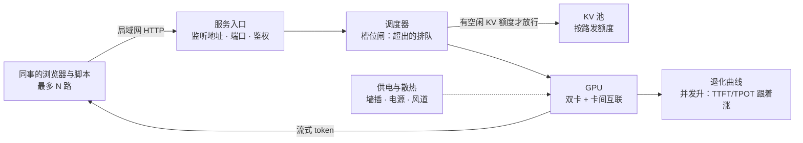

# 4.4 多用户上线：从玩具到服务

## 开篇问题

3.2 收尾时你手里有两样东西：一张 1/2/4/8 的并发表，一个只监听本机的服务。你在群里说了句"问答机器人搭好了"。周一早上九点，八个同事同时冒头：第一个人要地址，第二个人问能不能接进组里的工具，第三个人已经把三千行的产品文档粘了过来——而这台机器从周五起就没关过。

三个此前不存在的问题依次浮出来。地址发出去，同事的电脑怎么找到你这台机器？最多放几个人进来——启动参数里写的那个数，和同事体感"能用"的那个数，是同一个吗？还有最容易被跳过的一条：你下班了，机器不下班，插座、电源和温度，扛不扛得住常开？

本章回答核心问题：**怎么变成同事也能用的服务？** 到章末你会交出一份多用户压测报告：几路并发、每路多大上下文、三个指标各自退化到多少、墙上电表多走了多少字——以及那句最要紧的结论："本服务可承诺 N 人同时使用，超过后最先破线的是＿＿。"

## 正文

### 整体图景：从"我调用"到"同事调用"，变了什么

先把新链路摆出来：



输入输出没变，仍是带历史的对话进、流式 token 出。变的有四处。调用方从你一个人的脚本换成局域网里的任意设备，于是多了"地址与边界"这件前三章不存在的事；服务从"要用才拉起"变成工作日常驻，于是电力从一次性开销变成按天结算的流水；并发从压测时的临时状态变成常态负载，3.2 那句"拼车省算力、不省 KV"从结论变成日常；判断"能不能上线"的依据，也从单点数字变成一条退化曲线。这条链路不挑机器——2.1 的双卡机也好，4.3 的统一内存路线也好，走到"给同事用"这一步，遇到的都是这四件事。

顺带排一个反直觉的雷：网络带宽不在瓶颈名单里。100 tok/s 折合每秒几百字节到几 KB，是千兆局域网的零头；真正新上桌的资源是电与热。下面按"地址 → 上限 → 预算 → 供电 → 账 → 压测"的顺序走。

### 地址：把服务从回环搬到局域网

引擎默认的监听地址多半是回环地址（loopback，127.0.0.1）——只有本机能连，这正是"玩具"状态的由来。要给同事用，把监听地址改成 `0.0.0.0`（本机所有网卡）或内网网卡地址，同事用"你的内网 IP:端口"就能连上。各家参数名不同（Ollama 的 `OLLAMA_HOST` 环境变量、llama-server 与 vLLM 的 `--host`），默认值也不一致，以所用版本官方文档为准；改完先在本机连一次，再找一台同事的设备连一次——防火墙拦不拦，只有跨机器才试得出来。

第二件事是边界。局域网不等于可信网络：服务一开，同网段内谁都能匿名调用你的算力。最低限度三条：只暴露给可信网段，不做端口映射到公网；支持的引擎给接口加上密钥鉴权（llama.cpp 与 vLLM 都有 api-key 类参数）；没有内置鉴权的引擎（如 Ollama，随版本变，以官方文档为准）就放在反向代理（如 Nginx 这类转发程序）后面补一层。这些配置五分钟做完，漏掉的下场是月底电费里多出一段不属于你的用量。

### 上限：三道闸夹出来的并发数

"这个服务最多几人用"没有单一答案，因为挡人的闸门有三道，撞到哪道，症状都不一样。

第一道是**槽位闸**。引擎同时"在跑"（running）的请求数有一个人为设定的上限：vLLM 的 `--max-num-seqs`、llama.cpp 的 `-np`、Ollama 的并行环境变量，名字不同，概念同一个——你在部署时替这台机器承诺的座位数。超出的请求不报错，进 waiting 队列排队；座位是等出来的，反映到用户端就是 TTFT 里多出一段不设上限的排队时间。反过来槽位开太大也一样糟：所有人都挤上车，单路速度与 KV 显存同时告急。第二道是 **KV 闸**，3.2 已经算过一遍：KV 池 ÷ 单路预算 = 名义路数，它决定"座位全坐满时显存爆不爆"。

第三道闸最容易被忽略：**可用线**。就算显存装得下、槽位也够，八个人同时用时的单路速度可能慢到没法看。业内管这类承诺叫服务等级目标（service level objective，SLO），本章用更直白的叫法——可用线：由业务定的两条门槛，比如"TTFT 不超过 5 秒、TPOT 不超过 50 毫秒（约 20 tok/s）"。可用线怎么定是业务问题，但"服务上限是几路"必须由压测出的退化曲线回答——它是三道闸里唯一没法拍脑袋的一道。

*指标回看 · 并发：从 3.2 的"显存除法算出的上限"，升级为槽位、显存、可用线三道闸共同夹出的服务承诺。*

双卡机器还有一笔放大项。4.2 算过卡间通信账：每步前向要搬运的激活矩阵按 token 数计价。多人拼批后，每步拼进的 token 变多，这笔流量跟着变大——所以同样加并发，双卡 TPOT 的爬升常比单卡更陡，多出来的一段走在卡间的路上。这是机制推断，陡多少取决于互联方式与切分策略，以你自己的压测为准。

**已解示例**：可用线定为"TTFT ≤ 5 s、TPOT ≤ 50 ms"。压测读到：2 路时 TPOT 25 ms；4 路时 TPOT 38 ms、TTFT 中位 3 s；8 路时 TPOT 61 ms、TTFT 中位 9 s。按可用线判：上限是 4 路——8 路虽然显存装得下（第二道闸过了）、槽位也够（第一道闸过了），但两条线都破了。若把可用线放宽到"TPOT ≤ 80 ms、TTFT ≤ 10 s"，上限变 8 路。上限不是机器的属性，是"机器 × 可用线"的属性。

**小练习（5 分钟）**：同事反馈"出字慢一点没事，但点了按钮半分钟不动不行"。按这个体感写下两条可用线，再对照上面那组读数，重新判断上限是几路。

### KV 预算：给每路发额度，给长尾留余量

槽位和可用线定了，还剩显存这一道。多人服务的 KV 管理思路是预算制，四步：先算池子（显存总量 − 权重 − 引擎与激活缓冲）；再定每路额度（每路上下文上限 × 单 token KV，加每路固定小缓冲）；然后名义路数 = 池子 ÷ 每路额度，向下取整；最后槽位数 ≤ 名义路数，并留一块余量给"长尾"——总有同事贴来一篇超长文档。

第 4 步是新课。3.2 的除法假设每路都写满上限，真实负载不是：多数对话几百到几千 token，偶尔一条 32K 的大请求进来，一口气吃掉一大块池子。余量就是为它准备的——不留，长尾一来，池子吃紧、抢占启动，全车人跟着变慢。3.2 说的抢占机制，在这里等到它最常见的日常场景。

**已解示例**：KV 池 16 GiB，单 token 64 KiB，每路上限 16K。每路 = 64 KiB × 16,384 = 1 GiB，加固定小缓冲约 0.1 GiB，合计 1.1 GiB；名义路数 = 16 ÷ 1.1 ≈ 14，向下取整为 14。槽位设 8：最坏 8 × 1.1 = 8.8 GiB，余 7.2 GiB 给长尾与取整损耗。三个数——池、额度、槽位——写进部署笔记，此后谁改哪一个，都要重算一遍再改。

**小练习（5 分钟）**：池 12 GiB，单 token 64 KiB，每路上限 8K，固定缓冲忽略。名义几路？如果要求池子的一半留给长尾，槽位最多设几？

### 供电与散热：常开机器的两条底线

个人玩机时，功耗是"想起来才看"的读数；服务上线后，它变成一天 24 小时的物理约束。两条底线各对应一次典型翻车。

第一条是供电。预算是一道加法题：整机功耗 ≈ 各卡功耗之和 + 主机余量。本系列的双卡案例账：两张 2080Ti 合计约 500 W，加 CPU、内存、硬盘、主板约 100 W，整机约 600 W（来源：BV12ZEN6CEho）。电源不能按 600 W 买：模型加载与并发突增时有瞬时峰值；电源在高负载区间的转换效率会下降；元件老化后余量还会缩水。惯例按 1.5 倍以上留冗余——600 W 整机配 1100 W。这一节最常见的第二个坑，是拿 TDP 当电表读数：TDP（Thermal Design Power，散热设计功率）是散热器按多大发热量设计的参考值，实际功耗随负载浮动，整机还要把内存、硬盘、主板的份加回去。实测两件套：`nvidia-smi --query-gpu=name,power.draw,power.limit --format=csv` 看卡的瞬时功耗与功率上限；墙插接计量插座读整机真实功率。

第二条是散热。热量排不出去，显卡撞上温度墙（过热降频，thermal throttling）主动降速——从此你的压测数字变成室温的函数：冬天测出的上限，夏天不作数。检查项三条：机箱风道从前进后出，卡不要贴墙挤在死角；满载 20 分钟后看温度读数是否爬进降频区间（各卡阈值不同，以厂商规格为准）；双卡上下堆叠时，上卡吸的是下卡的废气，间距能留就留。

**已解示例**：整机实测满载 600 W，店里剩 650 W 和 1000 W 两个电源。1.5 倍冗余要求不低于 900 W，650 W 连满载都贴线，选 1000 W（案例里的 1100 W 是服务器拆机件，几十元档）。注意口径：600 W 是估算加法加案例口播的合计，装机后要用计量插座实测复核，再核对冗余倍数。

**小练习（5 分钟）**：你想再加第三张 250 W 的卡，整机约多少瓦？手头那只 1000 W 电源的冗余倍数还剩多少？低于 1.5 倍时，你有哪三个选项？

### 负载的另一面：常开一天，产出多少、烧多少

服务常开的第一个晚上，你会第一次盯着电表想问题。本系列的贯穿案例给过一笔"满打满算"的账（来源：BV1KKE96CELt）：假设单路 100 tok/s——注意这是原资料中的假设值，不是某台机器的实测——24 小时全速跑，日产出 = 86,400 秒 × 100 tok/s ≈ 864 万 token，这是全天满载的理论上限；功耗按 600 W 档，一天电量 = 0.6 kW × 24 h = 14.4 度，按民用电价 1~1.4 元/度，十几到 20 元/天。同一案例里给了一个对照锚点：某国产 MoE 模型的低价 flash 档，正式价 2 元/百万输出 token——20 元电费能买到 1000 万输出 token，比本地满载一天的极限产出还多。作者的结论是"用更贵的价格，用一个更弱的模型"。

这笔账的口径要攥紧：864 万是全天满载的理想值，真实服务的利用率远低于此；电价与 API 时价都在变；"更弱的模型"是作者对当时那档产品的判断。所以它现在只回答一个问题——常开的底线成本是多少——回答不了"值不值"；利用率、硬件折旧、二手卡风险的完整账本在第五章。但它立刻改变了一件事：开篇定的可用线，现在有了价格。四个人、每天八小时、每人几千 token 的服务，和"群里四十个人随时来"的服务，是两台电表。

### 压测与退化曲线：把"能用"变成可交差的数字

地址、槽位、KV 预算、供电散热，四块拼图齐了，上线前还差最后一步：拿出证据。方法在 3.2 已搭好骨架（N 份脚本同时发，扫 1/2/4/8），本章加三件装备。

第一件，真实感。同事不会发同一句话：把 prompt 按"闲聊、贴文档、改代码"准备成 N 个不同文件，长度错开；请求错峰到达（间隔零点几秒随机）而不是同一毫秒齐射——调度器面对的本来就是这种负载。

第二件，同步记录。三指标之外，显存、GPU 温度、整机功率三列必须同屏记录——退化到底是负载造成的，还是温度爬升造成的，只有靠这三列分得开。

第三件，纪律。每档至少三轮、报中位数（3.1 的老规矩）；测完一档等温度回落再进下一档；换个时段把整场复测一遍——两场曲线对不上，先查环境再信数字。

*指标回看 · TTFT：从"我自己的首字等待"升级为"含排队时间的服务指标"——多人之下它最先破线，退化曲线里它是第一根竖起来的。*

*指标回看 · TPOT：从"负载的函数"升级为可用线的判定项——曲线在哪个并发档越过你定的那条线，服务上限就写在哪里。*

## 完整算例

**已知条件与单位**：硬件：两张 22G 魔改 2080Ti，合计 44 GiB（≈ 47.2 十进制 GB；账按 GiB 记）；模型：千问 27B 级稠密（型号为案例口播转写，以模型卡为准），混合注意力架构——64 层中全注意力 16 层（KV 随长度线性涨），其余 48 层为线性注意力（GDN 固定小缓冲约 100 多 MB/路，不随长度涨）；权重 AWQ INT4 实测约 20 GiB；KV 精度 FP16，单 token 64 KiB（2.1 口径：16 层 × 8 个 KV 头 × head_dim 128 × 2 × 2 字节）；引擎与激活缓冲按 2.1 扣除法约 8 GiB。负载：4 位同事，每人平均上下文 8K = 8192 token，偶发长文档。

**要回答的问题**：4 用户 × 8K 的 KV 总账多大？44 GiB 怎么分？并发上限被哪道闸卡住？

**公式**：

```
KV 池 = 显存总量 − 权重 − 缓冲
单路 KV = 单 token KV × 每路上限 + 每路固定缓冲
名义路数 = KV 池 ÷ 单路预算（向下取整）
```

**逐项代入**：

- KV 池 = 44 − 20 − 8 = 16 GiB；
- 单路 @8K：64 KiB × 8192 = 2¹⁶ × 2¹³ = 2²⁹ 字节 = 512 MiB，加 GDN 固定约 0.1 GiB，约 0.6 GiB；
- 4 路：4 × 0.6 = 2.4 GiB，占池 15%；
- 名义路数 @8K = 16 ÷ 0.6 ≈ 26 路（理论上限，实际到不了）；每路上限提到 16K 时单路 1.1 GiB，名义 14 路。

**数量级与单位检查**：换一个乘法顺序——4 路 × 8192 token = 32,768 token，× 64 KiB = 2¹⁶ × 2¹⁵ = 2³¹ 字节 = 2 GiB，与逐项代入的主项一致（差的 0.4 GiB 是 GDN 固定项），账自洽。

**分配方案**：权重 20 GiB（死账，装载后不动）；缓冲 8 GiB（激活、引擎工作区、双卡通信缓冲都从这里出）；KV 池 16 GiB（活账）；槽位设 8、每路上限 16K——最坏 8 × 1.1 = 8.8 GiB，余 7.2 GiB 给长尾（一条贴 32K 文档的请求临时吃约 2.1 GiB，也盖得住）。名义容量远超 4 人，说明这个负载下**显存闸不收紧**。

**这是账面推演，不是实测结论**。误差来源：权重"20 多 G"未注明精确口径与单位；8 GiB 缓冲是扣除法余量，不是实测峰值；实际请求普遍写不到上限，显存读数会低于最坏账；引擎预留策略随版本不同。但方向明确：4 用户 × 8K 时，三道闸里最松的是 KV——**上限由槽位与可用线决定，只能压测，不能靠这道除法**。反证一句：若业务坚持每路 256K，单路 16 GiB 直接吃光池子，方案退回 2.1 的"并发锁死为 1"。同一台机器，负载改一行字，卡闸的门就换了一道。

## 贯穿案例的最终分析

回到周一早上那八个对话框。把"开放给全组"这个决策完整走一遍：

1. **先定可用线**：和提需求的人对齐"等多久算不可接受"。这一步不花算力，却决定后面所有数字的读法——没有可用线，压测只是表演。
2. **算 KV 预算**（完整算例）：池 16 GiB、每路上限 16K、槽位 8、余 7 GiB 给长尾。显存这道闸松，于是结论不是"加显存"，而是去测第三道闸。
3. **暴露与设防**：监听改内网、加鉴权、不做公网映射，同事设备实测连通。五分钟的事，漏了就是算力被人白占。
4. **压测 2/4/8**（动手实验）：TTFT 最先破线的那一档，就是承诺的边界。双卡机器顺带看一眼 TPOT 爬坡是否比单卡参照更陡——多出来的那一段，走在 4.2 的卡间路上。
5. **供电散热核查**：计量插座读整机功率，电源冗余不低于 1.5 倍，满载 20 分钟盯温度。冬天测的曲线，附上室温再交出去。
6. **把负载交给第五章**：贯穿案例那笔"864 万 token / 20 元 / API 1000 万"的账，配上你 T6 报告里的真实负载，就是 5.3 成本核算的全部原料。视频作者的劝退结论——"图省钱就别买卡"——成立条件是动机纯为省钱；若动机是数据不出内网、接口可控，成本账只是约束项之一。观点与账本，分开记。

## 理解检查

1. **计算**：KV 池 12 GiB，单 token 64 KiB，每路上限 16K，每路固定缓冲 0.1 GiB。名义几路？把每路上限砍到 8K 后又是几路？两次结果的倍数关系和"上下文减半"一致吗，为什么？
2. **条件变化**：同一台机器、同一份压测脚本，七月复测时所有并发档的 TPOT 都比三月高 15%。给出两种候选解释，各配一个读数来证实或排除。
3. **排障**：同事反馈"上午秒回，下午点了要转圈十几秒才出第一个字"。给出排查顺序（至少三步），每步写清验证点（提示：排队与槽位、温度与降频、后台任务、KV 长尾与抢占）。
4. **选型**：整机实测满载 620 W。三台候选电源：650 W、850 W、1200 W，选哪只，冗余倍数多少？若业务还要再插一张 300 W 的卡，你的判断变不变？

## 动手实验

**环境**：沿用 3.1 的 bench3.py 与 3.2 的并发脚本、已部署模型与引擎（llama.cpp 系最顺手）；一台同事设备（或另一台同网段电脑）用于跨机连通验证；`nvidia-smi` 可用；计量插座可选但强烈建议（没有就记 power.draw 合计并注明口径）。参数与字段以所用版本官方文档为准。

**步骤与命令**：

```bash
# 0) 暴露到局域网（参数名以版本为准），本机与同事设备各连通一次
llama-server -m 模型.gguf --host 0.0.0.0 --port 8080 -np 8 -c 131072

# 1) 准备 N 份不同 prompt（闲聊/贴文档/改代码各若干），错峰并发压测
for n in 2 4 8; do
  for i in $(seq $n); do
    sleep 0.$((RANDOM % 5))
    PROMPT=prompts/p$i.txt python3 bench3.py > "u${n}_${i}.log" &
  done
  wait; sleep 120        # 等温度回落再进下一档
done

# 2) 另开终端，同步记录显存/温度/功耗（每 5 秒一行）
nvidia-smi --query-gpu=timestamp,memory.used,temperature.gpu,power.draw,power.limit --format=csv -l 5
```

bench3.py 只需改一行：把读 `prompt.txt` 的那处改成读环境变量 `PROMPT`（不改也能测，只是 N 路同题，少一点真实感）；同事设备上的副本把地址换成服务机的内网 IP。`-c` 管的是总上下文预算还是每路预算，随引擎与版本而异，查清再设——本例 131072 ÷ 8 槽 = 每路 16K，与算例的分配方案对应。

**应记录的项**：每档每路的 TTFT 与 TPOT（中位数与最大值）、总吞吐；显存峰值、GPU 温度、power.draw 与 power.limit、墙插功率；有无排队（TTFT 里多出的固定段）、有无抢占（全员同步变慢再恢复）、有无报错；室温；每档三轮之间的差异。

**预期现象**：2 路时 TPOT 微涨、TTFT 几乎不动；4 路时 TTFT 开始明显爬升（排队与 prefill 轮转出现）；8 路时 TTFT 最先破可用线，TPOT 涨幅小于线性；显存涨幅明显低于 KV 理论账（请求写不到上限）；温度逐档爬升，若逼近降频区间，后档读数整体漂移；双卡机器的 TPOT 爬坡比单卡参照更陡一点（卡间通信随批变大）。

**失败排查**：各档数字与单并发时一模一样 → 槽位参数没生效或请求被串行化（查启动日志的并发槽/序列数）；TTFT 全档一致地巨大 → 全在排队（槽位为 1）或冷启动装载没热身；8 路 OOM → 回算例重核 KV 池（多半是缓冲被高估）；读数随时间单调变差 → 温度墙，对照温度列确认，降温后复测；同事设备连不上 → 监听地址、防火墙、是否同网段，三处逐个验。

**产出（多用户压测报告，T6）**：一张退化曲线表——行是并发档（2/4/8），列是 TTFT 中位/最大、TPOT 中位、总吞吐、显存峰值、温度、墙插功率、异常记录；表头写全口径：模型、量化、硬件、引擎、输入/输出长度、可用线。结论三句式："本服务可承诺并发 N、每路上下文上限 X K；超过后最先破线的是＿＿；本机满载功率＿＿W，电源冗余＿＿倍。"这份报告在 5.3 会作为成本核算的负载输入被原样引用——数字连口径一起留，别只留结论。

## 本章能力清单

对照五个学习目标：

- ✅ **部署**把本机服务暴露到局域网并设好访问边界：监听地址、端口、鉴权、跨机连通验证（地址一节 + 实验 0 步）；
- ✅ **计算**给定显存与用户负载的 KV 预算分配方案与名义路数，判断三道闸中哪道在收紧（KV 预算一节 + 完整算例 + 理解检查 1）；
- ✅ **解释**并发上限为什么是三道闸的交集而非参数表里的一个数，排队时间如何写进 TTFT（上限一节 + 理解检查 3）；
- ✅ **选择**电源档位并给出冗余倍数，说清 TDP 与实测功耗的区别（供电散热一节 + 理解检查 4）；
- ✅ **诊断**用退化曲线与温度/功率两列，区分"负载退化"与"热漂移"（压测一节 + 动手实验 + 理解检查 2）。

## 与下一章的衔接

服务上线只是暂时的句号。用不了多久你会遇到新问题：要升级、要申请新卡，或者要回答"为什么不再买一张"。那时摆上桌面的就是厂商规格表——容量、带宽、算力三列数字，哪个决定你的体验？下一章（5.1 三要素读穿一张卡）给你一套三要素归类法，把一张陌生规格表在十分钟内读成"能接几人、出字多快"。另外把 T6 报告收好：第五章的压轴题——本地与 API 的总账（5.3）——要用它算利用率，你测出的"几个人、多少 token、多少瓦"，到那一步会折算成每百万 token 的成本。

## 资料来源与延伸观看

- 贯穿案例（满载账与成本锚点：假设 100 tok/s、24 小时满载约 864 万 token/天、600 W 档日耗 14.4 度、电费十几到 20 元/天、某国产 MoE 模型 flash 档 2 元/百万输出 token、"更贵的价格用更弱的模型"）：BV1KKE96CELt。该视频为约 2 分钟短评：100 tok/s 是假设值而非实测；模型品牌名在机器转写稿中存疑；价格为视频时点的"正式价"，时价以厂商页面为准。
- 供电账（双 2080Ti 合计约 500 W、整机约 600 W、按 1.5 倍以上冗余配 1100 W、服务器拆机电源几十元、TDP 不是电表读数）：BV12ZEN6CEho；`nvidia-smi` 功耗字段与计量插座的验证方法出自源章的验证清单。
- 44 GiB 双卡显存账、AWQ INT4 权重 20 多 G、"并发锁死为 1"：BV1UMEv68E3C（2.1、3.2 的口径沿用；模型型号为口播转写，以模型卡为准）。
- 视频清单与全部出处见附录 B。
- 命令与参数：llama-server 的 `--host`/`--port`/`-np`/`-c`/`--api-key`，vLLM 的 `--host`/`--max-num-seqs`/`--gpu-memory-utilization`，Ollama 的 `OLLAMA_HOST` 等环境变量，均随版本变化，以各自官方文档为准；各家监听地址默认值不同，上线前先确认实际监听。
- 原资料未说明之处：案例机器的实测墙插功率与各并发档退化数据（视频未提供），本章以构造算例与"以你自己的压测为准"的纪律处理，未补造数字；GDN 固定缓冲"100 多 MB/路"为源章转述口径。
