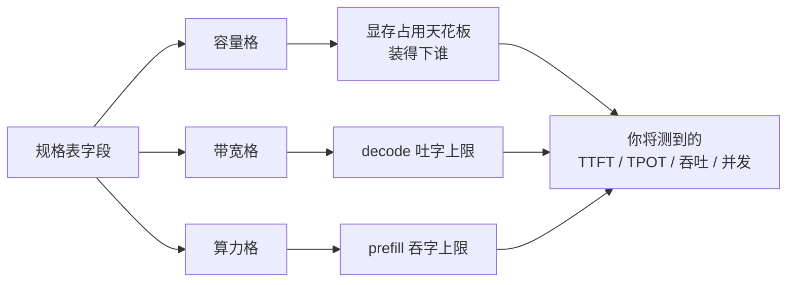

# 5.1 三要素读穿一张卡

## 开篇问题

第四部分收尾时，你的服务已经能接住同事的并发请求了。预算批下来，问题换成"买什么卡"。朋友在二手平台看中两张，各发来一张规格表截图：一张 16G 显存、带宽 1TB/s 出头，核心是五年前的架构；另一张 10G 显存、带宽 700 多 GB/s，核心倒新一些。用途他也说清了：跑 27B 级模型做问答，偶尔全组一起用。他问你：到底规格表上哪个数字，决定我用起来的体验？

规格表上有十几行数字：容量、位宽、等效频率、带宽、四种精度的算力、功耗、支持到哪个版本的 CUDA。逐行读会读晕，逐行比会比疯。这一章给你三样东西：一个把任何卡三格归类的框架（**容量、带宽、算力**，外加两个修正项），一张逐字段提取的读表模板，一套"哪些格子不能照单全收"的口径习惯。章末交出两样：两张陌生卡的三格判卷（动手实验）和一份读表模板（T8），顺手把朋友的题判完。

## 正文

### 规格表在链路的哪一环

选卡发生在部署之前，却预先决定了部署之后你要测的所有指标。两者的关系摆出来是这样：



第二、三部分里你亲手算过、测过的那些数，往上追溯，源头都是这张表的某几行。一位做选卡实测的 UP 主把性能归为三件事：与显存带宽、与算力、与架构密切相关；同一期还给了决策顺序：显存容量决定能不能，性能决定好不好（来源：BV1i6Y86AEv3）。本章框架就以这三件事为骨架：容量、带宽、算力三格，外加两个修正项，即**架构代际**（决定算力有几成能兑现）与**显存门派**（决定带宽这个数从哪来、可不可信）。

下面按"一票否决 → 吐字 → 吞字"的顺序走三格，每格都回答同一个问题：这一格的数字，怎么换算成你会测到的指标。

### 容量：握有一票否决权的那一格

容量格的读法你在 2.1 已经练熟了：显存三本账，权重、KV 缓存、缓冲区。选型时反过来用：先算清模型的账，再让容量格判卷。全书贯穿的千问系 27B 稠密模型（型号名出自源视频口播转写，以模型卡为准），Q4_K_M 文件口径约 16.5G（2.1/2.4 的账），KV 按上下文和并发另算（4.4 那笔"4 用户 × 8K 上下文"的账还记得吧），缓冲区留几 G。三本加起来对不上的卡，直接出局，后面两格看都不用看。

这一票有多硬，看两张卡的遭遇。CMP 90HX 是矿卡里少见的"好学生"：GA102 核心（与 3080/3090 同芯）、第三代 Tensor Core、GDDR6X 带宽 700 多 GB/s，算力与带宽两格都漂亮。但容量格只有 10G：27B 稠密模型装不下，连 35B 的 MoE 都塞不进去，最后只能改行去画图（来源：BV1E5426eE5X）。反过来的教训是 M40：24G 容量在千元内几乎独一份，但加速指令、算力、带宽、功耗全是短板，实测 prefill 只有 P100 的三分之一强、decode 约一半，"除了大显存全部都是缺点"（来源：BV1E5426eE5X）。两句话合起来就是容量格的判词：**容量不够，一票否决；容量够了，不保证及格**。

*指标回看 · 显存占用：第二、三章里它是"手算加实测"的运行时读数，本章升格为选型判卷——规格表容量那一格，划的是你未来每一次 nvidia-smi 读数的天花板；模型上线前，这一格已经把"装不装得下"判完了。*

**已解示例**：朋友看中的第二张（10G 那张）想跑上面那套 27B Q4_K_M 多用户问答。判卷：权重 16.5G 大于 10G，光权重这一本就爆了，还轮不到 KV，容量格一票否决，此卡出局。他接着问"四张拼 40G 呢"。账面上过线：权重切成四份，每卡 4G 出头，10G 里放得下自己那份 KV 与缓冲。但这一票只投给"装得下"。多卡要把 4.1 的切分折扣、4.2 的卡间路一起拉进来算：这张矿卡 PCIe 出厂锁窄，解锁后也只到约 3.0 x8 档，单卡推理不吃 PCIe，多卡流水线绕不开，四份供电散热也是平台账。勉强能装，体验另算。

**小练习（3 分钟）**：拿你现在跑的模型文件体积（GGUF 文件大小）加上 2.1 算过的 KV 账，算出总需求，对照你手里这张卡的容量格：余量还有几 G？按 4.4 的经验，这个余量够几个 8K 上下文的并发用户？

### 带宽：吐字上限的来历

容量判完"能不能"，带宽格回答"吐多快"。老朋友公式 decode 速度上限 ≈ 显存带宽 ÷ 权重体积，2.2 给出，3.4 打过六到八折。选型时带宽格的用法就是它：拿候选卡的带宽除以你的权重体积，得到单路吐字的理论上限，再按折扣估实测区间。

先扫一遍二手市场的常客。MI50 16G 的 HBM 带宽超过 1TB/s，是同价位卡里最高的，decode 也确实快：比 P100（700GB/s 级）快上约四成，带宽差多少、吐字快多少，量级对得上（来源：BV1E5426eE5X）。但有个反直觉的对照：同一场实测里，V100 带宽只有 900GB/s、比 MI50 还低，prefill 却是 MI50 的三倍（约 3000 对 1000 tok/s），decode 也反超了（来源：BV1E5426eE5X）。带宽最高只是吐字上限最高，不等于实测最快，读得快、算不过来照样慢。这条裂缝正好引出第三格。

*指标回看 · 吞吐：3.2 里它是并发曲线上爬升的斜率，本章把它映射到选型——decode 段的天花板写在带宽格、prefill 段写在算力格；你将来测到的吞吐曲线，先撞到哪条天花板，哪一格就是这张卡对你这份负载的"决定性数字"。*

### 算力：吞字上限，和它挨过的两顿打

算力格管 prefill。但先把 3.4 的工作点思维带过来：长输入、大批次时 prefill 才把算力吃满；输入短、并发低的场景它可能仍坐在访存区，算力再高也帮不上。所以读这一格别只看大小，要问你的负载吃不吃它。

这一格的数字挨过两顿打。第一顿在 3.4 见过：Intel Arc A770 纸面 FP16 128T，实测推理巨慢无比。纸面 TOPS 是原料，内核是把原料做熟的手艺。第二顿打的是"有没有这门算力"：P100 有 700GB/s 级带宽、千元档里带宽最高的一档，可整代帕斯卡缺 INT8 矩阵加速，prefill 实测只有 700 多 tok/s，被 150 元的 P102（能上千）反超（来源：BV1E5426eE5X）。带宽是瓶颈，但不是唯一瓶颈：缺的那条指令，规格表上不显眼，却直接砍掉了吞字上限。还有一条佐证：3060 的 FP16 算力只有 V100 的约三分之一（43 对 130T；130T 为口播口径，官方规格 112~125T，量级不变，见章末），prefill 实测却只慢了约三分之一。可见 prefill 对纸面算力没有想象中敏感，架构与内核的兑现率掺在里面（来源：BV1E5426eE5X）。

第二顿打引出第一个修正项：**架构代际**。所谓代际，指张量核心（Tensor Core）这台专做矩阵乘法的机器一次能吞多小的数。本书把它画成六个站牌：每挪一站，专机就能多算一种更小的格子。

▶ 插画：六代站牌，每代多算一种数，2080Ti 站在图灵那一格。

<div class="ill" data-ill="arch-generations"></div>

帕斯卡没有张量核心，只有 DP4A（一条指令算完四个 8 位整数的乘加，也就是"融合算子"）这类整数指令，SM（streaming multiprocessor，流式多处理器，GPU 里成组的计算单元）编号 SM61 起的 P4/P102/1080Ti 有它，SM60 的 P100 连这个都没有；SM 编号与后文 compute_cap 代际号同源。所以帕斯卡那张 24G 的 P40"快不起来"。伏特装上第一代张量核心，但 INT8 只有融合算子、做不了矩阵运算，本该翻倍的算力释放不出来。图灵（20 系）补上 INT8 矩阵加速，且 INT8 算力是 FP16 的两倍；安培再加 TF32 与异步拷贝。到了 Ada（40 系消费卡）才有原生 FP8 电路，NVFP4 则是 Blackwell（50 系）的格式。"哪代卡能原生算哪种格子"，第二章拆"支持 FP8 权重 ≠ 以 FP8 运算"时给过结论，站牌图就是那个结论的全谱。

代际还决定了"老卡为什么还能打"的三条边界。其一，decode 是搬权重不是算，没有张量核心的卡靠带宽也能吐字。其二，权重吃新格子的红利（FP8/FP4 位宽存放）、计算走老格子的路（反量化回 FP16），存算分离让老卡占到便宜。其三，prefill 是真刀真枪的算力，老卡在这里真吃亏，"存得下、算不过来"说的就是这种情况。所以给老卡判卷分两步：吐字看带宽格，吞字看代际，两格都不能省。至于你手里那张卡站在哪个站牌，N 卡一条命令就能查：`nvidia-smi --query-gpu=name,compute_cap --format=csv`，输出的 `compute_cap` 就是站牌编号：2080Ti 是 7.5、P40 是 6.1、3090 是 8.6（查询语法以驱动文档为准）。A 卡（如贯穿案例的 MI50）没有这个字段，改查框架的架构支持表，判代际的目的不变。

**已解示例**：一张卡规格表上"FP16 算力 65T、INT8 算力 130T"，另一张"FP16 130T、INT8 一栏空着"。不看型号，判代际：前者 INT8 数值恰好翻倍，说明 INT8 矩阵加速这一格在，至少图灵及以上；后者一栏空白，多半停在伏特，那一代的 INT8 只有融合算子、做不了矩阵运算，prefill 的吞字上限要按打折估。复核两步：查 compute_cap 定站牌，查框架支持表定生态。

**小练习（5 分钟）**：查你自己机器的 compute_cap（A 卡改查框架支持表），对照站牌图写出它站在哪一格、有哪种格子的硬件加速单元、缺哪几种。再回答：你的卡跑 Q4 权重时，计算单元实际在什么精度上干活？

### 带宽的出身：HBM 高楼与 GDDR 平房

三格还剩一处没交代来历：带宽这个数本身从哪来。答案在显存颗粒的两大门派里：**HBM**（High Bandwidth Memory，高带宽内存）与 **GDDR**（Graphics Double Data Rate）。两家抬带宽的路子完全不同：

▶ 插画：HBM 是贴着厂房盖的高楼，GDDR 是马路对面的平房加细长公路。

<div class="ill" data-ill="hbm-vs-gddr"></div>

GDDR 像在马路对面盖一排平房：每颗颗粒只有 32bit 的窄门，运力靠"多盖几间（并联颗粒）+ 门开关得更快（等效频率）"硬凑，货还要过一段 PCB 走线。HBM 是把仓库贴着厂房竖着摞成高楼：单个堆栈（stack）位宽就有 1024bit，与核心之间只垫一块毫米级的硅中介层，门宽、路近。两者的账摆在一起：

| | HBM 门派 | GDDR 门派 |
| --- | --- | --- |
| 结构 | 3D 堆叠，硅中介层紧贴核心 | 单颗粒 32bit，PCB 走线并联 |
| 位宽路数 | 单堆栈 1024bit，靠堆栈数堆总线 | 靠颗粒数与等效频率硬凑 |
| 典型带宽 | P100 700GB/s 级、V100 900GB/s、MI50 约 1TB/s；A100 靠 5 堆栈 5120bit 总线再高一档 | 2080Ti 616GB/s、90HX 700 多 GB/s |
| 常见载体 | 数据中心卡 | 游戏卡、矿卡 |
| 代价 | 贵、产能少——所以几乎只住数据中心卡 | 带宽天花板靠频率硬顶 |

（带宽为规格页口径，具体数字以各卡官方页为准。）类比说到这里要收回：HBM 并非全面碾压，所以消费卡至今几乎全在 GDDR 门派；"HBM 神卡"是二手市场用价格差换来的特例，那是下一章的话题。

HBM 还带来一个规格表上看不见的现象：**显存屏蔽与解锁**。HBM 是物理在位的堆栈，厂商用固件关掉一部分容量与算力来切档位，于是才有"解锁"一说；但多数刀法是物理级的，解锁是少数个案。矿卡 170HX 恰好是那个少数：与 A100 同用一颗 GA100 核心，出厂屏蔽的 HBM 被社区解锁到 80G，也有人只解到 64G。算力口径第二章拆过：FP32、TF32、FP16 三张表各列各的，0.3T、31 倍、100 TOPS 三个数不能互相乘。这里只取读表教训：容量那一格，可能是被固件关小过的，也可能是虚标的，规格表写多少，不等于到手多少（来源：BV17QN66tEKX）。

规格表外还有一个变量，并非 HBM 特有：**ECC**（Error Correcting Code，纠错）是数据中心卡的通用特性，GDDR 卡一样有。它给数据加校验位、错了能改，服务器"错一位就赔钱"的场景才需要，代价是两笔税。数据中心拆机的 T10 16G（GDDR6 专业卡）实测：开 ECC 占掉 1G 显存、带宽下降 20%（源视频实测口径，不是通用常数，以你的卡实测为准）；本地推理一般不开，省下的 1G 在三本账里是实打实的一格（来源：BV1E5426eE5X）。

### 逐字段提取：把模板建起来

三格框架之外，选型还需要一张逐字段的核对单。把规格表常见字段按"查什么、防什么坑、影响哪一格"整理成模板，作为本章的产出（T8），后面动手实验直接用它：

| 字段 | 去哪查 | 读表陷阱 | 判哪一格 |
| --- | --- | --- | --- |
| 显存容量与类型 | 规格页 Memory Size / Type | HBM 可能被屏蔽过；GDDR 看清 6/6X | 容量 |
| 位宽、等效频率、带宽 | 规格页 Bus / Bandwidth | 三者应互相验算（完整算例推导） | 带宽 |
| 各精度算力 | 规格页或厂商 ARK | FP32/TF32/FP16/INT8 各列各的，不能互乘 | 算力 |
| 架构 / compute_cap | 规格页；`nvidia-smi` 查询（A 卡查框架支持表） | 站牌决定原生加速的格子种类 | 算力兑现率 |
| 生态生命周期 | 框架文档支持表、CUDA 版本要求 | 老卡停在旧版 CUDA，框架可能不认 | 全部（能否开工） |
| 功耗与散热 | 规格页 TDP | 数据中心卡无风扇、需转接与主动散热 | 平台账 |
| PCIe 与互联 | 规格页；`nvidia-smi topo -m` | 矿卡 PCIe 可能被锁窄（4.2 的账） | 多卡时才算 |
| ECC 模式 | `nvidia-smi -q -d ECC` | 开着占容量又降带宽 | 容量与带宽 |

这张模板的用法是"先否决、再排序"：生态生命周期与容量两行做否决（跑不起来一切免谈），带宽与算力两行按你的负载画像排序（长进短出的总结任务偏算力格，短进短出的问答偏带宽格），剩下的字段做平台与风险的加减分。跑一遍只要几分钟，结论出自你自己的账，不用再听商家话术。

## 完整算例

全书从 2.2 起一直在借一个数：2080Ti 标称带宽 616GB/s。现在把这笔债还清，它就是"位宽 × 等效频率 ÷ 8"推导出来的。

**已知条件与单位**：卡为 2080Ti；显存类型 GDDR6；显存位宽（memory bus）352bit，即显存与核心之间并行数据线的总条数；等效频率 14Gbps，指每个引脚每秒传输 14G 个 bit（厂商把显存时钟倍增折算进这个数，不同代显存的折法不同，直接采用规格页标注的等效速率口径）。

**公式**：

```
带宽（Byte/s）= 位宽（bit）× 等效频率（bit/s 每线）÷ 8（bit→Byte）
```

**逐变量解释**：位宽描述"一次并行搬多少 bit"，等效频率描述"每秒搬多少次"，相乘得到每秒的 bit 总量；除以 8 换成字节，因为权重体积、账本口径都用字节。

**代入**：352 bit × 14 Gbit/s = 4928 Gbit/s = 4.928 Tbit/s；除以 8，得 **616 GB/s**。

**数量级与单位检查**：bit × 次/秒 = bit/s，除以 8 后是 Byte/s，量纲闭合。交叉验证一条结构线索：每颗 GDDR 颗粒位宽 32bit，352 ÷ 32 = 11，正好对应 2080Ti 的 11 颗显存颗粒，位宽字段与颗粒数互洽，数字可信。

**口径声明**：616GB/s 是标称理论上限，不是实测持续带宽；它在本书里的全部用途（decode 上限 ≈ 带宽 ÷ 权重体积，如 616 ÷ 16.5 ≈ 37 tok/s）也都是理论上限口径。

**误差来源**：其一，显存读写方向切换、刷新与协议开销让持续带宽低于标称；其二，若开启 ECC，带宽直接下降（T10 实测口径 -20%，具体幅度因卡而异）；其三，颗粒体质、温度与供电会影响实际运行频率；其四，GB 口径为十进制，与二进制 GiB 差约 7%。所以实测打六到八折是常态，这也正好补上 3.4 里 P40 反推等效带宽那笔账的另一半解释。

**你的数字往哪代**（同一套格子，填你自己的卡）：

| 格 | 你的数 |
| --- | --- |
| 显存位宽（bit，规格页 Memory Bus） | ＿ |
| 等效频率（Gbps） | ＿ |
| 算出带宽 = 位宽 × 频率 ÷ 8 | ＿ |
| 规格页标注带宽 | ＿ |
| 两数差异与口径解释 | ＿ |

## 贯穿案例的最终分析

回到朋友发来的两张截图。负载已说清：27B 级问答、偶尔全组用。下面按"先否决、再排序"把决策走完整，不直接跳到答案。

第二张（10G、700 多 GB/s、较新架构），容量格出局。判卷：权重 16.5G 连一本都放不下，KV 与缓冲无从谈起。带宽格与算力格再漂亮也翻不了案，容量节里 90HX 就是这个遭遇：算力略过 3070Ti、GDDR6X 700 多 GB/s，全卡败在 10G。对这份负载，它的"决定性数字"是容量格，而容量格不及格。

第一张（16G、1TB/s 出头、老架构，MI50 的画像）三格能过，两处打折。逐格看：

- 容量格：16G 装 27B 只到 Q3 级，KV 与缓冲再扣一圈；35B 级 MoE 社区的玩法是两张起拼（4.1 的切分账另算）。
- 带宽格：约 1TB/s，decode 上限按 1000 ÷ 16.5 ≈ 60 tok/s 打折估，吐字这格它赢。
- 算力格与代际修正项：FP16 与 INT8 加速都在位，但架构老，prefill 实测只有 V100 的约三分之一，长输入任务要按吞字上限重估（来源：BV1E5426eE5X）。
- 模板加减分：加分项是 PCIe 4.0 x16 不锁；扣分项是 AMD 卡，生态那一行先过 ROCm 支持列表再谈钱（ROCm 是 AMD 对应 CUDA 的计算生态，附录 D 的一句话结论）。

所以答案是：没有单一的决定性数字。容量格先判生死；过线之后，由你的负载决定带宽格还是算力格说了算；还有些格子本身要验真。就在朋友犹豫时，二手平台又冒出第三张表：170HX，80G HBM、GA100 核心、TF32 口径 100 TOPS，挂价 700~800 元，三格看上去全绿。细看每一格都被固件动过手脚：容量是屏蔽后解锁的，80G 与 64G 两种结果，能否稳定用于真实负载，原资料原话"还有待观察"；算力的三个数分属三张表，不能互相乘；矿卡出身，PCIe 与驱动都可能有限制（来源：BV17QN66tEKX）。朋友最后没买它：那张表的三个关键格子，没有一个能照单全收。

## 理解检查

1. **计算**：MI50 16G 带宽约 1TB/s，跑 27B Q4_K_M（文件口径 16.5G）单路 decode 理论上限是多少 tok/s？按六到八折估实测区间，并和 2080Ti 的约 37 tok/s（同折扣区间）比较：领先倍数与带宽倍数（约 1.6 倍）一致吗？实测折扣会不会吃掉它？
2. **条件变化**：T10 16G 开启 ECC 后，三本账里哪一本变了、变多少？若它原带宽 560GB/s，decode 理论上限变成多少？最后说明"-20%"这个数的适用条件。
3. **排障**：同事的新卡跑 7B 模型，decode 正常但 TTFT 长得离谱。`nvidia-smi` 查到 compute_cap 是 6.1。给出诊断结论、两条验证动作，以及"不换卡"前提下的一个缓解办法。
4. **选型**：三张候选卡。A：24G 帕斯卡无张量核心；B：16G HBM、700GB/s 级、代际老且缺 INT8；C：10G 新架构、700GB/s。任务一：27B 离线长文总结；任务二：7B 多用户短问答。各选哪张，还是都不选？写出三格判卷过程。

## 动手实验

**环境**：能上网的浏览器即可，不要求有卡；手头有 N 卡可加做本地核对。全程只读公开规格页，不花一分钱。

**步骤与命令**：

```bash
# （可选）本地卡核对：架构站牌与显存
nvidia-smi --query-gpu=name,compute_cap,memory.total --format=csv
nvidia-smi -q -d ECC          # 看 ECC 模式是否开启
```

1. 选两张本章没出现过的卡作为"陌生卡"，推荐一对对照组：Radeon VII（16G HBM2 的游戏卡）与 RTX 4060 Ti 16G（GDDR6 的 Ada 卡）。
2. 到厂商规格页或 TechPowerUp GPU 数据库，按本章模板逐字段抄录：容量与类型、位宽、等效频率、带宽、各精度算力、架构、TDP、生态支持。
3. 自己乘一遍带宽：位宽 × 等效频率 ÷ 8，与规格页标注互验；对不上时反推（带宽 × 8 ÷ 位宽）找原因。
4. 用三格给两张卡各写一行结论：跑 14B Q4 问答服务，谁的一票被否决，谁的吐字上限高，谁的吞字上限高。

**应记录的项**：模板八行全部填齐；带宽验算的算式；两张卡的三格结论各一行；若两站数字打架，记录各自口径。

**预期现象**：两张卡容量同格（16G 对 16G），带宽差约 3.5 倍（1024GB/s 量级对 288GB/s 量级），对同一份 14B Q4 负载，decode 上限差距悬殊。架构一栏请记录发布年代与架构名：两家谱系不同，别跨厂数代数。你还会发现 Radeon VII 的生态那一行要格外小心（AMD 卡，先查框架支持）。

**失败排查**：规格页找不到位宽字段 → 换 TechPowerUp 的 Specification 页（Memory Bus 一栏）；等效频率缺失 → 用带宽反推验证；两站带宽不一致 → 多半是频率口径（boost 与标称）或 GB/GiB 差异，记录后以厂商页为准；AMD 卡查不到 CUDA 生态行 → 本来就没有，改查 ROCm/框架支持列表，这本身就是模板"生态生命周期"一行要抓的坑。

**产出**：两张填好的模板，即你的第一份规格表解读（T8）。保留它：下一章给在售卡打分时，它就是评分表。

## 本章能力清单

对照本章的学习目标：

- ✅ **归类**任何一张陌生卡到容量/带宽/算力三格，并说出每格对应哪个部署判断（三节主干 + 理解检查 4）；
- ✅ **解释**架构代际如何决定一张卡能原生算哪些位宽格式、为什么老卡"存得下新格式却算不快"（站牌图 + 已解示例）；
- ✅ **区分** HBM 与 GDDR 的结构差异与带宽来源，并说明 ECC 与显存屏蔽这两个规格表外变量（门派对照 + 完整算例）；
- ✅ **计算**位宽 × 等效频率 ÷ 8 的带宽推导，并用颗粒数交叉验算（完整算例 + 实验）；
- ✅ **提取**规格表中部署决策字段，产出一份可复用的读表模板（模板表 + 动手实验产出）。

## 与下一章的衔接

三格加模板回答的是"哪张卡好"，没回答"哪张卡能买"。170HX 的故事其实已经剧透了下一章的主题：同一张规格表，在二手市场还有第二层读法，要问这张卡从哪来（矿卡、魔改卡、服务器拆机），价格是不是已经被消息面炒了上去（700 元到 1.5 万只用了一个月），个体体质有没有坑。5.2 会把"价格 × 显存"的地图铺开，告诉你神卡区、温饱线和智商税区怎么划；你手上这份 T8 模板，到时就是给每张在售卡打分的评分表。

## 资料来源与延伸观看

- 贯穿案例与十卡数据（MI50 约 1TB/s、decode 快约四成；V100 900GB/s、prefill 约 3000 tok/s；P100 700GB/s 级缺 INT8、P102 反超；M40 与 90HX 容量教训；T10 的 ECC 口径；基准为 llama.cpp 社区 7B 老模型，量化档位、并发与输入输出长度原资料未说明）：BV1E5426eE5X。卡型转写注：MI50 曾被转写作 MI250/M50，本书按 MI50 统一（4.1 同款钉子）。
- 170HX 解锁（GA100 同芯、FP32 0.3T 与 31 倍、TF32 口径 100 TOPS、HBM 解锁 80G/64G、价格 700~800 元到约 1.5 万元、"能否实战还有待观察"）：BV17QN66tEKX；口径拆解见第二章。
- "支持 FP8 权重 ≠ 以 FP8 运算"、图灵 INT8 翻倍与 W8A8 现象：BV14yT46kE5T。
- 三要素论断与选卡决策顺序（性能与带宽、算力、架构相关；"显存容量决定能不能，性能决定好不好"）：BV1i6Y86AEv3。
- P40 24G"显存救不了没有张量核心的算力"与 A770 纸面算力陷阱：BV1hLtG6ZE5M。
- 口径补充：V100 FP16"约 130T"为口播口径，官方 PCIe 112T、SXM2 125T；90HX 的 PCIe 锁窄与解锁档位为源视频口径，均以官方页与实测为准。
- 规格与生态：TechPowerUp GPU 数据库与厂商规格页（字段名以页面为准）；`nvidia-smi` 的 compute_cap 与 ECC 查询以 NVIDIA 驱动文档为准；框架对架构与量化格式的支持以 vLLM、llama.cpp 等项目当前版本文档为准。
- 原资料未说明之处：十卡基准的具体量化档位、batch 与输入输出长度；ECC 降带宽 20% 是否为通用常数；170HX 解锁后的 FP16 口径与多卡可用性，均按量级口径引用，未作推断，留待你用自己的实测补齐。
