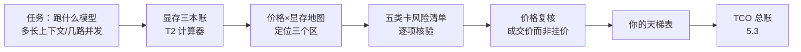

# 5.2 显卡市场生存指南：同一笔钱怎么花出双倍显存

## 开篇问题

预算 3500 元，二手平台上有两套候选。方案 A：一张魔改 3080 20G，开价 3000 元。方案 B：两张魔改 2080Ti 22G，合计约 3500 元。用上一章的三要素速判，A 几乎全胜——单精度算力接近 30T（视频口径），安培架构、第三代 Tensor Core、支持新版 CUDA，主流推理框架免魔改直跑；B 是两波矿潮淬过的老图灵卡，还得自己动手组装。通行天梯图也会把票投给 A。

但只跑大模型的圈子几乎一边倒选 B。分歧不在参数表上，而在参数表没有的两行里：一行是价格结构，一行是风险清单。这一章补上这两行，回答核心问题——**同一笔钱，怎么花出双倍显存？**20G 对 44G，价差只有五百块。到章末，你会得到一张按自己任务定位的"价格×显存"地图、一份下单前逐项打勾的验卡清单，以及你的第一张自制天梯表。

## 正文

### 钱在推理链路里的位置

前四章里，卡都默认"已经在你手里"：读规格、算三本账、测性能、排瓶颈。本章把时钟往前拨——卡还没买。一次完整的选卡决策长这样：



本章管中间四步，从两端接住你已经学的东西：往回接 5.1 的规格表解读——三要素是"出厂参数"，本章问的是"市场上真实卖多少钱、水有多深"；往前接 5.3 的总账——这里算出的购置价，是总账的第一行。下单那天就锁死两个用户指标的天花板：显存占用封顶上下文与并发，吞吐封顶单路速度。参数配错了可以改，卡买错了只能退货挨骂。

### 这个市场不看参数，看消息

个人买得起的推理卡几乎全来自三个渠道：数据中心拆机、矿潮退场的矿卡、小作坊魔改。共同点是定价不跟参数走，跟消息与供需走——更像海鲜市场：一船到货价格跳水，一条传闻身价翻倍。

两个真实样本。第一个：矿卡之王 CMP 170HX（英伟达为挖矿潮专门出的锁算力计算卡），与 A100 同一颗 GA100 核心，出厂锁三样——算力（单精度仅约 0.3 TFLOPS）、显存（HBM 被屏蔽）、PCIe（锁在 1.0 x4）。今年 7 月社区传出解锁消息：算力放开 31 倍（FP32 口径，0.3 涨到约 9.3 TFLOPS；另一张表上 TF32 张量口径达 100 TOPS），被屏蔽的 HBM 显存解到 80G——也有人只解到 64G。此前它趴在 700~800 元，有 UP 主上个月收藏了没买；消息验证后，64G 解锁版一个月内从 2000~3000 元炒到约 1.5 万，身价约 20 倍——踏空（涨了没上车、白白错过）就是这个市场的常规体验。第二个：大船到货——一批服务器拆机卡集中出货会把价格打下来，T10 落到 900 元/张；反向的例子是 MI50 32G，半年前还 800~900 元，被需求炒到 2000~2500，而同核心的 16G 版一直稳在 500~600：涨的全是显存那部分（来源：BV17QN66tEKX；BV1E5426eE5X）。

从样本里提炼三条判读规则。其一，看成交价不看挂价：挂价是卖家的愿望，"已售"记录才是市场共识。其二，暴涨案例是证据不是理由：它证明"这个市场由消息驱动"，不证明"现在买还能涨"。其三，把同一型号近一个月的成交价抄成一张表，你就能亲眼看到大船到货的低位和解锁传闻的高位——价表本身就是消息面的历史记录。

**已解示例**：卖家挂出一张 MI50 32G，2600 元。三步核价：抄同型号近一个月成交，多数落在 2200~2400，挂价高于共识约一成；对照下一节的地图记住同核心 16G 版只卖 500~600，贵的全是显存；结论：这是炒高位接盘价，不买，设降价提醒等大船。**小练习（3 分钟）**：想买 T10，卖家 A 挂 899 元"急出"，卖家 B 挂 1100 元"可小刀"。不查其他信息，哪家的价更接近真实行情？你接下来该查什么？

### 五类卡，五份风险清单

价格之外，二手市场还按"卡为什么会便宜"分成五类。便宜的来路不同，风险也不同：

| 卡种 | 代表 | 为什么便宜 | 核心风险 |
| --- | --- | --- | --- |
| 矿卡（mining card） | P104/P102、2080Ti | 矿潮退场回流 | 长期 7×24 满载，体质损耗 |
| CMP 计算卡 | 90HX、170HX | 出厂锁算力/显存/PCIe | 不解锁几乎不可用；解锁靠漏洞，个体差异大 |
| 魔改卡 | 2080Ti 22G、笔记本核心 16G | 手工改装的非原厂卡 | 焊工无质保；BIOS 与驱动的兼容随版本变化 |
| 拆机专业卡 | P100/V100 SXM2、T10 | 数据中心退役 | 要转接卡与散热改造，装机门槛高 |
| 炒价卡 | MI50 32G、V100 32G、RTX Pro6000 | 供需稀缺 | 溢价买的是稀缺不是性能，高位接盘 |

其中 SXM2（英伟达的一种板卡形态：核心直接焊在板上，不是标准 PCIe 卡）值得单独一句：V100 32G 的 SXM2 版绝对算力更高，但转接、散热、供电的成本叠上去，不如直接买四张 V100 16G SXM2——改装成本也是钱，要和卡价一起进总账。

为什么 CMP 卡存在"解锁"的想象空间？答案是良率（yield，一颗晶圆切出的完美核心比例）与刀法（binning，厂商把同款核心按瑕疵与屏蔽程度切档的手法）。同一颗 GA100，颗粒物理在位，固件只是关掉了它——A100 与 170HX 身价差几十倍，这正是"传闻一动、价格先飞"的物理前提。但成立条件要说清：解锁依赖漏洞或飞线（手工焊线补电路），有人成功不等于你这颗能成；"实际在科学计算或 AI 训练当中到底能不能用，还有待观察"——这句审慎值得抄在本子上（来源：BV17QN66tEKX）。

风险清单落到操作上是验卡三件套：`lspci -nn | grep -i vga` 核对设备 ID 与卖家描述是否一致；`nvidia-smi` 确认显存真被识别（22G 魔改卡应显示约 22542 MiB，而不是 11G 的"半张卡"）；`sudo lspci -vv -s <总线号> | grep -E "LnkCap|LnkSta"` 验 PCIe 有没有被锁（锁死的 CMP 卡 LnkCap 是 1.0 x4）。命令细节随驱动版本可能变化，以官方文档为准。

**已解示例**：到手续一张"2080Ti 22G"。第一步核身份：设备 ID 是普通 2080Ti，说明板是原厂板、22G 来自换颗粒魔改——风险在焊工不在板。第二步看显存读数 22542 MiB，满容在位。第三步查该卖家近月成交：同款出过三张、价格稳定在 2000 上下、无差评。三关都过，才轮到谈 NVLink 桥。**小练习（5 分钟）**：给一张 CMP 90HX 写出验卡命令序列，预测 LnkCap 与 LnkSta 各显示什么；若卖家声称"已解锁到 x16"，你的 LnkSta 预期变成什么？

### 价格×显存地图：三个区

把"卡为什么便宜"换成买家视角，同一批卡就排成一张地图：横轴显存、纵轴价格。总纲一句话：**显存容量决定能不能，性能决定好不好**——显存小了推得再快也没用武之地，显存大了哪怕推得慢，一切先发生起来。像开货运：显存是车厢，带宽和算力是发动机与路况；跑车送货，车厢塞不下货，时速再高也是零。类比的边界也要说清：显存只是前提，装下之后快不快，仍由 5.1 的三要素决定，两头都不能偏废（来源：BV1i6Y86AEv3）。

**神卡区（1000 元以下）**。十张候选卡全是数据中心退役或矿潮淘汰，买单理由只有"显存够大、价格够低"，解决的是"跑得起来吗"。

| 卡 | 二手价 | 显存 | 一句话 |
| --- | --- | --- | --- |
| P104 | 70~80 元 | 8G | 百元内唯一推荐，Pascal 矿卡 |
| P102 | 约 150 元 | 10G | prefill 能上千；PCIe 锁 x4 需改电路 |
| P4 | 200~300 元 | 8G | 免外接供电塞小主机，算力带宽减半 |
| P100 SXM2 | 220~230 元+转接 | 16G | HBM2 约 700GB/s，缺 INT8 |
| M40 | 400~500 元 | 24G | 唯一低价 24G，除显存全是缺点 |
| MI50 | 500~600 元 | 16G | HBM 超 1TB/s，已出 AMD 官方支持列表 |
| V100 16G SXM2 | 整套约 600 元 | 16G | 一代 Tensor Core，停在 CUDA 12 全靠社区 |
| CMP 90HX | 600 多元 | 10G | GA102 同门、约 760GB/s，但胃太小 27B 塞不下 |
| 3060 12G | 800~900 元 | 12G | 架构新全框架支持，算力带宽都弱 |
| T10 | 900 元 | 16G | 150W 拿 2080Ti 约八成性能 |

这档的天花板很清楚：跑 7B 的 prefill 才一千多 tok/s（llama.cpp 官方 7B 口径），27B 稠密模型推不动。买它是为了"有得跑"，不是为了"跑得好"。

**温饱线（1000~3000 元）**。排序逻辑从速度换成量化档位（2.3 的档位表）：显存多大，决定你敢用多高精度的权重、留多大上下文。同一个 35B 级 MoE 模型，16G 只能跑 Q3，24G 能跑 Q4 甚至 Q5——多出来的显存先换成精度和上下文（来源：BV1hLtG6ZE5M）。

| 卡 | 二手价 | 一句话 |
| --- | --- | --- |
| P40 24G | 1000 元 | 千元内唯一实用 24G，无 Tensor Core 最慢 |
| 2080/2080S 16G 魔改 | 1200 元 | 有 Tensor Core，性能远超 P40 |
| Intel Arc A770 16G | 1400 元 | 纸面 128T 强过 3080，实测比 P40 还慢 |
| 魔改 3070 系 16G | 1600 元 | 115W 功耗墙压平三张卡，哪张便宜买哪张 |
| 中科海光 Z100L 32G | 1800 元 | MI50 同源、ROCm 兼容，prefill 慢 |
| 2080Ti 22G | 2000 元 | 五星在 NVLink 桥接不在算力 |
| V100 32G | 2800 元 | 16G 版四倍以上价，缺 INT8——存得下算不过来 |
| 3080 20G | 3000 元 | 单卡五星，整段价位卡在机会成本边界 |

四个反直觉坐标值得记，它们全是"纸面参数骗人"的样本。A770：纸面 FP16 128T、INT8 256T，实测 prefill 和 decode 都比架构老得多的 P40 还慢——做本地推理优先 CUDA 生态，其他生态不是不能用，是优化排不上队。魔改 3070 系：FP16 只有 70 多 T，纸面不如 2080S，靠第三代 Tensor Core 实测反超；三张不同价位的卡被同一堵 115W 功耗墙摁到性能趋同。V100 32G：32G 显存很诱人，但缺 INT8 加速、新版 CUDA 不支持，量化路线受限——"存得下，算不过来"；注意成立条件：缺的是加速路线，不是不能跑。3080 20G：单卡确实五星，但不支持 P2P 点对点直连（4.2 讲过），多卡路线被出厂封死——五星评卡本身，"不推荐"评这个价位段的机会成本。

这档的实用判据：单卡跑 27B IQ3、30B 级 Q4 开始有单并发意义上的实用速度。

**智商税区（3000~1 万元）**。不是卡不好，是机会成本（opportunity cost，这笔钱放弃了的最优替代用途）太高：3090 二手已超 7000 元、全新过万（口播价）。在"只跑大模型拿 token"的前提下，这个区间没有"非这张卡不可"的单卡——钱花在速度上，显存没跟上，账立刻露馅：24G 跑 30B 级只够 Q4，硬塞 256K 满血上下文就得把 KV 压到 Q4 级，幻觉爆炸（2.5 的账）；反过来，多张低端卡凑到 40~48G 就能解锁 Q8——堆显存直接换智力。所以结论是把预算拆成低端多卡：V100、大船到货的 T4、双 2080Ti、两三张 3060，P2P 有无都行；卡数别贪多，两卡或四卡是成熟方案，再多整机调度和 CPU 会先累垮（来源：BV1i6Y86AEv3）。

▶ 插画：价格×显存选卡地图——三个区、十八张卡、四个反直觉坐标。

<div class="ill" data-ill="gpu-map"></div>

*指标回看 · 显存占用：2.1 里它是一本"装得下吗"的账，本章给它加一条价格刻度——每千元买到的显存。神卡区几十到上百 G、温饱线 7~24G、智商税区单卡跌到 3G 上下：这条刻度就是地图的横轴，也是"双倍显存"的量尺。*

### 能效比与平台：地图之外的两列

同一格显存、同一个价格，还有两个地图上看不见的变量。一是能效比（performance per watt）＝性能÷瓦数：T10 用 150W 拿到 2080Ti 约八成的性能，魔改 3070 系 115W 是全场最低功耗；长年点亮的机器，电费要进 5.3 的总账。顺带一个开关坑：专业卡的 ECC 纠错默认占约 1G 显存、并把带宽拉低约两成（视频实测口径，机制 5.1 讲过），本地推理不开。二是平台：多卡方案里，主板给每张卡几条 PCIe 直连车道、走不走南桥，4.2 已算过账——EPYC 一类给到 128 条 PCIe 4.0 的平台是多卡的好底子，PLX 拆分卡则会放大不支持 P2P 的卡的短板。买卡之前先看板子，别让两张好卡挤在一条窄路上。

**已解示例**：只比每瓦产出。设 2080Ti 满载约 250W 跑出 X tok/s，T10 用 150W 跑出 0.8X：每瓦产出是 0.8X/150 对 X/250，比值（0.8×250）÷150 ≈ 1.33——T10 每瓦高约三成。在意散热与电费的多卡方案里，这一栏能翻盘。**小练习（5 分钟）**：用你在 3.1 或 4.4 实测的 tok/s 除以 `nvidia-smi` 读到的满载瓦数，算出自己机器的每瓦产出；再估它 7×24 点亮一个月的度数（功率 × 720h ÷ 1000）。

### 以终为始：六步选卡顺序

地图是现成的，怎么落自己的位置？顺序错了会买错：先看卡再想用途，看什么都像神卡。正确顺序把任务放在最前面：先定任务（跑什么模型、多大上下文、几路并发）；再算显存（T2 计算器算出权重+KV+缓冲总量）；定精度（预算内选量化档位，别为"装得下"牺牲智力）；定形态（单卡装不下就双卡/四卡拼显存，而不是换更贵的单卡）；排序（显存达标后按带宽管 decode、算力管 prefill、架构管框架支持来挑）；最后补能效比与平台两列。

一步反例说明顺序为什么不能倒。卡商话术："96G 大显存畅跑 70B 大模型"。用第一步追问：跑的是哪个 70B？答案是两年前的 Llama 3.3 70B 稠密模型。当下开源模型两头走：30B 档民用卡塞得下；200B 档多为 MoE（Mixture of Experts，混合专家——总参数大、每次只激活一小部分的模型结构）；30B 到 200B 之间是空档，96G 正好两头不靠，硬跑 200B 也只能上很低精度的量化。同一张卡，做文生图是王炸，跑本地大模型要打问号——先定负载再定卡，顺序本身就是防坑工具（来源：BV14UEY6WEW7）。

*指标回看 · 吞吐：decode 上限公式（带宽÷权重体积）在这里第一次标上价格。理论上限除以卡价，得到"每元买到的 tok/s"——它是上限口径，不是实测承诺；实测要等卡到手，按第三章的方法跑基准。*

## 完整算例

回到开篇：3000 元的 3080 20G 对约 3500 元的双 2080Ti 22G，三栏见分晓。

**已知条件**（口径全列）：3080 20G 二手约 3000 元，320bit GDDR6X；2080Ti 352bit GDDR6、等效 14Gbps（5.1 算例口径），22G 魔改单卡约 2000 元、两张合计约 3500 元（NVLink 桥接器按需另加几百块）；目标模型千问 27B 级稠密，GGUF Q4_K_M 权重约 17G（视频口播值；AWQ 实测更高）；显存单位为十进制 GB。

**公式**：

```
单卡带宽 = 位宽 × 等效频率 ÷ 8
decode 上限 ≈ 显存带宽 ÷ 权重体积     （每秒能把权重完整读几遍）
元/G 显存 = 卡价 ÷ 显存容量
```

**代入与逐项解释**：

| 栏 | 3080 20G | 双 2080Ti 22G |
| --- | --- | --- |
| 显存 | 20G | 44G（22G×2） |
| 价格 | 3000 元 | 约 3500 元 |
| 元/G 显存 | 150 | 约 80 |
| 单卡带宽 | 约 760GB/s（320×19÷8，推算口径） | 616GB/s/张（352×14÷8） |
| decode 上限（17G 权重） | 760÷17 ≈ 45 tok/s | 单卡 616÷17 ≈ 36；双卡见下 |
| 风险 | 魔改无质保；不支持 P2P | 两波矿潮+换颗粒魔改；需自组平台 |

双卡那格要单独算：TP 切分后每张卡只读自己那一半权重（约 8.5G），权重读取那本账确实接近翻倍，理论上限可推到约 72 tok/s；但每层 all-reduce 的通信与同步要吃掉一块（4.2 的账），KV 与缓冲也在两卡间分摊——报出来的只能叫上限，不能按"616×2"直接承诺速度。

**数量级与单位检查**：GB/s ÷ GB = 1/s，单位闭合为 tok/s（理论上限口径）；616 ≈ 352×14÷8、760 ≈ 320×19÷8，两条带宽与 5.1 公式自洽；元/G 显存一栏 150 对 80——多花约 17% 的钱，买到 2.2 倍显存，单位显存价格近乎对折，这就是"双倍显存"的算术。

**口径声明**：decode 上限是"每秒把权重完整读几遍"的理论上限，不是实测值；3080 20G 的 760GB/s 由同核心 CMP 90HX 的 320bit 口径推算，该卡具体数字原资料未直接给出，以规格库为准；两张卡的价格随时段波动，以成交记录为准。

**误差来源**：decode 实际速度还受 KV 读取、batch、内核效率影响，常见在理论上限的五到八折（3.4 的实测方法可验证）；双卡的通信惩罚随切法与拓扑变化；魔改卡的显存体质还可能带来降频。

**结论**：这道题没有脱离任务的答案——A 赢在速度与省事，B 赢在显存与多卡的可能性。答案取决于你要跑什么，所以下一节把任务放回来。

## 贯穿案例的最终分析

现在把任务放回那 3500 元，用六步走一遍。

第一步定任务，答案分叉。**任务甲**：团队知识库问答，27B 级 Q4_K_M、8K 上下文、1~2 路并发。**任务乙**：上 Q8 高精度、更长上下文、4 路并发，智力优先。

第二步算显存。任务甲：权重 17G + KV（8K×2 路，按 2.1 的口径约 2G）+ 缓冲约 1G ≈ 20G——正好顶到 3080 20G 的红线，与"20G 跑 Q4_K_M 的 27B 上下文空间非常紧张"的口径吻合（来源：BV1hLtG6ZE5M）；放进 22G 单卡余 2G，放进 44G 双卡从容。任务乙：Q8 权重 27G 起步，20G 根本装不下，44G 才开门——与"凑到 40~48G 解锁 Q8"的口径一致（来源：BV1i6Y86AEv3）。

第三到第五步合起来定形态。任务甲：单卡就够——3080 20G 更快（上限 45 对 36 tok/s）、省 500 元、免组装，代价是魔改风险集中在一张卡上，且要接受这台机器只跑单卡的定位；2080Ti 22G 单卡是同档的稳妥替代。任务乙：只剩双 2080Ti 22G——不是因为 2080Ti 强，而是 3080 不支持 P2P，多卡 3080 从出厂就组不成（消费级 30 系里要 3080Ti/3090 才支持）。

第六步补风险与平台：买 2080Ti 22G 必须找信誉卖家、执行验卡三件套、主板留足插槽与供电；买 3080 20G 则先确认自己不需要多卡。

于是"同一笔钱怎么花出双倍显存"的完整答案是：**先确认你需要的是显存**。任务甲要的是速度与省事，双倍显存是浪费；任务乙要的是装得下与并发，双倍显存是唯一出路。地图三个区、六步顺序、五份风险清单，都是为了让"我需要什么"排在"这张卡多强"前面。

## 理解检查

1. **计算**：查规格库抄出 3060 12G 与 P40 24G 的显存带宽，分别算元/G 显存（800~900 元对 1000 元）与 decode 上限（27B Q4_K_M 权重按 17G）。哪张更符合"显存决定能不能"？它付出的代价是什么？
2. **条件变化**：若明天爆出"170HX 解锁后可稳定跑主线驱动"的确证消息，按本章的价格机制预测它一周内的价格走向；你会在哪个信号出现时下单，还是不下单？说明理由。
3. **排障**：到手的 2080Ti 22G 在 `nvidia-smi` 里只显示约 11G。列出至少三步排查（想想驱动、颗粒、BIOS、卖家各能查出什么），并指出哪一步能区分"卡有问题"与"货不对板"。
4. **选型**：预算 3000 元，任务"27B 级 Q4 + 8K 上下文 + 2 路并发"。给出你的选卡与理由，并回答：为什么 decode 上限更高的那张不一定是答案？

## 动手实验

**环境**：浏览器与二手交易平台（看成交记录）、TechPowerUp 一类规格库（套用 5.1 的规格表解读模板 T8）；无需持有显卡，全网操作约 40 分钟。

**步骤**：

1. 在二手平台按三个区各选一张在售卡：神卡区一张（建议 P104 或 MI50 16G）、温饱线一张（建议 P40 或 2080Ti 22G）、智商税区一张（建议 3090 或 V100 32G）；
2. 抄每张卡的挂价与近一个月"已售"成交记录（至少三条）；
3. 在规格库搜卡名，抄三行：显存容量、显存带宽、FP16/INT8 算力；魔改卡按原型号搜（如 2080Ti），显存栏手工改成实际容量；
4. 算三列：元/G 显存、decode 上限（带宽÷17G）、消息面状态（到货低位/传闻高位/稳定）；
5. 按风险清单标注卡种（矿卡/CMP/魔改/拆机/炒价），给每张卡写一句"买它的理由"与一句"不买它的理由"。

**应记录的项**：卡名、挂价、成交价区间、规格三行、元/G 显存、decode 上限、卡种与风险、地图区间归属。

**预期现象**：同型号成交价相对集中而挂价离散（挂价是愿望）；智商税区单卡算力最强而元/G 显存最低——参数与性价比在两个轴上；溢价集中在显存大的型号上。

**失败排查**：规格库搜不到魔改卡型号 → 按核心原型号搜、再核对显存条目；成交记录太少 → 换关键词（全称、带"AI"字样）或放宽到两个月，并在表里注明样本量；挂价与成交价差一倍以上 → 以成交价入表，挂价单独记作"卖方期望"。

**产出**：自己的天梯表——一张不少于六列、三行起步的表。它是本章交付物，也是 5.3 总账的购置成本行，做完留在手边。

## 本章能力清单

对照本章学习目标：

- ✅ **解释**二手显卡价格的消息驱动机制，并举出大船到货与解锁传闻两个方向相反的案例（"这个市场不看参数"一节）；
- ✅ **画出**价格×显存地图的三个区，并把任意一张在售卡定位到区（地图一节 + 插画）；
- ✅ **计算**元/G 显存与 decode 上限，并能说明后者是理论上限而非实测承诺（完整算例 + 理解检查 1）；
- ✅ **比较**五类卡的风险清单，写出验卡三件套的预期输出（风险清单一节 + 理解检查 3）；
- ✅ **选择**给定任务下的卡与形态（单卡/多卡），并说明机会成本在决策中的位置（贯穿案例 + 理解检查 4）。

## 与下一章的衔接

你的天梯表回答了"买哪张、花多少"，但这只是总账的第一行：电费按瓦数月复一月地走，矿卡暴雷的返工时间不开发票，利用率上不去的机器再便宜也是贵。下一章（5.3）把你表里的价格行、4.4 压测得到的 T6 负载数据和满载瓦数合进一张 TCO 表，用"每百万 token 成本"这个终极口径重新回答"这套机器到底值不值"。带着天梯表和你的满载瓦数进下一章。

## 资料来源与延伸观看

- 温饱线八卡与价格锚点（P40 的 7B 锚点 prefill 1000+/decode 50+、16G→Q3 与 24G→Q4/Q5、2080Ti 22G 靠 NVLink 拼显存、3080 20G 单精度接近 30T 与 P2P 短板、A770 翻车、115W 功耗墙）：BV1hLtG6ZE5M。
- 三个区总纲与多卡结论（显存决定能不能/性能决定好不好、24G 只够 Q4 与 40~48G 解锁 Q8、低端多卡清单 V100/T4/双 2080Ti/3060、两卡四卡是成熟方案）：BV1i6Y86AEv3。
- 消息面案例（170HX 解锁：0.3 TFLOPS 起、31 倍为 FP32 口径、TF32 表 100 TOPS、HBM 解到 80G 或 64G、700~800 元到约 20 倍、踏空经历与"有待观察"）：BV17QN66tEKX。
- 大船到货与能效比（T10 900 元/150W 约八成性能、MI50 32G 800~900→2000~2500 而 16G 稳定 500~600、V100 对 MI50：带宽是瓶颈但不是唯一瓶颈）：BV1E5426eE5X。
- "96G 畅跑 70B"话术拆解与 30B/200B 生态空档：BV14UEY6WEW7。视频清单与全部出处见附录 B。
- 验卡命令（lspci/nvidia-smi/LnkCap/LnkSta）以 NVIDIA 驱动文档当前版本为准；卡价以二手平台成交记录为准，本书所引价格均为视频发布时点的口播/观察值，随行情波动；T4/T10 等型号以原视频字幕转写为准、规格以官方页为准。
- 原资料未说明之处：3080 20G 的官方带宽数字（本文用同核心 90HX 的 320bit 口径推算）、2080Ti 22G 魔改卡的失效率、多卡方案整机调度上限的实测值，均无数据，未作推断。
