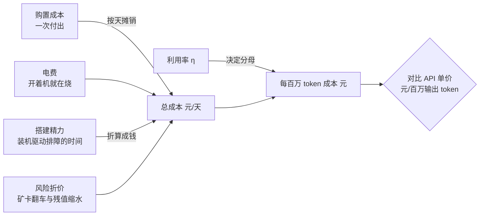

# 5.3 成本与决策：本地 vs API 的 TCO

## 开篇问题

购物车里躺着两张 2080Ti 22G 魔改卡，合计 3500 元——上一章的天梯表帮你把它圈了出来：同样的钱买不到更多的显存，矿卡风险清单你也过了一遍。光标停在"立即购买"上。此刻真正该问的不是"这张卡快不快"，前面五章已经把快不快讲透了，而是：**这套机器到底值不值？**

有个叫"紧急刹车"的社区项目专门在这个时刻劝人停手：上线一周收获 100 个 star（GitHub 上的收藏数），维护者的私信被问爆，问题清一色是"显卡去哪买、哪家店靠谱、2080Ti、3090、5090 怎么推荐"——先买卡、后想用途，是新手最普遍的路径（来源：BV1KKE96CELt）。本章不站队，只把"值不值"写成一笔你自己能复核的账：TCO（Total Cost of Ownership，总拥有成本）。算完之后，买与不买都是你的结论，而不是别人的劝告。

## 正文

### 整体图景：给整条推理链路定一个价

前四部分你给链路上每个环节都标过技术指标：显存装多少、TTFT 几百毫秒、吞吐几十 token。本章不再往链路里加环节，而是给整条链路定价——把所有开销折进一个口径：**每百万 token 多少元**，拿去和 API（云端推理服务，按 token 计费）的账单直接对表。



进账本的有四笔：购置成本、电费、精力、风险折价。分母只有一个——这套机器实际产出的 token 数。四个分子一个分母里，最不直观也最致命的是分母那侧的**利用率**：它决定这套机器的账是"每天摊薄一点"还是"每天白烧一场"。下面按顺序把每一笔算出来。

### 第一本账：满载一天，产出上限是多少

推理服务的产出由 decode 吐字速度决定（decode 即逐 token 生成的阶段），算式只有一行：

```
日产出 token = 3600 秒 × 24 小时 × tok/s
```

拿这本书一路跟到现在的机器代入。口径先摆全：双 2080Ti 22G 加 NVLink 桥、千问 27B 稠密模型、AWQ INT4 权重、社区版 vLLM 运行时、单并发（batch=1）、实测 decode 100 tok/s——这 100 是开着 MTP（多 token 预测，一种投机解码，3.5 讲过）的成绩，裸 decode 约 50；输入与输出长度原资料未说明，作者自己也声明这是"最高速度"口径（机器与成绩单见 3.3、4.2）。即便如此：

```
3600 × 24 × 100 = 864 万 token
```

一天共 86400 秒。这是那台机器 24 小时不眠不休的物理上限：你上班、睡觉、周末出门的时间全算进去，也才 864 万个输出 token。

**已解示例**：把 MTP 关掉，裸 decode 约 50 tok/s，满载日产出 = 86400 × 50 = 432 万 token。投机解码翻倍的速度，在这本账里等于"上限砍半"——加速开关的口径不清，成本账就差一倍，这就是为什么每个数字都要带口径进账本。

顺带堵一个常见的反驳口：有人会举 prefill（吞入阶段）约 1700 tok/s，说这套机器"处理的量远不止 864 万"。但 API 账单里输出 token 才是贵的那个，对比只能用输出口径——prefill 再快，不改变"一天最多吐 864 万个字"这个上限。

**小练习（5 分钟）**：翻出你在 4.4 压测报告（T6）里实测的单并发吐字速度，算你自己机器的满载日产出；再用同一份报告里并发 8 的总吞吐算一版"服务口径"上限。两版差几倍，记下来，实验环节还要用。

### 第二本账：电表上的一天

电费的算术初中就教过：电量（度，即千瓦时）= 功率（kW）× 时间（h）。600W 就是 0.6 kW，开满 24 小时是 14.4 度；按民用电价 1~1.4 元/度，一天约 14~20 元。注意 600W 本身是估算值——"双卡约 500W 加主机约 100W"的满载口径；待机与轻载会低一些，加载权重和并发突增时有瞬时峰值。想要准数，一个几十元的计量插座接在墙插上，比任何估算都可靠；电费单价则以你家电费单为准，别用新闻里的平均数。

电费有一个其他账都没有的性质：**开着机就在烧，没人用也照烧**。购置成本按天摊，好歹摊给正在产出的 token；凌晨三点的 0.6 kW 什么都没产出。这个性质预告了下一节的主题：利用率会同时往两个方向打击你——分子上电费照烧，分母上产出变少。

### 终极口径：每百万 token 多少钱

两本账一除，就得到本章的终极口径：

```
每百万 token 电费成本 = 日电费 ÷（日产出 ÷ 100 万）
                     = 20 ÷ 8.64 ≈ 2.3 元
```

对照物进场。案例：某国产厂商 MoE 大模型的 flash 档（低价档）公布正式价——每百万输出 token 2 元；按 MoE 总参数与激活参数之分（4.3 讲过），该档总参数量远大于 27B，激活参数量未必更多。口播型号名被机器字幕转写坏了，这里只取价格锚点；API 输入与输出分开计价、输出价通常更高，价格随行情变动，以厂商定价页为准（来源：BV1KKE96CELt）。

两边放上同一张桌：同样 20 元，本地方案满载一天产出 864 万 token，模型是 27B 稠密；同样的钱按 2 元/百万买 API，得到 1000 万输出 token，模型更大。20 ÷ 2 = 1000 万 > 864 万。于是有了那句账本总判决——**用更贵的价格，用更弱的模型**（来源：BV1KKE96CELt）。

三处口径必须钉死，否则这笔对比会被误读。其一，比较对象：本地是 27B 稠密 INT4 单并发，API 是总参数更大的 MoE，"更弱"有实指，不是修辞。其二，20 元取的是电价区间上限；取下限 1 元/度时日电费 14.4 元，满载每百万约 1.67 元，恰好小胜——**满载加低电价，是本地方案唯一能赢的口径组合**，而它的代价是 24 小时不眠不休。其三，864 万只算输出 token，prefill 量不计入（理由见上一节）。

*指标回看 · 成本：前四部分它一直是选型表上的附带条件（"更省钱"还得补一句"有条件"），本章起它有了终极口径——每百万 token 多少元；TTFT、吞吐、显存、并发最终都在这张账单里被折成钱。*

**已解示例**：把"能不能打平"翻译成不等式。日电费 = 14.4 × 电价，每百万成本 = 1.67 × 电价 ÷ η（η 是利用率，下一节登场）。想压到 2 元以下，需要 η > 0.83 × 电价：电价 1 元时，利用率要长期高于 83%；电价 1.39 元时，η 要超过 116%——满载都够不着。"本地省钱"四个字的真实门槛，就是这么一条不等式。

**小练习（3 分钟）**：翻出你最近一期电费单上的单价，代入 1.67 × 电价，得到你的"满载打平价"。它高于还是低于 2 元？答案直接决定你值不值得往下读。

### 利用率：满载是最偏袒本地的假设

η（利用率，utilization）= 实际产出 ÷ 满载产出。家用场景的 η 由生活节奏决定：上班、睡觉、出门，机器要么关机（购置成本摊得更薄），要么常开吃灰（电费照烧）。"家用利用率远低于满载"是方向判断，具体数字视频类材料没给过测量值——你的 η 只能你自己测，本章实验就干这件事。

把 η 代进终极口径，成本不是线性变贵，而是按 1/η 翻：

```
每百万成本 = 20 ÷（864 万 × η ÷ 100 万）= 2.31 ÷ η（元）
```

η 减半，成本翻倍：100% 时 2.3 元，50% 时 4.6 元，20% 时 11.6 元，5% 时 46.3 元。这条成本-利用率曲线是双曲线，敏感区全在低 η 一侧：从 100% 降到 50%，每百万只贵 2.3 元；从 20% 降到 5%，要贵 34 元。而日常使用的 η，恰好落在曲线最陡的那一段。

▶ 插画：利用率一掉，本地每百万 token 的成本如何崩掉。
<div class="ill" data-ill="utilization-collapse"></div>

敏感性分析还有一层，藏在你的使用习惯里。**常开模式**（机器 24 小时通电）里，η 同时打击分子分母，上表成立。**开关机模式**（用完就关）里，电费随开机时长等比例缩水：η=20% 时日电费约 4 元、日产出约 173 万，每百万仍是 2.3 元——电费口径对利用率几乎免疫。先别高兴：折旧不认开关机，购置成本按自然日摊，机器摆在那里就在贬值；每次冷启动还要等几十秒装载；"想用时有得等"本身就是代价。两种模式的完整对比，放在本章末尾的算例里。

### 账本之外的三笔：折旧、精力与矿卡折价

到这里账本里只烧了电费，还有三笔没入账。

| 隐性成本 | 口径 | 这台机器的量级 |
| --- | --- | --- |
| 购置摊销 | 4200~4500 元按使用年限直线摊 | 按 3 年零残值算约 4.1 元/天 |
| 搭建精力 | 装机、驱动、量化选型、排障的时长 × 你给自己定的时薪 | 假设 30 小时 × 50 元/时 = 1500 元（一次性，假设值） |
| 质量风险折价 | 矿卡体质损耗、翻车概率、残值缩水（风险清单见 5.2） | 体现在"预计卖出价"被打折 |

把第一笔代回去：日电费 20 元加摊销 4.1 元 ≈ 24.1 元/天，满载每百万 = 24.1 ÷ 8.64 ≈ 2.8 元——**比 API 锚点贵四成，而这仍是最偏袒本地的一天**。η=20% 时约 14 元，η=5% 时约 56 元。精力与风险折价还没入账，账已经输了；它们入账只会更难看。这三笔还有个共同点：全都逆着利用率走——用得越少，每百万 token 摊得越多，"机器吃灰"在账本上的名字叫"单位成本上升"。

*指标回看 · 成本：从"电费口径"升级为"全口径 TCO"——分母还是产出 token，分子从 20 元加码到 24 元以上；每补一笔口径，结论就更偏向 API 一格。这不是立场，是口径完整度的函数。*

**已解示例**：风险折价怎么变成数字？假设你候选的一张卡今天 1750 元，预计两年后 900 元卖出，年折旧 = (1750 − 900) ÷ 2 = 425 元/年，约 1.2 元/天。矿卡的折价就藏在"预计卖出价"里：矿潮重灾区的卡型，这个数要往下压——压多少，5.2 的风险清单给方向，二手平台的实际成交价给证据。

**小练习（10 分钟）**：在二手平台搜你候选卡型的当前成交价和一年前的行情，算年折旧，除以 365 得"每天折旧"，加到你的日电费上。看看全口径比纯电费口径贵了几成。

### 买车还是打车：把边界画出来

API 是打车：用一次付一次，零固定成本，代价是单价和"数据要出门"；本地是买车：固定成本先砸下去，划算与否全看使用率，好处是"数据不出门"。私家车再香，一年打不了几次车，固定成本就摊不平；反过来，每天通勤百公里的人，打车才真贵。类比到此为止，边界要用数字画：

- **本地占优**的条件（同时成立的越多越稳）：调用量大且稳定，η 长期高于打平线——比如每天定时的批量清洗、打标、转写任务，这类负载还能挪到电价低谷时段跑；需求里有 API 给不了的属性——数据不能出域（隐私）、环境没有外网（离线）、要改推理栈本身（学习与研究）；以及时间精力对你不算成本——以学习为目的时，账本里"浪费在折腾上的三笔钱"有一笔其实是收益。
- **API 占优**的条件：调用量小而零散；要旗舰级模型质量；没有运维带宽；以及一切"先试试看"的阶段。

"本地不省钱"这个结论自身也有成立条件：动机是省钱、个人或小团队量级的利用率、当前 API 价格水平（2 元/百万这个锚点随行情变动）、民用电价。四个条件任何一条反转——你用上了不计费的电、API 涨价数倍、或者你真把 η 做到 85% 以上——结论就要按你的数字重算。账是死的，η 是你自己的。

## 完整算例

**已知条件**：整机满载功耗 600W = 0.6 kW（估算值，装机口径见 3.3、4.2）；电价取 1.39 元/度，日电费 ≈ 20 元（"十几到 20 元"区间的上限）；单并发 decode 实测 100 tok/s（双 2080Ti 22G、千问 27B 稠密、AWQ INT4、社区版 vLLM、含 MTP、batch=1，输入输出长度原资料未说明）；一天 86400 秒。

**要回答的问题**：η 取 100%、20%、5% 时，本地每百万输出 token 的电费成本各是多少？与 API 的 2 元/百万差几倍？若改用"用完就关"的开关机模式，结论怎么变？

**公式**：

```
日产出 = 864 万 × η（token/天）
每百万成本（常开）= 20 ÷（864 万 × η ÷ 100 万）= 2.31 ÷ η（元）
每百万成本（开关机）= 20 × η ÷（864 万 × η ÷ 100 万）= 2.31（元，与 η 无关）
```

**逐项代入**：

| η | 日产出（token） | 常开每百万成本（元） | 与 API 2 元之比 | 开关机每百万（元） |
| --- | --- | --- | --- | --- |
| 100% | 864 万 | 2.3 | 1.16 倍 | 2.3 |
| 20% | 约 173 万 | 11.6 | 5.8 倍 | 2.3 |
| 5% | 约 43 万 | 46.3 | 23 倍 | 2.3 |

**数量级与单位检查**：分子是元/天，分母是百万 token/天，相除得元/百万 token，单位闭合；2.31 ÷ 0.2 = 11.55、2.31 ÷ 0.05 = 46.2，与表一致。产出量级：86400 s × 100 token/s = 8.64 × 10⁶，与 864 万同数量级。开关机一列的物理含义：电费与产出都随开机时长等比例缩，相除后 η 被约掉。

**这是理论上限口径的账，且处处偏袒本地**：满载 24 小时、取"最高速度"的 100 tok/s（含 MTP）、只算电费。误差来源与未计项：600W 是估算，实测应以计量插座为准；电价取上限（取 1 元时满载成本 1.67 元，可小胜）；折旧、精力、矿卡风险未入账（入账后满载约 2.8 元/百万）；开关机模式省下的电费，会被折旧与冷启动吃回一部分，全口径下两种模式差距收窄。**敏感性结论**：常开模式下成本对 η 是 1/η 关系，η 每减半成本翻倍，20% 以下是敏感区——做决策前先测自己的 η，再回来查这张表。

## 贯穿案例的最终分析

回到"紧急刹车"和购物车里那两张卡，把决策过程完整走一遍。

第一步，问动机。社区里那句反复出现的判断——"如果是图它的成本，不要去买"——依据不是玄学，就是本章三张表：满载产出账（864 万封顶）、电费账（一天 14~20 元）、终极口径（满载 2.3 元/百万起步，η 一掉就是 11.6、46）。省钱动机在这套数字面前没有生存空间：满载尚且打不平，何况人要睡觉（来源：BV1KKE96CELt）。

第二步，反过来检验账本口径，别把劝退当圣旨。这笔账最锋利的地方，是它已经处处取了对本地最有利的假设还赢了；但它也有没算到的局面：你的电不计费（公司、宿舍场景，此时电费口径归零，本地只剩折旧在抵抗）、你的负载是每天夜里跑批的稳定任务（η 真能站上打平线）、你的用途里写着你付费也买不到的东西（数据不出域、离线环境、亲手拆开推理栈）。任何一条命中，结论就该按你自己的数字重算——项目刹的是"先买卡再想用途"这个顺序，不是宣判本地 AI 没有价值（来源：BV1KKE96CELt）。

第三步，把结论固化成文件。翻回 4.4 的压测报告取 η，翻回 5.2 的天梯表取购置价与风险评级，套本章的四本账模板，得到你自己的一页纸：每百万全口径成本、与 API 对表的结果、以及"什么条件变了我要重算"。买与不买，落在这页纸上，而不是落在私信的劝告里。

## 理解检查

1. **计算**：一台整机满载 800W、实测单并发 60 tok/s、电价 1.2 元/度。满载日产出多少？每百万 token 电费成本多少？η 掉到 10% 呢？
2. **条件变化**：同一台机器、电价不变，API flash 档促销降到 1 元/百万。用"η > 0.83 × 电价"的框架重算：满载还打得平吗？打平所需的 η 变成了什么数？
3. **选型**：三个人来问方案——(a) 数据组每晚批量清洗约 800 万 token 的文本，工期半年；(b) 作家每周几次私人笔记问答，每次几千 token，笔记不能上云；(c) 学生想系统学推理引擎调优。各自给"本地 / API / 混合"建议，并写出算账依据（哪一节的那张表支持你）。
4. **口径诊断**：朋友说："我的卡满载才 350W，电费一天不到 8 块，肯定比 API 便宜。"指出他账本里至少两处口径问题，并说明每处会把结论往哪个方向拉。

## 动手实验

**目标**：用自己的 T6 压测数据填一张 TCO 表，量出你的 η 和你的每百万 token 成本。

**环境**：已完成 4.4 的多用户压测（T6 报告在手）；一台跑着推理服务的机器（vLLM 或 llama.cpp 系均可）；最近一期电费单；计量插座可选；记录周期一周。

**步骤与命令**：

```bash
# 1) 满载功率：压测时段采样（有计量插座则以插座读数为准）
nvidia-smi --query-gpu=power.draw --format=csv -l 60 > power.log

# 2) 一周产出 token：vLLM 自带 /metrics，看累计生成量（字段与端口以所用版本文档为准）
curl -s http://localhost:8000/metrics | grep 'generation_tokens_total'
# llama.cpp 系没有 /metrics：从服务日志里的 token 计数行汇总

# 3) 一行算出 η 与每百万成本（数字换成你的实测值）
python3 -c "
tg=100; days=7; made=3_100_000; kw=0.6; price=1.39
full = tg * 86400 * days
eta = made / full
day_cost = kw * 24 * price
per_m = day_cost / (made / days / 1e6)
print('η = %.1f%%   每百万 = %.1f 元' % (eta*100, per_m))
"
```

**应记录的指标**：满载功率（W）；电价（元/度）；一周实际生成 token 总数；你的单并发 TG；日电费；η；每百万电费成本；有条件再加购置价与预计残值，算出全口径。

**预期现象**：家用负载的 η 通常远低于 20%；你的每百万成本大多落在 10~50 元区间，高出 API 锚点一到两个数量级。若你跑的是夜间批量任务，η 明显更高——把两种负载各记一周对比，是本章最有说服力的一张对照表。

**失败排查**：`/metrics` 返回 404 → 确认服务启动时指标接口已开启，路径与字段以所用版本文档为准；没有整周时间 → 用一天日志外推，但工作日与周末要分开采样；没有计量插座 → 用 `power.limit`（卡的功率上限）估算，这是高估电费、对本地不利的保守方向，写结论时注明；token 总数异常偏大 → 检查是否把 prompt（输入）token 计入了产出，口径只认输出。

**产出（T7）**：把结果整理成一页《选型与成本决策书》：用途与调用量估算 / 候选硬件与购置价 / 四本账逐项（电费、折旧、精力、风险）/ 你的 η 与每百万全口径 / 与 API 对表的结论 / 让结论翻转的条件。它是全书交付物的最后一块主件，5.4 收官时装订。

## 本章能力清单

对照五个学习目标：

- ✅ **计算**满载日产出与每百万 token 电费成本，并随 η、电价重算（第一、二本账 + 完整算例 + 理解检查 1）；
- ✅ **画出**成本-利用率曲线的双曲线形状，指出敏感区与打平所需的 η（利用率一节 + 插画 + 理解检查 2）；
- ✅ **解释**TCO 四本账各自的口径、量级与相互关系（整体图景 + 三笔账一节）；
- ✅ **选择**给定用途做出本地 / API / 混合决策，并写出能让结论翻转的条件（买车还是打车 + 理解检查 3）；
- ✅ **诊断**省钱账本里的口径错误：满载假设、只算电费、比较对象错位（终极口径一节 + 理解检查 4）。

## 与下一章的衔接

回看本章做了什么：先算账（四本账拆成一张表）、信一手字段（电表、电费单、定价页，不信道听途说的数字）、控制变量（η 一项一项代入）、口径批判（满载、含 MTP、输出口径逐个钉死）、以终为始（从用途反推买不买）。这五个动作没有一个是新知识——都是前五章用过的老方法，本章只是第一次把它们同时用在"钱"上。下一章（5.4 方法论内化）是全书收官：把这些散落在各章的判断动作收拢成一套可迁移的流程，再挑一个陌生的性能宣称从头走一遍。到那时你会发现，你已经会"像 UP 主一样知道"了。

## 资料来源与延伸观看

- 贯穿案例与价格锚点：SPOTLITE"紧急刹车"短评（BV1KKE96CELt，约 2 分钟，机器字幕转写）。口播型号名转写失真，本文只取三个数量级锚点——满载日产出约 864 万 token、日电费十几到 20 元、某国产 MoE flash 档正式价 2 元/百万输出 token；API 实时价格以厂商定价页为准。
- 机器与速度口径：双 2080Ti 22G、千问 27B 稠密、AWQ INT4、社区版 vLLM、batch=1、含 MTP 约 100 tok/s、prefill 约 1700 tok/s、整机约 600W、购置约 4200~4500 元——装机与实测细节见 3.3、4.2 及其章末来源；矿卡风险与残值判断见 5.2。
- 测量工具：`nvidia-smi` 功耗字段、计量插座、电费单单价；vLLM `/metrics` 指标接口（路径与字段名以所用版本文档为准）；llama.cpp 服务日志的 token 计数。
- 原资料未说明之处（本文未作推断，留待实测与定价页补齐）：该方案的待机功耗与量化档位对功耗的影响、API 输入 token 单价、flash 档价格的时间有效性、家用场景 η 的统计分布。
