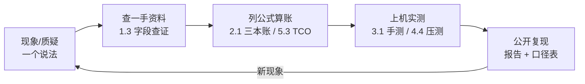

# 5.4 方法论内化：像 UP 主一样"知道"

## 开篇问题

走到全书最后一章，你手里已经攒了不少家伙：显存三本账、三指标手测、roofline 定位、TCO 表。群里先后进来两条消息。第一条："某模型上周调用量世界第一，赶紧上车。"第二条："两张老卡跑 256K 满血上下文？不可能，光历史缓存就得几十 G 甚至上百 G。"两条都带着数字，都催你表态。

买卡实测之前，能不能先判断个大概？这是本章唯一的问题：下次遇到陌生说法，我怎么自己判断？注意问法：问"怎么自己判断"，不问"这个说法是真是假"。真假是结论，结论只对当时的数字成立；方法才可复用。以后再刷到"吊打""第一""不可能"，把动作序列走一遍。很多说法走不完三步就现出原形；偶然被证明为真，那你可能捡到一个"44G 装下 256K"级别的便宜。

本章不引入任何新硬件知识，只做四件事：把全书工具挂上一条五步流水线，用一场完整的翻案把它走一遍，把七个习惯钉回案例，再示范怎么用在一件新鲜事上。检验在章末：报出五步与七习惯；复算"64G→16G"；对榜单宣称完成三问加一道除法；对新宣称独立走完查、算、测、复现。

## 正文

### 整体图景：一条不在推理链路上的流水线

这套方法不消耗显存，不在请求路径上，不改变任何一项用户指标。它决定的是你每一次决策的质量：选哪张卡、开多大上下文、信谁的跑分、这笔钱花不花。



排查程序故障叫 debug：复现现象，读源码而不是二手博客，对半排查，用 profiler（逐项记时间账的工具）看真实开销，修完重跑旧用例。把对象从"程序"换成"说法"，同一条流水线原样可用：**现象/质疑 → 查一手资料 → 列公式算账 → 上机实测 → 公开复现**，然后回到新现象，再来一圈。

▶ 插画：把每个说法当成待复现的 bug，五步闭环与真实案例。

<div class="ill" data-ill="debug-loop"></div>

难的是每一步"信什么、不信什么"。回看前几部分的案例，五个动作里嵌着七个习惯：动手前**先算账**，出发时**以终为始**；判断时**信一手字段**，见到排名先做**口径批判**；验证时**控制变量**；花钱前做**成本工程**；收尾时**开源复现**。七个习惯用法有分工：走查一条说法用先算账、信一手字段、控制变量、开源复现四个，顺序长在五步上；口径批判管别人的数字，成本工程与以终为始管花钱的决策，在走查前后出场。

### 贯穿案例：一场翻案的完整走查

案子本身在 2.1 已经结过，当时只借了结论；这次重走全程，看每一步凭什么可信。案情（SPOTLITE 翻案短视频，约 4.5 分钟，机器字幕转写；出处见章末）：一个推理项目用两张各 22G 显存的魔改 2080Ti（合计 44G）跑一个 27B 级稠密模型（型号为视频口播转写口径，以项目所用模型卡为准），权重为 AWQ INT4 档（4bit 权重量化档，2.4 对过折扣账）、实测 20 多 G，同时开着满血 256K FP16 上下文，已上线运行一个多星期。按 naive 算法（把模型卡标注的 64 层全部当作全注意力代入 KV 公式），仅缓存一项就要 64 GiB，比整台机器的显存还大。照这本账，项目根本不可能存在。

第一步，现象/质疑：不急着站队。事实跑了一个多星期是真的，公式也是教科书级的，只剩两种解释：项目造假，或者账本的某个前提错了。矛盾本身就是线索：账里有隐含前提不成立。

第二步，查一手资料：不查更权威的博主，查模型卡。`config.json` 里有第二部分起就用熟的字段：层数 64、KV 头数 8、head_dim 128；还有 1.3 教过的 Layer type（层类型），逐层写明每层用哪种注意力。64 层里只有 16 层是全注意力，其余 48 层是线性注意力，采用 GDN（Gated DeltaNet，门控 Delta 网络）机制，用定长缓冲区存递归状态与卷积状态，1.3 的说法是"只留摘要卡"。翻案证据就这一行字段，查证耗时不到一分钟。

第三步，列公式算账：公式一字不改，换输入。它隐含的前提是"每一层都为全部历史各存一份 K 和 V"，纯全注意力的老模型默认成立；混合架构时代只有全注意力层的账随上下文线性增长。层数 64 换成 16，64 GiB 即缩到 16 GiB，恰是四分之一；48 层 GDN 的定长缓冲约 100 多 MB，不随长度涨。完整复算见本章算例。

第四步，上机实测：字段改判后还可兜底验证（该视频未演示这一步；读数纪律照 3.1）：各跑一段 4K 与 64K 输入，用 `nvidia-smi` 记录两次显存读数，增量折算成每 token 的显存增量，应接近 16 层 × 4 KiB，即 64 KiB/token；按 64 层估会高估 4 倍。账本与读数对上，才算真正销案。

第五步，公开复现：结论落在仓库里。项目持续更新、每期报版本号，配置与权重清单公开，同型号机器拿到同一版本就能对答案。

最终总账：44G = 20 多 G 权重 + 16 GiB KV + 剩余约 8G 给计算缓冲，"绰绰有余"，"上线一个多星期"与 256K 满血上下文从此同时成立。同场第二个模型（60 层、10 层全注意力、50 层滑窗 1024）：naive 120G → 修正 20G，缩成 1/6，滑窗固定开销约 800 MB（视频口径；该型号与官方资料有出入，以官方模型卡为准）。两个缩水倍数不同，这步查证没法抄答案，每个模型都要查自己的 Layer type。

▶ 插画：64 层里只有 16 层在长账，这场翻案的视觉证据。

<div class="ill" data-ill="layer-type-bars"></div>

*指标回看 · 显存占用：全书走完一条完整的信任链——1.1 现象观察，2.1 公式记账，本章字段改判、实测复核。它从"看起来占了多少"变成"每一项都可以被独立质疑与验证的账"。*

**已解示例**：朋友按 naive 账断言某混合模型开 256K 要 100G，你只查到全注意力占比约五分之一。修正账 = 100G × 1/5 = 20G，加一类零点几 G 的固定开销。但"五分之一"若只是猜测，账就只是猜想；字段截图才是证据。

**小练习（5 分钟）**：打开任意感兴趣的模型的发布页，进 Files 找 `config.json`，数三样：`num_hidden_layers`、`num_key_value_heads × head_dim`、Layer type 里全注意力的个数。这三个数决定你替它算的每一笔显存账。

### 七个习惯，各就各位

翻案走完了，三个习惯已经出场：先算账（错账也是账，它把矛盾量化了出来）、信一手字段（Layer type）、开源复现（版本号与仓库）。剩下四个，各配一个案例钉在原处。

**判断时的另一半：口径批判。** 3.4 已用五问拆过开篇那条"调用量世界第一"，案子不重讲，这里把它固化成口袋里的三问：账本是谁的（厂商自报、第三方平台，还是全网统计）、窗口是日周月哪一级、样本画像偏谁。三问背后是同一个坑：**抽样偏差**（sampling bias）。样本从哪来，结论就只对哪儿成立；OpenRouter 是一个国外的 API 中转/聚合平台，榜单只统计经过它转发的流量，却常被当成全网总账。三问之后补一道除法：调用量计的是 token 不是人，而 token 消耗极端长尾。

**已解示例**：周榜第一约 6.13 万亿 token，一位自称"中度偏重度"的 API 用户一周约 140~150 亿（出处见章末）。两数一除：1 万亿 = 一万个亿，6.13 万亿 = 61,300 亿；61,300 ÷ 150 ≈ 409，约 400 人。400 个重度用户就能把任意模型刷上周榜第一，而主流产品用户量是几百万级（API/付费口径），差 4 个数量级。榜单的"第一"与市场的"第一"不同赛道：数字为真，结论为假。除法还有第二读法：400 人一周烧出的 6.13 万亿是真金白银的 API 账单，摊到中型团队或厂商内部调用上并非天文数字，刷榜可行且不算贵，榜单口径由此显出脆弱。

**小练习（5 分钟）**：找一条你最近刷到的榜单或"第一"类标题，套用上面三问。有一问答不上来，这个"第一"先存疑。

*指标回看 · 并发：它的可信测量=扫档记录——几路、什么上下文、单路掉到多少，三样齐全才能横向比较；4.4 的退化曲线是它最后的成熟形态。*

**验证时的纪律：控制变量。** 3.4 立过四条规矩：基准组、一次一个变量、先写预判、记全口径。执行案例：验证"没有 NVLink，多卡还能不能加速"，做法是三组"组内同卡"的对照（组间卡型不同、组内相同），固定 4K prompt 加 2K ubatch（微批，把长 prompt 切块喂入），只改并行方式，双卡流水线下 prefill 分别快约 72%、60%、50%，decode 全部不劣化，连 PCIe 1.0 x4 矿卡飞线环境都不例外（结论限定在语言模型；卡型 MI50/MI250 转写存疑的钉子见 4.1~4.2，出处见章末）。配套的是诚实标注："这是最高速度，不一定是可以稳定复现的速度"；没实测过的组合写成"推测值，没有实际验证过"。

*指标回看 · 吞吐：可信的吞吐数字=均值±波动+完整口径+"最高速度不等于稳定复现速度"的声明。从 1.2 的体感、3.1 的十次手测，到 4.1 多卡口径的增益归属，它是六项里最容易被"只报好数字"污染的一项。*

*指标回看 · TTFT：可信测量=阶段分离——它异常时先分"输入长（算力区）"还是"输入短（排队与固定开销）"，再决定查算力还是查调度。*

*指标回看 · TPOT：可信测量=口径钉死——并发与上下文不锁住，逐字节奏的读数就没有可比性；单并发下它对权重位宽敏感、对算力迟钝，这份敏感度本身就是它坐在访存区的证据（3.4 合诊表）。*

**动手前的两个习惯：先算账与成本工程。** 先算账连公式本身也要审，翻案的转折点正是那句"这公式对的吗"。算账花十分钟，省下的是几千元试错和几周等待。成本工程是它的货币化分支，一切换算成价格锚点：每 TFLOPS 多少钱、每 GB 显存多少钱、每百万 token 多少钱。一笔现成的满载账：单路 100 tok/s（在那段短评里是假设值；同一台真机开 MTP 实测 80~100，4.1/5.3 记过）24 小时全速，日产出 ≈ 864 万 token，600 W 档电费十几到 20 元/天；对照锚点是某国产 MoE 模型低价档 2 元/百万输出 token。20 元电费能买 1000 万 token，比本地满载一天的极限产出还多，作者结论"用更贵的价格，用一个更弱的模型"，硬件折旧与矿卡风险还没算（"紧急刹车"短评，出处见章末）。

**出发时的一个习惯：以终为始。** 先定工作负载，再反推硬件。一张 96G 专业卡半年从 6 万被炒到 10 万：做 AIGC（文生图/文生视频）它是王炸；跑本地 LLM 却两头不靠，开源模型已分化成 30B 档（民用卡塞得下）与 200B 档（多为 MoE，每步只激活约 10B），96G 卡在中间，结论"要以终为始，不要盲目的消费"（1.5 用过）。同一张卡，换个负载，评价反转，这与 3.4"瓶颈不是卡的属性，是工作点的属性"是同一句话的采购版。

*指标回看 · 成本：终极口径是 5.3 的每百万 token——购置、电费、精力、风险全摊进去。可信的成本数字同样要过五问：谁的电价、什么利用率、哪一天的 API 时价。*

**收尾的最后一环：开源复现。** 4.3 讲过的那个项目：176B 模型塞进两张 400 元老卡加 100 元 U 盘，测速工具 LLMSPEEDCHAT 直接开源，prefill 314 tok/s 从 llama.cpp 日志里读出来给你看；项目从 0.1.4 迭代到 0.1.6，每期都报版本号，数字可核查，比"秒天秒地"的截图值钱。查仓库而不是查人：star 数之外看版本号、commit 与 issue 记录，持续在修 bug 的仓库，结论才值得押注。

### 把方法用在一个新问题上

最后示范一遍"下次遇到陌生说法怎么办"。选一条本书没讲过的宣称："某新模型官方支持 1M 上下文，我的 24G 单卡也能开满。"走四步。

**查**：打开它的 `config.json`，数四个字段。假设它与你第一章那个 8B 同构（36 层、8 个 KV 头、head_dim 128；示范用假设，以官方 config 为准），Layer type 显示约四分之一是全注意力。**算**：每 token KV = 36 × 8 × 128 × 2 × 2 = 144 KiB（2.1 已解示例的数）。naive 账（层数取 36）：144 KiB × 1,048,576 ≈ 144 GiB；修正后只有 9 层长账，约 36 GiB。你的卡权重约 5G，5G＋36G＝41G，是 24G 卡容量的 1.7 倍、8G 卡的 5 倍，"官方支持"与"你的卡跑得动"再次是两句话。想让账变小，有两个旋钮：KV 压到 Q4（INT8 减半、Q4 再减半，2.5 档位账），36 GiB 约剩 9 GiB，总账 15G 上下，24G 卡放得下，但 2.5/3.2 有反面教材，满上下文的 Q4 级 KV"读过就忘"，省显存是用记忆精度付的；或接受更小窗口，上下文砍多少、KV 账砍多少。**测**：各跑一段 4K 与 64K 输入，`nvidia-smi` 记两次读数，增量折算每 token 增量，应接近"9 层 × 4 KiB = 36 KiB/token"。**复现**：配置、版本、命令、读数、口径表写进报告，末尾过一遍五问。四步走完，无论结论是"成立"还是"只在其条件下成立"，你拿到的都是有口径的答案，不是一次转发。

**小练习（10 分钟）**：把上面第一步换成你自己的卡和上一步查过的模型，重算"开满 256K 需要多少显存"，对照你的实际显存，写一句有口径的结论（模型、档位、上下文、精度四个要素缺一不可）。

### 全书数字口径总表（精简版，详见附录 C）

同一数字各章取值不同，多半是口径不同；常用四组备查。

| 组 | 口径 |
| --- | --- |
| 27B Q4_K_M 四口径 | 纸面 13.5G → 超级块账 ≈15.2G（2.4）→ 标注 16.5G（算式默认）→ 口播 25G（4.1 双卡 PP 案例）与 17G（5.2 天梯案例），口播数随期波动、以模型页实测为准；AWQ INT4 实测 20 多 G 另属一路线 |
| 8B KV 单 token 两口径 | 128 KiB＝32 层教学假设（1.3 起）；144 KiB＝qwen3:8b 实际（2.1） |
| prefill 实测（条件各异，不可横比） | 580＝2080Ti 单卡、27B Q4_K_M、8K 拆 4×2K；800 多＝同上、双卡接力（+38%~50%）；1700＝双 2080Ti+NVLink、AWQ、TP-2；2500／2600＝2080Ti、27B INT8、关 MTP（文本／代码） |
| 裸 decode 理论上限 | 37＝616GB/s÷16.5G（2080Ti）；61＝约 1TB/s÷16.5G（3.1 算例单卡口径，与之对齐） |

## 完整算例

**已知条件与单位**：模型：千问 27B 级稠密（型号为案例视频口播转写，以项目所用模型卡为准）；架构字段：`num_hidden_layers` = 64，KV 头数 = 8，head_dim = 128，Layer type：16 层全注意力、48 层 GDN 线性注意力；KV 精度 FP16，每元素 2 字节；上下文：满血 256K = 262,144 token，单路并发；权重：AWQ INT4，项目实测 20 多 G（未注明 GB/GiB，原资料未说明）；GDN 固定缓冲约 100 多 MB；硬件：两张 22G 魔改 2080Ti，合计 44G（标称口径实为 GiB：22542 MiB × 2，4.4/5.2 口径）。

**要回答的问题**：256K 上下文的 KV 到底占多少？44G 装得下吗？

**公式**：

```
KV 显存 = 存 KV 的层数 × KV头数 × head_dim × 2(K+V) × 序列长度 × 每元素字节数
```

**逐项解释与代入**：

- 每层每 token：8 × 128 × 2 × 2 = 4,096 字节 = 4 KiB（"KV头数 × head_dim"是一只 K 的截面，×2 是 K、V 各一份，×2 字节是 FP16）；
- naive 账（层数取 64）：64 × 4 KiB = 256 KiB/token；256 KiB × 262,144 = 2³⁶ 字节 = 64 GiB。按这本账，权重再加 20 多 G，方案枪毙；
- 修正账（层数取 16）：16 × 4 KiB = 64 KiB/token；64 KiB × 262,144 = 2³⁴ 字节 = 16 GiB；
- 固定开销：48 层 GDN 定长缓冲约 100 多 MB，KV 小计约 16.1 GiB；
- 合账：44G − 20 多 G（权重）− 16.1G（KV）≈ 8G，留给计算缓冲，成立；
- 横向对照（60 层、10 层全注意力的那个模型）：naive 120G → 修正 20G，缩成 1/6，滑窗固定开销约 800 MB（视频口径）。

**数量级与单位检查**：KiB × 262,144（=2¹⁸）把 2⁶ KiB 顶成 2²⁴ KiB = 2³⁴ 字节 = 16 GiB，2 的幂次闭合；修正值与 naive 值之比 16/64 = 1/4，恰等于全注意力层占比。错账与对账只差一个输入，逻辑自洽。

**口径声明**：16 GiB 是代入修正字段后的理论值，不是实测。误差来源：GDN 缓冲只有"100 多 MB"的量级口径，精确字节数原资料未说明；"20 多 G"未注明 GB/GiB；27B 型号为口播转写；单路并发假设来自项目自述；实测兜底即正文第四步。

## 贯穿案例的最终分析

把翻案的决策过程复盘一遍。答案"16G"上一节已经算清，这里要看的是每一步为什么那样走。

1. **为什么第一步是怀疑账本而不是怀疑事实**：事实（上线一个多星期）是可核查的存在，账本是人为构造的模型，打架时构造物先上审判席。这不是教条，是成本考量：查账一分钟，证伪一个运行中的项目要搭一套同样的环境。
2. **为什么查字段而不是查更权威的博主**：翻案靠的是模型卡里一行 Layer type，不是更响亮的名字。二手结论可以被无限转发，一手字段不会变。查证一分钟，把错账砍掉四倍。
3. **为什么字段改判后还要实测**：字段告诉你理论账该是 16G，实测告诉你这台机器真占了多少，两者之间隔着缓冲预留策略、引擎实现与量化口径。账本与读数对上，结论才从"应该成立"升级为"确认成立"。
4. **为什么敢写"销案"**：每一步的证据都可独立复验，字段任何人能查，除法任何人能算，读数任何人能测；五问里"能否复现"过不了的说法，再漂亮也只是猜想。
5. **七个习惯在本案的出勤表**：先算账、信一手字段、开源复现全程在场，控制变量以"4K/64K 两点对照"的简化形态出场，口径批判、成本工程、以终为始缺席，本案没有排名可比、没有采购要做。习惯按需调用，但顺序固定：先算账定矛盾，再查字段定前提，然后实测定案。

最后划清方法与结论的边界：方法可以带走，结论要留在它的成立条件里。翻案的结论（"混合架构的 KV 账只算全注意力层"）有成立条件，上下文够长、混合占比显著时修正才值钱；短上下文的小模型按 naive 账误差可忽略。

## 理解检查

1. **计算**：某模型 `config.json` 标注 48 层、8 个 KV 头、head_dim 128，Layer type 显示 12 层全注意力。256K、FP16 上下文：naive 账与修正账各多少 GiB？若权重 AWQ INT4 约 18G，两张 24G 卡装得下吗？列出三本账。
2. **条件变化**：把题 1 的上下文从 256K 降到 32K，两本账各缩到多少？8 倍的缩放对两本账都成立吗？GDN 那本固定开销的占比怎么变？
3. **排障**：同事按 naive 账否决了你的长上下文方案，而你的实测已经跑通。写一份三步说明：他的账哪一项该换掉、依据哪个字段、换完后两本账各是多少（数字用题 1 字段代）。
4. **除法**：某平台周榜第一约 3 万亿 token，一位重度 API 用户一周约 100 亿。多少人能刷出第一（先把"万亿"换成"亿"口算）？主流产品用户量若为百万级，差大约几个数量级？这条除法能证明"该模型没人用"吗？边界在哪里？

## 动手实验

**环境**：沿用 3.1/3.4 的机器与已部署模型（7B~8B 起步），`llama-bench` 或 curl 手测脚本、`nvidia-smi` 可用；另需一条公开渠道的性能宣称（商品页话术、跑分帖、社群转发的"快 X 倍"都行）。

**步骤与命令**（四步走查，参数名以所用版本官方文档为准）：

```bash
# 第 1 步 查：把宣称改写成可检验形式，查一手来源
#   模型字段：发布页 config.json；引擎参数：官方文档
# 第 2 步 算：列公式代入自己的数，先写预判
#   可用：显存三本账 / decode 上限 = 带宽 ÷ 权重体积 / TCO 表
# 第 3 步 测：单变量对照，基准组连测 10 次取中位数
llama-bench -m 模型_基准档.gguf -p 512 -n 128 -r 10
llama-bench -m 模型_对照档.gguf -p 512 -n 128 -r 10   # 只动宣称涉及的那个变量
# 第 4 步 复现：写报告，过五问
nvidia-smi --query-gpu=memory.used,temperature.gpu --format=csv -l 5
```

**应记录的项**：宣称原文与出处；查到的字段摘录；公式与逐项代入；每组均值与极差；完整口径表（模型/量化/输入/输出/并发）；结论三选一：支持、推翻、无法判定（并写明缺哪项口径）。

**预期现象**：不预设，两类结果都是合格产出；最常见的发现是第三种：宣称没给口径，补上口径后只在特定条件下成立。

**失败排查**：查不到字段 → 按"全口径上限"记账并在报告里注明（1.3 的诚实账做法）；测不出差异 → 先确认变量真的生效，再检查负载是否落在对该变量敏感的区位（3.4 合诊表）；读数与宣称对不上 → 先对口径（GB/GiB、PP/TG、峰值/均值、输入长度），口径对齐后再谈对错。

**产出（全书收官件）**：方法论走查报告。把 T1 选型理由、T2 显存计算器、T3+T4 性能报告、T5 量化对比、T6 多用户压测报告、T7 成本决策书、T8 规格表解读模板装订成册；本次四步走查作为卷末案例；每件旧交付物后补一行"五问自查"：哪一问当时没答上、现在补什么。这本册子就是这门课的期末答卷。

## 本章能力清单

对照学习目标：

- ✅ **复述**五步闭环的顺序与七个习惯各管的环节，把一条陌生说法放到图上定位它卡在哪一步（整体图景 + 插画 + 理解检查 3）；
- ✅ **走查**KV 翻案全程：从 naive 64 GiB 到 Layer type 改判 16 GiB，说明每一步的信任依据与成立条件（贯穿案例 + 完整算例 + 理解检查 1）；
- ✅ **驳斥**一条调用量宣称：账本三问加一道除法，说清结论的边界（口径批判节 + 理解检查 4）；
- ✅ **示范**把方法迁移到新问题：对一条长上下文宣称完整走查、算、测、复现四步（新问题示范节 + 动手实验）；
- ✅ **装订**T1~T8 全部交付物成方法论走查报告，每件附五问自查（动手实验 + 产出）。

## 与下一章的衔接

全书到这里没有下一章了，下一章是你自己的下一个问题。随身家当清点一次：六个指标与它们的可信测法，三本显存账，roofline 与单变量对照，TCO 表，一条五步流水线，七个习惯，外加 T1 到 T8 八件交付物。它们不保证你对，但保证你的每个结论都带着口径、字段和可复现的路径，错了也错得明白，改起来快。附录 B 收着全书案例的视频清单，刷到新说法时回去对一对：下一个"翻案"，用的还是这一章的动作。

## 资料来源与延伸观看

- 贯穿案例（44G 双 2080Ti 与 256K 翻案：naive 64G/120G → 修正 16G/20G、Layer type 16/10 层全注意力、GDN 缓冲 100 多 MB、滑窗约 800 MB；约 4.5 分钟，机器字幕转写）：BV1UMEv68E3C。
- 调用量宣称拆解（周榜约 6.13 万亿 token、重度用户周约 140~150 亿、约 400 人的除法、几百万级用户口径；约 1 分钟）：BV1kgN26SECZ；五问首次完整展开见 3.4。
- 控制变量与诚实标注（三组组内同卡对照 prefill +72%/+60%/+50%、decode 不劣化、4K prompt + 2K ubatch；最高速度≠稳定复现速度与推测值标注；卡型 MI50/MI250 转写存疑，口径统一见 4.1~4.2）：BV1dx3Q6iEbZ、BV1Y2LX61EjQ。
- 成本锚点（假设 100 tok/s 满载约 864 万 token/天、电费十几到 20 元/天、API 2 元/百万输出对照；100 tok/s 为短评假设值，同机实测 80~100 见 4.1/5.3）：BV1KKE96CELt。
- 以终为始（96G 专业卡 6 万涨到 10 万、AIGC 王炸与 LLM 两头不靠、30B/200B 两档分化）：BV14UEY6WEW7。
- 开源复现（176B 老卡加 U 盘项目、LLMSPEEDCHAT 开源、prefill 314 tok/s 读自 llama.cpp 日志、0.1.4→0.1.6 报版本号）：BV1xQtf6SEHR。
- 方法与数据沿用的本书章节：1.3、2.1、3.1/3.4、4.1~4.4、5.1~5.3；视频清单与全部出处见附录 B。
- 原资料未说明之处（GDN 与滑窗固定开销的精确字节数、"20 多 G"的 GB/GiB 口径、27B 型号的官方名称、OpenRouter 数字随时间变化）正文已逐处标注，本文未作推断；榜单与时价以查证当日的一手页面为准。
