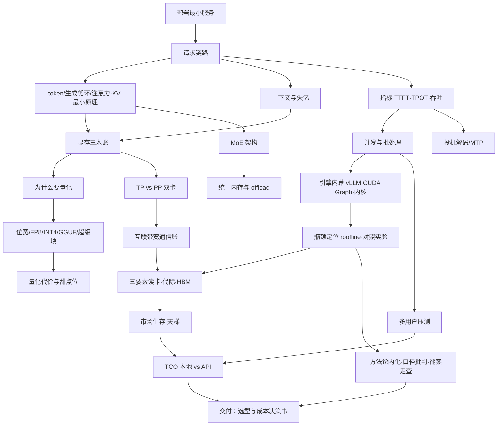

# 《大模型入门》v2 重构方案：项目型教材架构

> 定位：读者跟随一条完整项目主线——**在一台机器上部署模型 → 看懂请求链路 → 算清显存 → 测量延迟与吞吐 → 找出瓶颈 → 做量化和并行选择 → 支持多用户 → 完成硬件选型与成本评估**——全书结束即项目交付。
> 本文档只做架构：不写正文，不保留仅因原视频顺序而存在的章节边界。

---

## 0. 读者画像（期望读者）

会编程（任意语言）、用过 ChatGPT 类产品、**没部署过模型、没玩过显卡、不懂量化**。买卡/租卡预算 3000~10000 元，目标是在本地跑一个"自己人能用"的推理服务，并有能力判断"值不值、卡不卡、怎么优化"。

---

## 1. 全书结束时读者能完成的 8 个真实任务

| # | 任务 | 检验方式 |
|---|---|---|
| T1 | 在自己的机器上部署一个 7B 级模型的最小推理服务（OpenAI 兼容 API），完成一次真实调用 | 交付：可复现的部署脚本 + 一次截图/curl 记录 |
| T2 | 给定模型配置与 prompt 长度，手工算出 KV 缓存与总显存占用，判断装不装得下 | 交付：一张自己填写的显存三本账表，与实测 nvidia-smi 误差 <15% |
| T3 | 测出自己服务的 TTFT / TPOT / 吞吐，绘制并发-吞吐与并发-延迟两条曲线 | 交付：基准脚本 + 双曲线图 |
| T4 | 给定实测曲线，指认当前瓶颈（算力/带宽/KV/调度），并用一次对照实验验证判断 | 交付：瓶颈结论 + 支持它的前后对照数据 |
| T5 | 通过量化把模型显存占用减半以上，用量化前同一套指标出具对比报告 | 交付：Q8 vs Q4 vs IQ3 三档对比表 + 同题盲测记录 |
| T6 | 为 2~8 个并发用户配置并行/批处理策略，压测并说明取舍 | 交付：压测报告（策略选择理由 + 数据） |
| T7 | 给定负载（QPS × prompt 长度 × 输出长度），估算所需硬件与月度成本，输出"本地 vs API"决策书 | 交付：一页决策书（含 TCO 表与敏感性分析） |
| T8 | 读懂任一陌生模型卡/显卡规格表，提取部署决策所需字段（Layer type、带宽、位宽支持、功耗） | 交付：对一张从未见过的规格表的逐字段解读 |

---

## 2. 知识先修关系与现有目录诊断

### 2.1 目标先修关系（mermaid）

### 2.2 现有目录诊断

**前置知识倒置（4 处）**

| # | 现状 | 问题 |
|---|---|---|
| D1 | 卷二（精度量化）整卷位于卷三（引擎）之前 | 读者还没部署过任何东西、没见过显存不够的场景，先学 19 位截断与 E4M3——动机倒置。量化必须在"第一次装不下/想加速"之后 |
| D2 | v3/01 指标章先于 v3/02 框架章 | 读者还没有可观测的对象，先学"怎么看表"——应先跑起服务（观测对象），再定义指标（观测语言） |
| D3 | v1/03-04（层堆叠、QKV 注意力）在第一次部署之前 | 数学密度峰值出现在动机最低点；初学者只需要"为什么第二个字便宜"这一最小原理 |
| D4 | v4/04 架构代际、v4/05 HBM 在读者无选型需求时出现 | 无锚知识；应推迟到"读规格表选卡"的那一刻（JIT） |

**重复解释（4 组）**

| # | 内容 | 现分布 | 处理 |
|---|---|---|---|
| R1 | 显存账 | v1/05（KV 公式）、v2/03（选档位=算预算）、v4/02（三本账） | 三处合并为一张"三本账"主算例，v1 处只留机制、v2 处只留链接 |
| R2 | Prefill/Decode 两阶段 | v1/07、v3/01、v4/03 三次全量定义 | N2 只讲现象、N11 定义指标口径、N14 讲瓶颈本质——每次只加一个视角，明确"回看"标记 |
| R3 | 框架两流派 | v3/02 与 v2/03 各讲一遍 | 部署日只讲"今天用哪个"，完整地图并入附录速查 |
| R4 | 案例卷复述正文定义 | 卷五 8 章大量重讲 v1-v4 概念 | 案例降级为各章的贯穿案例/算例，不再独立成章 |

**跨度过大（4 处）**

| # | 位置 | 问题 | 处理 |
|---|---|---|---|
| G1 | v1/03→v1/04 | 从"层堆叠"直跳 QKV 数学，无铺垫实验 | N3 用"缓存命中手测"先建立 KV 直觉，再给原理 |
| G2 | v4/06 | TP/PP 出现在读者没有任何多卡经验之前 | 先做双卡实验（N16 开篇即实验），再讲原理 |
| G3 | v3/07 内核与算子 | Tensor Core 三代+DP4A+cp.async 一章堵墙 | 压缩为"内核为什么重要"一节并入引擎章 |
| G4 | v4/07 互联全家桶 | lane/南桥/bifurcation/PLX 一次性全给 | 拆到 N17，且每项绑一个实测数字 |

---

## 3. 新目录表

> 每章唯一核心问题；学习目标均为可检验行为；"贯穿案例"全书统一用 SPOTLITE 实测（标 BV 号，出处统一入附录 B）；"实验"全部可在 3000 元级环境（或免费 Colab/租卡）完成；"章末产出"累积构成最终交付物。

### 第一部分 · 跑起来：你的第一个推理服务
> 部分要解决的工程问题：**让模型在我机器上回答问题，并说出"按下回车之后发生了什么"。** 约束：不引入 GPU 架构细节与浮点数学（位宽仅在安装包名中出现，不解释）。

| 章 | 核心问题 | 先修 | 学习目标（可检验） | 贯穿案例 | 实验 | 章末产出 |
|---|---|---|---|---|---|---|
| **1.1** 从零到第一次调用：最小推理服务 | 怎么让一个模型在我机器上回答问题？ | 会用命令行 | ①装好 Ollama/llama.cpp 并拉起一个 7B Q4 模型 ②用 curl 打通 OpenAI 兼容接口 ③说清引擎两流派差异与"今天用哪个" ④数出一个句子的 token 数 | BV1qU846JEpW（CPU 分词几十 ms） | 装 Ollama → 跑 qwen:7b → curl 首次调用；用 tokenizer 数 token | 可复现部署脚本 + 首次调用记录（T1 一半） |
| **1.2** 按下回车之后：一次请求的旅程 | 我发一句话之后，机器里发生了什么？ | 1.1 | ①画出请求七步泳道图（tokenize→调度→prefill→decode→采样→detokenize→流式返回）②区分 CPU 活与 GPU 活 ③解释为什么"第一个字最慢"（TTFT 现象级观察） ④解释自回归=一次吐一个字 | BV1qU846JEpW（请求链路） | 用 `--stream` 对比首字时间与非流式总时长（只观测，不下定义） | 手绘泳道图 + 观察记录 |
| **1.3** 为什么第二个字便宜：注意力与 KV 缓存 | 模型生成时怎么"记住"前文？ | 1.2 | ①用"逐字抄录/便签/摘要卡"三种笔记法解释全注意力、滑窗、线性注意力 ②说清 KV 缓存省的是什么计算 ③用 cache 命中实验验证"带历史 vs 重算" ④看懂模型卡 Layer type 字段 | BV1UMEv68E3C（Layer type 伏笔） | 同 prompt 分两次请求（带历史/不带），对比 TTFT 差异 | 一段给外行解释 KV 缓存的话 |
| **1.4** 聊着聊着就忘了：上下文窗口 | 为什么长对话会"失忆"？ | 1.3 | ①解释上下文窗口与截断行为 ②估算一段对话的 token 数 ③说明 reasoning budget 对时延的影响 ④演示截断导致的失忆现象 | BV1xQtf6SEHR（reasoning budget）、BV1nVVr6QEFq（多轮改代码失忆） | 多轮对话直到触发截断，记录失忆表现 | "失忆复盘"记录一份 |
| **1.5** 第一次选型：我的机器该跑哪个模型 | 货架上那么多模型，我跑哪个？ | 1.1-1.4 | ①用"总参 vs 激活参"区分稠密与 MoE ②说出 30B 甜点位与版本时效逻辑 ③按显存上限反推可选档 ④为自己机器写出选型理由 | BV14UEY6WEW7（货架与档位） | 跑 2 个不同规模模型，记录可用性差异 | 选型理由一页（T1 完成标志） |

**部分里程碑**：T1 完成。指标词汇（TTFT/TPOT/吞吐/显存占用/并发/成本）在此以"观测表"形式首次登场——只记录现象，定义留给 3.1。

### 第二部分 · 算清楚：显存、位宽与量化
> 工程问题：**这个模型+这个上下文，我的卡装得下吗？装不下/想更快时，砍什么、砍多少？**

| 章 | 核心问题 | 先修 | 学习目标 | 贯穿案例 | 实验 | 章末产出 |
|---|---|---|---|---|---|---|
| **2.1** 显存三本账 | 这个模型+这个上下文，装得下吗？ | 1.3 | ①列出权重/KV/缓冲三本账公式 ②代任何配置算出总显存 ③判断 OOM 风险并给出降档方案 ④用 nvidia-smi 验证误差 <15% | BV1UMEv68E3C（256K 翻案，此处先用 naive 口径埋雷） | 填三本账表 → 实测对照 → 解释误差来源 | 显存三本账计算器（表格或脚本）（T2） |
| **2.2** 为什么要量化：三笔账 | 54G 的模型怎么塞进 24G 的卡？ | 2.1 | ①复述装不下/搬不动/损失小三笔账 ②算出"权重÷4→速度×4"的带宽账 ③说出量化是交易不是免费 | 44G 方案（BV1UMEv68E3C） | 无新实验（用 2.1 数据） | 三笔账讲给外行的三句话 |
| **2.3** 位宽的世界：浮点、FP8 与整数格 | 砍位宽到底砍掉了什么？ | 2.2 | ①拆 FP32/FP16/BF16/TF32 位段 ②解释指数-尾数取舍 ③区分 FP8 两条分法（E4M3/E5M2）与 NVFP4 两层缩放 ④算位宽-显存阶梯 | BV14yT46kE5T（20 系 FP8/INT8） | Python struct 拆字节 + np.float16 溢出实验 | 位段解剖笔记 |
| **2.4** 打开 GGUF：文件、超级块与档位 | Q4_K_M 这个名字里藏着什么？ | 2.3 | ①画出 GGUF 四段结构 ②算出超级块 4.5bit 账 ③解释 _M 混合策略与 4.8 的来历 ④用 metadata 的 file_type 验证档位 | BV1UMEv68E3C（20 多 G 权重的折扣） | 用 llama.cpp 加载打印逐张量类型，对上四段结构 | 一份自己模型的 GGUF 结构走查 |
| **2.5** 量化的代价与甜点位 | Q4 之后为什么不能再省？ | 2.4 | ①画出位宽-质量曲线并指出拐点 ②解释误差累积与自回归放大 ③说明 KV 量化的取舍 ④做出"够用档"决策 | BV1GtbL63Ekt、BV1i6Y86AEv3（档位常识） | 同模型 Q8/Q4/IQ3 三档：显存+速度+同题回答盲测 | **量化对比报告（T5）** |

**部分里程碑**：T5 完成。指标回看：显存占用（三本账）正式进入个人指标表；吞吐变化首次量化。

### 第三部分 · 测明白：延迟、吞吐与瓶颈
> 工程问题：**"快"是哪种快？慢在哪一环？不换卡还能怎么快？**

| 章 | 核心问题 | 先修 | 学习目标 | 贯穿案例 | 实验 | 章末产出 |
|---|---|---|---|---|---|---|
| **3.1** 会看表：TTFT、TPOT 与吞吐 | "快"到底是哪种快？ | 第一部分 | ①定义并手测 TTFT/TPOT/吞吐 ②区分吞吐与单路速度 ③解释单并发=个人真实指标 ④复述"最高速度≠稳定复现速度" | BV1nVVr6QEFq（单并发 100tok/s） | curl 脚本手测三指标，与 llama-bench 互验 | 个人指标表 v1（观测升级为定义） |
| **3.2** 并发与批处理：GPU 为什么不怕人多 | 10 个人同时用，为什么不是慢 10 倍？ | 3.1 | ①解释 batch 复用权重的原理 ②说明 PagedAttention 省的显存 ③预测并发翻倍后自己的速度 ④区分连续批处理与静态批次 | BV1i6Y86AEv3（并发 KV 翻倍） | 同卡 1/2/4/8 路并发压测，填并发-延迟表 | 并发行为笔记 |
| **3.3** 引擎在忙什么：调度、CUDA Graph 与内核 | 同样的卡，换引擎为什么差一倍？ | 3.2 | ①解释引擎调度的三件事（排队/组批/KV 管理）②算 CUDA Graph 省的发射开销 ③说出内核（Marlin/FlashAttention）解决什么 ④辨析"CPU 何时成为瓶颈" | BV1qU846JEpW（毫秒级时延分解） | vLLM 开/关 CUDA Graph 对照 | 时延分解表（毫秒级） |
| **3.4** 找瓶颈：roofline 与对照实验 | 我的服务卡在哪一环？ | 3.1-3.3 | ①画出 roofline 两区并定位工作点 ②设计单变量对照实验 ③用 TTFT/TPOT 分离 prefill/decode 瓶颈 ④驳斥一个无口径的性能宣称 | BV1kgN26SECZ（调用量口径批判） | 改 batch/位宽/上下文三组对照，观察工作点移动 | **性能报告：双曲线+瓶颈结论（T3+T4）** |
| **3.5** 投机解码与 MTP：不换卡的提速 | 不换卡还能怎么快？ | 3.1 | ①解释 draft-verify 与接受率 ②读 N 值曲线并找出甜点 ③算加速比 1+N×p 的适用范围 ④说明代价（prefill 变慢/显存/PP 不兼容） | BV1qGh56JEj2（MTP/DFlash/DSpark 实测） | 开/关 MTP 对照，按任务类型记录加速差异 | MTP 开关决策记录 |

**部分里程碑**：T3、T4 完成。指标回看：三指标+并发维度全部落地为个人数据。

### 第四部分 · 扩上去：多卡、并行与大模型
> 工程问题：**一个人不够用了、一张卡不够大了，怎么扩？**

| 章 | 核心问题 | 先修 | 学习目标 | 贯穿案例 | 实验 | 章末产出 |
|---|---|---|---|---|---|---|
| **4.1** 双卡怎么放：TP vs PP | 两张小卡为什么常常赢一张大卡？ | 2.1、3.1 | ①区分 TP（切层内）与 PP（按层接力）②解释 PP 让 prefill 重叠、decode 不重叠的原因 ③算 all-reduce 通信量 ④为自己双卡选 TP 或 PP 并给依据 | BV1YxjU6qEuw、BV1dx3Q6iEbZ（580→800 与 PCIe 1.0x4） | 单卡 vs 双卡 PP 基准对照（同 prompt 集） | 双卡基准报告 |
| **4.2** 卡间互联：NVLink、PCIe 与通信账 | 卡和卡之间的路有多宽？ | 4.1 | ①算 payload=hidden×token×字节 ②区分带宽敏感与延迟敏感 ③读懂 nvidia-smi topo ④解释矿卡飞线为什么毁掉 TP | BV1Y2LX61EjQ（NVLink 实测） | 双卡带/不带 NVLink 桥对照（或读他人数据复算） | 互联带宽笔记 |
| **4.3** 大模型的另两条路：统一内存与 offload | 176B 怎么可能在几张老卡上跑？ | 1.5（MoE）、2.1 | ①解释统一内存零拷贝与划线 ②计算 MoE"总参大激活小"为何适合慢介质 ③设计 offload 分层（显存/内存/U盘）④复算 176B=125B+51B 的账 | BV1otY26LE8w、BV1xQtf6SEHR、BV14UEY6WEW7 | （可选）CPU offload 实验：n-gram/词表放内存 vs SSD | 大模型路线决策树 |
| **4.4** 多用户上线：从玩具到服务 | 怎么变成同事也能用的服务？ | 3.2、3.4、4.1 | ①把服务暴露给局域网并管理并发上限 ②按负载选批处理与 KV 预算 ③给出供电/散热底线 ④完成 2~8 用户压测 | BV1KKE96CELt（满载产出账） | 2/4/8 用户脚本压测，记录 TTFT/TPOT 退化 | **多用户压测报告（T6）** |

**部分里程碑**：T6 完成。指标回看：并发与吞吐曲线扩展到多用户；TTFT 在 prefill 重叠下的变化。

### 第五部分 · 选硬件：选型、成本与判断力
> 工程问题：**下一个项目，买什么卡？这套东西到底值不值？别人的话信不信？**

| 章 | 核心问题 | 先修 | 学习目标 | 贯穿案例 | 实验 | 章末产出 |
|---|---|---|---|---|---|---|
| **5.1** 三要素读穿一张卡 | 规格表上哪个数字决定我的体验？ | 第四部分 | ①按容量/带宽/算力三要素归类任何卡 ②读懂架构代际对位宽格式的支持（FP8/FP4 起点）③区分 HBM 与 GDDR 的结构差异 ④提取规格表中部署决策字段 | BV1E5426eE5X、BV17QN66tEKX（矿卡限制） | 拿两张陌生卡规格表做三要素速判 | 规格表解读模板（T8） |
| **5.2** 显卡市场生存指南 | 同一笔钱怎么花出双倍显存？ | 5.1 | ①复述矿卡/魔改卡/SXM2 的风险清单 ②用"价格×显存"地图定位神卡与智商税区 ③识别消息面驱动的价格陷阱 | BV1hLtG6ZE5M、BV1i6Y86AEv3（天梯与劝退） | 拍卖页实战：给 3 张在售卡打分 | 自己的天梯表 |
| **5.3** 成本与决策：本地 vs API 的 TCO | 这套机器到底值不值？ | 4.4 | ①算电费-利用率曲线 ②对比 API 每百万 token 成本 ③给敏感度分析（利用率±X%）④写出决策书 | BV1KKE96CELt（紧急刹车） | 用自己 T6 压测数据代入 TCO 表 | **选型与成本决策书（T7）** |
| **5.4** 方法论内化：像 UP 主一样"知道" | 下次遇到陌生说法，我怎么自己判断？ | 全书 | ①复述七模式闭环 ②完整走查一次"KV 100G 翻案" ③对任一宣称做口径批判 ④把"原理→估算→实测→复现"用于新问题 | BV1UMEv68E3C 翻案全程、BV1kgN26SECZ | 选一个网上的性能宣称，完整走一遍四步 | 方法论走查报告（全书收官件） |

**部分里程碑**：T7、T8 完成。指标回看终局：全部六指标换算成"每百万 token 成本"这一终极口径。

### 附录（原卷六降级/重组）

| 附录 | 内容 | 来源 |
|---|---|---|
| 附录 A | 术语速查表（按拼音/字母，词条→一句话→章节链接） | v6/02 整体降级 |
| 附录 B | 资料索引：22 期视频清单（BV 号→标题→引用章）+ GitHub 仓库 + 规格页 | v6/03 升级为全书统一出处索引 |
| 附录 C | 公式与口径速查卡（三本账/payload/TCO/GB 与 GiB） | 各章算例抽取 |
| 附录 D（进阶篇入口） | CUDA vs ROCm 生态、软件栈四层、张量核心三代演进 | v3/09、v3/07 部分内容移入 |

---

## 4. 指标回归表（要求 9：六指标贯穿）

| 指标 | 首次观测 | 正式定义 | 维度扩展 | 用于定位 | 用于决策 |
|---|---|---|---|---|---|
| TTFT | 1.2（现象：首字慢） | 3.1（curl 手测） | 4.1（prefill 重叠后） | 3.4（prefill 瓶颈） | 5.3（换算成本） |
| TPOT/ITL | 1.2（逐字节奏） | 3.1 | 4.4（多用户退化） | 3.4（decode 瓶颈） | 5.3 |
| 吞吐 | 1.1（体感） | 3.1（口径辨析） | 3.2（并发吞吐） | 3.4（roofline） | 5.3（产出上限） |
| 显存占用 | 1.1（安装包大小） | 2.1（三本账） | 4.2（每卡分摊） | 3.4（KV 压力） | 5.1（容量选卡） |
| 并发 | 1.2（单人） | 3.2（batch 语义） | 4.4（2~8 用户） | 3.4（工作点） | 5.3（QPS 报价） |
| 成本 | 1.5（电费直觉） | 4.4（功耗底账） | — | — | 5.3（TCO/每百万 token） |

---

## 5. 迁移映射表（原 46 章 + 素材 → 新架构）

| 原章节/素材 | 新位置 | 处理方式 | 理由 |
|---|---|---|---|
| v1/01 token、词表与 BPE | 1.1 | **拆分**：token 概念与计数进 1.1 必需最小集；BPE 合并过程压缩为一段+动画 | 部署日只需要"token 是计费与速度的单位"；BPE 细节属好奇型知识 |
| v1/02 生成=预测下一个 token | 1.2 | **拆分**：自回归直觉进 1.2 链路；softmax/温度采样压缩为链路一步 + 移采样细节到 1.2 侧栏 | 与链路同天讲，避免独立数学章 |
| v1/03 Transformer：按层堆叠 | 1.3 | **压缩合并**："40 层串行"只作为"为什么逐字要过全部层"的最小铺垫 | 层数细节在显存账（2.1）更有机结合 |
| v1/04 注意力 | 1.3 | **压缩合并**：QKV 数学降为侧栏，主体用三种笔记法类比 + cache 命中实验 | 治 G1 跨度：先直觉后原理 |
| v1/05 KV 缓存 | 1.3 + 2.1 | **拆分**：机制/三笔记法进 1.3；显存公式与算账进 2.1 | 治 R1：公式与三本账合流 |
| v1/06 注意力三变体 | 1.4 | **移动**：Layer type 字段查证在 1.4 收尾（为 2.1 翻案埋线） | 变体是"失忆/长文本"的直接解释物 |
| v1/07 Prefill 与 Decode | 1.2 + 3.1 | **拆分**：现象（吞字/吐字/TTFT 体感）进 1.2；口径定义（PP/TG）进 3.1 | 治 R2 重复定义 |
| v1/08 上下文窗口与思考预算 | 1.4 | **保留+更名**：核心问题改写为"为什么失忆" | 失忆是可体验的现象，窗口是解释 |
| v1/09 MoE | 1.5 + 4.3 | **拆分**：总参/激活参一页进 1.5 选型；完整架构与 n-gram 外挂进 4.3 | 选型日只需要"为什么大 MoE 跑得动"；架构细节跟大模型路线走 |
| v1/10 模型生态与幻觉 | 1.5 + 3.4 | **拆分**：货架/甜点位/时效进 1.5；幻觉归 2.5（量化代价）与口径批判归 3.4 | 幻觉在量化语境最自然 |
| v2/01 浮点数从零讲起 | 2.2 + 2.3 | **拆分**："为什么非要量化"三笔账独立成 2.2；位段解剖进 2.3 | 治 D1 倒置：动机先行 |
| v2/02 FP8 与 NVFP4 | 2.3 | **合并**：与浮点基础合为一章"位宽的世界" | FP8 是位宽叙事的延续，不独立成章 |
| v2/03 INT8/INT4 与 GGUF | 2.3 + 2.4 | **拆分+扩容**：档位表进 2.3；GGUF 四段结构+超级块独立成 2.4（含两张新插画） | GGUF 结构值得完整一节课 |
| v2/04 权重与激活 W8A16 | 2.4 | **并入**：命名法作为 GGUF/档位章的词汇节 | W?A? 命名依赖位宽语境 |
| v2/05 量化粒度与异常值 | 2.4 | **压缩并入**："Marlin 为什么快"一节 + 异常值漫画 | 独立章跨度过大（G3 同族） |
| v2/06 量化的代价 | 2.2 + 2.5 | **拆分**：为什么量化三笔账进 2.2；甜点位/KV 量化/幻觉曲线成 2.5 | 治 D1：动机与代价分立两头 |
| v3/01 指标章 | 3.1 | **保留+前置修正**：移到服务已跑通之后；PP/TG 口径从 v1/07 并入 | 治 D2 倒置 |
| v3/02 框架两流派 | 1.1 + 附录 A | **拆分**：最小子集（今天用哪个）进 1.1 开篇；完整地图压缩入附录速查 | 治 R3 |
| v3/03 vLLM 与 PagedAttention | 3.2 + 3.3 | **拆分**：PagedAttention（KV 显存效率）进 3.2；调度与引擎差异进 3.3 | 与并发/引擎两问对齐 |
| v3/04 并发与批处理 | 3.2 + 4.4 | **拆分**：batch 原理进 3.2；多用户运营进 4.4 | 治 R2 同族 |
| v3/05 CUDA Graph | 3.3 | **合并**：并入引擎章，与调度/内核同讲"快从哪里来" | 独立章体量不足 |
| v3/06 投机解码 | 3.5 | **保留+吸收 v5/03**：实测对比读法并入作为贯穿案例 | 主题完整，配齐实验 |
| v3/07 内核与算子 | 3.3 + 附录 D | **压缩拆分**：三句话版本（Marlin/FlashAttention 解决什么）进 3.3；三代演进细节移入进阶篇 | 治 G3 |
| v3/08 CPU 在干嘛 | 1.2 + 3.3 | **拆分**：请求链路中的 CPU 泳道进 1.2；毫秒分解/调度瓶颈进 3.3 | CPU 是链路的一部分，不独立 |
| v3/09 CUDA vs ROCm | 附录 D | **移入进阶篇**：生态账对初学者选卡仅一句结论（AMD 卡先查生态） | 对目标读者是二手决策信息 |
| v4/01 显存 vs 内存 | 2.1 | **压缩并入**：三层级图作为三本账开篇 | 单独成章体量不足 |
| v4/02 显存三本账 | 2.1 | **保留（主体）**：v1/05 公式与 v2/03 预算并入合流 | 治 R1 |
| v4/03 带宽/算力与 roofline | 2.2 + 3.4 | **拆分**："带宽决定 decode"作为量化动机进 2.2；roofline 与定位实验成 3.4 | 一章两用各取所需 |
| v4/04 架构代际 | 5.1 | **移动（JIT）**：作为"读规格表"的支撑知识 | 治 D4 |
| v4/05 HBM vs GDDR | 5.1 | **移动（JIT）** | 同上 |
| v4/06 TP vs PP | 4.1 + 4.2 | **拆分**：两种切法与选择进 4.1；all-reduce/通信公式/延迟敏感进 4.2 | 通信账自成一课 |
| v4/07 NVLink 与 PCIe | 4.2 | **保留**：吸收 4.1 的通信量公式后成为完整互联章 | 治 G4：拆散了墙 |
| v4/08 统一内存与 offload | 4.3 | **保留+吸收 v5/05、v5/06**：两案例成为贯穿算例 | 大模型路线自然延伸 |
| v4/09 平台与功耗 | 4.4 + 5.3 | **拆分**：供电/散热底线进 4.4 上线章；电费账进 5.3 TCO | 功耗在多用户语境出现才有力 |
| v4/10 显卡市场生存指南 | 5.2 | **保留+吸收 v5/04**：天梯并入 | 主题完整 |
| 卷五 8 个案例章 | 全书 | **解散文**：01→4.1 贯穿案例；02→5.4 走查+2.1 算例；03→3.5；04→5.2；05/06→4.3；07→5.3；08→3.4+5.4 | 治 R4：案例为项目服务，不按视频顺序立章；不再保留仅因视频顺序存在的边界 |
| v6/01 七个方法论模式 | 5.4 | **保留（主体）**：吸收 v5/02 翻案与 v5/08 口径批判作为走查案例 | 收官件 |
| v6/02 术语速查表 | 附录 A | **降级为附录** | 要求 6 |
| v6/03 案例出处对照 | 附录 B | **升级**：与视频清单、GitHub、规格页合并为全书统一资料索引 | 要求 6 |
| 素材：notes/ 勘误与评审记录 | 仓库保留 | **移入 `notes/archive-v1/`** | 过程资产，不进书 |
| 素材：16 个交互动画 + 30 张插画 | 对应新章原位保留 | **原位复用**：tokenizer→1.1，kv-cache→1.3/2.1，prefill-decode→1.2，pp-pipeline-anim→4.1，其余按知识点映射平移 | 资产不重做 |

**统计**：46 章 → **23 章 + 4 附录**（5 部分）；无整章删除，8 个案例章解除独立边界，2 章移入进阶篇，2 章降级附录。

---

## 6. 写作纪律（v2 每章强制模板）

1. 开篇即核心问题 + 一个可动手的动作（哪怕只是 curl）
2. 正文每遇六指标之一，右上角"指标回看"标记：本次更新了它的哪个维度
3. 算例必须给出"你自己的数字往哪代"的空表
4. 实验失败也记录（对照 SPOTLITE 的翻车案例风格）
5. 章末产出进入"项目交付物清单"，最后一章把它们装订成完整项目报告
